# Crystal Diffraction (Simulatore di diffrazione)

**Crystal Diffraction (Simulatore di diffrazione)** simula i pattern di diffrazione di raggi X, neutroni ed elettroni da cristallo singolo.

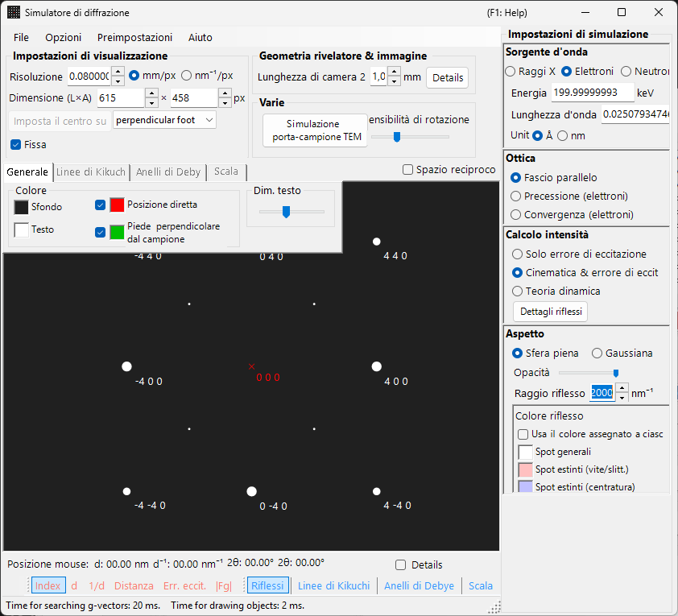

La finestra presenta **a sinistra** un'area di disegno per il pattern di diffrazione e **a destra** i pannelli di impostazione per le proprietà dei riflessi (lunghezza d'onda, fascio incidente, calcolo dell'intensità, aspetto e così via). La combinazione di lunghezza d'onda e fascio incidente determina la modalità di acquisizione (diffrazione di raggi X, SAED, PED, CBED), e i pannelli di destra si riconfigurano di conseguenza.

---

## Come questa pagina e le pagine delle modalità si suddividono il lavoro

- **Questa pagina (hub)**: raccoglie le operazioni comuni a ogni modalità (scorciatoie, menu, barra degli strumenti, informazioni su schermo/rivelatore, schede di overlay, informazioni sui riflessi, geometria del rivelatore, compressione dinamica).
- **Ogni pagina di modalità**: tratta **ogni impostazione che appare a destra** quando quella modalità è selezionata (lunghezza d'onda, fascio incidente, calcolo dell'intensità, aspetto, impostazioni delle onde di Bloch, impostazioni di precessione e così via), in modo che ogni pagina sia autonoma (tra le modalità esiste qualche sovrapposizione).

| Modalità | Contenuto | Pagina |
|------|----------|------|
| **Diffrazione di raggi X (e di neutroni)** | Pattern di diffrazione di raggi X / neutroni da cristallo singolo (parallelo, raggi X a precessione, Back Laue) | [Simulazione di diffrazione di raggi X](4-x-ray-neutron-diffraction.md) |
| **SAED** | Diffrazione elettronica a fascio parallelo (selected-area electron diffraction) | [Simulazione SAED](1-saed-simulation.md) |
| **PED** | Diffrazione elettronica a precessione | [Simulazione PED](2-ped-simulation.md) |
| **CBED** | Diffrazione elettronica a fascio convergente | [Simulazione CBED](3-cbed-simulation.md) |

---

## Riferimento rapido alle modalità

Individua la pagina che ti serve dalla combinazione di **lunghezza d'onda (sorgente)** e **fascio incidente**.

| Lunghezza d'onda | Fascio incidente | Modalità | Pagina |
|------------|--------------------|------|------|
| Elettrone | Parallelo | SAED | [Simulazione SAED](1-saed-simulation.md) |
| Elettrone | Precessione (elettrone = PED) | PED | [Simulazione PED](2-ped-simulation.md) |
| Elettrone | Convergenza (CBED) | CBED | [Simulazione CBED](3-cbed-simulation.md) |
| Raggi X | Parallelo | Diffrazione di raggi X | [Simulazione di diffrazione di raggi X](4-x-ray-neutron-diffraction.md) |
| Raggi X | Precessione (raggi X) | Raggi X a precessione (camera di precessione) | [Simulazione di diffrazione di raggi X](4-x-ray-neutron-diffraction.md) |
| Raggi X | Back Laue | Laue in retrodiffusione | [Simulazione di diffrazione di raggi X](4-x-ray-neutron-diffraction.md) |
| Neutrone | Parallelo | Diffrazione di neutroni | [sezione neutroni della Simulazione di diffrazione di raggi X](4-x-ray-neutron-diffraction.md) |

> **Note**: Le scelte del fascio incidente cambiano con la lunghezza d'onda. Per gli elettroni: **Parallelo, Precessione (elettrone = PED), Convergenza (CBED)**; per i raggi X: **Parallelo, Precessione (raggi X), Back Laue**; per i neutroni: solo **Parallelo**. La selezione di **Precessione (elettrone = PED)** o **Convergenza (CBED)** commuta automaticamente il calcolo dell'intensità su **Dynamical**.

---

## Scorciatoie da tastiera e mouse

Si applicano alla finestra del pattern di diffrazione condivisa dalle simulazioni di raggi X, SAED e PED. Trascinare sul pattern ruota il **cristallo**. Qui **non c'è zoom con la rotellina del mouse** — esegui lo zoom con clic destro / trascinamento destro.

| Scorciatoia | Azione |
|----------|--------|
| <kbd>F1</kbd> | Aprire questa pagina del manuale online |
| Trascinamento sinistro vicino al centro | Inclinare il cristallo |
| Trascinamento sinistro nell'area esterna | Far ruotare il cristallo attorno all'asse del fascio |
| Doppio clic sinistro su un riflesso | Mostrare i dettagli del riflesso (indice, *d*, fattore di struttura, errore di eccitazione) |
| Trascinamento centrale | Spostare il pattern |
| <kbd>CTRL</kbd> + Trascinamento centrale | Spostare il centro del rivelatore (quando l'area del rivelatore è mostrata) |
| Clic destro | Zoom indietro |
| Trascinamento destro di un riquadro | Zoom avanti sulla regione selezionata |
| Doppio clic destro sulla barra di stato | Copiare un riepilogo testuale delle impostazioni correnti |
| Doppio clic destro su un pulsante di livello acceso (Spots / Kikuchi / Debye / Scale) | Far lampeggiare quel livello accendendolo e spegnendolo |

Le finestre ausiliarie aperte da qui aggiungono ancora qualche scorciatoia:

| Scorciatoia | Azione |
|----------|--------|
| Doppio clic sinistro sullo stereogramma — **TEM holder** | Impostare l'inclinazione del portacampioni su quel punto |
| Tasti freccia — **TEM holder** | Avanzare l'inclinazione del portacampioni a passi (spunta prima **Arrow keys**) |
| Rilasciare un file `.prm` o un'immagine — **Detector geometry** | Caricare la geometria del rivelatore / l'immagine di overlay |
| Rilasciare un profilo `.txt` — **Dynamic compression** | Caricare un profilo pressione/tempo (trascina la linea rossa nel grafico per scorrere) |

Le scorciatoie <kbd>CTRL</kbd>+<kbd>SHIFT</kbd> a livello di applicazione della finestra principale funzionano anche mentre questa finestra è in primo piano (vedi [finestra principale](../0-main-window.md)).

→ Vedi **[21. Scorciatoie da tastiera e mouse](../21-shortcuts.md)** per tutte le finestre a colpo d'occhio.

---

## Percorsi rapidi per obiettivo

| Obiettivo | Partire da | Riferimento |
|------|------------|-----------|
| Produrre diffrazione elettronica a fascio parallelo (SAED) | Impostare **Incident beam** su **Parallel** e **Wavelength** su elettrone | [Simulazione SAED](1-saed-simulation.md), [calcolo SAED a fascio parallelo](../appendix/a3-bloch-wave/calculation.md) |
| Produrre diffrazione di raggi X da cristallo singolo | Commutare **Wavelength** su raggi X / Sincrotrone | [Simulazione di diffrazione di raggi X](4-x-ray-neutron-diffraction.md) |
| Produrre diffrazione elettronica a precessione (PED) | Impostare **Incident beam** su **Precession (electron)**, quindi impostare il semiangolo e il passo | [Simulazione PED](2-ped-simulation.md) |
| Produrre diffrazione elettronica a fascio convergente (CBED) | Impostare **Incident beam** su **Convergence (CBED, electron only)** e impostare le condizioni nella finestra CBED | [Simulazione CBED](3-cbed-simulation.md), [calcolo CBED](../appendix/a3-bloch-wave/cbed.md) |
| Ispezionare l'elenco dei riflessi dal calcolo dinamico | Selezionare **Dynamical** e aprire **Spot Details** o **Details** | [Calcolo dinamico (nucleo condiviso)](../appendix/a3-bloch-wave/calculation.md) |
| Confrontare la geometria del rivelatore con un'immagine sperimentale | Aprire le impostazioni della geometria del rivelatore da **Details** e usare l'immagine di overlay | [Sistema di coordinate del rivelatore](../appendix/a1-coordinate-system/2-diffraction.md) |

---

## Area principale

Il pattern di diffrazione viene simulato al centro dello schermo.

### Uso del mouse

Vedi "Scorciatoie da tastiera e mouse" all'inizio di questa pagina.

### Posizione del mouse

Le informazioni corrispondenti alla posizione del cursore (cursore *q*, *d*, 2θ, azimut e così via) sono visualizzate nella riga di stato sopra il pattern. Spuntare **Details** aggiunge informazioni più dettagliate (l'(*hkl*) del riflesso più vicino, l'errore di eccitazione, il fattore di struttura e così via).

---

## Menu "File"

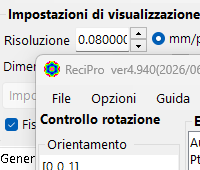

| Voce di menu | Descrizione |
|-----------|-------------|
| **Save** | Salvare il pattern di diffrazione visualizzato in un file. |
| **Save detector area** | Salvare solo il ritaglio dell'area del rivelatore. |
| **Copy** | Copiare l'immagine visualizzata negli appunti. |
| **Copy detector area** | Copiare solo il ritaglio dell'area del rivelatore. |

### Preset {#toolbar}

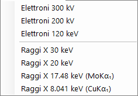

Salvare e richiamare una configurazione completa del simulatore — lunghezza d'onda, geometria del rivelatore, impostazioni delle schede, proprietà dei riflessi e così via — come preset. Utile per passare rapidamente tra strumenti / modalità di acquisizione.

---

## Barra degli strumenti

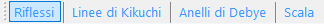

| Pulsante | Descrizione |
|--------|-------------|
| Spots | Mostrare / nascondere il livello dei riflessi di diffrazione |
| Kikuchi | Mostrare / nascondere il livello delle linee di Kikuchi |
| Debye | Mostrare / nascondere il livello degli anelli di Debye |
| Scale | Mostrare / nascondere il livello delle linee di scala |
| Index / d / 1/d / Distance / 2θ / χ / Excitation error / Structure factor | Scelta dell'etichetta associata a ciascun riflesso |

---

## Informazioni su schermo e rivelatore

### Schermo

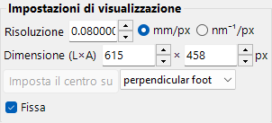

| Elemento | Descrizione |
|------|-------------|
| **Resolution** | La dimensione di un pixel (mm). Non deve necessariamente corrispondere alla dimensione effettiva del pixel del rivelatore; viene trattata come scala di visualizzazione e si aggiorna automaticamente quando esegui lo zoom con il mouse. |
| **Size (W×H)** | Larghezza e altezza in pixel dell'area di disegno. A seconda della risoluzione del display, valori molto grandi potrebbero non essere impostabili. |
| **Set centre / Fix centre** | Impostare il centro del pattern su un qualsiasi pixel dell'area di disegno e, se necessario, fissarlo. Quando è fissato, il centro non può essere spostato con lo spostamento del mouse. |
| **Horizontal flip / Vertical flip / Negative image** | Ribaltamenti geometrici (orizzontale / verticale) e inversione del contrasto del pattern visualizzato. Usali per far corrispondere l'orientazione o il contrasto di un'immagine sperimentale. |
| **Reciprocal space** | Sovrappone la sfera di Ewald e i vettori del reticolo reciproco sul pattern, visualizzando quali riflessi sono eccitati. |

### Rivelatore (lunghezza di camera)

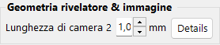

- **Camera length** : Distanza dal campione al rivelatore (mm).
- **Details** : Apre la finestra delle impostazioni della geometria del rivelatore (vedi [Geometria del rivelatore](#detector-geometry) di seguito).

### Misc

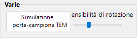

- **Rotation sensitivity** : Quantità di rotazione del cristallo per pixel di trascinamento del mouse.
- **TEM holder simulation** : Apre la finestra di simulazione collegata al portacampioni (vedi sotto).

---

## Simulazione del portacampioni TEM {#drawing-overlay-tabs}

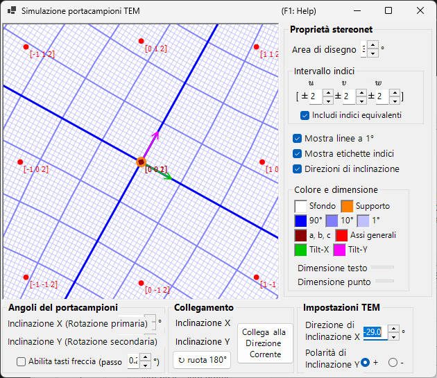

Apre una finestra che collega il pattern di diffrazione a un **TEM holder** a doppia inclinazione (o a rotazione). L'impostazione degli angoli di inclinazione del portacampioni aggiorna il pattern e l'orientazione del cristallo, e le orientazioni raggiungibili possono essere mostrate su uno stereogramma (aggiunto in v4.914). Un doppio clic sinistro sullo stereogramma imposta l'inclinazione del portacampioni su quel punto, e spuntare **Arrow keys** consente ai tasti freccia di avanzare l'inclinazione a passi.

---

## Schede di overlay del disegno

### General

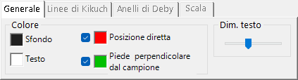

Imposta i colori dei riflessi, delle etichette, delle linee di Kikuchi, degli anelli di Debye e di altri overlay. Le impostazioni qui si applicano a tutte le modalità di rendering.

### Linee di Kikuchi

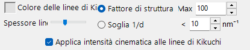

Attiva quando le linee di Kikuchi sono abilitate nella barra degli strumenti.

- **Reflection selection** : Scegli quali riflessi generano le linee di Kikuchi. O **structure factor** (i primi *N* riflessi per $\lvert F_{hkl}\rvert$) oppure **1/d cutoff** (tutti i riflessi il cui 1/d è inferiore alla soglia (nm⁻¹)).
- **Line appearance** : Imposta lo spessore della linea, il colore delle linee di Kikuchi e **Draw with kinematical intensity** (scala l'intensità della linea in base all'intensità cinematica del riflesso).
- **Threshold** : Un parametro legacy. Esegue il calcolo delle linee di Kikuchi solo per i riflessi con *d* maggiore del valore specificato (mantenuto per compatibilità).

### Anelli di Debye

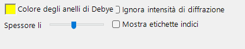

Attiva quando gli anelli di Debye sono abilitati nella barra degli strumenti.

- **Ignore diffraction intensity** : Se spuntata, tutti gli anelli di Debye sono disegnati con lo stesso colore e la stessa intensità (ignorando il fattore di struttura del cristallo). Usala per un confronto puramente geometrico.
- **Show index label** : Se spuntata, l'(*hkl*) appare vicino a ciascun anello.

### Scale

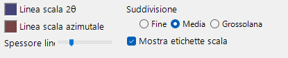

Attiva quando le linee di scala sono abilitate nella barra degli strumenti.

- **2θ / Azimuth scale lines** : **2θ** rappresenta un angolo di diffusione costante (cerchi concentrici), **Azimuth** rappresenta un angolo di azimut costante (linee radiali dal centro). I colori sono configurabili in modo indipendente.
- **Line width** : Spessore delle linee di scala.
- **Division** : Intervallo angolare tra linee di scala adiacenti.
- **Show scale labels** : Se disegnare etichette numeriche sulle linee di scala.

### Misc {#diffraction-spot-information}

Impostazioni varie come la sensibilità di rotazione del mouse.

- **Mouse sensitivity** : Quantità di rotazione del cristallo per pixel di trascinamento del mouse.

---

## Informazioni sui riflessi di diffrazione

Elenca i dettagli per riflesso calcolati con il metodo delle onde di Bloch (calcolo Dynamical). Aprila con il pulsante **Spot Details** (pannello del calcolo dell'intensità) o con la casella di controllo **Details**.

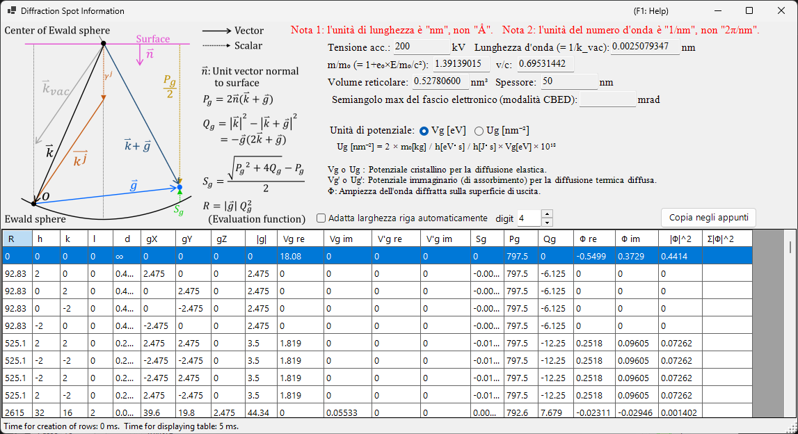

### Schema e definizioni

Lo schema (in alto a sinistra) mostra i vettori sulla sfera di Ewald e definisce le grandezze usate nella tabella ($\hat{\mathbf{n}}$ è il versore normale alla superficie del campione, $\mathbf{k}$ è il vettore d'onda incidente, $\mathbf{g}$ è il vettore del reticolo reciproco).

- $P_g = 2\,\hat{\mathbf{n}} \cdot (\mathbf{k} + \mathbf{g})$
- $Q_g = |\mathbf{k}|^2 - |\mathbf{k} + \mathbf{g}|^2 = -\mathbf{g} \cdot (2\mathbf{k} + \mathbf{g})$
- **Errore di eccitazione:** $S_g = \dfrac{\sqrt{P_g^2 + 4 Q_g} - P_g}{2}$
- **Funzione di valutazione:** $R = |\mathbf{g}|\, Q_g^2$ — ordina i riflessi in base a quanto fortemente sono eccitati (più piccolo = più vicino alla sfera di Ewald = eccitato più fortemente; il fascio trasmesso $g=0$ ha $R=0$ e viene per primo). La tabella è ordinata per $R$ crescente.

### Colonne della tabella

| Colonna | Significato |
|--------|---------|
| **R** | funzione di valutazione $R = \lvert\mathbf{g}\rvert\, Q_g^2$ (sopra; usata per selezionare / ordinare i riflessi) |
| **h, k, (i,) l** | indici di Miller (*i* è l'indice esagonale ridondante, mostrato solo per i cristalli esagonali) |
| **d** | distanza interplanare (nm) |
| **gX, gY, gZ** | componenti del vettore del reticolo reciproco *g* (1/nm) |
| **\|g\|** | modulo di *g* (1/nm) |
| **Vg re / Vg im** | coefficiente di Fourier del potenziale del cristallo per la diffusione elastica, $V_g$ (reale / immaginario) |
| **V'g re / V'g im** | potenziale immaginario (di assorbimento) per la diffusione termica diffusa (TDS), $V'_g$ (reale / immaginario) |
| **Sg** | errore di eccitazione $S_g$ (sopra; 1/nm) |
| **Pg** | grandezza ausiliaria $P_g = 2\,\hat{\mathbf{n}}\cdot(\mathbf{k}+\mathbf{g})$ (sopra) |
| **Qg** | grandezza ausiliaria $Q_g = -\mathbf{g}\cdot(2\mathbf{k}+\mathbf{g})$ (sopra) |
| **Φ re / Φ im** | ampiezza complessa $\Phi$ dell'onda diffratta dinamica sulla superficie di uscita (reale / immaginaria) |
| **\|Φ\|^2** | intensità diffratta $\lvert\Phi\rvert^2$ di quel riflesso |
| **Σ\|Φ\|^2** | somma cumulativa di $\lvert\Phi\rvert^2$ (totale sui riflessi; utile come verifica della conservazione dell'intensità) |

### Unità di potenziale e altri controlli

- **Unit of potential** : Commuta il potenziale visualizzato tra **Vg [eV]** (potenziale elettrostatico, eV) e **Ug [nm⁻²]** (la grandezza scalata $U_g = (2 m_0/h^2)\, V_g$ che entra nelle equazioni delle onde di Bloch). Le intestazioni delle colonne cambiano di conseguenza tra *Vg / V'g* e *Ug / U'g*.
- Sopra la tabella sono mostrati la tensione di accelerazione, la lunghezza d'onda ($\lambda = 1/k_\text{vac}$), il rapporto di massa relativistico $m/m_0$, il rapporto di velocità $v/c$, il volume del reticolo, lo spessore del campione e (in modalità CBED) il semiangolo massimo del fascio elettronico.
- **Note 1:** l'unità di lunghezza è **nm**, non Å. **Note 2:** l'unità di numero d'onda è **1/nm**, non 2π/nm.
- **Effective digit** : numero di cifre significative mostrate nella tabella. **Auto resize row width** : adatta automaticamente le larghezze delle colonne. **Copy to clipboard** : esporta la tabella come testo che può essere incollato in un foglio di calcolo. (Questo modulo è mostrato in inglese anche con un'interfaccia giapponese.)

---

## Geometria del rivelatore {#detector-geometry}

Una finestra per la configurazione dettagliata della geometria del rivelatore (lunghezza di camera, inclinazione, rotazione) e per l'overlay di un'immagine sperimentale. Aprila da **Details** nel pannello **Detector geometry**.

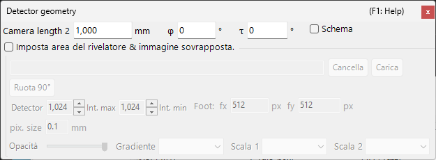

### Impostazioni della geometria del rivelatore

Specifica la geometria di riflessione, come la lunghezza di camera e l'inclinazione del rivelatore (**Tau / Phi**). Per Back Laue (Laue in retrodiffusione), imposta qui la geometria che posiziona il rivelatore sul lato della sorgente.

### Area del rivelatore e immagine sovrapposta

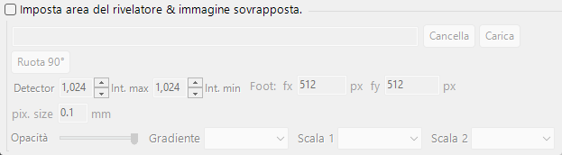

Specifica l'area attiva del rivelatore e rilascia un'immagine sperimentale per sovrapporla. Usa questo per sovrapporre il pattern simulato e un'immagine sperimentale e mettere a punto la geometria del rivelatore.

Vedi anche [Sistema di coordinate del rivelatore](../appendix/a1-coordinate-system/2-diffraction.md) per le definizioni del sistema di coordinate.

---

## Compressione dinamica

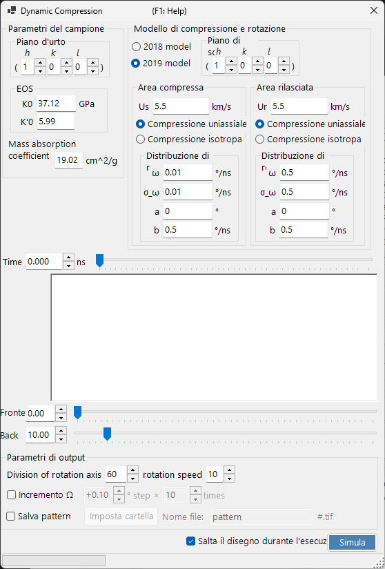

Una finestra per scorrere il profilo pressione/tempo di un esperimento ad alta pressione (compressione dinamica). Rilascia un profilo pressione/tempo `.txt` su questa finestra per caricarlo, quindi trascina la linea rossa nel grafico per scorrere in modo continuo nel tempo (nella pressione) riflettendo lo stato corrispondente nel pattern di diffrazione.

---

## Argomenti correlati

- [Simulazione di diffrazione di raggi X](4-x-ray-neutron-diffraction.md)
- [Simulazione SAED](1-saed-simulation.md)
- [Simulazione PED](2-ped-simulation.md)
- [Simulazione CBED](3-cbed-simulation.md)
- [Calcolo dinamico (nucleo condiviso)](../appendix/a3-bloch-wave/calculation.md)
- [Sistema di coordinate del rivelatore](../appendix/a1-coordinate-system/2-diffraction.md)
