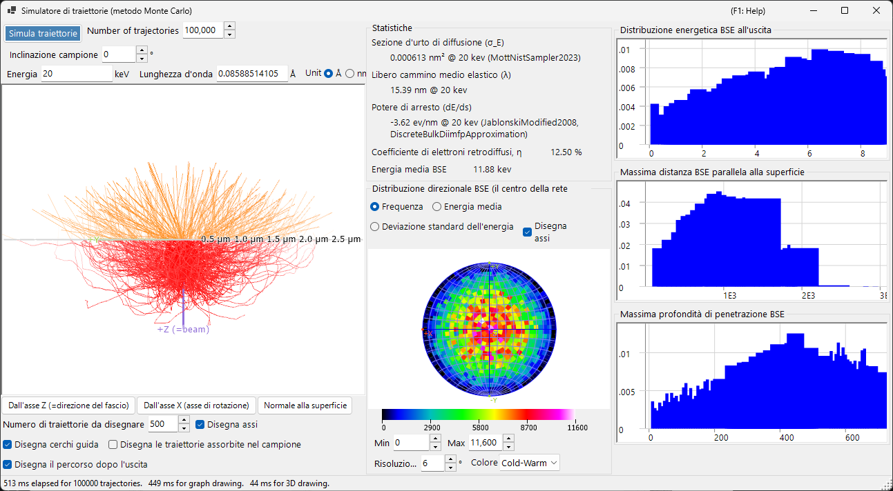
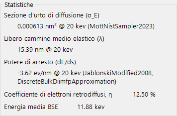
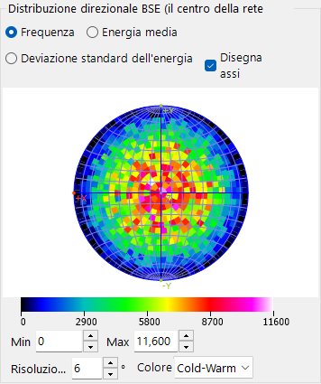
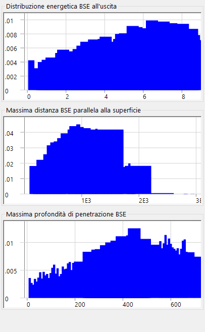

# Traiettorie elettroniche

Il **simulatore di traiettorie** calcola le traiettorie degli elettroni all'interno di un campione con il **metodo Monte-Carlo**: gli elettroni incidenti subiscono diffusione elastica e anelastica, e le distribuzioni risultanti degli elettroni retrodiffusi (direzione, energia, profondità di penetrazione) vengono accumulate. Queste distribuzioni forniscono anche la ponderazione angolare/energetica/in profondità utilizzata dalla [12. Simulazione EBSD](12-ebsd-simulation.md).

---

## Scorciatoie da tastiera e mouse

Le traiettorie sono mostrate in una vista 3-D OpenGL. Essa utilizza la [navigazione della vista](21-shortcuts.md) standard di ReciPro, ma **lo spostamento è disattivato** — utilizzare i pulsanti delle viste predefinite per passare agli orientamenti standard.

| Scorciatoia | Azione |
|----------|--------|
| <kbd>F1</kbd> | Apre questa pagina del manuale online |
| Trascinamento sinistro | Ruota il modello |
| Trascinamento destro su/giù, o rotellina del mouse | Zoom |
| <kbd>CTRL</kbd> + doppio clic destro | Commuta tra proiezione ortografica / prospettica |

→ Vedere **[21. Scorciatoie da tastiera e mouse](21-shortcuts.md)** per una panoramica di tutte le finestre.

---

## Condizioni di calcolo

Energia del fascio, numero di elettroni incidenti, campione/materiale e altri parametri Monte-Carlo (vedere lo screenshot panoramico sopra).

### Energia del fascio

Tensione di accelerazione del fascio elettronico incidente (keV). Imposta l'energia cinetica utilizzata sia per i modelli di diffusione elastica (Mott) sia per quelli di diffusione anelastica (risposta dielettrica).

### Numero di elettroni incidenti

Quanti elettroni simulare. Un numero maggiore di elettroni riduce il rumore statistico ma aumenta linearmente il tempo di esecuzione.

### Campione / materiale

Composizione e densità del campione. Per impostazione predefinita corrisponde al cristallo attualmente selezionato nella finestra principale, ma può essere sostituito per studi delle sole traiettorie.

### Inclinazione del campione

Angolo di inclinazione del campione. Utilizzato quando i dati delle traiettorie alimentano il [simulatore EBSD](12-ebsd-simulation.md) (tipicamente 70° per l'EBSD).

### Modello di sezione d'urto

Il modello della sezione d'urto di diffusione elastica (Mott / Bethe / NIST). Modelli diversi bilanciano velocità e accuratezza ad angoli di inclinazione elevati o in prossimità dei bordi di assorbimento.

---

## Opzioni dello stereogramma

Opzioni di visualizzazione per la distribuzione angolare tracciata sulla proiezione stereografica (vedere lo screenshot panoramico sopra).

### Metodo di proiezione

Proiezione **Wulff** (equiangolare) o **Schmidt** (equiareale). Schmidt è solitamente preferita quando si legge la densità statistica.

### Emisfero

Traccia l'emisfero superiore (retrodiffuso) o inferiore (trasmesso).

### Risoluzione / Scala dei colori

Ampiezza delle classi dell'istogramma angolare e mappa dei colori utilizzata per la visualizzazione della densità.

---

## Statistiche

Riepilogo dell'esecuzione.

- **Resa di retrodiffusione** — frazione degli elettroni incidenti che escono attraverso la superficie di ingresso.
- **Libero cammino medio** — distanza media tra gli eventi di diffusione.
- **Profondità di penetrazione media** — profondità massima media raggiunta da un elettrone prima di uscire o essere assorbito.
- **Tempo trascorso / Throughput** — costo dell'esecuzione in tempo reale.

---

## Distribuzione direzionale BSE

Distribuzione angolare degli elettroni retrodiffusi (il centro dello stereogramma corrisponde alla direzione della normale alla superficie). Il contorno giallo/arancione (quando presente) delimita la regione sottesa dal rivelatore EBSD.

---

## Profili

Profili in profondità ed energia degli elettroni simulati.

### Profilo in profondità

Istogramma della profondità finale di uscita (nm) degli elettroni retrodiffusi. Utilizzato dal simulatore EBSD per ponderare l'integrazione in profondità del master pattern.

### Profilo energetico

Istogramma della perdita di energia ΔE (keV) degli elettroni retrodiffusi. Utilizzato dal simulatore EBSD per ponderare l'integrazione in energia.

---

## Vedere anche

- [Simulazione EBSD](12-ebsd-simulation.md)
- [Calcolo EBSD](appendix/a3-bloch-wave/ebsd.md)
- [Diffrazione dinamica (onda di Bloch)](appendix/a3-bloch-wave/index.md)
- [Simulatore HRTEM/STEM](9-hrtem-stem-simulator/index.md)
- [Simulatore di diffrazione](7-diffraction-simulator/index.md)
