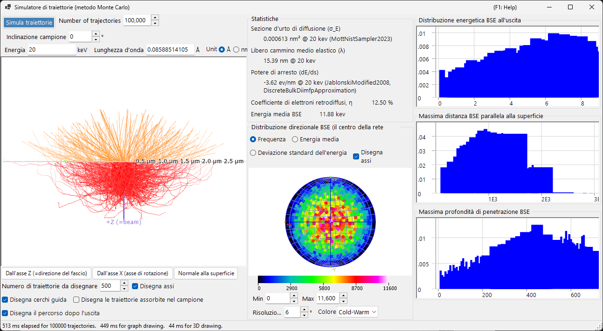
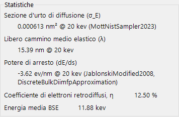
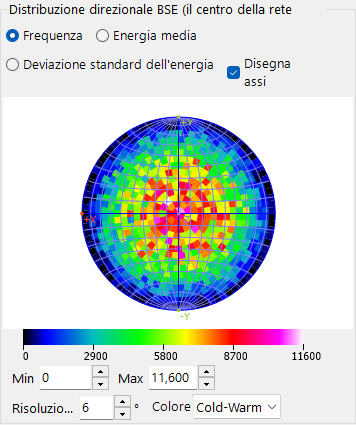
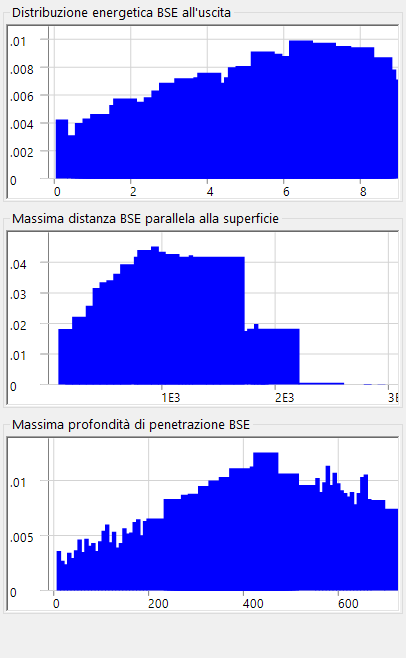

# Traiettorie elettroniche

Il **Simulatore di traiettorie (metodo Monte Carlo)** calcola le traiettorie degli elettroni all'interno di un campione con il **metodo Monte-Carlo**: gli elettroni incidenti subiscono diffusione elastica e anelastica, e le distribuzioni risultanti degli elettroni retrodiffusi (BSE) — direzione, energia all'uscita, profondità di penetrazione ed estensione laterale — vengono accumulate. Queste distribuzioni forniscono anche la ponderazione angolare/energetica/in profondità utilizzata dalla [12. Simulazione EBSD](12-ebsd-simulation.md).

La finestra è divisa in tre colonne: la **vista 3-D delle traiettorie** a sinistra, le **Statistiche** e lo stereogramma della **Distribuzione direzionale BSE** al centro, e tre **istogrammi** a destra. La composizione e la densità del campione sono quelle del cristallo selezionato nella finestra principale; qui si impostano soltanto l'energia del fascio, l'inclinazione del campione e il numero di traiettorie.

---

## Scorciatoie da tastiera e mouse

Le traiettorie sono mostrate in una vista 3-D OpenGL. Essa utilizza la [navigazione della vista](21-shortcuts.md) standard di ReciPro, ma **lo spostamento è disattivato** — utilizzare i pulsanti delle viste predefinite per passare agli orientamenti standard.

| Scorciatoia | Azione |
|----------|--------|
| <kbd>F1</kbd> | Apre questa pagina del manuale online |
| Trascinamento sinistro | Ruota il modello |
| Trascinamento destro su/giù, o rotellina del mouse | Zoom |
| <kbd>CTRL</kbd> + doppio clic destro | Commuta tra proiezione ortografica / prospettica |

→ Vedere **[21. Scorciatoie da tastiera e mouse](21-shortcuts.md)** per una panoramica di tutte le finestre.

---

## Condizioni di calcolo

I controlli nella parte superiore della finestra impostano l'esecuzione:

- **Simula traiettorie** : avvia la simulazione Monte-Carlo. La barra di stato in basso riporta separatamente il tempo trascorso per il calcolo delle traiettorie, per il disegno dei grafici e per il rendering 3-D.
- **Number of trajectories** : quanti elettroni incidenti seguire. Un numero maggiore di elettroni riduce il rumore statistico di tutte le distribuzioni descritte di seguito, con un tempo di esecuzione che cresce linearmente.
- **Inclinazione campione** (°) : inclinazione della superficie del campione attorno all'asse *X*. Lasciarla a 0 per l'incidenza normale; usare **−70°** per riprodurre la geometria del [simulatore EBSD](12-ebsd-simulation.md), dove la forte inclinazione aumenta la resa di retrodiffusione.
- **Energy** (keV) / **Wavelength** / **Unit** : la tensione di accelerazione del fascio incidente e la lunghezza d'onda elettronica corretta relativisticamente a essa associata. L'energia imposta l'energia cinetica utilizzata sia dal modello elastico (NIST Mott) sia da quello anelastico (potere frenante / IMFP).

I modelli di diffusione non sono selezionabili dall'utente: le sezioni d'urto elastiche provengono dalla tabella NIST Mott inclusa nel programma (con ricorso a Rutherford schermato al di fuori del suo intervallo), e il potere frenante dalla forma di Jablonski modificata (2008). Il modello effettivamente utilizzato è indicato accanto a ciascun valore in **Statistiche**. Vedere [Attenuazione e trasporto](appendix/a2-beam-interaction/attenuation-transport.md) per una descrizione di questi modelli.

### Vista 3-D delle traiettorie

Le traiettorie rosse sono gli elettroni assorbiti nel campione, quelle arancioni gli elettroni che escono come elettroni retrodiffusi. I cerchi guida concentrici sono etichettati in nm (o µm), e **+X**, **+Y**, **+Z (=beam)** indicano gli assi.

- **Dall'asse Z (=direzione del fascio)** / **Dall'asse X (asse di rotazione)** / **Normale alla superficie** : allineano la vista alle direzioni standard.
- **Numero di traiettorie da disegnare** : quante delle traiettorie calcolate visualizzare (disegnarle tutte e 100.000 sarebbe illeggibile e lento).
- **Disegna assi** / **Disegna cerchi guida** : le frecce degli assi e la scala delle distanze.
- **Disegna le traiettorie assorbite nel campione** : include gli elettroni che non escono mai.
- **Disegna il percorso dopo l'uscita** : continua a disegnare il percorso di un elettrone retrodiffuso dopo che ha lasciato la superficie.

---

## Statistiche

Valori per l'energia del fascio attuale, con il modello che ha prodotto ciascuno di essi indicato tra parentesi.

- **Sezione d'urto di diffusione (σ_E)** (nm²) — sezione d'urto elastica totale per atomo.
- **Libero cammino medio elastico (λ)** (nm) — distanza media tra eventi di diffusione elastica.
- **Potere frenante (dE/ds)** (eV/nm, negativo) — energia persa per unità di lunghezza di percorso.
- **Coefficiente di elettroni retrodiffusi, η** (%) — la frazione di elettroni incidenti che escono di nuovo attraverso la superficie di ingresso. È la grandezza su cui si basa il contrasto delle immagini BSE.
- **Energia media BSE** (keV) — energia media degli elettroni retrodiffusi nel momento in cui escono.

---

## Distribuzione direzionale BSE

Distribuzione angolare degli elettroni retrodiffusi, tracciata su uno stereogramma il cui centro corrisponde alla direzione della normale alla superficie.

- **Frequenza** / **Energia media** / **Deviazione standard dell'energia** : la grandezza rappresentata dal colore — quanti elettroni escono in ciascuna direzione, la loro energia media o la dispersione di tale energia.
- **Disegna assi** : sovrappone le direzioni +X / ±Y / ±Z.
- **Min** / **Max**, **Resolution**, **Color** : i limiti della scala dei colori, l'ampiezza angolare delle classi dell'istogramma e la mappa dei colori.

---

## Istogrammi

Tre distribuzioni degli elettroni retrodiffusi, tutte normalizzate ad area unitaria.

### Distribuzione energetica BSE all'uscita

Istogramma dell'**energia che gli elettroni retrodiffusi possiedono ancora quando lasciano il campione** (keV) — non della loro perdita di energia. Il simulatore EBSD lo utilizza per ponderare l'integrazione in energia del master pattern.

### Massima distanza BSE parallela alla superficie

Istogramma della distanza percorsa **lateralmente** (parallelamente alla superficie, nm) da ciascun elettrone retrodiffuso prima di uscire. Corrisponde all'estensione laterale del volume di interazione, e quindi al limite intrinseco di risoluzione spaziale di una misura BSE o EBSD.

### Massima profondità di penetrazione BSE

Istogramma della massima profondità **perpendicolare alla superficie** (nm) raggiunta da ciascun elettrone retrodiffuso prima di uscire. Il simulatore EBSD lo utilizza per ponderare l'integrazione in profondità del master pattern.

---

## Vedere anche

- [Simulazione EBSD](12-ebsd-simulation.md)
- [Calcolo EBSD](appendix/a3-bloch-wave/ebsd.md)
- [Attenuazione e trasporto](appendix/a2-beam-interaction/attenuation-transport.md) — le sezioni d'urto elastiche, il potere frenante e i percorsi utilizzati qui.
- [Diffrazione dinamica (onda di Bloch)](appendix/a3-bloch-wave/index.md)
- [Simulatore HRTEM/STEM](9-hrtem-stem-simulator/index.md)
- [Simulatore di diffrazione](7-diffraction-simulator/index.md)
