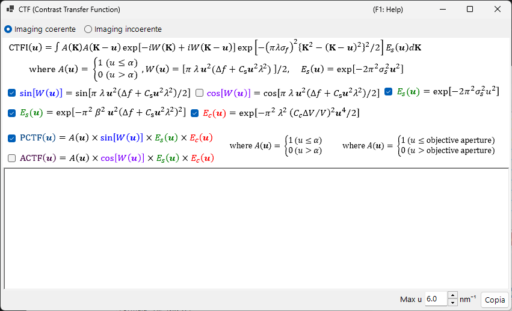

# Simulazione HRTEM

Simula immagini TEM ad alta risoluzione con frange reticolari. La modalità principale del [Simulatore HRTEM/STEM](index.md).

---

## Flusso di calcolo

1. **Metodo delle onde di Bloch**: calcola la propagazione dell'onda elettronica attraverso il potenziale del cristallo; fornisce ampiezza e fase dell'onda uscente
2. **Funzione della lente**: applica le aberrazioni della lente obiettivo (aberrazione sferica $C_s$, defocalizzazione $\Delta f$)
3. **Coerenza parziale**: tiene conto della dimensione finita della sorgente (coerenza spaziale) e della larghezza in energia (coerenza temporale)
4. **Formazione dell'immagine**: calcola l'intensità $|\psi(\mathbf{r})|^2$

---

## Parametri del campione

| Parametro | Descrizione |
|-----------|-------------|
| **Thickness** | Spessore del campione (nm). Le immagini HRTEM dipendono fortemente dallo spessore |

---

## Parametri ottici

### Condizioni TEM

| Parametro | Descrizione |
|-----------|-------------|
| **Acc. Vol.** | Tensione di accelerazione (kV). La lunghezza d'onda corretta relativisticamente è mostrata accanto |
| **Defocus** | Valore di defocalizzazione (nm). La defocalizzazione di Scherzer è mostrata come riferimento |

### Parametri intrinseci

| Parametro | Descrizione | Tipico |
|-----------|-------------|---------|
| **Cs** | Aberrazione sferica (mm) | 0.5–1.0 (convenzionale); < 0.01 (corretta in Cs) |
| **Cc** | Aberrazione cromatica (mm) | 1.0–2.0 |
| **β** | Semiangolo di illuminazione (mrad) | 0.1–1.0 |
| **ΔE** | Larghezza in energia 1/*e* (eV) | 0.5–2.0 |

---

## Funzione di trasferimento del contrasto di fase (PCTF)

Visualizzata nella scheda della funzione della lente:

- $\sin\chi(u)$: funzione di trasferimento del contrasto di fase ($\chi(u)$ è la funzione di aberrazione della lente)
- $E_\text{s}(u)$: inviluppo della coerenza spaziale
- $E_\text{c}(u)$: inviluppo della coerenza temporale

Defocalizzazione di Scherzer: $\Delta f = -\sqrt{\tfrac{4}{3}\,C_s \lambda}\ (\approx -1.155\,\sqrt{C_s \lambda})$, la condizione che fornisce una banda PCTF negativa ampia (contrasto scuro = posizioni atomiche). ReciPro utilizza questo valore di Scherzer originale — ricavato ponendo il minimo della fase di aberrazione $\chi$ a $-2\pi/3$ — e il valore mostrato nella GUI segue questa formula; alcune fonti utilizzano invece il valore di *Scherzer esteso* $-1.2\sqrt{C_s\lambda}$.

---

## Apertura obiettivo

Imposta la dimensione dell'apertura (mrad) e la posizione. **Open aperture** la rimuove. Il numero di onde di Bloch considerate dipende dalle condizioni dell'apertura.

---

## Modelli di coerenza parziale

| Modello | Descrizione |
|-------|-------------|
| **Quasi-coherent (linear image)** | Veloce. Valido nell'approssimazione di fase debole |
| **TCC (Transmission Cross Coefficient)** | Più accurato; calcolo più lungo |

---

## Modalità di simulazione

| Modalità | Descrizione |
|------|-------------|
| **Single image** | Una sola immagine allo spessore e alla defocalizzazione correnti |
| **Serial image** | Matrice di immagini su intervalli di spessore × defocalizzazione (Start / Step / Num) |

---

## Regolazione dell'immagine

| Impostazione | Descrizione |
|---------|-------------|
| **Min / Max** | Intervallo di visualizzazione (cursori di regolazione dell'immagine) |
| **Colour** | Scala di grigi o Cold-Warm |
| **Gaussian blur (FWHM)** | Applica un filtro gaussiano |
| **Unit cell** | Sovrappone la griglia della cella elementare |
| **Scale** | Mostra una barra di scala |

---

## Vedi anche

- [Simulatore HRTEM/STEM (panoramica)](index.md)
- [Simulazione STEM](2-stem-simulation.md)
- [Simulazione del potenziale](3-potential-simulation.md)
- [Appendice A3.2 — Formazione dell'immagine HRTEM](../appendix/a3-bloch-wave/hrtem.md)
