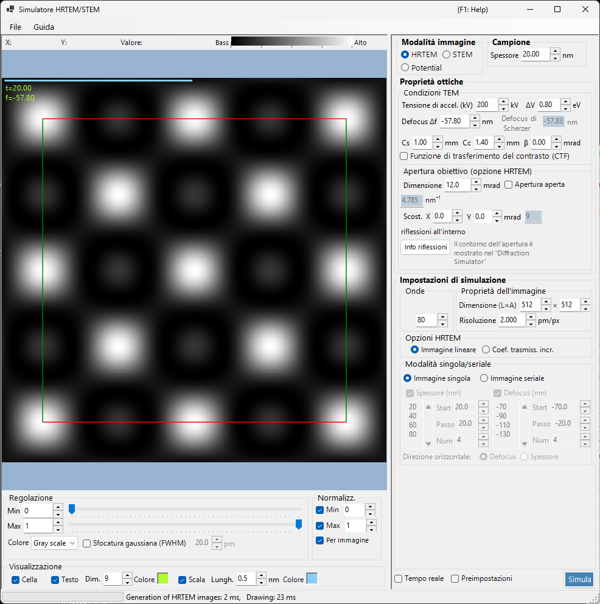
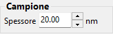
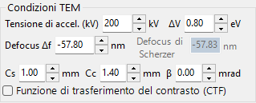
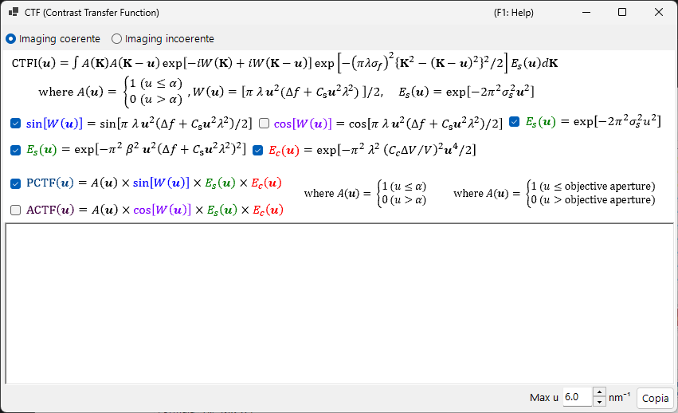
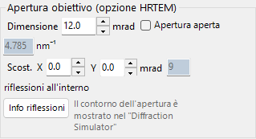
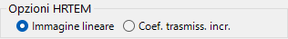
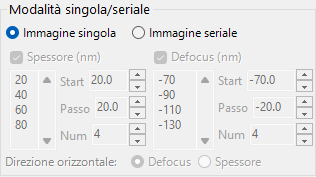
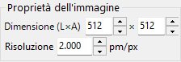
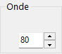

# Simulazione HRTEM

La simulazione **HRTEM (High-Resolution Transmission Electron Microscopy)** calcola immagini TEM ad alta risoluzione con frange reticolari. È la modalità principale del [Simulatore HRTEM/STEM](index.md).

> Questa pagina descrive tutte le impostazioni che compaiono sul lato destro quando **Modalità immagine = HRTEM**. Per i controlli sul lato sinistro — visualizzazione del risultato e regolazione della luminosità — vedere la [pagina panoramica](index.md#display-settings).

---

## Panoramica

Un'immagine HRTEM si forma quando l'onda elettronica trasmessa attraverso il campione viene riprodotta sotto l'influenza delle aberrazioni della lente obiettivo. ReciPro calcola la propagazione dell'onda elettronica all'interno del campione con il metodo delle onde di Bloch (calcolo dinamico) e genera l'immagine HRTEM tramite la funzione di trasferimento del contrasto di fase (PCTF).

### Flusso di calcolo

1. **Metodo delle onde di Bloch**: calcola la propagazione dell'onda elettronica nel potenziale del cristallo e ottiene ampiezza e fase dell'onda uscente
2. **Funzione della lente**: applica le aberrazioni della lente obiettivo (aberrazione sferica $C_s$, defocus $\Delta f$)
3. **Coerenza parziale**: tiene conto della dimensione finita della sorgente (coerenza spaziale) e della fluttuazione di energia (coerenza temporale)
4. **Formazione dell'immagine**: calcola la distribuzione di intensità $|\psi(\mathbf{r})|^2$

Per la teoria, vedere [Appendice A3.2 — Formazione dell'immagine HRTEM](../appendix/a3-bloch-wave/hrtem.md).

---

## Campione

- **Spessore** : spessore del campione (nm). Le immagini HRTEM dipendono fortemente dallo spessore. In modalità **Immagine seriale** questo valore viene ignorato e si usa invece l'elenco degli spessori descritto più avanti.

---

## Condizioni TEM

Imposta le condizioni di imaging della lente obiettivo.

| Parametro | Descrizione | Predefinito / tipico |
|-----------|-------------|-------------------|
| **Tensione di accel. (kV)** | Tensione di accelerazione. La lunghezza d'onda elettronica corretta relativisticamente è mostrata a destra | 200 kV |
| **Defocus Δf** | Defocus della lente obiettivo (nm). Il valore di riferimento del **Defocus di Scherzer** è mostrato sotto | −57.8 nm |
| **Cs** | Coefficiente di aberrazione sferica (mm). Influisce sulla CTF e sul defocus di Scherzer | 0.5–1.0 (convenzionale), < 0.01 (corretto in Cs) |
| **Cc** | Coefficiente di aberrazione cromatica (mm). Determina la sfocatura dell'immagine dovuta alla dispersione in energia | 1.0–2.0 mm |
| **β** | Semiangolo di illuminazione (mrad). Rappresenta l'effetto della dimensione finita della sorgente (coerenza spaziale) | 0.1–1.0 mrad |
| **ΔV** | Larghezza a metà altezza della dispersione in energia degli elettroni (eV). Insieme a Cc determina la dispersione del fuoco dovuta all'aberrazione cromatica | 0.5–2.0 eV |

> **Menu contestuale**: sul pannello Condizioni TEM si possono applicare con un solo clic **Azzera tutte le aberrazioni** / **Imposta defocus al valore di Scherzer** / **Imposta defocus a 0 nm**. Le preimpostazioni delle condizioni (300kV ARM300F, 200kV 2100F e così via) sono disponibili da **Preimpostazioni** in basso a sinistra.

### Defocus di Scherzer

Il valore di defocus in prossimità del quale il contrasto di fase è ottimale, calcolato dalla lunghezza d'onda corrente e dall'aberrazione sferica $C_s$ (mostrato come riferimento).

$$\Delta f_{\text{Scherzer}} = -\sqrt{\tfrac{4}{3}\,C_s \lambda}\quad\left(\approx -1.155\,\sqrt{C_s \lambda}\right)$$

In questa condizione la PCTF è negativa su un ampio intervallo di frequenze spaziali, per cui le posizioni atomiche appaiono con contrasto scuro. ReciPro adotta questo valore di Scherzer originale (ricavato ponendo il minimo della fase di aberrazione $\chi$ a $-2\pi/3$), e il valore mostrato nella GUI segue questa formula. Si noti che alcuni riferimenti utilizzano invece il valore di *Scherzer esteso* $-1.2\sqrt{C_s\lambda}$, che allarga ulteriormente la banda di trasferimento.

---

## Funzione della lente / Funzione di trasferimento del contrasto (CTF)

Spuntando **Funzione di trasferimento del contrasto (CTF)** si apre una finestra che traccia come le aberrazioni della lente e il defocus trasferiscono il contrasto dell'immagine a ciascuna frequenza spaziale.

- $\sin\chi(u)$ : funzione di trasferimento del contrasto di fase ($\chi(u)$ è la funzione di aberrazione della lente)
- $E_\text{s}(u)$ : funzione di inviluppo della coerenza spaziale; lo smorzamento dovuto alla dimensione finita della sorgente ($\beta$)
- $E_\text{c}(u)$ : funzione di inviluppo della coerenza temporale; lo smorzamento dovuto alla fluttuazione di energia ($C_c$, $\Delta V$)

La modifica del limite superiore dell'asse orizzontale $u$ (frequenza spaziale) cambia l'intervallo tracciato.

---

## Apertura obiettivo (opzione HRTEM)

Limita le onde diffratte che attraversano l'apertura obiettivo. Il numero di onde diffratte tagliate dall'apertura modifica anche il numero di spot inclusi nel calcolo delle onde di Bloch (il limite superiore è il numero massimo di onde di Bloch impostato in **Onde**).

- **Dimensione** : semiangolo dell'apertura obiettivo (mrad). Più è piccola, più onde diffratte ad alto angolo vengono tagliate e più i dettagli ad alta risoluzione risultano smussati. Viene mostrato il raggio equivalente nello spazio reciproco $\sin\theta/\lambda$ (nm⁻¹).
- **Scost. X** / **Y** : spostamento del centro dell'apertura obiettivo (mrad). Usato per l'imaging in campo scuro e con fascio inclinato.
- **Apertura aperta** : apre l'apertura obiettivo (infinita), così che tutte le onde diffratte contribuiscano all'immagine.
- **riflessioni all'interno** : il numero di fasci diffratti (spot) che cadono all'interno dell'apertura (sola lettura).
- **Info riflessioni** : apre una tabella che elenca i fasci diffratti all'interno dell'apertura (intensità, ampiezza complessa e così via).

> La dimensione dell'apertura obiettivo è mostrata anche nel **Simulatore di diffrazione**.

---

## Opzioni HRTEM (modello di coerenza parziale)

Seleziona il modello di interferenza utilizzato per integrare i contributi di tutte le direzioni del fascio incidente.

- **Immagine lineare** : calcolo poco costoso. Adatto a campioni sottili per i quali vale l'approssimazione di oggetto a fase debole; moltiplica la PCTF per gli inviluppi di coerenza spaziale e temporale.
- **Coef. trasmiss. incr.** (coefficiente di trasmissione incrociato) : calcolo costoso ma più accurato. Integra il coefficiente di trasmissione incrociato completo ed è il modello da usare per diffusori forti che eccitano molte onde diffratte intense.

Per i dettagli, vedere [Appendice A3.2 — Formazione dell'immagine HRTEM](../appendix/a3-bloch-wave/hrtem.md).

---

## Modalità singola/seriale

- **Immagine singola** : calcola una sola immagine HRTEM allo spessore e al defocus correnti.
- **Immagine seriale** : genera un insieme di immagini variando per passi lo spessore e il defocus (serie in spessore / serie focale). Utile per trovare la condizione che meglio corrisponde a un'immagine sperimentale.

Per un'immagine seriale, impostare quanto segue.

| Voce | Descrizione |
|------|-------------|
| **Spessore (nm)** / **Defocus (nm)** | Quale grandezza far variare (sono ammesse entrambe) |
| **Start / Passo / Num** | Valore iniziale, ampiezza del passo e numero di immagini. Vengono espansi nella casella di elenco sottostante, che può anche essere modificata direttamente |
| **Direzione orizzontale:** | Quando si fanno variare sia lo spessore sia il defocus, la grandezza disposta lungo la direzione orizzontale della griglia (**Defocus** o **Spessore**) |

Facendo variare sia lo spessore sia il defocus si ottiene una matrice di immagini righe × colonne.

---

## Proprietà dell'immagine

- **Dimensione (L×A)** : numero di pixel dell'immagine simulata (512×512 per impostazione predefinita).
- **Risoluzione** : risoluzione di campionamento (pm/px). Un valore più piccolo risolve frange reticolari più fini, ma il tempo di FFT cresce proporzionalmente.

---

## Onde

- Numero massimo di onde di Bloch utilizzate nel metodo di Bethe (calcolo dinamico), 80 per impostazione predefinita. Un numero maggiore migliora l'accuratezza, ma la risoluzione del problema agli autovalori richiede un tempo $O(N^3)$.

---

## Vedere anche

- [Simulatore HRTEM/STEM (panoramica)](index.md)
- [Simulazione STEM](2-stem-simulation.md)
- [Simulazione del potenziale](3-potential-simulation.md)
- [Appendice A3.2 — Formazione dell'immagine HRTEM](../appendix/a3-bloch-wave/hrtem.md)
