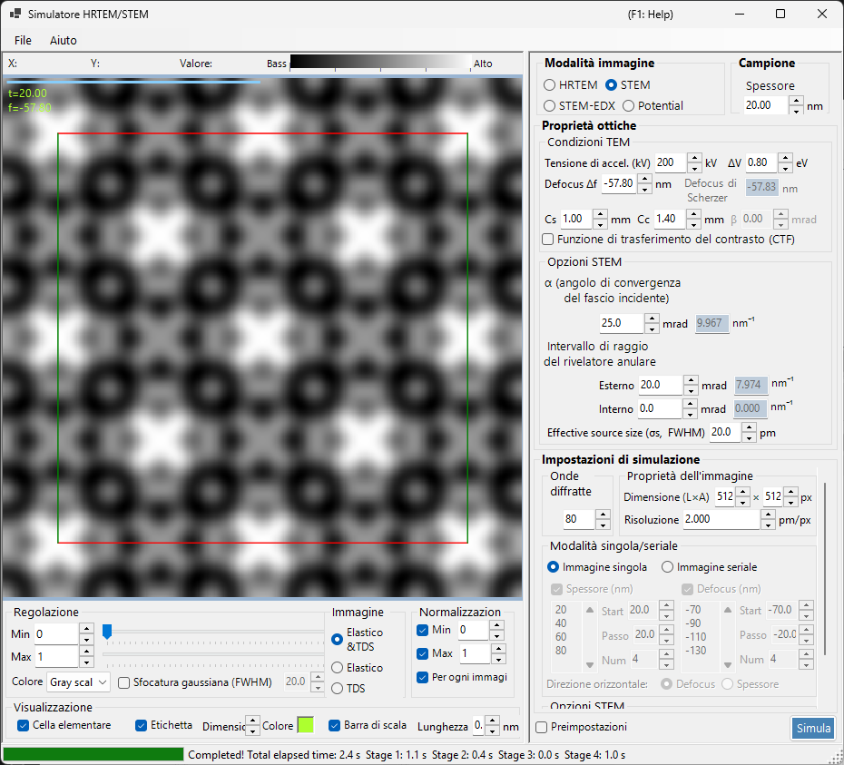
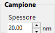
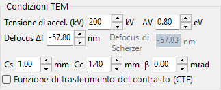
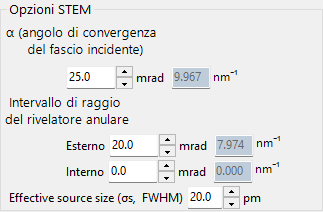
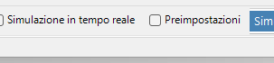
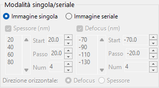
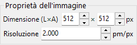
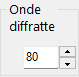
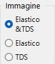

# Simulazione STEM

La simulazione **STEM (Scanning Transmission Electron Microscopy)** calcola immagini di microscopia elettronica a trasmissione a scansione con il metodo delle onde di Bloch.

> Questa pagina elenca tutte le impostazioni che compaiono a destra quando **Image mode = STEM**. Per i controlli di visualizzazione del risultato, luminosità e normalizzazione a sinistra, vedere la [pagina panoramica](index.md). Solo il **bersaglio di visualizzazione** specifico dello STEM è ripetuto di seguito.

---

## Panoramica

Un fascio elettronico convergente viene fatto scansionare sul campione, e gli elettroni trasmessi e diffusi in ciascuna posizione di scansione vengono raccolti da rivelatori anulari. ReciPro calcola l'immagine STEM con il metodo delle onde di Bloch (calcolo dinamico).

### Flusso di calcolo

1. In ciascuna posizione di scansione, calcola le intensità diffratte con il metodo delle onde di Bloch per ogni direzione di incidenza della sonda convergente.
2. Integra l'intensità diffusa sull'intervallo angolare del rivelatore.
3. È possibile calcolare sia il contributo elastico sia quello della diffusione termica diffusa (TDS).

Vedere [Appendice A3.4 — Calcolo STEM](../appendix/a3-bloch-wave/stem.md) per la teoria.

---

## Tipi di rivelatore

| Rivelatore | Intervallo angolare | Contributo principale | Contrasto |
|----------|-------------|-------------------|----------|
| **BF** (campo chiaro) | 0 – angolo di convergenza | Elastico | Contrasto di fase |
| **ABF** (campo chiaro anulare) | Parte interna dell'angolo di convergenza | Elastico | Sensibile agli elementi leggeri |
| **LAADF** (campo scuro anulare a basso angolo) | Appena oltre l'angolo di convergenza | Elastico + TDS | Sensibile alla deformazione |
| **HAADF** (campo scuro anulare ad alto angolo) | Ben oltre l'angolo di convergenza | TDS (anelastico) | Contrasto-Z ($\propto Z^2$) |

> **Impostazioni tipiche del rivelatore** (ciascuna disponibile con un clic dal menu contestuale delle opzioni STEM, tutte con angolo di convergenza α = 25 mrad):
> BF (0–5 mrad) / ABF (12–24 mrad) / LAADF (26–60 mrad) / HAADF (80–250 mrad)

---

## Parametri del campione

- **Thickness** : spessore del campione (nm). Questo valore viene ignorato nella modalità **Serial image**.

---

## Condizioni TEM

| Parametro | Descrizione | Predefinito / tipico |
|-----------|-------------|-------------------|
| **Acc. Vol. (kV)** | Tensione di accelerazione. La lunghezza d'onda dell'elettrone corretta relativisticamente è mostrata accanto | 200 kV |
| **Defocus Δf** | Defocalizzazione della lente obiettivo (che forma la sonda) (nm) | −57.8 nm |
| **Cs** | Coefficiente di aberrazione sferica (mm). Influenza la dimensione della sonda | 0.5–1.0 mm |
| **Cc** | Coefficiente di aberrazione cromatica (mm) | 1.0–2.0 mm |
| **ΔV (FWHM)** | Larghezza a metà altezza della dispersione di energia degli elettroni (eV) | 0.5–2.0 eV |

> **β (semiangolo di illuminazione) è disabilitato in modalità STEM**, perché l'angolo di convergenza α ne assume il ruolo.

---

## Opzioni STEM (ottiche)

Imposta la geometria della sonda convergente e del rivelatore anulare. Ogni angolo è anche mostrato a destra convertito in un raggio nello spazio reciproco $\sin\theta/\lambda$ (nm⁻¹).

| Parametro | Descrizione | Predefinito / tipico |
|-----------|-------------|-------------------|
| **α (convergence angle)** | Semiangolo della sonda convergente (mrad). Valori maggiori danno una sonda più fine e modificano il contrasto di diffrazione | 15–25 mrad |
| **(Annular) detector inner angle** | Semiangolo di raccolta interno del rivelatore anulare (mrad). Il segnale all'interno di questo angolo è escluso | BF: 0, HAADF: 80 |
| **(Annular) detector outer angle** | Semiangolo di raccolta esterno del rivelatore anulare (mrad). Il segnale all'esterno di questo angolo è escluso | BF: 5, HAADF: 250 |
| **Effective source size σs (FWHM)** | Dimensione effettiva della sorgente di elettroni. Valori maggiori sfocano la sonda e riducono il contrasto dei dettagli fini | — |

---

## Opzioni STEM (simulazione)

- **Slice thickness for inelastic** : spessore della fetta del campione (nm) utilizzato nel calcolo dell'intensità TDS (termica diffusa, anelastica). Valori più piccoli sono più accurati ma più lenti.
- **Angular resolution** : risoluzione di campionamento angolare delle direzioni di incidenza della sonda (mrad). Valori più piccoli campionano la sonda più finemente ma sono più lenti.

---

## Modalità immagine (single / serial)

- **Single image** : calcola una sola immagine STEM allo spessore corrente.
- **Serial image** : genera una serie di immagini con spessore / defocalizzazione variati a passi (impostati con **Start / Step / Num**; l'elenco sottostante può anche essere modificato direttamente).

---

## Proprietà dell'immagine

- **Size (W×H)** : numero di pixel nell'immagine scansionata (predefinito 512×512). In STEM questo equivale al numero di punti di scansione e scala linearmente il tempo di calcolo.
- **Resolution** : risoluzione di campionamento (pm/px).

---

## Onde diffratte

- **Max Bloch waves** : numero massimo di onde di Bloch utilizzate nel metodo di Bethe (predefinito 80). Il costo del problema agli autovalori scala con il cubo del numero di onde.

---

## Bersaglio di visualizzazione STEM (lato risultato)

L'interruttore di visualizzazione in basso a sinistra della finestra seleziona quale componente di diffusione dell'immagine STEM già calcolata mostrare (commutabile senza ricalcolare).

| Bersaglio di visualizzazione | Descrizione |
|----------------|-------------|
| **Elastic** | Immagine della sola diffusione elastica |
| **TDS** | Immagine della sola diffusione termica diffusa |
| **Elastic & TDS** | Somma di elastico + TDS |

---

## Costo computazionale

La simulazione STEM è computazionalmente onerosa, quindi impostare i seguenti parametri in modo appropriato.

| Fattore | Impatto |
|--------|--------|
| **Angolo di convergenza** | Maggiore → più sovrapposizione dei dischi CBED → costo più elevato |
| **Onde di Bloch** | Il costo del problema agli autovalori scala come N³ |
| **Risoluzione angolare** | Più fine → più accurata ma il costo scala come N² |
| **Pixel dell'immagine (Size)** | Scala lineare con il numero di punti di scansione |

---

## Importanza del fattore di temperatura

Per la simulazione HAADF-STEM, gli atomi devono avere un fattore di temperatura isotropo non nullo (fattore di Debye–Waller). Se il valore è sconosciuto, impostare $B \approx 0.5\ \text{Å}^2$. Con un fattore di temperatura pari a zero, l'intensità TDS è nulla e l'immagine HAADF non viene calcolata correttamente.

| Rivelatore | Intervallo | Contributo principale |
|----------|-------|-------------------|
| BF, ABF | All'interno dell'angolo di convergenza | Elastico |
| LAADF, HAADF | All'esterno dell'angolo di convergenza | Anelastico (TDS) |

---

## Confronto con Dr. Probe

È stato confermato che le simulazioni STEM di ReciPro concordano strettamente con la diffusa GUI Dr. Probe (v1.10). La figura seguente confronta le due per i rivelatori BF, ABF, LAADF e HAADF su una serie di spessori (2.96–60.05 nm), sia in assenza di aberrazioni (a sinistra) sia con Cs = 0.2 mm, defocalizzazione = −25.9 nm (a destra). I due codici concordano per tutti i tipi di rivelatore e tutti gli spessori.

Un rapporto più dettagliato è disponibile come PDF: [Confronto delle simulazioni STEM con la GUI Dr. Probe (v1.10) e ReciPro (v4.854)](https://github.com/seto77/ReciPro/files/10976084/ComparisonSTEMsimulations.pdf).

---

## Vedere anche

- [Simulatore HRTEM/STEM (panoramica)](index.md)
- [Simulazione HRTEM](1-hrtem-simulation.md)
- [Simulazione del potenziale](3-potential-simulation.md)
- [Appendice A3.4 — Calcolo STEM](../appendix/a3-bloch-wave/stem.md)
- [Appendice A3.4 — Calcolo STEM](../appendix/a3-bloch-wave/stem.md)
