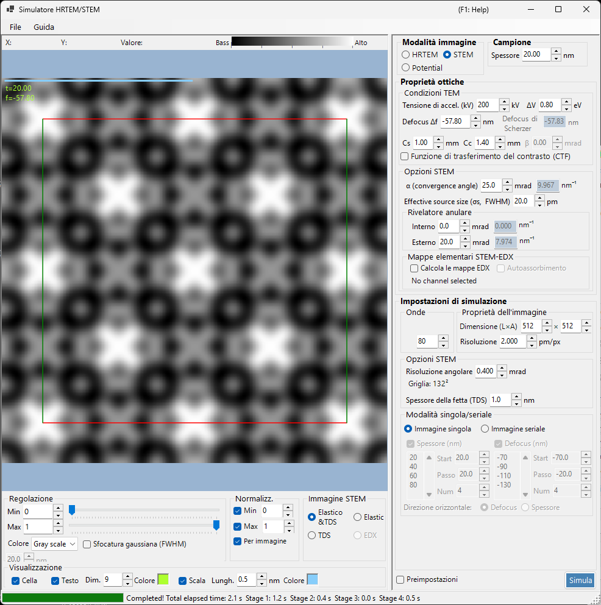
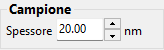
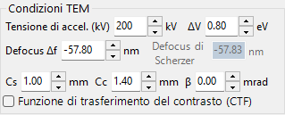
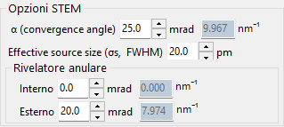
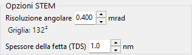
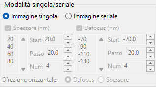
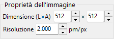
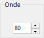
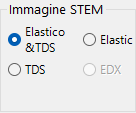
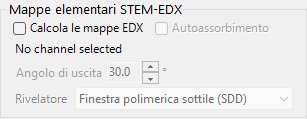

# Simulazione STEM

La simulazione **STEM (Scanning Transmission Electron Microscopy)** calcola immagini di microscopia elettronica a trasmissione a scansione con il metodo delle onde di Bloch.

> Questa pagina elenca tutte le impostazioni che compaiono a destra quando **Image mode = STEM**. Per i controlli di visualizzazione del risultato, luminosità e normalizzazione a sinistra, vedere la [pagina panoramica](index.md). Solo il **bersaglio di visualizzazione** specifico dello STEM è ripetuto di seguito.

---

## Panoramica

Un fascio elettronico convergente viene fatto scansionare sul campione, e gli elettroni trasmessi e diffusi in ciascuna posizione di scansione vengono raccolti da rivelatori anulari. ReciPro calcola l'immagine STEM con il metodo delle onde di Bloch (calcolo dinamico).

### Flusso di calcolo

1. In ciascuna posizione di scansione, calcola le intensità diffratte con il metodo delle onde di Bloch per ogni direzione di incidenza della sonda convergente.
2. Integra l'intensità diffusa sull'intervallo angolare del rivelatore.
3. È possibile calcolare sia il contributo elastico sia quello della diffusione termica diffusa (TDS).

Vedere [Appendice A3.4 — Calcolo STEM](../appendix/a3-bloch-wave/stem.md) per la teoria.

---

## Tipi di rivelatore

| Rivelatore | Intervallo angolare | Contributo principale | Contrasto |
|----------|-------------|-------------------|----------|
| **BF** (campo chiaro) | 0 – angolo di convergenza | Elastico | Contrasto di fase |
| **ABF** (campo chiaro anulare) | Parte interna dell'angolo di convergenza | Elastico | Sensibile agli elementi leggeri |
| **LAADF** (campo scuro anulare a basso angolo) | Appena oltre l'angolo di convergenza | Elastico + TDS | Sensibile alla deformazione |
| **HAADF** (campo scuro anulare ad alto angolo) | Ben oltre l'angolo di convergenza | TDS (anelastico) | Contrasto-Z ($\propto Z^2$) |

> **Impostazioni tipiche del rivelatore** (ciascuna disponibile con un clic dal menu contestuale delle opzioni STEM, tutte con angolo di convergenza α = 25 mrad):
> BF (0–5 mrad) / ABF (12–24 mrad) / LAADF (26–60 mrad) / HAADF (80–250 mrad)

---

## Parametri del campione

- **Thickness** : spessore del campione (nm). Questo valore viene ignorato nella modalità **Serial image**.

---

## Condizioni TEM

| Parametro | Descrizione | Predefinito / tipico |
|-----------|-------------|-------------------|
| **Acc. Vol. (kV)** | Tensione di accelerazione. La lunghezza d'onda dell'elettrone corretta relativisticamente è mostrata accanto | 200 kV |
| **Defocus Δf** | Defocalizzazione della lente obiettivo (che forma la sonda) (nm) | −57.8 nm |
| **Cs** | Coefficiente di aberrazione sferica (mm). Influenza la dimensione della sonda | 0.5–1.0 mm |
| **Cc** | Coefficiente di aberrazione cromatica (mm) | 1.0–2.0 mm |
| **ΔV (FWHM)** | Larghezza a metà altezza della dispersione di energia degli elettroni (eV) | 0.5–2.0 eV |

> **β (semiangolo di illuminazione) è disabilitato in modalità STEM**, perché l'angolo di convergenza α ne assume il ruolo.

---

## Opzioni STEM (ottiche)

Imposta la geometria della sonda convergente e del rivelatore anulare. Ogni angolo è anche mostrato a destra convertito in un raggio nello spazio reciproco $\sin\theta/\lambda$ (nm⁻¹).

| Parametro | Descrizione | Predefinito / tipico |
|-----------|-------------|-------------------|
| **α (convergence angle)** | Semiangolo della sonda convergente (mrad). Valori maggiori danno una sonda più fine e modificano il contrasto di diffrazione | 15–25 mrad |
| **(Annular) detector inner angle** | Semiangolo di raccolta interno del rivelatore anulare (mrad). Il segnale all'interno di questo angolo è escluso | BF: 0, HAADF: 80 |
| **(Annular) detector outer angle** | Semiangolo di raccolta esterno del rivelatore anulare (mrad). Il segnale all'esterno di questo angolo è escluso | BF: 5, HAADF: 250 |
| **Effective source size σs (FWHM)** | Dimensione effettiva della sorgente di elettroni. Valori maggiori sfocano la sonda e riducono il contrasto dei dettagli fini | — |

---

## Opzioni STEM (simulazione)

- **Slice thickness for inelastic** : spessore della fetta del campione (nm) utilizzato nel calcolo dell'intensità TDS (termica diffusa, anelastica). Valori più piccoli sono più accurati ma più lenti.
- **Angular resolution** : risoluzione di campionamento angolare delle direzioni di incidenza della sonda (mrad). Valori più piccoli campionano la sonda più finemente ma sono più lenti. Il numero di direzioni cresce come il quadrato di questo rapporto, per cui è la leva principale sul tempo di calcolo; per le misure di convergenza vedi [Campionamento angolare della sonda](../appendix/a3-bloch-wave/stem.md#angular-sampling).

---

## Modalità immagine (single / serial)

- **Single image** : calcola una sola immagine STEM allo spessore corrente.
- **Serial image** : genera una serie di immagini con spessore / defocalizzazione variati a passi (impostati con **Start / Step / Num**; l'elenco sottostante può anche essere modificato direttamente).

---

## Proprietà dell'immagine

- **Size (W×H)** : numero di pixel nell'immagine scansionata (predefinito 512×512). In STEM questo equivale al numero di punti di scansione e scala linearmente il tempo di calcolo.
- **Resolution** : risoluzione di campionamento (pm/px).

---

## Onde diffratte

- **Max Bloch waves** : numero massimo di onde di Bloch utilizzate nel metodo di Bethe (predefinito 80). Il costo del problema agli autovalori scala con il cubo del numero di onde.

---

## Bersaglio di visualizzazione STEM (lato risultato) {#stem-display-target}

L'interruttore di visualizzazione in basso a sinistra della finestra seleziona quale componente di diffusione dell'immagine STEM già calcolata mostrare (commutabile senza ricalcolare).

| Bersaglio di visualizzazione | Descrizione |
|----------------|-------------|
| **Elastic** | Immagine della sola diffusione elastica |
| **TDS** | Immagine della sola diffusione termica diffusa |
| **Elastic & TDS** | Somma di elastico + TDS |
| **EDX** | Mappa dei raggi X caratteristici. La riga da mostrare (ad esempio `O-K`) si sceglie nella casella combinata sottostante, e **EDX comune** in *Normalizz.* pone tutti i canali su un unico intervallo di visualizzazione condiviso, così che cambiando canale l'immagine non venga riscalata |

!!! note
    Tutte e tre le immagini sono ricostruite dalla parte reale della somma di Fourier, quindi **Elastic & TDS** è esattamente la somma delle altre due. Fino alla versione 4.944 veniva preso il modulo, il che rompeva questa identità e schiariva leggermente i pixel scuri. Vedi [Ricostruzione di un'immagine reale](../appendix/a3-bloch-wave/stem.md#real-image-reconstruction).

---

## Mappe elementari STEM-EDX {#stem-edx}

Spuntare **Calcola le mappe EDX** per calcolare le mappe dei raggi X caratteristici insieme all'immagine di tipo ADF. Non si tratta di una modalità separata: i segnali elastico, TDS ed EDX provengono tutti dalla stessa esecuzione STEM, e in seguito si passa dall'uno all'altro in [Immagine STEM](#stem-display-target) senza ricalcolare.

Non c'è un selettore di elementi. Quando la casella è spuntata viene calcolato **ogni canale elemento/guscio calcolabile per questo cristallo a questa tensione di accelerazione**, e la riga sotto la casella li elenca (ad esempio `3 mappa/e: O-K, Mg-K, Al-K`). Un canale è disponibile quando la soglia di ionizzazione si trova al di sotto della tensione di accelerazione e il guscio è coperto dai dati forniti — K: C–Sn (Z = 6–50), L-totale: Ca–Rn (Z = 20–86). La tabella fornita memorizza fattori di forma di ionizzazione completamente relativistici fino a un vettore di diffusione di 8 Å⁻¹ per ogni canale, per cui le righe L degli elementi pesanti fino al radon sono simulate senza estrapolazione. Se nessun canale è disponibile, il calcolo viene rifiutato con un messaggio esplicativo invece di produrre una mappa vuota.

La riga successiva riporta la griglia delle direzioni della sonda, ad esempio `Griglia: 132² (consigliato: ≥48²)`. Questa griglia è determinata da **Risoluzione angolare** e dall'angolo di convergenza; vedi [Campionamento angolare della sonda](../appendix/a3-bloch-wave/stem.md#angular-sampling). Al di sotto della suddivisione consigliata il residuo hermitiano ±q può superare la tolleranza e interrompere il calcolo, per cui il valore diventa arancione e prima dell'avvio del calcolo compare una finestra di conferma.

!!! warning "Che cosa rappresentano i valori"
    La mappa è il **numero di lacune nei gusci interni generate per elettrone incidente** — una grandezza di modello, non un conteggio previsto di raggi X. La resa di fluorescenza, l'autoassorbimento nel campione, l'angolo solido del rivelatore e l'efficienza del rivelatore **non** sono applicati. Usare le mappe per la distribuzione spaziale e per confrontare spessori o orientazioni, non per una quantificazione assoluta.

### Parametri del rivelatore (riservati)

**Autoassorbimento**, **Angolo di uscita** e **Rivelatore** sono presenti nel pannello ma disabilitati: appartengono al modello del rivelatore non ancora implementato. Sono mostrati perché il pannello non cambi disposizione quando il modello verrà introdotto. Il loro effetto futuro differisce per natura:

| Fattore | Contrasto pixel per pixel in una mappa | Rapporto tra le mappe degli elementi |
|---|---|---|
| Autoassorbimento (angolo di uscita) | **lo modifica** | **lo modifica** |
| Finestra del rivelatore / strato morto / efficienza | nessun effetto | **lo modifica fortemente** |
| Angolo solido del rivelatore, corrente del fascio, tempo di permanenza | nessun effetto | nessun effetto |

L'ultima riga spiega perché ReciPro non espone affatto la corrente del fascio né il tempo di permanenza: moltiplicano ogni pixel di ogni mappa per lo stesso numero, si cancellano in qualunque rapporto e sono invisibili dopo la normalizzazione di visualizzazione.

### Accuratezza e costo

Lo STEM-EDX non impone limiti aggiuntivi al numero di onde né allo spessore della fetta: passa attraverso gli stessi percorsi di calcolo dell'immagine di tipo ADF, quindi le impostazioni che funzionano per lo STEM funzionano anche per l'EDX.

L'accuratezza è lasciata all'utente, esattamente come per il numero di onde o la risoluzione angolare. Come riferimento, l'errore di integrazione in profondità cresce all'incirca in proporzione a **Spessore della fetta (TDS)** — circa 2–3 % a 1 nm, 4–8 % a 2 nm e 12–23 % a 4 nm (relativo al picco, SrTiO₃ a 39 nm). Dimezzare lo spessore della fetta dimezza all'incirca l'errore e raddoppia all'incirca il lavoro di integrazione in profondità.

Con aberrazioni impostate (per esempio Cs = 1 mm con defocus di Scherzer a α = 25 mrad), la fase di aberrazione oscilla rapidamente sulla griglia delle direzioni della sonda, e STEM-EDX può rifiutare il calcolo con un errore *non-Hermitian residual* anche con una griglia fine — questo rifiuto protegge la mappa da artefatti di griglia di alcuni punti percentuali. Ridurre Cs e il defocus (la media di scansione di una mappa EDX non dipende affatto dalle aberrazioni), oppure rendere la **Risoluzione angolare** decisamente più fine accettando un calcolo più lungo.

---

## Costo computazionale

La simulazione STEM è computazionalmente onerosa, quindi impostare i seguenti parametri in modo appropriato.

| Fattore | Impatto |
|--------|--------|
| **Angolo di convergenza** | Maggiore → più sovrapposizione dei dischi CBED → costo più elevato |
| **Onde di Bloch** | Il costo del problema agli autovalori scala come N³ |
| **Risoluzione angolare** | Più fine → più accurata ma il costo scala come N² |
| **Pixel dell'immagine (Size)** | Scala lineare con il numero di punti di scansione |

---

## Importanza del fattore di temperatura

Per la simulazione HAADF-STEM, gli atomi devono avere un fattore di temperatura isotropo non nullo (fattore di Debye–Waller). Se il valore è sconosciuto, impostare $B \approx 0.5\ \text{Å}^2$. Con un fattore di temperatura pari a zero, l'intensità TDS è nulla e l'immagine HAADF non viene calcolata correttamente.

| Rivelatore | Intervallo | Contributo principale |
|----------|-------|-------------------|
| BF, ABF | All'interno dell'angolo di convergenza | Elastico |
| LAADF, HAADF | All'esterno dell'angolo di convergenza | Anelastico (TDS) |

---

## Confronto con Dr. Probe

È stato confermato che le simulazioni STEM di ReciPro concordano strettamente con la diffusa GUI Dr. Probe (v1.10). La figura seguente confronta le due per i rivelatori BF, ABF, LAADF e HAADF su una serie di spessori (2.96–60.05 nm), sia in assenza di aberrazioni (a sinistra) sia con Cs = 0.2 mm, defocalizzazione = −25.9 nm (a destra). I due codici concordano per tutti i tipi di rivelatore e tutti gli spessori.

Un rapporto più dettagliato è disponibile come PDF: [Confronto delle simulazioni STEM con la GUI Dr. Probe (v1.10) e ReciPro (v4.854)](https://github.com/seto77/ReciPro/files/10976084/ComparisonSTEMsimulations.pdf).

---

## Confronto con py_multislice

Le mappe STEM-EDX di ReciPro sono state verificate anche con [py_multislice](https://github.com/HamishGBrown/py_multislice), un codice multislice / fonone congelato indipendente. La figura confronta le mappe O-K, Ti-K e Sr-L di SrTiO₃ [001] a 200 kV su una serie di spessori (3,91–62,48 nm), senza aberrazioni (a sinistra) e con Cs = 0,2 mm, defocus = −25,9 nm (a destra).

Le forme normalizzate delle mappe concordano entro 1–2 % per Ti-K e Sr-L nel limite sottile. I **totali** differiscono del ±10–17 % perché i due codici prendono le sezioni d'urto di ionizzazione da fonti diverse (Bote–Salvat in ReciPro, tabelle del gruppo Allen in py_multislice). Il rapporto ReciPro / py_multislice cala inoltre con lo spessore, perché il modello assorbitivo di ReciPro rimuove gli elettroni diffusi termicamente mentre il fonone congelato continua a farli ionizzare — il che quantifica l'errore pratico dell'approssimazione assorbitiva per l'EDX.

Il rapporto completo, con le curve quantitative e l'analisi in frequenza spaziale, è disponibile in PDF: [Confronto di simulazioni STEM-EDX con py_multislice e ReciPro (v4.945)](../../assets/references/STEM_EDX_pyms_comparison.pdf).

---

## Vedere anche

- [Simulatore HRTEM/STEM (panoramica)](index.md)
- [Simulazione HRTEM](1-hrtem-simulation.md)
- [Simulazione del potenziale](3-potential-simulation.md)
- [Appendice A3.4 — Calcolo STEM](../appendix/a3-bloch-wave/stem.md)
