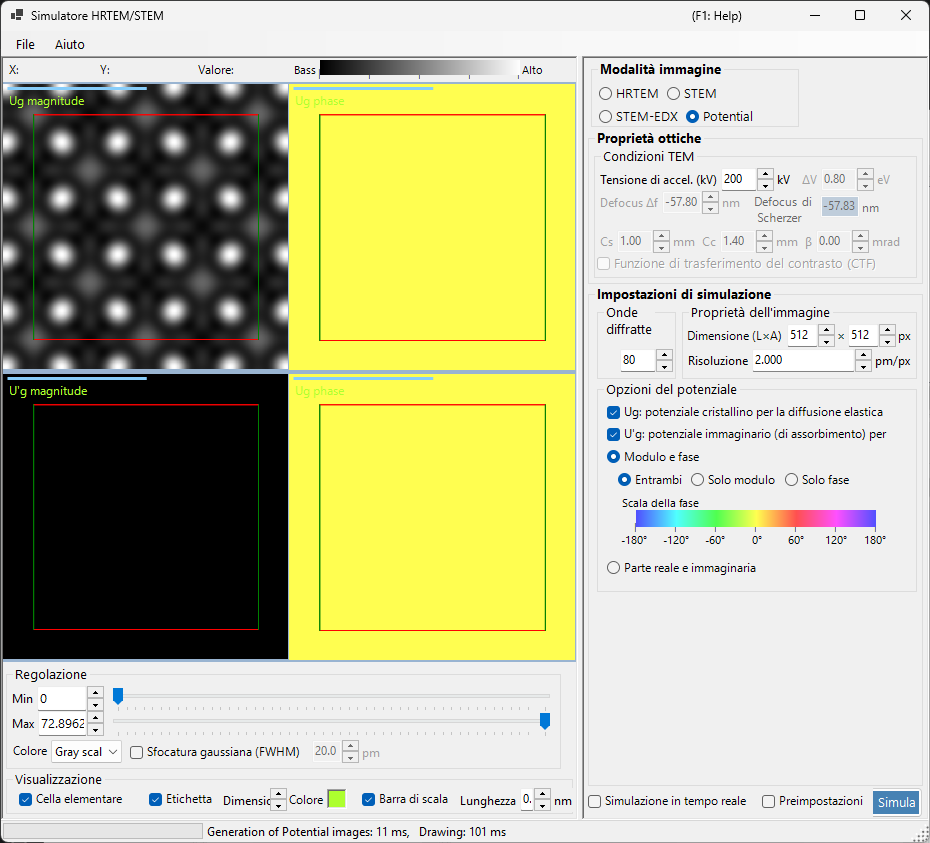

# Simulazione del potenziale

La **simulazione del potenziale** calcola e visualizza la distribuzione 2D del potenziale del cristallo. Non viene applicato alcun effetto di trasferimento dell'immagine (aberrazioni delle lenti, rivelatore): visualizza il potenziale proiettato del cristallo stesso.

> Questa pagina copre tutte le impostazioni che compaiono sul lato destro quando **Image mode = Potential**. Per la visualizzazione del risultato, la regolazione della luminosità e gli altri controlli sul lato sinistro, vedere la [pagina panoramica](index.md#display-settings).

---

## Panoramica

Gli elettroni all'interno di un cristallo vengono diffusi dal potenziale del cristallo. La sua distribuzione è alla base di tutti i fenomeni di diffrazione e di formazione dell'immagine ed è un'informazione chiave per comprendere la struttura del cristallo. Poiché questa modalità non include né aberrazioni delle lenti né effetti dinamici dipendenti dallo spessore, è particolarmente adatta all'esame della struttura stessa.

> **In modalità potenziale i pannelli per lo spessore del campione, la normalizzazione dell'intensità e la modalità immagine (single / serial) non vengono visualizzati.** Tra le condizioni TEM è attiva solo la tensione di accelerazione.

---

## Condizioni TEM

- **Acc. voltage (kV)** — tensione di accelerazione. Determina la lunghezza d'onda dell'elettrone ed è usata per calcolare i coefficienti di Fourier $U_g$ del potenziale.

> **Defocus, Cs, Cc, β, ΔE e la PCTF sono inattivi in modalità potenziale** (non viene applicata alcuna ottica di formazione dell'immagine) e appaiono in grigio.

---

## Opzioni del potenziale

Seleziona quale potenziale visualizzare e come visualizzarlo.

### Potenziale target

| Tipo | Descrizione |
|------|-------------|
| **$U_g$ — elastic scattering potential** | Il potenziale (elettrostatico) del cristallo responsabile della diffusione elastica. Rappresenta l'intensità di diffusione |
| **$U'_g$ — absorption potential** | Il potenziale immaginario (di assorbimento) che deriva dalla diffusione termica diffusa (TDS). Rappresenta la perdita dal canale elastico |

$U_g$ e $U'_g$ possono essere mostrati contemporaneamente (per ciascuno selezionato viene aggiunto un riquadro).

### Metodo di visualizzazione

| Modalità | Opzioni |
|------|---------|
| **Magnitude and phase** | **Both** / **Magnitude only** / **Phase only** (la fase è rappresentata con una ruota di colori e una scala di fase è mostrata sotto) |
| **Real and imaginary part** | **Both** / **Real only** / **Imaginary only** |

---

## Proprietà dell'immagine

- **Size (W×H)** — dimensioni in pixel dell'immagine generata (predefinito 512×512).
- **Resolution** — risoluzione di campionamento (pm/px).

---

## Onde diffratte

- **Max Bloch waves** — numero massimo di onde di Bloch (coefficienti di Fourier) incluse nella sintesi di Fourier del potenziale (predefinito 80). Valori più grandi includono frequenze spaziali più elevate e riproducono dettagli più fini del potenziale.

---

## Regolazione dell'immagine (lato sinistro)

La luminosità (Min / Max), la scala dei colori e la sovrapposizione del reticolo della cella elementare si impostano sul lato sinistro in **Adjust** e **Display** (vedere la [pagina panoramica](index.md#display-settings)).

---

## Vedere anche

- [Simulatore HRTEM/STEM (panoramica)](index.md)
- [Simulazione HRTEM](1-hrtem-simulation.md)
- [Simulazione STEM](2-stem-simulation.md)
