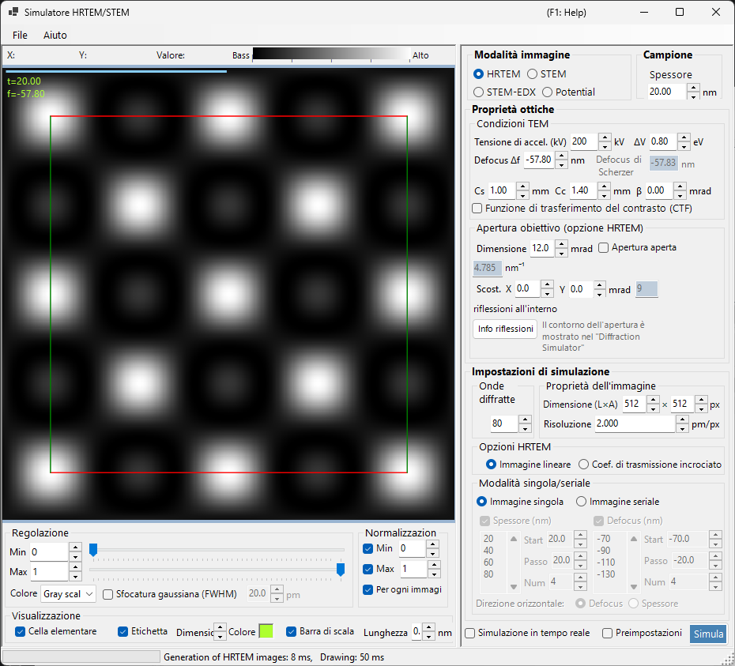
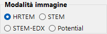
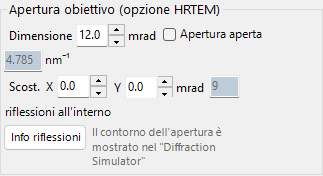
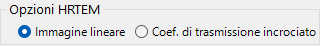
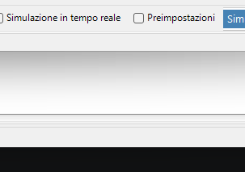
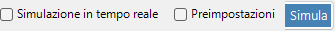
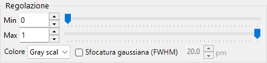
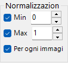
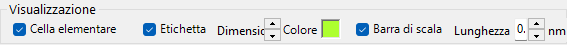

# HRTEM / STEM Simulator

Il **Simulatore HRTEM/STEM** simula immagini di frange reticolari TEM (HRTEM), immagini STEM e potenziali proiettati. Fare clic su **Simulate** per avviare il calcolo.

---

## Scorciatoie da tastiera e mouse

I risultati vengono mostrati come uno o più riquadri immagine. Utilizzano la [navigazione standard della vista immagine](../21-shortcuts.md) di ReciPro, e tutti i riquadri si spostano e si ingrandiscono insieme.

| Scorciatoia | Azione |
|----------|--------|
| <kbd>F1</kbd> | Apre questa pagina del manuale online |
| <kbd>CTRL</kbd>+<kbd>C</kbd> (griglia immagini attiva) | Copia l'immagine o le immagini negli appunti come metafile |
| Trascinamento sinistro / centrale | Sposta l'immagine (tutti i riquadri si muovono insieme) |
| Rotellina del mouse su / giù | Zoom avanti (×2) / indietro (×0.5) in corrispondenza del cursore |
| Trascinamento di un rettangolo con il tasto destro | Zoom avanti nella regione selezionata |
| Clic destro / doppio clic destro | Zoom indietro (×0.5) |
| <kbd>CTRL</kbd> + trascinamento di un rettangolo con il tasto destro | Seleziona un'area rettangolare |
| Doppio clic sinistro su un riquadro | Ingrandisce quel riquadro / ripristina la griglia (layout a più riquadri) |
| Movimento del mouse (senza tasto) | Legge la posizione (pm) e il valore del pixel in corrispondenza del cursore |

→ Vedere **[21. Scorciatoie da tastiera e mouse](../21-shortcuts.md)** per una panoramica di ogni finestra.

---

## Percorsi rapidi per obiettivo

| Obiettivo | Punto di partenza | Riferimento |
|------|------------|-----------|
| Calcolare una singola immagine HRTEM | Impostare **Image mode** su **HRTEM**, quindi impostare la tensione di accelerazione e la defocalizzazione in **TEM conditions** | [Simulazione HRTEM](1-hrtem-simulation.md), [Formazione dell'immagine HRTEM](../appendix/a3-bloch-wave/hrtem.md) |
| Calcolare un'immagine STEM | Impostare **Image mode** su **STEM**, quindi impostare l'angolo di convergenza e il rivelatore in **STEM options** | [Simulazione STEM](2-stem-simulation.md), [Calcolo STEM](../appendix/a3-bloch-wave/stem.md) |
| Visualizzare il potenziale proiettato | Impostare **Image mode** su **Potential** | [Simulazione del potenziale](3-potential-simulation.md) |
| Generare una serie di spessore / defocalizzazione | Configurare **Single / Serial** e le condizioni dell'immagine in **HRTEM options** | [Simulazione HRTEM](1-hrtem-simulation.md) |
| Usare HAADF-STEM con TDS | Impostare fattori di temperatura atomici diversi da zero e usare un rivelatore LAADF / HAADF | [Calcolo STEM](../appendix/a3-bloch-wave/stem.md) |

---

## Flusso di lavoro di base

1. Selezionare il cristallo e l'orientazione nella finestra principale, quindi aprire questo simulatore.
2. Scegliere HRTEM, STEM o Potential in **Image mode**.
3. Impostare tensione di accelerazione, defocalizzazione, aberrazioni, aperture e impostazioni di convergenza STEM in **Optical property**.
4. Impostare spessore, dimensione dell'immagine, risoluzione, numero di onde di Bloch e modello di coerenza parziale in **Simulation property**.
5. Fare clic su **Simulate**, quindi regolare luminosità, normalizzazione, barra di scala ed etichette in **Display settings**.

---

## Area immagine

La metà sinistra della finestra mostra l'immagine simulata. La barra di stato nella parte superiore riporta la posizione del cursore (**X:**, **Y:**) e il valore dell'immagine **Value:** (intensità) sotto il cursore, accanto a una scala di intensità **Low → High** che riflette la mappa di colori e l'intervallo di luminosità correnti.

---

## Menu File

### Menu Aiuto

---

## Image mode / Sample

{align=left}

HRTEM, Potential o STEM.

{ align=left style="clear: both" }
Imposta lo spessore del campione.

## Optical property { style="clear: both" }

### TEM conditions

Tensione di accelerazione, defocalizzazione (Scherzer mostrato).

#### Acc. voltage

Tensione di accelerazione del microscopio elettronico. Una modifica aggiorna la lunghezza d'onda corretta relativisticamente (mostrata accanto al campo) e, insieme a **Cs**, il valore suggerito di **Scherzer defocus** mostrato sotto.

#### Defocus

Valore di defocalizzazione della lente obiettivo. La defocalizzazione di Scherzer (il valore che massimizza il trasferimento di contrasto di fase nell'approssimazione di oggetto a fase debole) è mostrata sotto come riferimento.

### Inherent property (HRTEM optical aberrations)

Parametri di aberrazione specifici del microscopio usati dal calcolo della funzione della lente.

- **Cs** — coefficiente di aberrazione sferica.
- **Cc** — coefficiente di aberrazione cromatica.
- **β** — semiangolo di illuminazione (effetto di sorgente finita).
- **ΔE** — larghezza a 1/e della fluttuazione di energia degli elettroni.

### Lens function

Diagrammi della funzione della lente. La modifica del limite superiore di *u* cambia l'intervallo di disegno.

- **sin[χ(u)]** — funzione di trasferimento del contrasto di fase (PCTF).
- **E_s(u)** — funzione di inviluppo della coerenza spaziale.
- **E_c(u)** — funzione di inviluppo della coerenza temporale.

### Objective aperture (HRTEM option)

Cs, Cc, beta, delta-E, PCTF, inviluppi di coerenza spaziale/temporale, apertura obiettivo.

#### Size

Dimensione dell'apertura obiettivo in mrad. Spuntare **Open aperture** per rimuovere l'apertura. Il numero di spot di diffrazione inclusi nel calcolo delle onde di Bloch dipende dall'apertura; il massimo è limitato dal valore **Max Bloch waves** in **Simulation property**.

#### Shift

Spostamento orizzontale dell'apertura in mrad — usato per simulare un'apertura obiettivo decentrata in HRTEM.

#### Spot info

Apre l'elenco dettagliato degli spot (intensità, ampiezza complessa, ecc.) per le riflessioni che attraversano l'apertura. Comodo quando anche il Simulatore di diffrazione è aperto per il confronto.

### STEM options (optical)

#### Convergence semi-angle

Semiangolo della sonda convergente (mrad). Controlla la dimensione della sonda STEM e la risoluzione spaziale dell'immagine simulata.

#### Detector geometry

Angoli di raccolta interno/esterno del rivelatore anulare (mrad). Scegliere tra BF (piccolo angolo interno), ABF, LAADF, HAADF (grande angolo interno).

#### Scan area / step

Campo di scansione (campo visivo) e dimensione del pixel per l'immagine STEM.

---

## Simulation property

### HRTEM options

Max Bloch waves, pixel/risoluzione dell'immagine, coerenza parziale (quasi-coherent / TCC), modalità Single/Serial.

#### Max Bloch waves

Numero massimo di onde di Bloch usate nel calcolo dinamico. Un aumento migliora l'accuratezza a scapito del tempo di risoluzione degli autovalori di *O*(*N*³).

#### Image property (pixels & resolution)

Dimensioni in pixel e risoluzione di campionamento dell'immagine simulata. Una risoluzione più alta produce un motivo di frange più fine, ma un tempo di FFT proporzionalmente più lungo per ogni sezione.

#### Partial-coherent model

Come viene trattata l'interferenza delle onde quando si combinano i contributi di tutte le direzioni del fascio incidente.

- **Quasi-coherent** — modello rapido e approssimato che moltiplica la funzione di trasferimento del contrasto di fase per gli inviluppi di coerenza spaziale e temporale.
- **Transmission cross coefficient (TCC)** — modello più accurato che integra sul coefficiente di trasmissione incrociato completo. Più lento ma esatto nel regime di imaging lineare.

Vedere [Appendice A3.2 — Formazione dell'immagine HRTEM](../appendix/a3-bloch-wave/hrtem.md).

#### Single / Serial mode

- **Single image** — simula una singola immagine allo spessore impostato in **Sample property** e alla defocalizzazione impostata in **Optical property**.
- **Serial image** — genera una matrice spessore × defocalizzazione secondo **Start / Step / Num** per ciascuno dei due. Utile per trovare la condizione di migliore corrispondenza rispetto a un'immagine sperimentale.

### STEM options (simulation)

- **Bloch wave count** — stesso ruolo che in HRTEM, applicato per ogni posizione della sonda.
- **Angular resolution** — numero di punti di campionamento nell'integrazione sulla direzione della sonda.
- **TDS treatment** — se includere la diffusione termica diffusa tramite i fattori di temperatura *B*. Necessario per LAADF/HAADF.

### Potential options

Visualizzato quando **Image mode = Potential**.

- **Target potential** — scegliere **U_g** (elastico) o **U′_g** (assorbimento / TDS).
- **Display method** — **Magnitude and phase** oppure **Real and imaginary part**.

### Image properties

### Diffracted waves

---

## Simulate

---

## Display settings

### Adjust

Luminosità min/max, scala di colori, sfocatura gaussiana.

### Normalization

### Display

Etichetta (spessore/defocalizzazione), barra di scala, sovrapposizione della cella elementare.

### STEM image

---

## Simulazione STEM

Il calcolo dipende da: angolo di convergenza, numero di onde di Bloch, risoluzione angolare.

| Rivelatore | Contributo |
|----------|-------------|
| BF, ABF | Elastico |
| LAADF, HAADF | Anelastico (TDS) |

> Impostare i fattori di temperatura diversi da zero per il TDS (B = 0.5 Ų in caso di dubbio). Intensità HAADF $\propto Z^2$.

Un rapporto più dettagliato è disponibile come PDF: [Confronto delle simulazioni STEM con Dr. Probe GUI (v1.10) e ReciPro (v4.854)](https://github.com/seto77/ReciPro/files/10976084/ComparisonSTEMsimulations.pdf). Vedere [Simulazione STEM](2-stem-simulation.md) per i dettagli.

---

## Vedere anche

- [Simulazione HRTEM](1-hrtem-simulation.md)
- [Simulazione STEM](2-stem-simulation.md)
- [Simulazione del potenziale](3-potential-simulation.md)
- [Diffrazione dinamica (onda di Bloch)](../appendix/a3-bloch-wave/index.md)
- [Simulatore di diffrazione](../7-diffraction-simulator/index.md)
- [Traiettorie elettroniche](../8-electron-trajectory.md)
