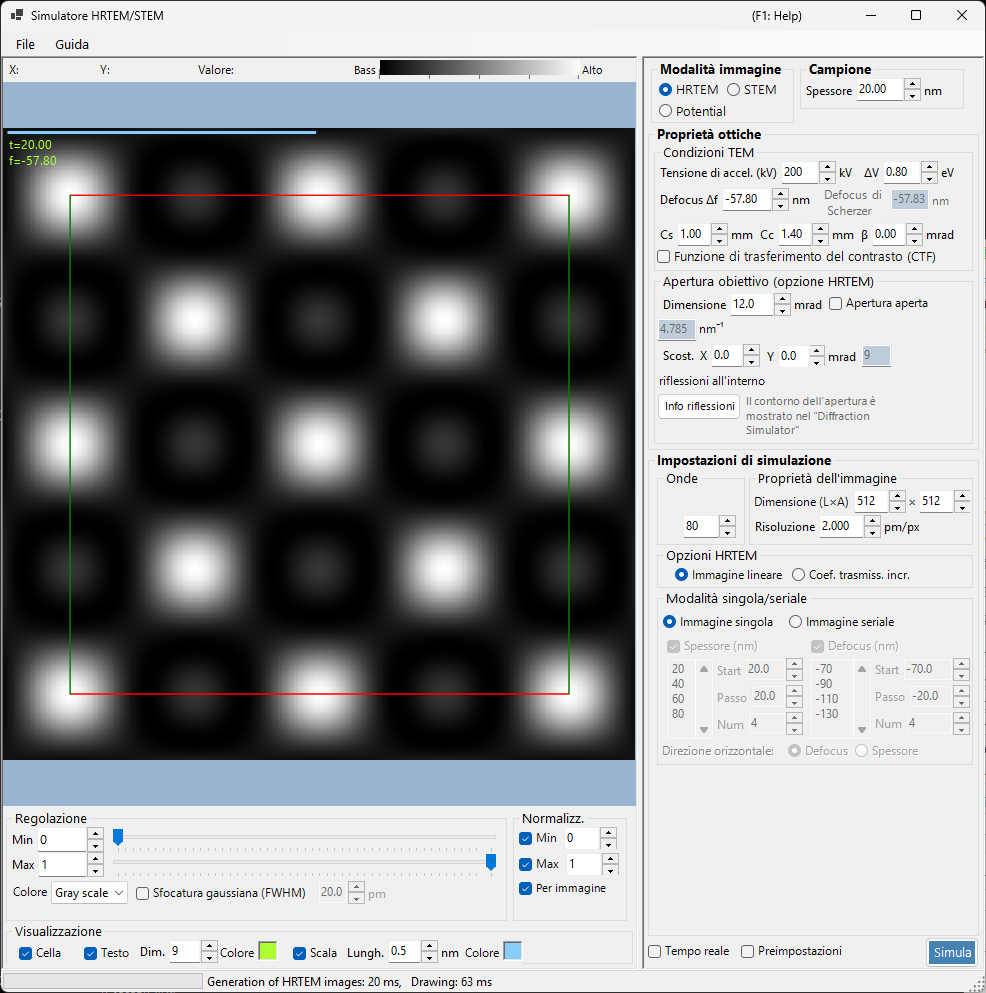
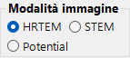
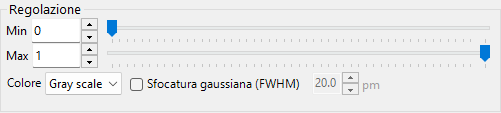
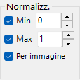
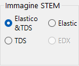
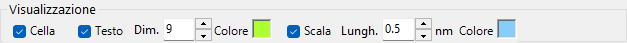
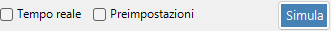
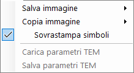
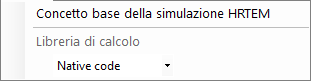

# Simulatore HRTEM/STEM

Il **Simulatore HRTEM/STEM** simula immagini di frange reticolari TEM (HRTEM), immagini STEM e potenziali cristallini proiettati per il cristallo e l'orientazione selezionati. Fare clic su **Simula** per avviare il calcolo.

La finestra è divisa in due metà. Il **lato sinistro** mostra il risultato della simulazione e ne controlla l'aspetto (riquadri immagine, luminosità, colori, barra di scala e così via); il **lato destro** contiene le condizioni di calcolo (**Proprietà ottiche** e **Impostazioni di simulazione**).

---

## Questa pagina e le pagine delle modalità

- **Questa pagina (panoramica)**: le operazioni comuni a tutte le modalità, insieme ai **controlli di visualizzazione e regolazione del risultato sul lato sinistro**.
- **Pagine delle modalità**: tutte le impostazioni che compaiono sul **lato destro** per quella modalità, descritte in modo che ciascuna pagina sia autosufficiente (alcune impostazioni compaiono quindi in più di una pagina).

| Modalità | Contenuto | Pagina |
|------|----------|------|
| **HRTEM** | Immagini TEM ad alta risoluzione con frange reticolari | [Simulazione HRTEM](1-hrtem-simulation.md) |
| **STEM** | Immagini di microscopia elettronica a trasmissione a scansione (BF / ABF / LAADF / HAADF) | [Simulazione STEM](2-stem-simulation.md) |
| **Potential** | Potenziale cristallino proiettato ($U_g$ / $U'_g$) | [Simulazione del potenziale](3-potential-simulation.md) |

---

## Scorciatoie da tastiera e mouse

I risultati vengono mostrati come uno o più riquadri immagine. Utilizzano la [navigazione standard della vista immagine](../21-shortcuts.md) di ReciPro, e tutti i riquadri si spostano e si ingrandiscono insieme.

| Scorciatoia | Azione |
|----------|--------|
| <kbd>F1</kbd> | Apre questa pagina del manuale online |
| <kbd>CTRL</kbd>+<kbd>C</kbd> (griglia immagini attiva) | Copia l'immagine o le immagini negli appunti come metafile |
| Trascinamento sinistro / centrale | Sposta l'immagine (tutti i riquadri si muovono insieme) |
| Rotellina del mouse su / giù | Zoom avanti (×2) / indietro (×0.5) in corrispondenza del cursore |
| Trascinamento di un rettangolo con il tasto destro | Zoom avanti nella regione selezionata |
| Clic destro / doppio clic destro | Zoom indietro (×0.5) |
| <kbd>CTRL</kbd> + trascinamento di un rettangolo con il tasto destro | Seleziona un'area rettangolare |
| Doppio clic sinistro su un riquadro | Ingrandisce quel riquadro / ripristina la griglia (layout a più riquadri) |
| Movimento del mouse (senza tasto) | Legge la posizione (pm) e il valore del pixel in corrispondenza del cursore |

→ Vedere **[21. Scorciatoie da tastiera e mouse](../21-shortcuts.md)** per una panoramica di ogni finestra.

---

## Percorsi rapidi per obiettivo

| Obiettivo | Punto di partenza | Riferimento |
|------|------------|-----------|
| Calcolare una singola immagine HRTEM | Impostare **Modalità immagine** su **HRTEM**, quindi impostare la tensione di accelerazione e il defocus in **Condizioni TEM** | [Simulazione HRTEM](1-hrtem-simulation.md), [Formazione dell'immagine HRTEM](../appendix/a3-bloch-wave/hrtem.md) |
| Calcolare un'immagine STEM | Impostare **Modalità immagine** su **STEM**, quindi impostare l'angolo di convergenza e il rivelatore in **Opzioni STEM** | [Simulazione STEM](2-stem-simulation.md), [Calcolo STEM](../appendix/a3-bloch-wave/stem.md) |
| Visualizzare il potenziale proiettato | Impostare **Modalità immagine** su **Potential** | [Simulazione del potenziale](3-potential-simulation.md) |
| Generare una serie di spessore / defocus | In HRTEM, configurare **Modalità singola/seriale** e le condizioni dell'immagine | [Simulazione HRTEM](1-hrtem-simulation.md) |
| Usare HAADF-STEM con TDS | Impostare fattori di temperatura atomici diversi da zero e portare il rivelatore STEM su LAADF / HAADF | [Calcolo STEM](../appendix/a3-bloch-wave/stem.md) |

---

## Flusso di lavoro di base

1. Selezionare il cristallo e l'orientazione nella finestra principale, quindi aprire questa finestra.
2. Scegliere HRTEM, STEM o Potential in **Modalità immagine**.
3. Impostare tensione di accelerazione, defocus, aberrazioni, apertura, angolo di convergenza STEM e così via in **Proprietà ottiche** (vedere le pagine delle modalità).
4. Impostare spessore, dimensione dell'immagine, risoluzione, numero di onde di Bloch, modello di coerenza parziale e così via in **Impostazioni di simulazione** (vedere le pagine delle modalità).
5. Fare clic su **Simula**, quindi regolare l'aspetto con **Regolazione**, **Normalizz.** e **Visualizzazione** a sinistra secondo necessità.

---

## Selezione della modalità immagine

{ align=left }

**Modalità immagine**, in alto a destra, seleziona il tipo di calcolo. I pannelli di destra (**Proprietà ottiche** e **Impostazioni di simulazione**) cambiano in base alla modalità scelta.

- **HRTEM** — immagini TEM ad alta risoluzione con frange reticolari → [Simulazione HRTEM](1-hrtem-simulation.md)
- **STEM** — immagini di microscopia elettronica a trasmissione a scansione → [Simulazione STEM](2-stem-simulation.md)
- **Potential** — potenziale cristallino proiettato → [Simulazione del potenziale](3-potential-simulation.md)

---

## Area immagine (lato sinistro)

La metà sinistra della finestra mostra l'immagine simulata. La barra di stato nella parte superiore riporta la posizione del cursore (**X:**, **Y:**) e il **Valore:** dell'immagine (intensità) sotto il cursore, accanto a una scala di intensità **Basso → Alto** che riflette la mappa di colori e l'intervallo di luminosità correnti.

Quando vengono prodotte più immagini (un'immagine seriale, oppure modulo/fase di un potenziale) esse sono affiancate in una griglia, e tutti i riquadri si ingrandiscono e si spostano insieme.

---

## Visualizzazione e regolazione dei risultati (pannello sinistro) {#display-settings}

Il pannello in basso a sinistra regola l'aspetto del risultato — luminosità, colori, normalizzazione e sovrapposizioni. Queste impostazioni valgono per tutte le modalità e hanno effetto senza ricalcolare.

### Regolazione

- **Min** / **Max** : estremo inferiore (nero) e superiore (bianco) dell'intervallo di intensità visualizzato. Usare i cursori per regolare il contrasto.
- **Colore** : scala di colori dell'immagine — **Gray scale** oppure **Cold-Warm** (dal blu al rosso).
- **Sfocatura gaussiana (FWHM)** : se spuntata, applica una sfocatura gaussiana con la larghezza a metà altezza (pm) indicata a destra, approssimando una risoluzione finita (funzione di allargamento del punto).

### Normalizzazione

- **Per immagine** : se spuntata, normalizza ciascuna immagine separatamente (se non spuntata, l'intera serie condivide una scala comune).
- **Min** / **Max** : fissa l'estremo inferiore / superiore della normalizzazione al valore indicato a destra, invece del minimo / massimo dell'immagine.

### Immagine STEM

Visibile solo in modalità STEM. Seleziona quale componente di diffusione dell'immagine STEM calcolata viene visualizzata (**Elastico**, **TDS** oppure **Elastico & TDS**). Essendo specifica dello STEM, è descritta anche nella pagina [Simulazione STEM](2-stem-simulation.md).

### Visualizzazione

Imposta gli elementi sovrapposti all'immagine.

- **Cella** : sovrappone il contorno della cella elementare proiettata, così da poter mettere in relazione il contrasto dell'immagine con il reticolo cristallino.
- **Testo** : sovrappone etichette come spessore, defocus e indici. Si possono specificare **Dim.** (dimensione del carattere) e **Colore**.
- **Scala** : sovrappone una barra di scala. Si possono specificare **Lungh.** (nm) e **Colore**.

---

## Esecuzione della simulazione

- **Simula** : esegue il calcolo con il cristallo, le condizioni del microscopio, lo spessore, il defocus e le impostazioni di visualizzazione correnti.
- **Arresta** : interrompe il calcolo in corso (visibile solo durante il calcolo).
- **Tempo reale** : se spuntata, ricalcola immediatamente quando il cristallo viene ruotato (nascosta in modalità STEM).
- **Preimpostazioni** : mostra/nasconde la finestra delle preimpostazioni, che memorizza e richiama le condizioni di imaging TEM.

---

## Menu File

- **Salva immagine** : salva **come immagine (formato PNG)**, **come immagine (formato TIFF)** oppure **come metafile (EMF)**. **Salva singolarmente in modalità immagine seriale** scrive una per una le immagini di un'esecuzione seriale.
- **Copia immagine** : copia negli appunti **come immagine** oppure **come metafile (EMF)**.
- **Sovrastampa simboli** : incorpora nell'immagine salvata la cella elementare, le etichette e la barra di scala.
- **Carica parametri TEM** / **Salva parametri TEM** : salvano in un file le condizioni ottiche (tensione di accelerazione, aberrazioni e così via) e le ripristinano.

## Menu Guida

- **Concetto base della simulazione HRTEM** : apre la spiegazione della formazione dell'immagine HRTEM ([Appendice A3.2](../appendix/a3-bloch-wave/hrtem.md)).
- **Libreria di calcolo** : seleziona la libreria di calcolo — **Native code** (C++/Eigen, veloce) oppure **Managed code** (.NET). Native è normalmente più veloce.

---

## Vedere anche

- [Simulazione HRTEM](1-hrtem-simulation.md)
- [Simulazione STEM](2-stem-simulation.md)
- [Simulazione del potenziale](3-potential-simulation.md)
- [Diffrazione dinamica (onda di Bloch)](../appendix/a3-bloch-wave/index.md)
- [Simulatore di diffrazione](../7-diffraction-simulator/index.md)
- [Traiettorie elettroniche](../8-electron-trajectory.md)
