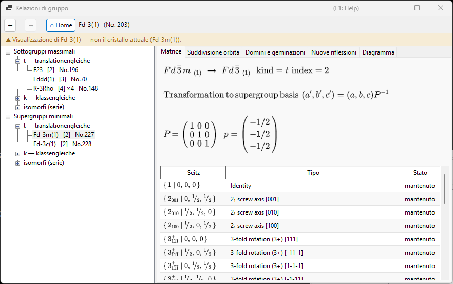
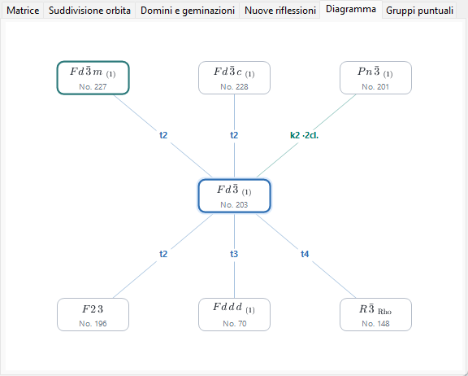
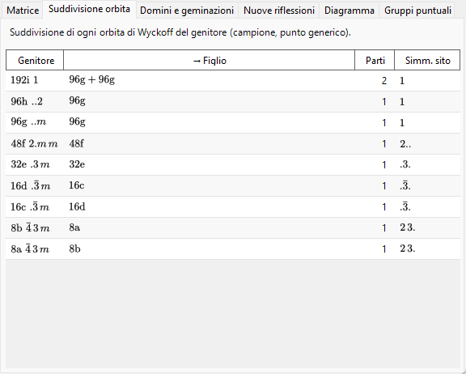
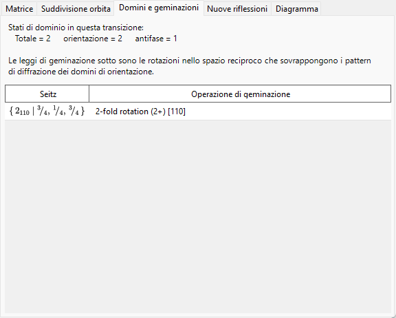

# A4.2. Relazioni gruppo–sottogruppo

**Relazioni di gruppo…** è un browser per le relazioni sottogruppo massimale / supergruppo minimale dei 230 tipi di gruppi spaziali, che si apre dal pannello **Opzioni** di [Informazioni di simmetria](../../2-symmetry-information.md). A differenza di una tabella statica, ogni relazione mostrata viene calcolata al momento dell'esecuzione, direttamente dalle operazioni di simmetria del gruppo spaziale corrente (vedi [A4.1](symbols-and-diagrams.md#operazioni-di-simmetria-scheda-operazioni)); può quindi essere controllata operazione per operazione, anziché essere accettata sulla fiducia come trascrizione delle *International Tables*, Vol. A1.

Questa pagina spiega prima il vocabolario di teoria dei gruppi usato dal browser, e passa poi in rassegna ciascuna delle sue schede.

---

## Il teorema di Hermann: sottogruppi *t*-, *k*- e isomorfi

Un sottogruppo $H<G$ è **massimale** se nessun sottogruppo di $G$ si colloca strettamente fra $H$ e $G$. Un teorema dovuto a Carl Hermann (1929) afferma che, per i gruppi spaziali tridimensionali qui tabulati, ogni sottogruppo massimale di un gruppo spaziale $G$ è di uno di due tipi:

- **sottogruppo *translationengleiche* (*t*-)** — "a traslazioni uguali": $H$ conserva *tutte* le traslazioni di $G$ (lo stesso reticolo, la stessa cella), ma ha un gruppo puntuale più piccolo. L'indice $[G:H]$ (il numero di classi laterali di $H$ in $G$) è uguale all'indice dei gruppi puntuali $[P_G:P_H]$.
- **sottogruppo *klassengleiche* (*k*-)** — "a classe uguale": $H$ conserva la *stessa classe cristallina geometrica* (lo stesso tipo di gruppo puntuale) di $G$, ma solo un sottoreticolo delle sue traslazioni — una cella convenzionale più grande e/o meno vettori di centratura. L'indice è uguale all'indice dei reticoli di traslazione $[T_G:T_H]$.

I **sottogruppi isomorfi** sono il caso particolare, e importante, dei sottogruppi *k*- in cui $H$ è inoltre dello *stesso tipo di gruppo spaziale* di $G$ stesso (solo con una cella più grande — una relazione che si ripete indefinitamente, cosicché i sottogruppi isomorfi formano una serie infinita indicizzata dalla dimensione della cella, a differenza dei sottogruppi *t*- e *k*- non isomorfi di un dato $G$, che sono in numero finito). Per un sottogruppo isomorfo *massimale* l'indice è sempre una potenza di un numero primo ($p$, e in tre dimensioni occasionalmente $p^2$ o $p^3$); quale potenza si presenti dipende da come il reticolo quoziente finito si decompone come modulo sotto l'azione del gruppo puntuale. Si noti inoltre che il cambiamento di base verso un sottoreticolo può comportare un autentico cambiamento dei vettori di base e uno spostamento dell'origine, non soltanto un ingrandimento uniforme della cella lungo un asse.

Poiché ogni relazione di sottogruppo di indice finito (massimale o no) può essere raggiunta come catena di passi massimali, elencare i soli sottogruppi massimali (e, nella direzione opposta, i supergruppi minimali) basta a descrivere l'intera rete delle relazioni di sottogruppo di indice finito — ed è esattamente per questo che le ITA Vol. A1, e questo browser, tabulano soltanto le relazioni massimali/minimali.

!!! note "Solo due tipi — l'isomorfo è una sottoclasse, non un terzo tipo"
    È un'abbreviazione comune parlare di "sottogruppi *t*-, *k*- e isomorfi" come se fossero tre pari grado, e l'albero di questo browser è in effetti organizzato per comodità in tre rami. Formalmente, però, il teorema di Hermann è una bipartizione a **due** vie (*t* oppure *k*); i sottogruppi isomorfi sono semplicemente i sottogruppi *k*- che si trovano a riprodurre il tipo di gruppo spaziale di $G$ stesso.

### L'indice come conteggio di classi laterali

Poiché i gruppi spaziali sono infiniti (contengono le traslazioni), qui "indice" significa sempre **il numero di classi laterali di $H$ in $G$**, non un rapporto di ordini $|G|/|H|$ (entrambi gli ordini sono infiniti) — per i gruppi finiti le due nozioni coincidono, ma per i gruppi spaziali solo la definizione per conteggio di classi laterali ha senso. L'albero e la scheda Matrice mostrano entrambi questo indice come, ad es., `t, index 2` o `k, index 3`.

### Sottogruppi coniugati e classe di coniugio

Una data relazione astratta di sottogruppo può spesso realizzarsi dentro $G$ in più modi geometricamente distinti — legati fra loro per orientazione o posizione, non per tipo — ad esempio l'immagine speculare di un piano di riflessione, o un asse elicoidale lungo una direzione orientata diversamente ma equivalente per simmetria. Due realizzazioni siffatte $H$ e $H'$ sono coniugate **entro $G$** se $H' = gHg^{-1}$ per qualche $g\in G$; il browser raggruppa tutte le copie $G$-coniugate di una relazione in un'unica voce e riporta quante sono come dimensione della *classe di coniugio*. Si tratta di una nozione strettamente più fine del raggruppare i sottogruppi secondo l'equivalenza (più grossolana) sotto il normalizzatore euclideo o affine di $G$ — una classificazione che le ITA stesse talvolta usano in alternativa — perciò sottogruppi che condividono lo stesso tipo e lo stesso indice non appartengono automaticamente a una sola classe di coniugio: possono dividersi in più classi.

---

## Navigare nel browser

- L'**albero** (riquadro di sinistra) ha due radici, **Sottogruppi massimali** e **Supergruppi minimali**, ognuna suddivisa in un ramo **`t — translationengleiche`**, un ramo **`k — klassengleiche`** e un ramo **`isomorfi (serie)`**. Le classi non coniugate che condividono lo stesso tipo figlio e lo stesso indice riceverebbero altrimenti etichette identiche, quindi vengono distinte da un suffisso `· classe n`. Nel ramo **isomorfi** dei Sottogruppi massimali, le classi di coniugio equivalenti sotto il *normalizzatore affine* di $G$ vengono inoltre raggruppate sotto un'unica riga di orbita (*"… — m classi (equivalenti per normalizzatore)"*) — la stessa granularità delle voci IIc delle ITA Vol. A1 — e il limite dell'enumerazione si imposta con il selettore **Sottogruppi isomorfi: indice ≤** della barra degli strumenti (2–27, valore predefinito 4; i limiti più alti vengono calcolati in background).
- La scheda **Diagramma** disegna uno scheletro semplificato in stile Bärnighausen: il gruppo corrente al centro (evidenziato), i suoi supergruppi minimali sopra e i suoi sottogruppi massimali sotto — **le relazioni *t*-, *k*- e isomorfe allo stesso modo**, dato che ognuna è un singolo "passo massimale". Ogni arco è etichettato con il suo tipo e il suo indice (`t2`, `k3`, `i3`), con codifica a colori: blu per *t*, verde acqua per *k* e arancione per gli isomorfi. I simboli dei nodi sono composti come autentici simboli cristallografici — pedici per gli assi elicoidali, sopralineature per le rotoinversioni. Le classi non coniugate che condividono lo stesso tipo di destinazione, lo stesso tipo di relazione e lo stesso indice vengono fuse in un unico nodo la cui etichetta d'arco riporta il numero di classi (es. `k2 ·2 cl.`) — l'albero resta il posto dove ispezionare ogni classe singolarmente. Quando una riga contiene più relazioni di quante ne entrino nella larghezza della finestra, i nodi si riducono di un passo e l'eccedenza viene raccolta in un nodo tratteggiato `+N` (non cliccabile — per l'elenco completo usa l'albero); un piccolo promemoria `i: solo indice ≤ 4` compare nell'angolo ogni volta che sono visualizzati archi isomorfi, e `k: calcolo in corso…` finché la ricerca inversa dei supergruppi *k*- è ancora in costruzione. Quando scendi di sottogruppo in sottogruppo a colpi di doppio clic, la catena dei gruppi che hai attraversato (il tuo *ramo selezionato*) viene disegnata come una colonna verticale viola sopra il gruppo corrente — un albero di Bärnighausen multilivello del tuo percorso di transizione (es. $Pm\bar3m \rightarrow P4/mmm \rightarrow Pmmm \rightarrow \ldots$), ogni arco etichettato con la relazione che hai seguito; risalire o premere **Indietro** pota il ramo di conseguenza, e le catene più lunghe di tre antenati vengono abbreviate con un `⋮ +N` attenuato. Questo mostra soltanto lo scheletro secondo la teoria dei gruppi — un albero di Bärnighausen completo, nel senso delle relazioni strutturali, riporta a ogni arco anche le trasformazioni di cella, la suddivisione delle posizioni di Wyckoff e le correlazioni fra le coordinate atomiche, che vivono nelle altre schede descritte più avanti anziché sul diagramma stesso.
- Un **clic singolo** (su un nodo dell'albero o su un nodo del Diagramma) seleziona una relazione e popola le schede di dettaglio in basso. Un **doppio clic** *naviga*: reimposta l'intero browser con quel gruppo spaziale come radice, così puoi camminare passo dopo passo da un gruppo a un sottogruppo a un altro sottogruppo.
- **Indietro / Avanti / Home** scorrono la cronologia di navigazione; **Home** riporta sempre al gruppo spaziale del cristallo dal quale hai effettivamente aperto il browser.
- Il **breadcrumb** (in alto) mostra il gruppo spaziale attualmente visualizzato (`simbolo HM (No. n)`); il **banner di contesto** sotto di esso diventa verde ("Visualizzazione del gruppo spaziale del cristallo attuale.") quando coincide con il tuo cristallo, o ambrato ("Visualizzazione di … — non il cristallo attuale (…).") quando hai navigato altrove — un promemoria che sfogliare un sottogruppo *non* modifica il tuo cristallo.

---

## Scheda Matrice

Mostra il cambiamento di base e lo spostamento dell'origine fra il setting del genitore e quello del figlio, secondo la convenzione ITA: i nuovi vettori di base sono $(\mathbf a',\mathbf b',\mathbf c')=(\mathbf a,\mathbf b,\mathbf c)\cdot P$, e le coordinate di un punto nel setting del genitore sono $\mathbf x_{\text{parent}} = P\,\mathbf x_{\text{child}} + \mathbf p$. La matrice $3\times3$ $P$ e lo spostamento dell'origine $\mathbf p$ sono stampati come frazioni.

- Quando la relazione è stata raggiunta da **Sottogruppi massimali**, $P$ e $\mathbf p$ sono mostrati direttamente (verso genitore → figlio).
- Quando invece è stata raggiunta da **Supergruppi minimali**, la scheda mostra $P^{-1}$ (e lo spostamento corrispondentemente invertito), con la didascalia *"derivata dalla tabella dei sottogruppi del supergruppo stesso"* — il browser memorizza sempre la relazione dal punto di vista del gruppo più grande e la inverte su richiesta, anziché mantenerne due copie indipendenti.
- **Sottogruppi coniugati di questa classe: $n$** riporta la dimensione della classe di coniugio descritta sopra.
- Una tabella dei generatori elenca ogni rappresentante di classe laterale, contrassegnato come **mantenuto** (ancora presente in $H$) o **perso** (presente in $G$ ma non in $H$ — esattamente le operazioni responsabili della rottura di simmetria), ciascuno con il suo simbolo di Seitz e la descrizione del tipo geometrico di [A4.1](symbols-and-diagrams.md#operazioni-di-simmetria-scheda-operazioni).
- Se il tipo di gruppo spaziale di destinazione di una relazione candidata non è stato identificato nel catalogo di ReciPro, la scheda lo dice apertamente invece di tirare a indovinare, e mostra solo il simbolo del gruppo puntuale.

---

## Scheda Suddivisione orbita

Mostra come ciascuna posizione di Wyckoff del gruppo *genitore* si suddivide quando la simmetria si abbassa a $H$: una riga per ogni posizione del genitore, con la molteplicità/lettera/simmetria del sito del genitore, le molteplicità/lettere risultanti del figlio (unite con `+` se l'orbita si suddivide in più di una), in quante parti si è suddivisa e le simmetrie di sito distinte del figlio.

Il calcolo avviene sostituendo effettivamente **un punto campione fisso e generico** nelle operazioni di entrambi i gruppi e confrontando le orbite risultanti — una suddivisione *campionata* numericamente, non il formalismo pienamente simbolico della suddivisione di Wyckoff (come quello usato da strumenti quali WYCKSPLIT); per questo motivo la scheda si chiama deliberatamente "Suddivisione orbita" e non "Suddivisione di Wyckoff" — un trattamento pienamente simbolico potrebbe in linea di principio tracciare ogni coincidenza a parametri speciali, mentre questo approccio campionato riporta soltanto la suddivisione osservata in un punto generico e non segnalerebbe da sé una coincidenza che si verifica solo per valori speciali di $x,y,z$.

Per una **relazione *k*- o isomorfa** lo stesso approccio campionato viene applicato al reticolo di traslazione più rado: la scheda mostra come ogni orbita del genitore si suddivide man mano che le traslazioni reticolari vanno perdute, e le molteplicità del figlio sono contate **nella cella ingrandita del sottogruppo** (cosicché, per un ingrandimento di cella di indice $n$, le molteplicità delle parti sommano a $n$ volte la molteplicità del genitore).

---

## Scheda Domini e geminazioni

Quando un cristallo si trasforma da $G$ a un sottogruppo $H$, ciascuna delle $[G:H]$ classi laterali di $H$ in $G$ corrisponde a un possibile **stato di dominio**: lo stato di riferimento è la classe laterale dell'identità, e ogni altra classe laterale — rappresentata da un'operazione "persa" della scheda Matrice — genera un ulteriore stato di dominio, legato al riferimento da quell'operazione.

Per un **sottogruppo *t*-**, in particolare, il reticolo di traslazione è invariato ($T_G=T_H$): dal punto di vista della teoria dei gruppi, quindi, qui non esiste alcun **dominio di antifase (di traslazione)** — ogni stato di dominio differisce dal riferimento per un'autentica operazione del gruppo puntuale, mai per una semplice traslazione. La scheda riporta perciò sempre `antifase = 1` e `orientazione = totale`, cioè tutti i $[G:H]$ stati di dominio sono **domini di orientazione**.

Per una transizione ***k*- o isomorfa** la situazione è esattamente rovesciata: il gruppo puntuale è invariato, quindi c'è **un solo stato di orientazione**, e le traslazioni reticolari perdute generano **domini di antifase (di traslazione)** — la scheda riporta `orientazione = 1` e `antifase = totale`. Ogni traslazione perduta è elencata come simbolo di Seitz di pura traslazione, insieme al corrispondente vettore di antifase espresso nella cella del sottogruppo. Poiché tutti i domini di antifase condividono la stessa orientazione, le loro riflessioni fondamentali coincidono esattamente; solo le riflessioni di superstruttura (vedi la scheda **Nuove riflessioni**) portano una differenza di fase attraverso un confine di antifase.

La **legge di geminazione** per una coppia di domini di orientazione è la parte matriciale dell'operazione persa — una rotazione o una riflessione, espressa come agente sul reticolo diretto o su quello reciproco — che porta l'orientazione del reticolo di un dominio su quella dell'altro. Per una transizione a sottogruppo *t*-, questa operazione è per costruzione una simmetria del reticolo del gruppo *genitore* $G$: se dunque la metrica effettiva della struttura a bassa simmetria conserva ancora quella simmetria reticolare, i reticoli reciproci dei due domini coincidono esattamente dopo l'operazione di geminazione e i loro diagrammi di diffrazione si sovrappongono completamente — il caso idealizzato di geminazione *meroedrica* che questa scheda descrive. In una transizione reale la fase a bassa simmetria sviluppa tipicamente una piccola deformazione spontanea che conserva la metrica del genitore solo in modo approssimato, quindi in pratica la sovrapposizione è spesso solo approssimata (geminazione *pseudo-meroedrica*); questa scheda riporta la legge di geminazione teorico-gruppale, a metrica esatta, non una misura di quanto un particolare cristallo reale vi si avvicini.

Un caso degenere con l'elenco delle classi laterali vuoto viene riportato come `(dominio singolo)` (l'indice 1 non è mai mostrato come relazione).

---

## Scheda Nuove riflessioni

Per una transizione a sottogruppo *t*-, elenca le riflessioni che diventano permesse dalla simmetria in $H$ pur essendo sistematicamente assenti in $G$ — cioè le riflessioni che le condizioni di riflessione del genitore (dalla scheda [Condizioni](../../2-symmetry-information.md)) vietano, ma quelle di $H$ no. La finestra di ricerca si imposta con il selettore **Finestra di ricerca** della scheda: $|h|,|k|,|l|\le4$ per impostazione predefinita, regolabile da 2 a 8 (limiti maggiori possono elencare molte più riflessioni).

Poiché un sottogruppo *t*- non ingrandisce mai la cella elementare, queste **non** sono riflessioni di superstruttura/a indici frazionari — restano $(h,k,l)$ interi della cella del genitore, e diventano *permesse* soltanto perché un piano di slittamento o un asse elicoidale che le obbligava ad annullarsi non è più presente. (Autentiche riflessioni di superstruttura a indici frazionari del genitore diventano possibili solo quando la cella stessa si ingrandisce, il che accade per un sottogruppo *k*-, non per un sottogruppo *t*-.) Una riflessione che compare qui è soltanto *permessa* dalla simmetria; che sia effettivamente osservata dipende comunque dal fattore di struttura della struttura reale a simmetria più bassa.

Per una **relazione *k*- o isomorfa** la scheda elenca le nuove riflessioni **indicizzate sulla cella ingrandita del sottogruppo** (di nuovo entro la finestra di ricerca) e classifica ciascuna nell'ultima colonna:

- le **riflessioni di superstruttura** corrispondono a indici *frazionari* del genitore, mostrati tra parentesi (es. `(1/2 0 1)`) — compaiono unicamente perché la cella si è ingrandita;
- le **riflessioni liberate** sono intere nella cella del genitore, ma erano vietate da una condizione di riflessione del genitore che il sottogruppo rimuove — al loro posto è mostrata la regola del genitore rimossa (rientra qui anche la perdita di traslazioni di centratura, es. un genitore centrato $I$ che perde la sua condizione $h+k+l$ pari).

Le riflessioni permesse sia nel genitore sia nel figlio (riflessioni fondamentali) non sono elencate. Se il tipo di gruppo spaziale del figlio non è stato identificato, le condizioni di riflessione del figlio sono ignote e la scheda dichiara che la previsione non è possibile.

---

## Limitazioni attuali

I motori del browser per i sottogruppi *t*- e *k*-, le ricerche inverse dei supergruppi *t*- e *k*- e la classificazione isomorfa (IIc) sono pienamente implementati e verificati in modo indipendente rispetto alle tabelle delle operazioni dei gruppi spaziali, e le schede **Suddivisione orbita**, **Domini e geminazioni** e **Nuove riflessioni** sono operative per ogni tipo di relazione. Le limitazioni residue sono mostrate come tali, anziché omesse in silenzio:

- **I sottogruppi isomorfi sono enumerati fino al limite del selettore (per impostazione predefinita indice ≤ 4, al massimo 27).** Una serie isomorfa continua indefinitamente verso indici più alti, quindi la nota in grigio sul ramo indica sempre il limite corrente, invece di fingere che l'elenco sia completo. Il raggruppamento in orbite del normalizzatore si basa su una ricerca limitata dei generatori del normalizzatore; è verificato rispetto alle ITA A1 per i casi testati, ma una dimostrazione formale di completezza per ogni gruppo resta un lavoro futuro — nel peggiore dei casi un'orbita potrebbe apparire suddivisa in più righe, mai fusa erroneamente.
- I **supergruppi *k*-** vengono calcolati in background al primo utilizzo (la ricerca inversa richiede le tabelle dei sottogruppi *k*- di ogni tipo della stessa classe cristallina); l'albero mostra per breve tempo un nodo in grigio *"calcolo in corso…"* (e il Diagramma una nota d'angolo *"k: calcolo in corso…"*) finché non è pronta.

---

## Glossario

| Termine | Significato |
|---|---|
| Sottogruppo massimale / supergruppo minimale | Un sottogruppo (supergruppo) senza nessun'altra relazione di sottogruppo strettamente compresa fra esso e $G$ |
| Indice $[G:H]$ | Il numero di classi laterali di $H$ in $G$ |
| *translationengleiche* (*t*-) | Stesso reticolo di traslazioni, gruppo puntuale più piccolo; indice = indice dei gruppi puntuali |
| *klassengleiche* (*k*-) | Stesso tipo di gruppo puntuale, sottoreticolo delle traslazioni (cella più grande); indice = indice dei reticoli |
| Sottogruppo isomorfo | Un sottogruppo *k*- che è inoltre dello stesso tipo di gruppo spaziale di $G$ |
| Classe di coniugio (entro $G$) | L'insieme delle realizzazioni $G$-coniugate ($gHg^{-1}$) di una stessa relazione di sottogruppo |
| Dominio di orientazione | Uno stato di dominio legato al riferimento da un'operazione del gruppo puntuale |
| Dominio di antifase (di traslazione) | Uno stato di dominio legato al riferimento soltanto da una traslazione perduta (possibile per le transizioni *k*-, non per le *t*-) |
| Legge di geminazione | La parte matriciale di un'operazione persa, che porta il reticolo di un dominio di orientazione su quello di un altro |

---

## Vedi anche

- [2. Informazioni di simmetria](../../2-symmetry-information.md) — la guida alla GUI che questa appendice spiega.
- [A4.1. Simboli dei gruppi spaziali e diagrammi di simmetria](symbols-and-diagrams.md) — il vocabolario dei simboli di Seitz e dei tipi geometrici usato in tutte le schede Matrice e Domini e geminazioni.
- [Appendice A4. Simmetria e gruppi spaziali](index.md)
