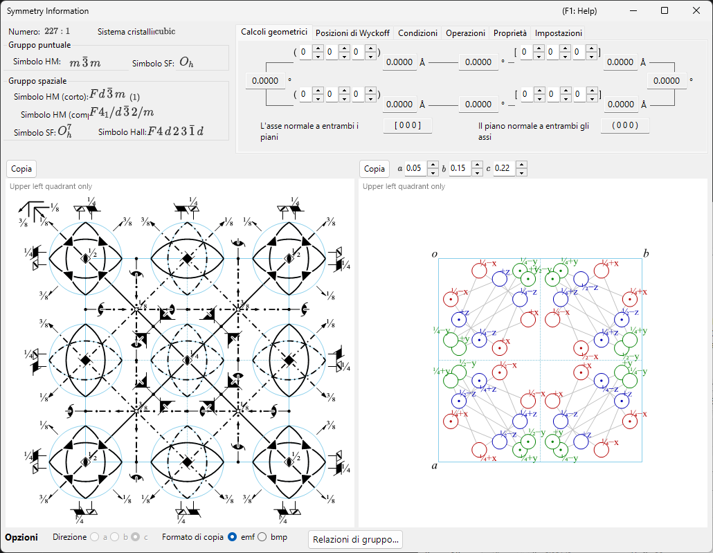

# Appendice A4. Simmetria e gruppi spaziali

Il capitolo della finestra principale [2. Informazioni di simmetria](../../2-symmetry-information.md) è una guida alla GUI: dice quale scheda mostra cosa e quale pulsante copia quale diagramma. Questa appendice raccoglie il **contesto cristallografico e di teoria dei gruppi** dietro quelle tabelle e quelle figure — che cosa codifica realmente un simbolo di Hermann–Mauguin, come leggere i diagrammi degli elementi di simmetria e delle posizioni generali nello stile del Vol. A delle *International Tables for Crystallography* (ITA), e che cosa significano le tabelle di supergruppi/sottogruppi della finestra **Relazioni di gruppo…** e la loro terminologia (*translationengleiche*, *klassengleiche*, classe di coniugio, domini, leggi di geminazione, …).

Sono trattate due finestre, e la teoria si legge meglio in questo ordine:

1. **[A4.1. Simboli dei gruppi spaziali e diagrammi di simmetria](symbols-and-diagrams.md)** — i simboli di Hermann–Mauguin, di Schoenflies e di Hall; la classificazione secondo la teoria dei gruppi mostrata nella scheda **Proprietà** (centrosimmetrico, Sohncke, simmorfico, polare, classe cristallina aritmetica, simmetria di Patterson, …); la descrizione di ogni operazione di simmetria nella scheda **Operazioni** come tripletta di coordinate/simbolo di Seitz/tipo geometrico; e le convenzioni grafiche dei diagrammi degli elementi di simmetria e delle posizioni generali in fondo alla finestra [Informazioni di simmetria](../../2-symmetry-information.md).
2. **[A4.2. Relazioni gruppo–sottogruppo](group-subgroup-relations.md)** — che cosa sono un *sottogruppo massimale* e un *supergruppo minimale*, la distinzione *t*-/*k*- di Hermann, e come leggere ciascuna scheda del browser **Relazioni di gruppo…** (Diagramma, Matrice, Suddivisione orbita, Domini e geminazioni, Nuove riflessioni) aperto dal pannello **Opzioni** di Informazioni di simmetria.

A4.1 viene per prima perché A4.2 vi fa costantemente riferimento: ogni relazione di sottogruppo/supergruppo è a sua volta etichettata con gli stessi simboli di Hermann–Mauguin, gli stessi simboli di Seitz e le stesse espressioni di tipo geometrico (*"3-fold rotation"*, *"c-glide plane"*, *"screw axis"*, …) introdotti lì.

---

## Ambito e fonti

Il database integrato di ReciPro copre i 230 tipi di gruppi spaziali (con 530 setting/scelte di origine tabulati) esattamente come tabulati nelle *International Tables for Crystallography*, **Volume A** (simmetria dei gruppi spaziali) e **Volume A1** (sottogruppi massimali dei gruppi spaziali). Questa appendice spiega la *presentazione* di quei dati da parte di ReciPro — la notazione, i diagrammi, lo strumento di navigazione — e presuppone che il lettore abbia già una familiarità di livello universitario con i reticoli, i gruppi puntuali e l'idea di operazione di simmetria. Non sostituisce le ITA stesse, che restano il riferimento autorevole per i dati tabulati (e che ReciPro non può riprodurre alla lettera per ragioni di copyright — vedi la scheda **Impostazioni** per l'elenco, proprio di ReciPro, delle origini/setting alternativi di un dato tipo di gruppo spaziale).

!!! note "Relazioni di gruppo… è una funzionalità in sviluppo attivo"
    Il browser **Relazioni di gruppo…** (A4.2) calcola i sottogruppi e i supergruppi *translationengleiche* (t-) e *klassengleiche* (k-, inclusi gli *isomorfi*) direttamente dalle operazioni di simmetria del gruppo spaziale stesso (non da un elenco pre-tabulato), cosicché ogni relazione mostrata è verificata in modo indipendente anziché copiata da una tabella. I limiti che rimangono — ad es. la serie isomorfa è enumerata solo fino a indice ≤ 4 — sono esplicitati nelle **Limitazioni attuali** di A4.2.

---

## Vedi anche

- [2. Informazioni di simmetria](../../2-symmetry-information.md) — la guida alla GUI che questa appendice spiega.
- [A4.1. Simboli dei gruppi spaziali e diagrammi di simmetria](symbols-and-diagrams.md) · [A4.2. Relazioni gruppo–sottogruppo](group-subgroup-relations.md)
- [Appendice A1. Sistemi di coordinate](../a1-coordinate-system/1-orientation.md)
- [Appendice A2. Interazione del fascio (basi di fisica dello stato solido)](../a2-beam-interaction/index.md) — dove le condizioni di riflessione del gruppo spaziale (assenze sistematiche) entrano nel fattore di struttura.
