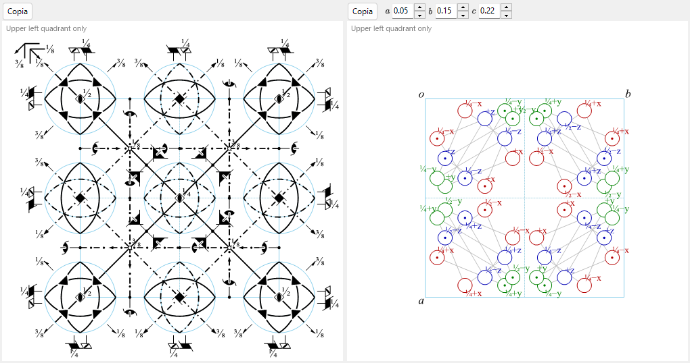

# A4.1. Simboli dei gruppi spaziali e diagrammi di simmetria

Questa pagina spiega tutto ciò che compare nella metà superiore di [Informazioni di simmetria](../../2-symmetry-information.md) (il pannello di identità del gruppo spaziale e le schede **Operazioni**/**Proprietà**/**Impostazioni**) e i due diagrammi schematici nella parte bassa della finestra. Tutta la notazione segue le *International Tables for Crystallography* (ITA), Vol. A.

---

## Simboli di Hermann–Mauguin (HM)

Un simbolo di Hermann–Mauguin ha due livelli: il **simbolo del gruppo puntuale** (riquadro superiore, *Gruppo puntuale*) descrive la sola simmetria macroscopica del cristallo, mentre il **simbolo del gruppo spaziale** (riquadro inferiore, *Gruppo spaziale*) vi aggiunge la centratura del reticolo e le eventuali componenti elicoidali/di slittamento.

### Lettera del reticolo

Il simbolo del gruppo spaziale inizia con una delle sette lettere di reticolo standard:

| Lettera | Significato |
|---|---|
| `P` | Primitivo |
| `A`, `B`, `C` | A base centrata (centratura rispettivamente sulla faccia *bc*, *ac* o *ab*) |
| `I` | A corpo centrato |
| `F` | A facce centrate |
| `R` | Romboedrico (un reticolo trigonale a sé stante; spesso descritto in *assi esagonali*, nel qual caso la cella contiene tre punti reticolari) |

### Direzioni di simmetria

Dopo la lettera del reticolo, ogni posizione rimanente del simbolo rappresenta una **direzione di simmetria** — una direzione del cristallo lungo la quale giace un asse di rotazione/elicoidale, e/o perpendicolarmente alla quale giace un piano di riflessione/slittamento. Quali direzioni fisiche queste posizioni indichino, e in quale ordine, è fissato dal sistema cristallino:

| Sistema cristallino | 1ª posizione | 2ª posizione | 3ª posizione |
|---|---|---|---|
| Triclino | *(nessuna — solo `1` o `-1`)* | | |
| Monoclino | $[010]$ (asse unico $b$, convenzione di ReciPro) | | |
| Ortorombico | $[100]$ | $[010]$ | $[001]$ |
| Tetragonale | $[001]$ | $[100],[010]$ | $[110],[1\bar 10]$ |
| Trigonale / Esagonale | $[001]$ | $[100],[010],[\bar 1\bar 1 0]$ | $[1\bar 10],[120],[\bar 2\bar 1 0]$ |
| Cubico | $[100],[010],[001]$ | $[111]$ *(e le altre 3 diagonali di corpo)* | $[1\bar 10],[110]$ *(e le altre 4 diagonali di faccia)* |

Una singola posizione viene riempita secondo queste regole:

- Un numero semplice $n$ ($n=1,2,3,4,6$) : un asse di **rotazione** di ordine $n$ lungo quella direzione.
- Un asse elicoidale $n_p$ (es. $2_1$, $4_2$, $6_3$) : una rotazione di $360°/n$ *combinata con* una traslazione di $p/n$ del periodo reticolare lungo l'asse. Ad esempio $2_1$ (una "vite binaria") significa ruotare di $180°$ **e** traslare di metà dello spigolo di cella lungo l'asse; $6_3$ significa ruotare di $60°$ e traslare di metà dello spigolo di cella lungo $c$.
- Una lettera semplice ($m,a,b,c,n,d$) senza numero di rotazione davanti : un **piano di riflessione o di slittamento** perpendicolare a quella direzione (il significato della lettera è lo stesso dei diagrammi, più avanti).
- $n/m$ oppure $n_p/m$ : un asse di rotazione/elicoidale **con** un piano di riflessione a esso perpendicolare (i due elementi condividono la stessa direzione, uno lungo l'asse e uno di traverso).
- $-n$ (es. $-1,-3,-4,-6$) : un asse di **rotoinversione** (ruotare di $360°/n$, poi invertire rispetto a un punto sull'asse). $-1$ da solo denota un puro centro di inversione; non esiste un asse "$-2$", perché una rotoinversione binaria è identica a una riflessione e si scrive quindi sempre $m$.

### Simbolo corto e simbolo completo

Il simbolo HM **corto** (quello citato di solito) omette gli elementi di simmetria già implicati da quelli scritti; il simbolo **completo** esplicita ogni direzione. Ad esempio, il gruppo spaziale No. 62 è $Pnma$ in forma corta e $P\,2_1/n\,2_1/m\,2_1/a$ in forma completa — i tre assi elicoidali $2_1$ sono implicati dai tre piani di slittamento/riflessione insieme al gruppo puntuale $mmm$ del gruppo spaziale, quindi il simbolo corto li omette. I campi *Simbolo HM (corto)* e *Simbolo HM (completo)* di ReciPro li mostrano entrambi; per la maggior parte dei gruppi spaziali coincidono.

### Simboli di Schoenflies (SF) e di Hall

Il **simbolo di Schoenflies** (es. $D_{2h}^{16}$) nomina il tipo di gruppo puntuale ($D_{2h}$) e aggiunge un apice che si limita a enumerare *quale* gruppo spaziale di quella famiglia di gruppo puntuale sia questo — a differenza del simbolo HM, l'apice da solo non porta alcun significato geometrico diretto; bisogna cercarlo in tabella. ReciPro mostra il simbolo di Schoenflies sia per il gruppo puntuale sia per il gruppo spaziale.

Il **simbolo di Hall** è una notazione diversa, basata sui generatori e progettata per un'elaborazione informatica non ambigua: elenca un insieme minimo di operazioni generatrici insieme a un'origine esplicita, cosicché un programma può ricostruire l'esatto insieme di coordinate senza consultare una tabella di corrispondenza per sapere "quale setting/scelta di origine questo simbolo HM implichi". Un simbolo di Hall non è l'*unico* modo possibile di codificare un dato insieme di operazioni (scelte diverse dei generatori danno stringhe di Hall diverse, ugualmente valide, per lo stesso gruppo), ma ognuna è pienamente esplicita e reversibile di per sé. ReciPro mostra un simbolo di Hall generato sistematicamente per il setting corrente; la scheda **Impostazioni** (più avanti) elenca tutte le scelte tabulate di origine/setting che condividono il numero del gruppo spaziale corrente, ciascuna con il proprio simbolo HM e Hall.

---

## Operazioni di simmetria (scheda Operazioni)

La scheda **Operazioni** elenca ogni operazione di simmetria della posizione generale per il setting corrente (con le traslazioni di centratura del reticolo già espanse), in tre notazioni parallele:

| Colonna | Esempio | Significato |
|---|---|---|
| Coordinate | `-y, x-y, z+1/3` | La tripletta di coordinate $(x,y,z)\mapsto(x',y',z')$, cioè la mappa affine $x'=Rx+t$ scritta in forma algebrica (convenzione ITA/CIF). |
| Seitz | `3+ [111]` | Un simbolo compatto: ordine e verso della rotazione/elicogira (`3+`), direzione dell'asse (`[111]`) e — se presente — la traslazione dell'operazione, es. `2₁ [001] 0,0,1/2`. Una riflessione pura è `m`, l'identità è `1`, l'inversione è `-1`. |
| Tipo | `3-fold rotation (3+) [111]` | Una classificazione dell'operazione in linguaggio corrente: `Identity`, `Inversion centre at …`, `n-fold rotation`, `nₚ screw axis`, `Mirror plane m`, un `a/b/c/n/d`-`glide plane`, oppure una `n`-fold `rotoinversion`, ciascuna con la propria direzione (e, per il centro di inversione, la posizione). |

Il pulsante **Copia (CIF)** colloca l'elenco completo delle operazioni negli appunti come loop CIF `_space_group_symop_operation_xyz`. Questo vocabolario — simbolo di Seitz e tipo geometrico — ricompare in tutta la pagina [A4.2](group-subgroup-relations.md), dove ogni generatore mantenuto/perso di una relazione di sottogruppo è descritto nello stesso modo.

---

## Classificazione secondo la teoria dei gruppi (scheda Proprietà)

La scheda **Proprietà** riporta un insieme di classificazioni standard del gruppo spaziale corrente. Alcune di esse — centrosimmetrico, Sohncke e polare (e, da queste, le proprietà fisiche permesse elencate più avanti) — discendono direttamente dalla **parte matriciale** $R$ di ciascuna operazione (la parte lineare, di rotazione o di riflessione), insieme alla parte traslazionale per il carattere centrosimmetrico. Le altre — simmorfico, coppia enantiomorfa, famiglia cristallina/sistema reticolare/tipo di Bravais, classe cristallina aritmetica e simmetria di Patterson — sono proprietà del *tipo* di gruppo spaziale nel suo complesso (il suo numero IT, il tipo di reticolo e la classe di Laue), più che di una singola operazione. Nulla di tutto ciò richiede una metrica (la forma della cella elementare) — dipende soltanto dal contenuto astratto di simmetria e dalla classificazione del tipo di gruppo spaziale.

**Centrosimmetrico** — l'insieme delle operazioni contiene qualche operazione della forma $\{-I \mid t\}$ (un'inversione rispetto al punto $t/2$, che non deve necessariamente essere l'origine). Le proprietà di Sohncke e polare (più avanti) sono mutuamente esclusive con questa: un centro di inversione inverte ogni direzione, quindi un gruppo centrosimmetrico non può mai essere polare, e $-I$ ha determinante $-1$, quindi un gruppo centrosimmetrico non può mai essere di Sohncke.

**Gruppo di Sohncke (che conserva l'orientazione)** — la parte matriciale di *ogni* operazione ha $\det R=+1$: il gruppo contiene solo rotazioni proprie e rotazioni elicoidali, mai una riflessione, uno slittamento, un'inversione o una rotoinversione. 65 dei 230 tipi di gruppi spaziali sono gruppi di Sohncke. Essere un gruppo di Sohncke è la condizione di simmetria perché una struttura sia compatibile con oggetti di chiralità definita (molecole chirali, proteine, quarzo, …) senza contenere anche le loro immagini speculari. È una nozione più ampia dell'appartenere a una *coppia* di tipi di gruppi spaziali genuinamente distinti e speculari — vedi **Coppia enantiomorfa**, subito sotto.

**Coppia enantiomorfa** — fra i 65 tipi di Sohncke, 11 coppie (22 tipi) sono legate l'una all'altra *soltanto* da una trasformazione che inverte l'orientazione, e da nessuna trasformazione propria (che la conserva): applicare una riflessione a un cristallo in uno di questi gruppi spaziali lo trasforma nell'altro membro della coppia, mai in sé stesso sotto alcuna rietichettatura degli assi. Le 11 coppie sono quelle costruite su assi elicoidali di verso opposto:

$$P4_1 / P4_3,\ \ P4_122 / P4_322,\ \ P4_12_12 / P4_32_12,\ \ P3_1/P3_2,\ \ P3_112/P3_212,\ \ P3_121/P3_221,$$
$$P6_1/P6_5,\ \ P6_2/P6_4,\ \ P6_122/P6_522,\ \ P6_222/P6_422,\ \ P4_332/P4_132.$$

I restanti $65-22=43$ tipi di Sohncke sono la propria immagine speculare (achirali *in quanto tipi di gruppo spaziale*, anche se ogni singola struttura che vi appartiene resta comunque chirale).

**Simmorfico** — uno dei 73 tipi di gruppi spaziali per i quali si può scegliere un'origine tale che *ogni* rappresentante di classe laterale (modulo le traslazioni reticolari) abbia componente di traslazione intrinseca (elicoidale/di slittamento) nulla — o, in modo equivalente, qualche punto della cella ha un gruppo di simmetria del sito isomorfo all'intero gruppo puntuale. (Le traslazioni di centratura, naturalmente, restano; "simmorfico" è un'affermazione sulle parti non primitive delle operazioni del *gruppo puntuale*, non sul reticolo.) Un gruppo spaziale simmorfico può sempre essere generato dal suo solo gruppo puntuale più il suo reticolo, senza bisogno di assi elicoidali o piani di slittamento, quando è descritto in quella particolare origine — che è esattamente l'origine che le ITA stesse tabulano per un tipo simmorfico, sicché il suo simbolo standard corto/completo è già privo di lettere elicoidali/di slittamento. (Descrivere le operazioni dello stesso gruppo in un'origine spostata, o traslata di un vettore di centratura, può far sembrare che una singola operazione porti una traslazione elicoidale/di slittamento, senza che la classificazione simmorfica del tipo cambi — la classificazione chiede soltanto se un'origine priva di traslazioni esista, e per questi 73 tipi esiste.)

**Polare** — se esiste una direzione lasciata invariante, $Rv=v$, dalla parte matriciale di *ogni* operazione (non $\pm v$: una vera direzione polare deve essere preservata esattamente, non semplicemente invertita o lasciata come asse binario). I casi possibili sono: **nessuna** (nessuna direzione siffatta) &nbsp;/&nbsp; un singolo asse $[uvw]$ &nbsp;/&nbsp; un intero piano (ogni direzione in esso) &nbsp;/&nbsp; **qualsiasi** direzione (solo per il gruppo puntuale $1$). Un asse polare è la direzione lungo la quale una polarizzazione elettrica spontanea è permessa dalla simmetria (vedi la tabella delle proprietà fisiche più avanti).

**Famiglia cristallina, sistema reticolare, tipo di Bravais** — la gerarchia di classificazione standard IUCr al di sopra del sistema cristallino: in totale 6 **famiglie cristalline**, 7 **sistemi cristallini**, 7 **sistemi reticolari** e 14 **tipi di reticoli di Bravais**. La sottigliezza è la **famiglia cristallina esagonale**: come **sistemi cristallini** si divide in *trigonale* ed *esagonale*, ma come **sistemi reticolari** si divide in modo diverso, in *esagonale* e *romboedrico* — un gruppo spaziale trigonale ricade nel sistema reticolare esagonale se il suo reticolo è di tipo $P$, o nel sistema reticolare romboedrico se è centrato $R$, a qualunque dei due sistemi cristallini esso appartenga.

**Classe cristallina aritmetica** — l'abbinamento di un simbolo di gruppo puntuale (eventualmente risolto per direzioni) con una lettera di reticolo di Bravais, es. `4mmP`; in totale esistono 73 classi cristalline aritmetiche. Poiché alcuni simboli di gruppo puntuale (`3m1` vs. `31m`, per i due modi non equivalenti in cui un gruppo puntuale $3m$ può disporsi rispetto a un reticolo esagonale) codificano già la propria orientazione rispetto al reticolo, citare il simbolo di gruppo puntuale orientato insieme alla lettera di reticolo basta a nominare la classe senza ambiguità.

**Simmetria di Patterson** — il tipo di reticolo insieme alla *classe di Laue* (il gruppo puntuale centrosimmetrico ottenuto aggiungendo $-1$ al gruppo puntuale proprio del gruppo spaziale), con tutta l'informazione elicoidale/di slittamento eliminata: es. `Pmmm` per uno qualsiasi dei 30 gruppi spaziali ortorombici a reticolo $P$, indipendentemente da quali di essi abbiano piani di slittamento. È la simmetria della funzione di Patterson calcolata dalle *intensità* di diffrazione $|F|^2$ nell'approssimazione cinematica, perché $|F|^2$ è insensibile allo sfasamento introdotto da una traslazione di slittamento/elicoidale (anche se le assenze sistematiche che essa causa, e i picchi di Harker nella mappa di Patterson, possono comunque tradirne indirettamente la presenza). Per la diffrazione elettronica dinamica questo quadro cinematico non vale esattamente; vedi l'[Appendice A3](../a3-bloch-wave/index.md).

### Proprietà fisiche permesse dalla simmetria

Le ultime righe della scheda Proprietà riportano se una data proprietà fisica macroscopica è **permessa dalla simmetria** per il gruppo puntuale corrente — una condizione necessaria, non una garanzia che l'effetto sia grande o anche solo presente in un cristallo reale (la convenzione del Nye, "Physical Properties of Crystals"):

| Proprietà | Condizione di simmetria | Gruppi puntuali |
|---|---|---|
| Piroelettrico / ferroelettrico | Polare (è permesso un vettore polare di rango 1 — la polarizzazione spontanea) | i 10 gruppi puntuali polari |
| Piezoelettrico | Non centrosimmetrico **e** gruppo puntuale $\ne 432$ | 20 dei 21 gruppi puntuali non centrosimmetrici |
| Generazione di seconda armonica ($\chi^{(2)}$ di dipolo elettrico di volume) | Stessa condizione della piezoelettricità (un tensore polare di rango 3) | gli stessi 20 gruppi puntuali |
| Attività ottica (girotropia naturale) | Gli 11 gruppi puntuali contenenti solo rotazioni proprie, più altri 4 che sono girotropi senza essere puramente Sohncke | $1,2,3,4,6,222,32,422,622,23,432$ e $m,mm2,\bar4,\bar42m$ — 15 gruppi puntuali in totale |

$432$ è l'unico gruppo puntuale acentrico *privo* di risposta piezoelettrica/SHG: ha troppa simmetria rotazionale (tutte rotazioni proprie, cubico) perché una qualsiasi componente di un tensore polare di rango 3 sopravviva, pur non essendo centrosimmetrico.

!!! note "Permesso dalla simmetria, non necessariamente osservato"
    Queste righe dicono che cosa il gruppo puntuale *permette*. Che un cristallo reale commuti davvero la propria polarizzazione (vera ferroelettricità), o mostri una risposta piezoelettrica o SHG di utilità pratica, dipende dalla chimica e dai dettagli strutturali, al di là della sola simmetria.

### Scheda Impostazioni

Elenca tutte le scelte tabulate di origine e di setting degli assi che condividono il numero IT del gruppo spaziale corrente (ad es. le due scelte di origine di $Fd\bar 3m$, o le diverse scelte di cella di un gruppo monoclino), ciascuna con il proprio simbolo HM e Hall; la riga del setting attualmente visualizzato è contrassegnata. Questa scheda serve solo a consultare le alternative — selezionare una riga non modifica il cristallo.

---

## Diagramma degli elementi di simmetria

Il diagramma di sinistra riproduce il diagramma schematico di simmetria in stile ITA Vol. A per il setting corrente, proiettato lungo l'asse scelto con il controllo **Direzione** (`a`/`b`/`c`).

**Gli assi perpendicolari alla pagina** sono disegnati come simboli puntuali pieni la cui forma codifica l'ordine di rotazione, con piccole code ("alette") aggiunte per gli assi elicoidali (il loro numero e la loro disposizione codificano sia il passo $p$ dell'elica sia la sua chiralità, cosicché ad es. $3_1$ e $3_2$ — viti dello stesso ordine ma di verso opposto — sono disegnate con motivi di code speculari, non semplicemente con un numero diverso di code):

| Simbolo | Elemento |
|---|---|
| Lente piena (ovale appuntito) | Asse di rotazione binario |
| Lente piena con un'aletta | Asse elicoidale $2_1$ |
| Triangolo pieno | Asse di rotazione ternario |
| Triangolo pieno con code | Asse elicoidale $3_1$ / $3_2$ |
| Quadrato pieno | Asse di rotazione quaternario |
| Quadrato pieno con code | Asse elicoidale $4_1$ / $4_2$ / $4_3$ |
| Esagono pieno | Asse di rotazione senario |
| Esagono pieno con code | Asse elicoidale $6_1 \ldots 6_5$ |
| Piccolo cerchio vuoto | Centro di inversione ($-1$) |
| Simbolo combinato vuoto/pieno | Asse di rotoinversione ($-3,-4,-6$) |

Gli assi che corrono obliqui o giacciono nella pagina (ciò accade solo per direzioni speciali come le diagonali di corpo $\langle 111\rangle$ o le diagonali di faccia $\langle 110\rangle$ del sistema cubico) sono disegnati come una freccia con il simbolo puntuale al suo piede, secondo la stessa convenzione ITA.

**I piani** sono disegnati come linee il cui stile indica il tipo di slittamento — la lettera dice lungo quale direzione reticolare corre il vettore di slittamento (o che esso è diagonale/di un quarto di cella), mentre il fatto che quella traslazione giaccia *nella* pagina o ne esca *fuori* dipende dall'asse di proiezione scelto:

| Stile di linea | Piano |
|---|---|
| Linea continua | Piano di riflessione $m$ |
| Tratteggio lungo | Slittamento assiale $a$ o $b$ |
| Linea punteggiata | Slittamento assiale $c$ (nel caso comune in cui la sua traslazione esce dalla pagina) |
| Linea tratto-punto | Slittamento diagonale $n$ |
| Linea tratto-punto con freccia | Slittamento a diamante $d$ (una traslazione di un quarto di cella; si presenta solo nelle celle centrate) |
| Linea doppia | "Doppio slittamento" $e$ — due vettori di slittamento indipendenti coincidono sullo stesso piano (si presenta solo nelle celle centrate, dove uno slittamento e il suo partner traslato dalla centratura passano per lo stesso piano) |

Un'etichetta di altezza frazionaria (es. `1/4`) accanto a un simbolo ne dà la coordinata lungo l'asse di proiezione ogniqualvolta l'elemento non giace nel piano ad altezza 0.

!!! note "Gruppi cubici a reticolo F: viene disegnato solo un ottante"
    Per i gruppi spaziali cubici a centratura $F$, ReciPro disegna solo il quadrante in alto a sinistra di un ottavo della cella (altrimenti il diagramma sarebbe troppo denso per essere leggibile); la cella completa lo ripete tramite le traslazioni di centratura e tramite gli stessi elementi di simmetria disegnati. Gli stessi elementi di simmetria possono anche essere sovrapposti direttamente al modello 3D nel [Visualizzatore struttura](../../5-structure-viewer.md).

---

## Diagramma delle posizioni generali

Il diagramma di destra traccia le posizioni equivalenti generali — l'orbita di un punto generico $(x,y,z)$ sotto ogni operazione del gruppo spaziale — di nuovo in stile ITA:

- Ogni **cerchio** è la proiezione di una copia del punto equivalente per simmetria.
- Una **virgola** dentro un cerchio contrassegna una copia generata da un'operazione *di seconda specie* (una riflessione, uno slittamento, un'inversione o una rotoinversione) — ha la chiralità opposta a quella di un oggetto di prova chirale collocato nel punto originale, esattamente come le coppie di mani semplici e speculari usate nelle ITA stesse.
- Un **cerchio diviso** (metà semplice, metà con virgola) contrassegna una posizione in cui una copia da operazione propria e una copia da operazione impropria si proiettano sullo stesso punto.
- Un'etichetta di altezza accanto a un cerchio (`+`, `−`, `½+`, …) dà la coordinata di quella copia lungo l'asse di proiezione *rispetto al* punto di riferimento — `+` significa "a $z$", `−` significa "a $-z$", `½+` significa "a $z+\tfrac12$", e così via; non è un'altezza assoluta.
- (Solo per i gruppi spaziali cubici) sottili linee ausiliarie collegano tre cerchi legati da un asse ternario lungo una diagonale di corpo $\langle111\rangle$.
- In generale, un cerchio (o una metà di un cerchio diviso) corrisponde a una posizione equivalente, quindi il numero di cerchi coincide con la **molteplicità** della posizione generale mostrata nella scheda [Posizioni di Wyckoff](../../2-symmetry-information.md) — una rapida verifica di coerenza quando si legge uno qualunque dei due diagrammi. Se l'asse di proiezione scelto fa coincidere esattamente più copie della stessa chiralità, esse vengono sovrapposte in un unico punto (distinte solo da etichette di altezza separate) anziché disegnate come cerchi affiancati, e il numero di cerchi visibili può allora risultare inferiore alla molteplicità.

I campi `numericBox` sotto **Direzione** permettono di spostare il punto di prova $(x,y,z)$ dalla posizione predefinita che il gruppo spaziale assegna per quel gruppo puntuale, il che è talvolta utile per sfoltire un diagramma in cui più cerchi coinciderebbero.

---

## Vedi anche

- [2. Informazioni di simmetria](../../2-symmetry-information.md) — la guida alla GUI che questa appendice spiega.
- [A4.2. Relazioni gruppo–sottogruppo](group-subgroup-relations.md) — riutilizza il vocabolario dei simboli di Seitz e dei tipi geometrici introdotto qui.
- [Appendice A4. Simmetria e gruppi spaziali](index.md)
