# メインウィンドウ

ReciProを起動すると、メインウィンドウが表示されます。このウィンドウで計算対象の結晶を選択し、回転させ、各種機能を呼び出します。

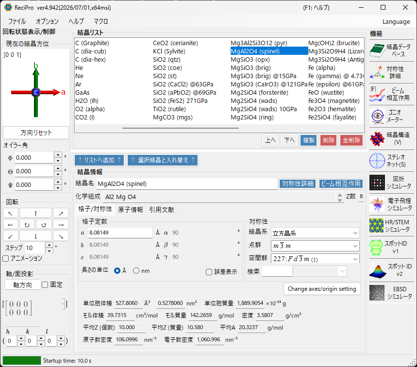

ウィンドウは以下の領域で構成されています：

| 領域 | 位置 | 説明 |
|------|------|------|
| **メニューバー** | 最上部 | ファイル操作、オプション、ヘルプ |
| **回転コントロール** | 左部 | 結晶方位の表示・設定 |
| **結晶リスト** | 中央上部 | 結晶の選択・管理 |
| **結晶情報** | 中央下部 | 格子定数・対称性・原子位置の編集 |
| **機能** | 右部 | シミュレーション・解析ウィンドウの起動 |

---

## 基本ワークフロー

はじめてお使いの方は、次の手順を参考にしてください。

1. **結晶リスト**で計算対象の結晶を選択する。CIF/AMC ファイルを使う場合は **結晶情報** 領域へドラッグ＆ドロップします。
2. 格子定数・原子位置を編集した場合は、**リストへ追加** または **選択結晶と入れ替え** で変更を結晶リストへ反映する。
3. **回転情報**で晶帯軸、結晶面、オイラー角、またはマウスドラッグにより結晶方位を決める。
4. 右側の **ファンクション** から目的の機能を開く。回折、HRTEM/STEM、EBSD などの計算ウィンドウは、現在選択中の結晶と方位を引き継ぎます。

---

## ファイルメニュー

### ファイル

| メニュー項目 | 説明 |
|-------------|------|
| 結晶リストを読み込み（現在のリストを消去） | 結晶リストファイル(*.xml)を読み込み、現在のリストを置換 |
| 結晶リストを読み込み（現在のリストに追加） | 結晶リストを読み込み、現在のリストに追加 |
| 結晶リストを初期状態に戻す | 起動時の結晶リストを再読込 |
| 結晶リストを保存 | 現在の結晶リストを保存 |
| 選択結晶をCIF形式で書き出し | 選択中の結晶をCIFフォーマットで保存 |
| 現在のリストを消去 | すべての結晶をリストから削除 |
| 閉じる | アプリケーションを終了 |

### オプション

| メニュー項目 | 説明 |
|-------------|------|
| ツールチップを表示 | ツールチップの表示/非表示を切り替え |
| Use Miller-Bravais (hkil) index | 三方晶・六方晶系で面指数をプログラム全体で4指数  \((hkil)\) 表記にする |
| レジストリを初期化 (要再起動) | 次回起動時にウィンドウサイズ・波長・カメラ長等の設定をリセット |
| Crystallography.Native.dll を無効化 (要再起動) | ネイティブ(C++)ライブラリの読込に失敗する場合にマネージドコードで代替 |
| OpenGLによる全てのレンダリングを無効化 (要再起動) | 古いGPU/リモートデスクトップ環境向け |
| OpenGLによるテキストレンダリングを無効化 (要再起動) | 一部GPUでの文字描画不具合への対処 |
| MKL ライブラリを使用 | 数値計算にIntel MKLを使用 |
| ダークモード | ライト／ダークのカラーテーマを切り替え |
| Powder diffraction function (under development) | 多結晶（粉末）回折ウィンドウを有効化 |
| Capture GUI Components… | GUIスクリーンショットを保存する開発者向けツール |

### ヘルプ

| メニュー項目 | 説明 |
|-------------|------|
| アップデート | 新バージョンの確認・インストール |
| ヒント | 使い方のヒントを表示 |
| バージョン履歴 | バージョン履歴を表示 |
| ライセンス | MITライセンスを表示 |
| Github ページ | GitHubリポジトリを開く |
| バグ・要望報告 | GitHub Issuesを開く |
| 使い方 (WEB) / 使い方 (Wiki) | オンラインヘルプを開く。現在の正本は GitHub Pages 版です。 |

言語の切り替えは別の **Language** メニューで行います（英語/日本語、要再起動）。

### Language

UI 言語を英語または日本語に切り替えます。変更は再起動後に反映されます。

### マクロ

[マクロ](20-macro/index.md) ウィンドウを開き、Python構文のスクリプトで ReciPro の操作を自動化します。よく使う処理を繰り返す場合は、[組み込み関数一覧](20-macro/1-built-in-functions.md) と [マクロの使用例](20-macro/2-examples.md) を参照してください。

---

## 回転状態の表示/制御

結晶の回転状態は、回折シミュレータ・Structure Viewer・ステレオネット・HRTEM/STEM シミュレータ・EBSD シミュレータなど他のウィンドウでも共通して使われます。単なる表示上の設定ではなく、シミュレーションで用いる入射ビーム方向と結晶座標系の関係を定義します。短い操作動画は [How to use（動画）](appendix/a0-how-to-use.md) のページにあります。

### 現在の結晶方位

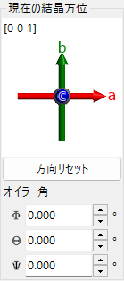

結晶の回転状態がグラフィカルに表示されます。マウスドラッグで回転できます。

結晶軸の色：
- **赤**: *a*軸
- **緑**: *b*軸
- **青**: *c*軸

### 方向リセット
結晶方位を**初期状態**にリセットします。初期状態とは、*c*軸がスクリーンに垂直、*b*軸が画面上方向を向く状態です。

### 晶帯軸
スクリーンに垂直な方向に最も近い晶帯軸指数を表示します。検索範囲（例：*u* + *v* + *w* < 30）を指定できます。

### オイラー角
**Z–X–Z**系のオイラー角で結晶方位を設定します：
- **Ψ**: Z軸回転
- **θ**: X軸回転
- **Φ**: Z軸回転

回転はΨ → θ → Φの順に適用されます。詳しくは [回転ジオメトリ](4-rotation-geometry.md) および [座標系](appendix/a1-coordinate-system/1-orientation.md) を参照。

### 回転

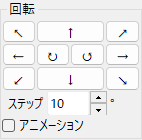

矢印方向に角度**ステップ**分だけ回転します。**アニメーション**をチェックすると連続回転します。

### 軸/面投影

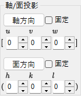

指定した晶帯軸や結晶面の方向に結晶方位を設定します。

- **固定**: チェックすると、指定した軸・面が空間的に固定された状態で回転します。
- **軸方向**: 指定した晶帯軸 [*uvw*] をスクリーン垂直方向に設定します。**面方向**も設定されていれば、その方向が画面上向きになります。
- **面方向**: 指定した結晶面 (*hkl*) の法線をスクリーン垂直方向に設定します。**軸方向**も設定されていれば、その方向が画面上向きになります。

### 結晶方位を設定する基本的な方法

| 方法 | こんなとき | 操作場所 |
|------|-----------|---------|
| マウスドラッグ | 結晶軸を見ながら自由に回転させたいとき | 「現在の結晶方位」パネル |
| 矢印ボタン | 小さな回転を繰り返し行いたいとき | 「回転」パネル |
| 晶帯軸 | \([001]\) や \([110]\) など、見たい方向が分かっているとき | 「軸/面投影」/ 晶帯軸の入力 |
| 面法線 | 結晶面 \((hkl)\) をスクリーンに垂直にしたいとき | 「軸/面投影」/ 面の入力 |
| オイラー角 | 再現可能な数値で方位を指定したいとき | 「オイラー角」 |

回転行列と座標系の規約は [回転ジオメトリ](4-rotation-geometry.md) および [Appendix A1. 座標系の定義](appendix/a1-coordinate-system/1-orientation.md) を参照してください。

---

## 結晶リスト

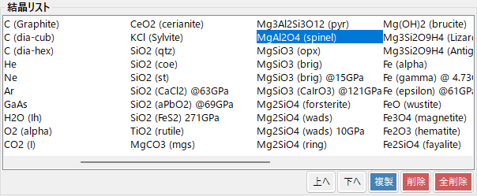

読み込まれた結晶を表示（初期状態で約80結晶）。結晶を選択すると **結晶情報** に詳細が表示され、計算対象に設定されます。**結晶リストを右クリック**するとコンテキストメニュー（*名前の変更*・*CIF形式で書き出し*・*複製*・*削除*）が表示されます。

| ボタン | 動作 |
|--------|------|
| 上へ / 下へ | 選択した結晶の順番を移動 |
| 複製 | 選択中の結晶を複製 |
| 削除 / 全削除 | 選択した結晶またはすべての結晶を削除 |
| リストへ追加 / 選択結晶と入れ替え | 現在の結晶をリスト末尾に追加、または選択中の結晶と置換 |

---

## 結晶情報

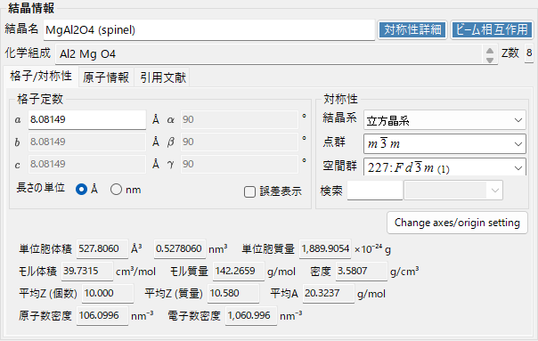

格子定数・対称性・原子位置を設定・表示します。CIFファイルやAMCファイルをこの領域にドラッグ＆ドロップして結晶を読み込むこともできます。

> **重要**: 変更を加えた場合は必ず**リストへ追加**または**選択結晶と入れ替え**ボタンを押してください。押さないと、別の結晶を選択した際に変更内容が失われます。

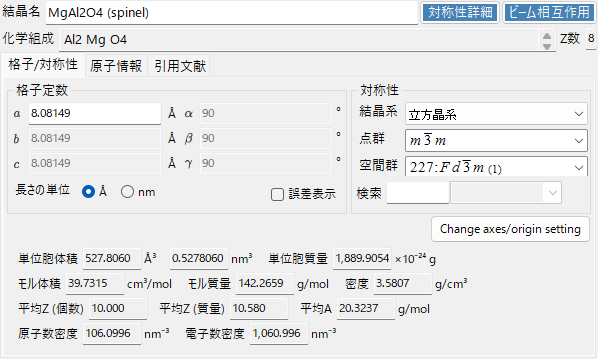

### 格子/対称性 タブ

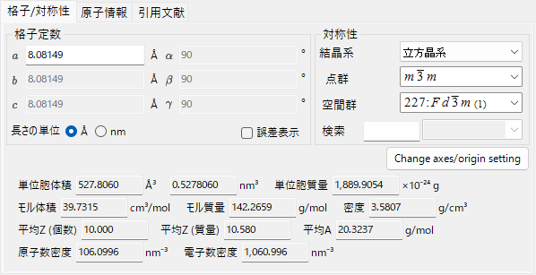

### 原子情報 タブ

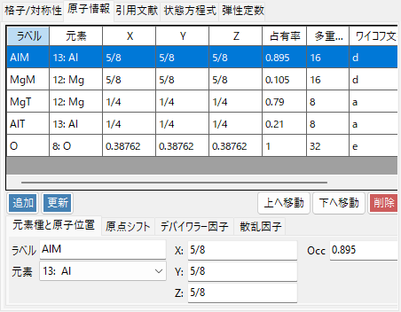

### 引用文献 タブ

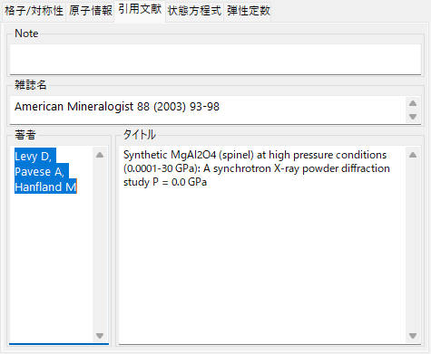

### 状態方程式 タブ

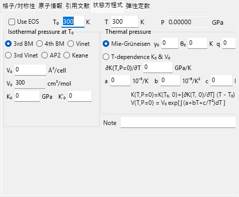

### 弾性定数 タブ

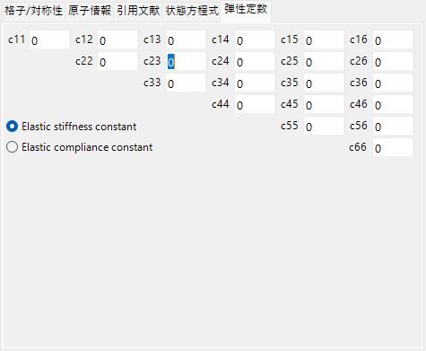

---

## 機能パネル {#functions}

ウィンドウ右側の縦並びボタンから、各解析・シミュレーションウィンドウを起動します（下表 [ファンクション](#functions) を参照）。

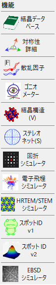

| ボタン | 説明 | 詳細 |
|--------|------|------|
| 結晶データベース | 内蔵／オンラインデータベースからの結晶検索・取込 | [結晶データベース](1-crystal-database.md) |
| 対称性詳細 | 空間群の対称性情報・ITC Vol.A 様式の対称ダイアグラム | [対称性情報](2-symmetry-information.md) |
| 散乱因子 | 結晶面のリストアップ・構造因子の計算 | [散乱因子](3-scattering-factor.md) |
| ゴニオメーター | 回転行列の3D表示・オイラー角変換 | [回転ジオメトリ](4-rotation-geometry.md) |
| 結晶構造 | OpenGLによる結晶構造の3D描画 | [結晶構造ビューア](5-structure-viewer.md) |
| ステレオネット | ステレオネット投影 | [ステレオネット](6-stereonet.md) |
| 回折シミュレータ | 電子線・X線の単結晶回折シミュレーション | [回折シミュレータ](7-diffraction-simulator/index.md) |
| 電子飛程シミュレータ | モンテカルロ法による電子飛程（電子軌道）シミュレーション | [電子飛程](8-electron-trajectory.md) |
| HRTEM/STEMシミュレータ | 高分解能TEM/STEM像シミュレーション | [HRTEM/STEMシミュレータ](9-hrtem-stem-simulator/index.md) |
| スポットID v1 | 制限視野回折パターンの指数付け（旧「TEM ID」） | [Spot ID v1](10-spot-id.md) |
| スポットID v2 | 回折スポットの検出・指数付け | [Spot ID v2](11-spot-id-v2.md) |
| EBSDシミュレータ | EBSDパターンシミュレーション | [EBSDシミュレーション](12-ebsd-simulation.md) |
| 粉末回折 | 多結晶（粉末）回折。**オプション ▸ Powder diffraction function** で有効化 | — |
