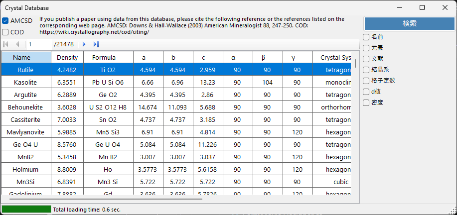
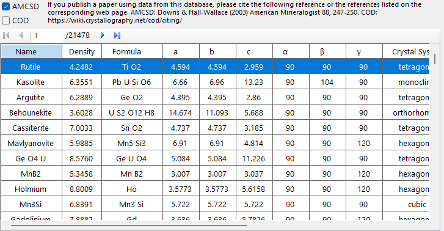
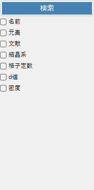
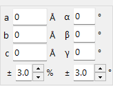

<!-- nav -->

🌐 [English](../en/1-crystal-database.md)  |  **日本語**

[← 0. メインウィンドウ](0-main-window.md)  |  [🏠 ホーム](index.md)  |  [2. 対称性情報 →](11-symmetry-information.md)

# 結晶データベース

**結晶データベース** は、2つのデータソースから結晶構造を検索・インポートできます。**AMCSD** と **COD** のチェックボックスで切り替えます。

- **AMCSD** — 内蔵の [American Mineralogist Crystal Structure Database](http://rruff.geo.arizona.edu/AMS/amcsd.php)（約21,000件）。
- **COD** — [Crystallography Open Database](https://www.crystallography.net/cod/)。初回利用時にデータベースファイルが自動でダウンロードされ、更新もできます。

AMCSD を使用する際は、以下の文献を必ず引用してください：

> Downs, R.T. and Hall-Wallace, M. (2003) The American Mineralogist Crystal Structure Database. *American Mineralogist* **88**, 247–250.

---

## テーブル

データベースに含まれる結晶が表示されます。検索条件を入力している場合は、条件に合う結晶のみが表示されます。

テーブル中の結晶を選択すると、メインウィンドウの **結晶情報** に情報が転送されます。**結晶リスト** に追加するには **リストへ追加** または **選択結晶と入れ替え** ボタンを押してください。

---

## 検索オプション

検索条件を入力後、**検索**ボタンまたはEnterキーを押してください。

| 条件 | 説明 |
|------|------|
| **名前** | 結晶の名称 |
| **元素** | **周期表**ボタンで元素選択ウィンドウを開く。各元素のボタンは「含んでもよい」「必ず含む」「必ず含まない」を切替 |
| **文献** | 論文名、雑誌名、著者名 |
| **結晶系** | 結晶系を選択 |
| **格子定数** | 格子定数と許容誤差 |
| **d値** | 強い回折のd-spacingと許容誤差 |
| **密度** | 密度と許容誤差 |

### 格子定数検索

---

[← 0. メインウィンドウ](0-main-window.md)  |  [🏠 ホーム](index.md)  |  [2. 対称性情報 →](11-symmetry-information.md)
