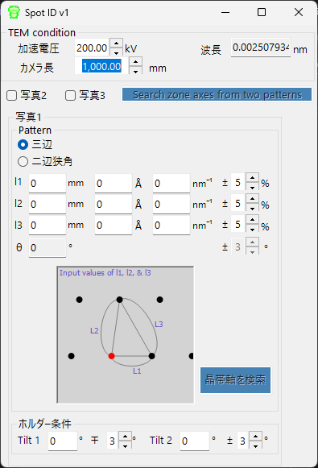

# Spot ID v1（スポット検出・指数付け）

**Spot ID v1** は、実験電子回折像からスポットを検出、フィッティング、指数付けします。数値入力したスポットジオメトリからのゾーン軸検索（旧 **TEM ID**）にも対応しています。

---

## メインエリア

回折画像を表示します。ドラッグ＆ドロップまたは**File**メニューから画像を読み込めます。右クリック・右ドラッグでズーム。

### マウス操作

| 操作 | 動作 |
|------|------|
| 左シングルクリック | スポットを選択 |
| 左ダブルクリック | スポットを追加 |
| Ctrl + 左ダブルクリック | 透過スポットを追加 |
| Ctrl + 右シングルクリック | スポットを削除 |

### 画像調整

| 設定 | 説明 |
|------|------|
| Min / Max | 輝度の範囲（トラックバーでも調整可） |
| Gradient | Positive または Negative |
| Scale | Linear または Log |
| Colour | グレースケール または Cold-Warm |
| Dust & Scratch | 異常に明るい/暗いピクセルを除去 |
| Gaussian blur | ガウシアンブラーの適用 |

---

## 光学系 (Optics)

入射源、エネルギー/波長、カメラ長、検出器のピクセルサイズを入力します。

> dm3/dm4ファイル（Gatan Digital Micrograph）を読み込んだ場合、これらの値は自動設定されます。

---

## スポット検出とフィッティング

**Detect & fit spots** ボタンで回折スポットを自動検出し、2D Pseudo-Voigt関数でフィッティングします。

### 検出オプション

| パラメータ | 説明 |
|-----------|------|
| Number | 検出するスポットの最大数 |
| Nearest neighbour | 検出するスポット間の最小距離 |
| Fitting range | フィッティングする半径（ピクセル単位） |

### テーブル操作

| ボタン | 動作 |
|--------|------|
| Reset range | すべてのスポットのフィッティング範囲を再設定 |
| Show label/symbol | ラベル/シンボルを画像に重畳 |
| Clear all spots | すべてのスポットを削除 |
| Save / Copy | テーブルをタブ区切り形式でエクスポート |
| Re-fit all | すべてのスポットを再フィッティング |

### スポット詳細ウィンドウ

チェックすると別ウィンドウが開き、選択スポット（左）と4方向のプロファイル（右）が表示されます。青＝観測データ、赤＝フィッティング結果。

---

## 指数付け (Index)

**Identify spots** ボタンで、検出したスポットをメインウィンドウで選択した結晶に対して指数付けします。

| 設定 | 説明 |
|------|------|
| Acceptable error | 指数付けの許容誤差 |
| Single grain / Multi grains | 単結晶または多結晶として指数付け |
| Show label/symbol | 指数付けされたラベルを画像に重畳 |
| Refine thickness and direction | 動力学理論（ベーテ法）を適用して精密化 |

---

## スポットジオメトリからのゾーン軸検索（旧 TEM ID）

読み込む画像がない場合でも、制限視野電子回折 (SAED) パターンのジオメトリを手入力して候補ゾーン軸を検索できます。TEM観察条件とスポットジオメトリを入力し、**晶帯軸を検索** ボタン（3枚すべてを使う場合は **三枚の写真から晶帯軸を検索**）で候補となる結晶方位を検索します。

### TEM条件

加速電圧やカメラ長などのTEM観察条件を入力します。

### 写真1・2・3

回折スポットのジオメトリを入力します。

- 検出器上のスポット間距離を入力する場合は **mm** ボックスを使用。
- *d* 値がわかっている場合は **Å** または **nm⁻¹** 単位で入力。

**三辺** — 透過スポットを一頂点とする三角形の三辺の長さを入力。

**二辺狭角** — 透過スポットを含む二辺の長さと、その間の角度を入力。
