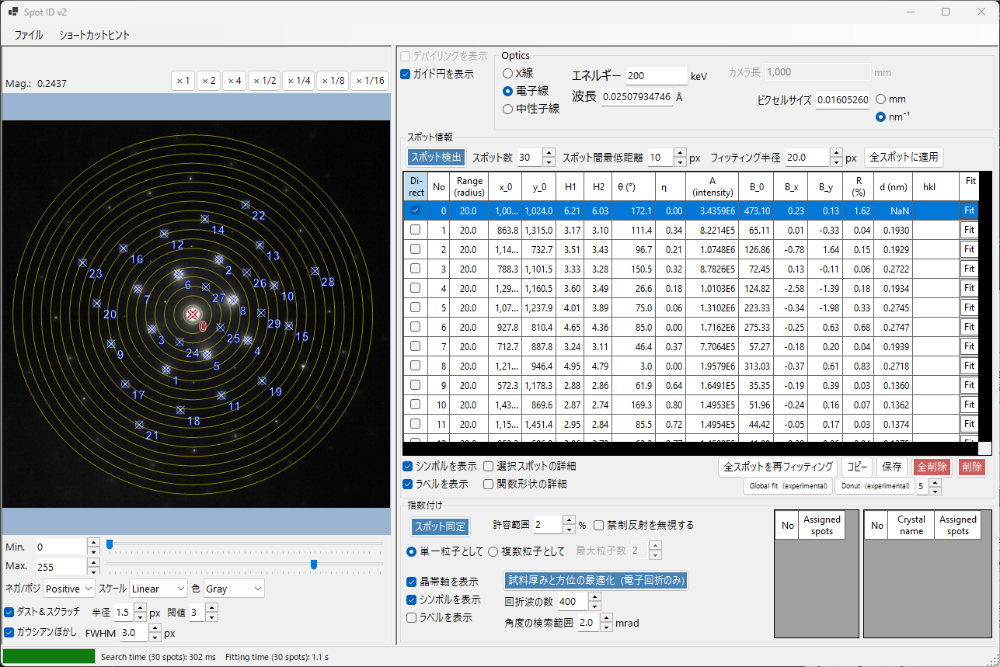
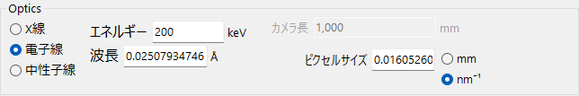
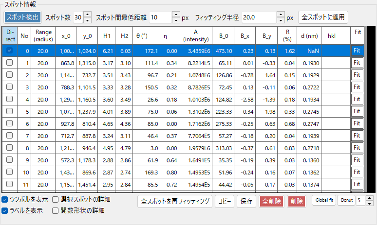
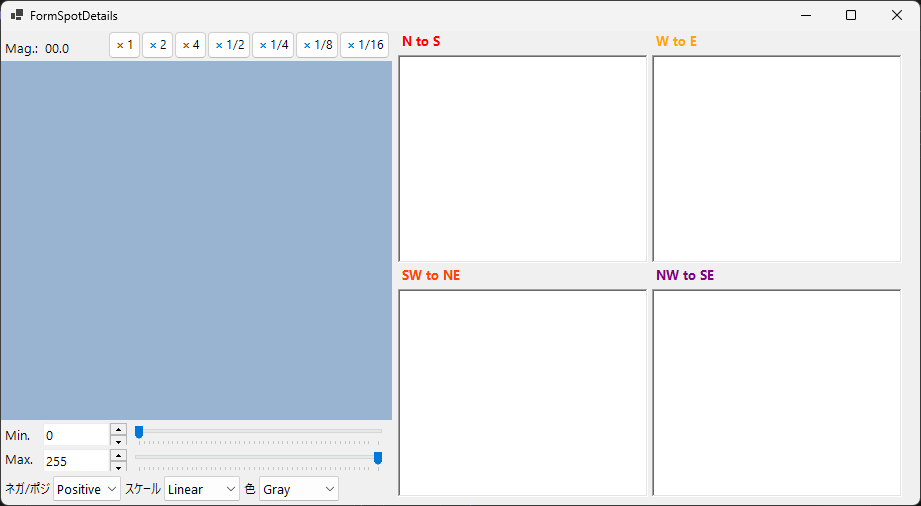
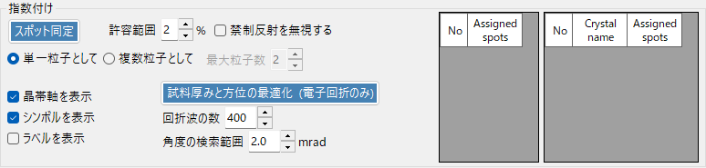

# Spot ID v2

**Spot ID v2** は [Spot ID](10-spot-id.md) の強化版で、スポット検出、フィッティングアルゴリズム、指数付けエンジンが改善されています。

---

## キーボード・マウスショートカット

スポット一覧は、読み込んだ画像上で直接作成します。画像ペインの拡大・平行移動は ReciPro 標準の [画像ビュー操作](21-shortcuts.md) で、スポット編集には以下の組み合わせが加わります。

| ショートカット | 動作 |
|----------------|------|
| <kbd>F1</kbd> | このページのオンラインマニュアルを開く |
| 画像を左ダブルクリック | その点にスポットを追加（ピークフィッティング） |
| <kbd>CTRL</kbd> ＋ 左ダブルクリック | スポットを追加し、直接（000）ビームに指定 |
| スポットを左クリック | 最も近いスポットを選択 |
| <kbd>CTRL</kbd> ＋ スポットを右クリック | 最も近いスポットを削除 |
| <kbd>CTRL</kbd> ＋ 矢印キー | 選択中のスポットを1ピクセル移動 |
| 左ドラッグ／中ドラッグ（空き領域） | 画像を平行移動 |
| ホイール | カーソル位置を中心にズームイン／アウト |
| 右ドラッグで矩形選択 | 選択範囲にズームイン |
| 右ダブルクリック | ズームアウト |
| スポット行のヘッダーをダブルクリック（表） | そのスポットへズーム（×2） |

メインウィンドウの <kbd>CTRL</kbd>+<kbd>SHIFT</kbd>+<kbd>T</kbd> でこのウィンドウを開閉できます。

→ 全ウィンドウの一覧は **[21. キーボード・マウスショートカット](21-shortcuts.md)** を参照。

---

## ファイルメニュー

回折画像の読み込み・保存。[Spot ID v1](10-spot-id.md) と同じドラッグ&ドロップ読み込みに対応。Gatan DM3/DM4 のメタデータ (カメラ長・波長・ピクセルサイズ) は自動的に反映されます。

---

## Optics

### 入射源

線種 (X線 / 電子線 / 中性子線) と、エネルギー (または波長) を設定します。

### カメラ長 / ピクセルサイズ

カメラ長 (mm) と検出器ピクセルサイズ (mm あるいは nm⁻¹)。Gatan DM ファイルを読み込んだ場合はヘッダから自動入力されます。

---

## スポット情報

- **スポット検出**: 局所最大値とバックグラウンド除去を用いた自動スポット検出。
- **スポット数**: 検出するスポットの最大数を指定します。
- **スポット間最低距離**: 検出スポット間に許す最小間隔 (px)。これより近接したピークは統合され、同一スポットの二重検出を防ぎます。
- **フィッティング半径**: 各スポットのピーク当てはめに用いる円領域の半径 (px)。この円内のピクセルを擬 Voigt 関数でフィッティングします。
- **全スポットに適用**: すべてのスポットのフィッティング半径を、現在の「フィッティング半径」の値に揃えます。
- **削除 / 全削除**: 個別またはすべての検出スポットを削除。
- **コピー**: スポット位置と強度をクリップボードにコピー。
- **選択スポットの詳細**: チェックすると、選択中のスポットの詳細情報ウィンドウを表示します。

---

## 指数付け

- **スポット同定**: 指数付けアルゴリズムを実行して最適な結晶と晶帯軸を検索。
- **許容範囲**: 面間隔と角度の許容偏差を設定。
- **禁制反射を無視する**: チェックした場合、らせん軸・映進面による禁制反射は満たされないものとして晶帯軸を探索します。
- **単一粒子として / 複数粒子として**: 単結晶として 1 つの方位を探索するか、多結晶（複数粒子）として複数の方位を探索するかを選びます。複数粒子の場合は **最大粒子数** で探索する粒子数の上限を指定します。
- **結果**: 最良の一致が結晶名、晶帯軸 [uvw]、各スポットの指数 (hkl) と共に表示。

---

## v1からの改善点

- スポット検出でのノイズ処理の改善。
- 複数のプロファイル形状に対応した、より堅牢なフィッティングアルゴリズム。
- 最適化された検索アルゴリズムによる高速な指数付け。
- 重なり合うスポットやサテライト反射のサポート。
