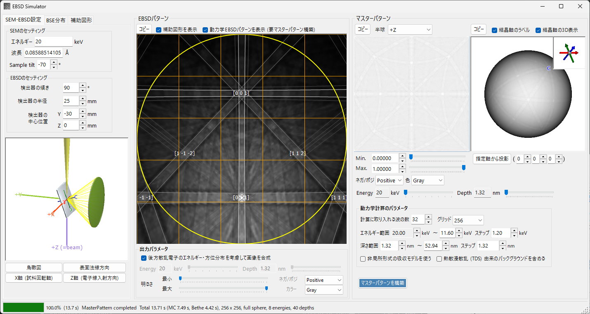
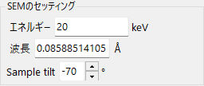
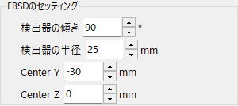
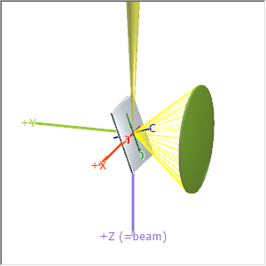
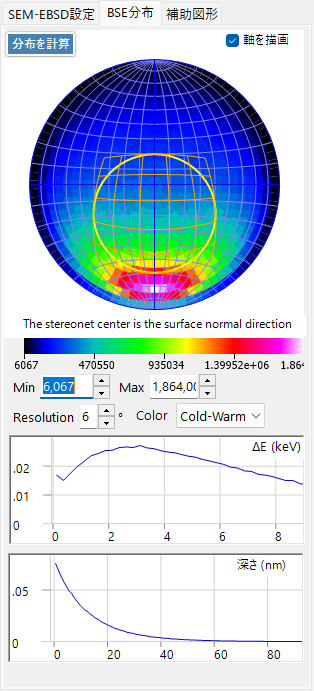
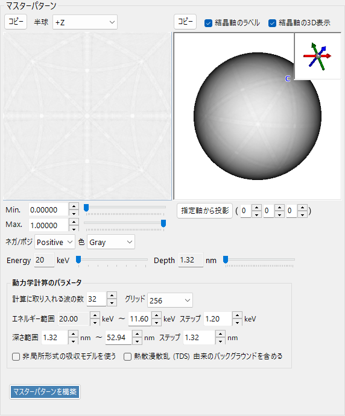
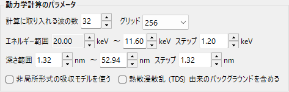
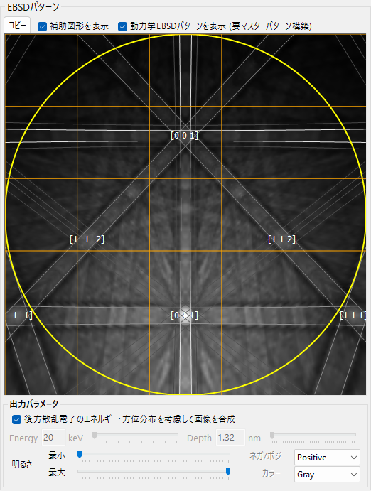
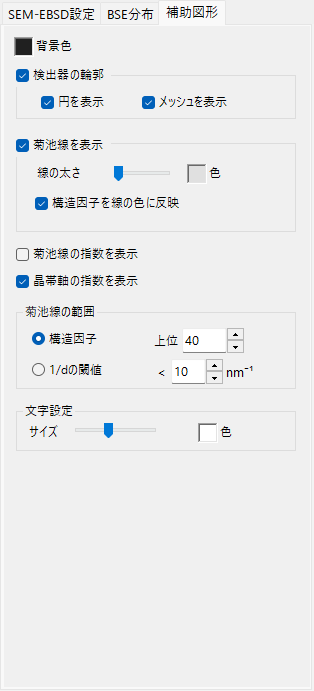

# EBSDシミュレーション (EBSD Simulation)

**EBSDシミュレータ** は、走査電子顕微鏡（SEM）で得られる電子線後方散乱回折（EBSD）パターン（菊池パターン）を、第一原理的にシミュレーションします。後方散乱電子（BSE）の方位・エネルギー・侵入深さの分布をモンテカルロ法で求め、結晶の動力学回折（ブロッホ波法）による **マスターパターン** を計算し、現在の結晶方位に対して検出器面へ投影します。

ウィンドウは3列で構成されます。

- **左列** — シミュレーション条件。タブで **SEM-EBSD設定**（試料・検出器の幾何条件と3Dビュー）、**BSE分布**（後方散乱電子分布）、**補助図形**（菊池線などのオーバーレイ）を切り替えます。
- **中央列** — 現在の結晶方位に対するEBSD（菊池）パターン。
- **右列** — 方位に依存しないマスターパターン（2D投影・3D球）。

---

## シミュレーションの流れ

**マスターパターンを構築** を押すと、以下が順に実行されます。

1. **モンテカルロBSEシミュレーション** — 現在の結晶組成・密度・加速電圧・試料傾斜を使い、約250万本の電子を試料中で追跡します（弾性散乱: Mott/NIST 断面積、非弾性散乱: 誘電応答モデル）。後方散乱電子の「侵入深さ × 射出方位 × 射出エネルギー」の同時分布が得られます。
2. **レンジの自動決定** — 上記分布から、動力学計算に使うエネルギー範囲（入射エネルギーからエネルギー損失の約80パーセンタイルまで）と深さ範囲（侵入深さの約99パーセンタイルまで）が自動的に設定されます。
3. **マスターパターンの構築** — 各エネルギー・各深さについて動力学回折（ブロッホ波法）を解き、モンテカルロ分布で重み付けして全方向（球面）の後方散乱回折強度を積算します。結果は等面積（Rosca–Lambert）格子に格納されます。
4. **検出器面への投影と重み付け** — 現在の結晶方位に対して、検出器の各画素が見込む方向の強度をマスターパターンから引き、菊池パターンとして描画します。必要に応じてBSEの方位・エネルギー分布で重み付けします。

エネルギー範囲・深さ範囲などはステップ1・2で自動設定されますが、構築前に手動で調整することもできます。

---

## SEMのセッティング

- **エネルギー** — 入射電子線の加速電圧（keV）。
- **波長** — 電子線の波長（Å）。エネルギーと連動します。
- **Sample tilt** — 試料の傾斜角（通常70°）。EBSDでは試料を大きく傾けることで後方散乱電子の収量を高めます。

---

## EBSDのセッティング（検出器ジオメトリ）

- **検出器の傾き** — 検出器（蛍光板）の傾き。
- **検出器の半径** — 検出器の半径（mm）。描画されるパターンの視野角を決めます。
- **検出器の中心位置** — 照射点を原点とした検出器中心の位置（Y, Z）（mm）。

幾何条件は **SEM-EBSD設定** タブの3Dビューで確認できます。

灰色の板が試料、緑の円筒/円錐が検出器、紫の **+Z (=beam)** が入射電子線です。試料に固定された結晶の **a / b / c** 軸も表示されます。**鳥瞰図**・**表面法線方向**・**X軸 (試料回転軸)**・**Z軸 (電子線入射方向)** のボタンで標準的な視点に切り替えられます。座標系の定義は [Appendix A2. 検出器座標系](appendix-a2-detector-coordinate-system.md) を参照してください。

---

## 後方散乱電子（BSE）分布

**BSE分布** タブには、モンテカルロで求めた後方散乱電子の分布が表示されます。**分布を計算** で再計算できます。

- **ステレオネット** — 後方散乱電子の角度分布（射出方向のヒストグラム）。中心が表面法線方向で、黄/橙の枠は検出器が見込む領域を示します。**軸を描画** で結晶軸を重ねられます。色スケール（Min / Max・Resolution・Color）を調整できます。
- **ΔE (keV)** — 後方散乱電子のエネルギー損失分布。
- **深さ (nm)** — 後方散乱電子の最終的な侵入（脱出）深さ分布。

これらの分布は [電子飛程](8-electron-trajectory.md) と同じモンテカルロエンジンで計算され、マスターパターンの重み付けに使われます。

---

## マスターパターン

マスターパターンは、方位に依存しない全方向の後方散乱回折強度です。**マスターパターンを構築** で動力学理論により計算します。

- **2D表示**（左） — 半球の等面積投影。**半球** で投影する半球（+Z / −Z）を選びます。
- **3D表示**（右） — 強度をマッピングした球。マウスで回転でき、右上のインセットに結晶軸（a/b/c）が同期表示されます。**結晶軸のラベル** / **結晶軸の3D表示** で軸ラベル・軸矢印の表示を切り替え、**指定軸から投影** で指定したゾーン軸 [u v w] 方向から眺めます。
- **Min. / Max.・ネガ/ポジ・色** — 表示強度の範囲、ネガ/ポジ、カラースケール。
- **Energy / Depth** スライダー — 表示するエネルギー・深さスライスを選択します。
- いずれの図も **コピー** でクリップボードへコピーできます。

### 動力学計算のパラメータ

- **計算に取り入れる波の数** — ブロッホ波計算に取り入れる回折波（ビーム）の本数。多いほど精密ですが計算時間が増えます。
- **グリッド** — マスターパターン格子の分解能（既定256）。
- **エネルギー範囲**（… ～ … **ステップ** …） — 積算するエネルギー範囲とステップ（keV）。モンテカルロ結果から自動設定されます。
- **深さ範囲**（… ～ … **ステップ** …） — 積算する深さ範囲とステップ（nm）。同じく自動設定されます。
- **非局所形式の吸収モデルを使う** — 非局所形式の吸収モデルを使います。
- **熱散漫散乱 (TDS) 由来のバックグラウンドを含める** — 熱散漫散乱由来のバックグラウンド強度を含めます。

---

## EBSDパターン

中央パネルに、現在の結晶方位に対するEBSD（菊池バンド）パターンが表示されます。

- **動力学EBSDパターンを表示 (要マスターパターン構築)** — 構築済みのマスターパターンを検出器面へ投影します。
- **補助図形を表示** — 菊池線・指数などのオーバーレイ（下記）を重ねます。
- **出力パラメータ**
  - **後方散乱電子のエネルギー・方位分布を考慮して画像を合成** — チェックすると、単一スライスではなくBSE分布（エネルギー・深さ・方位）で重み付けして合成します。
  - **Energy / Depth** — 上記をオフにしたとき、表示するエネルギー・深さスライスを指定します。
  - **明るさ**（**最小** / **最大**）・**ネガ/ポジ**・**カラー** — 明るさの範囲、ネガ/ポジ、カラースケール。
- **コピー** — パターンをクリップボードにコピーします。

---

## 補助図形

**補助図形** タブで、パターンに重ねるオーバーレイを設定します。

- **背景色** — 背景色。
- **検出器の輪郭** — 検出器の輪郭。**円を表示**（外周円）・**メッシュを表示**（格子）。
- **菊池線を表示** — 菊池線を描画。**線の太さ**・**色**、**構造因子を線の色に反映**。
- **菊池線の指数を表示** — 菊池線（バンド）の指数表示。
- **晶帯軸の指数を表示** — 晶帯軸の指数表示。
- **菊池線の範囲** — 描画する菊池線の選定基準。**構造因子**（**上位** N 本＝構造因子の大きい順）または **1/dの閾値**（1/d がしきい値以下）を選びます。
- **文字設定** — 指数ラベルの **サイズ**（文字サイズ）・**色**。

---

## 関連項目

- [電子飛程](8-electron-trajectory.md) — 方位・エネルギー・深さの重み付けに用いるモンテカルロ電子飛程（BSE）シミュレーション。
- [回折シミュレータ](7-diffraction-simulator/index.md) — 動力学（ブロッホ波法）電子回折。
- [Appendix A2. 検出器座標系](appendix-a2-detector-coordinate-system.md) — 試料・検出器の座標系の定義。
