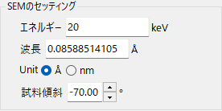
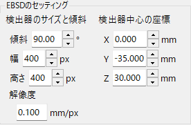
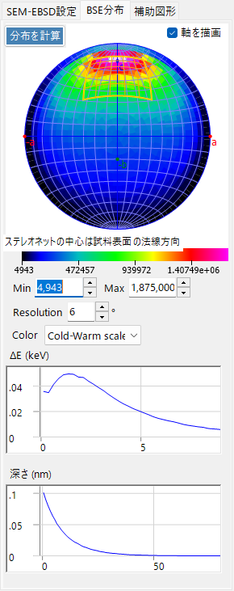
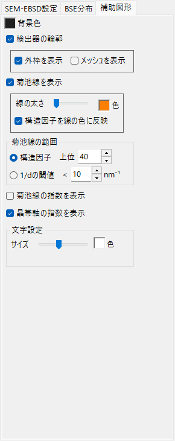
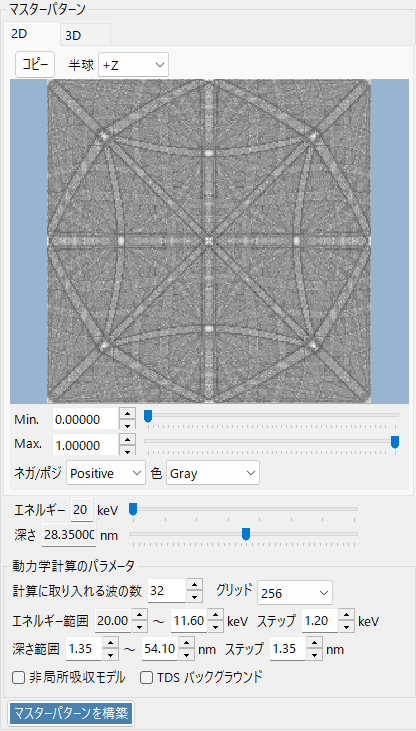
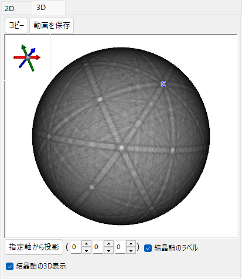
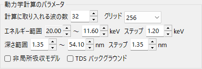
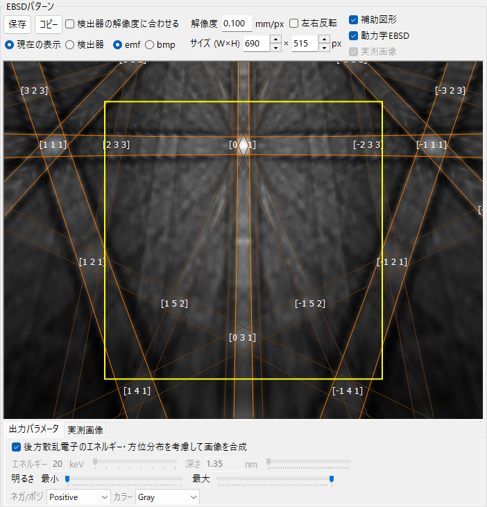
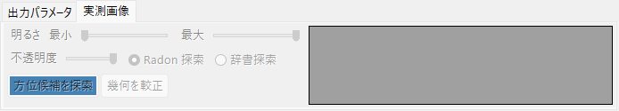

# EBSDシミュレーション (EBSD Simulation)

**EBSDシミュレータ** は、走査電子顕微鏡（SEM）で得られる電子線後方散乱回折（EBSD）パターン（菊池パターン）を、動力学理論に基づく計算によってシミュレーションします。後方散乱電子（BSE）の方位・エネルギー・侵入深さの分布をモンテカルロ法で求め、結晶の動力学回折（ブロッホ波法）による **マスターパターン** を計算し、現在の結晶方位に対して検出器面へ投影します。実測のEBSD画像を読み込んで **指数付け**（その画像を最もよく説明する方位の自動探索）を行うこともできます（[実測画像](#実測画像)）。

ウィンドウは3列で構成されます。

- **左列** : シミュレーション条件。タブで **SEM-EBSD設定**（試料・検出器の幾何条件と3Dビュー）、**BSE分布**（後方散乱電子分布）、**補助図形**（菊池線などのオーバーレイ）を切り替えます。
- **中央列** : 現在の結晶方位に対するEBSD（菊池）パターン。その下のタブで **出力パラメータ** と **実測画像** を切り替えます。
- **右列** : 方位に依存しないマスターパターン（**2D** / **3D** タブ）。

最下部のステータスバーには、実行中の計算の進捗と結果の要約が表示されます。

---

## キーボード・マウスショートカット

中央のEBSD（菊池）パターンと右側のマスターパターンビューでは、マウス操作が異なります。

| ショートカット | 動作 |
|----------------|------|
| <kbd>F1</kbd> | このページのオンラインマニュアルを開く |
| パターン中心付近を左ドラッグ | 結晶を傾ける |
| パターン外周を左ドラッグ | 結晶を回す |
| パターンをダブルクリック | カーソル位置の検出器セルを選択し統計を表示 |
| 画像ファイルをウィンドウにドロップ | 実測EBSD画像として読み込む |
| 3Dビュー（幾何／マスター球）を左ドラッグ | 回転 |
| 3Dビューを右ドラッグ、またはホイール | ズーム |
| <kbd>CTRL</kbd> ＋ 3Dビューを右ダブルクリック | 正射投影／透視投影の切替 |
| 2Dマスターパターンをドラッグ／ホイール | 画像を平行移動／ズーム |

3Dビューは ReciPro 標準の [ビュー操作](21-shortcuts.md)（平行移動は無効）です。

→ 全ウィンドウの一覧は **[21. キーボード・マウスショートカット](21-shortcuts.md)** を参照。

---

## シミュレーションの流れ

**マスターパターンを構築** を押すと、以下が順に実行されます。

1. **モンテカルロBSEシミュレーション** : 現在の結晶組成・密度・加速電圧・試料傾斜を使い、約250万本の電子を試料中で追跡します（弾性散乱: Mott/NIST 断面積、非弾性散乱: 誘電応答モデル）。後方散乱電子の「侵入深さ × 射出方位 × 射出エネルギー」の同時分布が得られます。
2. **レンジの自動決定** : 上記分布から、動力学計算に使うエネルギー範囲（入射エネルギーからエネルギー損失の約95パーセンタイルまで）と深さ範囲が自動的に設定されます。ここでの深さはマスターパターンの厚さ、すなわち出射方向に沿って測った経路長（源の深さ ÷ cos χ。χ は出射方向と試料表面の法線のなす角）です。深さ範囲は、検出器に届く電子のこの経路長の 99.9 パーセンタイル（有効数字 2 桁に切り上げ）までで、表面近くほど細かい 40 段の不等間隔に刻まれます。
3. **マスターパターンの構築** : 各エネルギー・各深さについて動力学回折（ブロッホ波法）を解き、モンテカルロ分布で重み付けして全方向（球面）の後方散乱回折強度を積算します。結果は等面積（Roşca–Lambert）格子に格納されます。
4. **検出器面への投影と重み付け** : 現在の結晶方位に対して、検出器の各画素が見込む方向の強度をマスターパターンから引き、菊池パターンとして描画します。必要に応じてBSEの方位・エネルギー分布で重み付けします。

エネルギー範囲・深さ範囲などはステップ1・2で自動設定されますが、構築前に手動で調整することもできます。

---

## SEM-EBSD設定

### SEMのセッティング

- **エネルギー** : 入射電子線の加速電圧（keV）。
- **波長** : 電子線の波長。エネルギーと連動します。**単位** で Å と nm を選びます。
- **Sample tilt** : 試料の傾斜角（通常 −70°）。EBSDでは試料を大きく傾けることで後方散乱電子の収量を高めます。

### EBSDのセッティング

検出器（蛍光板）は、画素数と画素サイズで定義される矩形です。

- **検出器のサイズと傾斜** : **Tilt** は検出器面の傾き（°）、**Width**・**Height** は検出器の画素数です。
- **解像度** : 検出器1画素の物理サイズ（mm/px）。検出器の物理サイズは Width × 解像度、Height × 解像度 になります。
- **検出器中心の座標** : 照射点を原点とした検出器中心の位置 **X**・**Y**・**Z**（mm）。Y・Z と傾斜でカメラ長が決まり、X は左右方向のずれです。

実測画像を読み込むと、検出器1画素が画像1画素に対応するよう **Width**・**Height** が画像サイズに合わせられます（**解像度** は変更されません）。

幾何条件は **SEM-EBSD設定** タブの3Dビューで確認できます。

灰色の板が試料、緑の矩形板が検出器、紫の **+Z (=beam)** が入射電子線です。試料に固定された結晶の **a / b / c** 軸も表示されます。**鳥瞰図**・**表面法線方向**・**X軸 (試料回転軸)**・**Z軸 (電子線入射方向)** のボタンで標準的な視点に切り替えられます。座標系の定義は [Appendix A1. 座標系の定義](appendix/a1-coordinate-system/2-diffraction.md) を参照してください。

---

## BSE分布

**BSE分布** タブには、モンテカルロで求めた後方散乱電子の分布が表示されます。**「分布を計算」** で再計算できます。

- **ステレオネット** : 後方散乱電子の角度分布（射出方向のヒストグラム）。中心が表面法線方向で、黄色の枠は検出器が見込む矩形領域を示します。**軸を描画** で結晶軸を重ねられます。色スケール（**Min** / **Max**・**Resolution**・**カラー**）を調整できます。
- **ΔE (keV)** : 後方散乱電子のエネルギー損失分布。
- **深さ (nm)** : 検出された後方散乱電子が最後に非弾性散乱を起こした深さの分布（マスターパターンの重み付けに使う深さと同じ定義）。

これらの分布は [電子飛程](8-electron-trajectory.md) と同じモンテカルロエンジンで計算され、マスターパターンの重み付けに使われます。

---

## 補助図形

**補助図形** タブで、EBSDパターンに重ねるオーバーレイを設定します。

- **背景色** : 背景色。
- **検出器の輪郭** : 検出器の輪郭。**外枠を表示**（検出器の縁を示す黄色の矩形）・**メッシュを表示**（分割格子）。
- **菊池線を表示** : 菊池線を描画。**線の太さ**・**カラー**、**構造因子を線の色に反映**（構造因子に応じて各線が背景色へ溶け込みます）。
- **菊池線の範囲** : 描画する菊池線の選定基準。**構造因子**（**上位** N 本＝構造因子の大きい順）または **1/dの閾値**（1/d がしきい値以下、nm⁻¹）を選びます。
- **菊池線の指数を表示** : 菊池線（バンド）の指数表示。
- **晶帯軸の指数を表示** : 晶帯軸の指数表示。
- **文字設定** : 指数ラベルの **サイズ**（文字サイズ）・**カラー**。

---

## マスターパターン

マスターパターンは、事前に計算する全方向の後方散乱回折強度です。**「マスターパターンを構築」** で動力学理論により計算します（**停止** で計算を中断できます）。

- **2D** タブ : 半球の等面積（Lambert）投影。**半球** で投影する半球（+Z / −Z）を選びます。
- **3D** タブ : 強度をマッピングした球。マウスで回転でき、左上のインセットに結晶軸（a/b/c）が同期表示されます。**「結晶軸のラベル」** / **「結晶軸の3D表示」** で軸ラベル・軸矢印の表示を切り替え、**「指定軸から投影」** で隣に入力した晶帯軸 \([uvw]\) 方向から眺めます。
- **Energy / Depth** スライダー : プレビューするエネルギー・深さスライスを選択します。
- いずれの図も **コピー** でクリップボードへコピーできます。
- **動画を保存**（**3D** タブ） : 球面マスターパターンが回転する動画（MP4）を保存します。回転方向・速度・長さ・fps・品質などは、[結晶構造ビューア](5-structure-viewer.md) と同じ「Movie setting」ダイアログで指定します。回転するのはこの3D表示だけで、結晶方位（メインウィンドウのオイラー角）は変わりません。

### 動力学計算のパラメータ

- **計算に取り入れる波の数** : ブロッホ波計算に取り入れる回折波（ビーム）の本数。多いほど精密ですが計算時間が増えます。
- **グリッド** : マスターパターン格子の分解能（1辺あたりのピクセル数、64～8192。既定256）。4096・8192 は中間データに極めて大きなメモリを必要とするため（既定の 16 エネルギー × 40 深さでは 4096 で約 344 GB、8192 で約 1374 GB。2048 でも約 86 GB）、エネルギー・深さの段数を大幅に減らさないと実用になりません。メモリが足りない場合は「MasterPattern failed」と表示されて計算が終了します（ReciPro 自体は動作を続けます）。
- **エネルギー範囲**（… ～ … **ステップ** …） : 積算するエネルギー範囲とステップ（keV）。モンテカルロ結果から自動設定されます。
- **深さ範囲**（… ～ … **ステップ** …） : 積算する深さ範囲とステップ（nm）。同じく自動設定されます。自動設定された深さは不等間隔なので、欄には最浅の点・上限・最初の区間幅を目安として表示します。欄を手で変更すると、その値による等間隔の深さに切り替わります。
- **非局所吸収モデル** : 非局所形式の吸収モデルを使います。
- **非局所後方散乱源** : 原子位置に局在した後方散乱源を、後方半球で積分した非局所の吸収ポテンシャル形式（U'_back）に置き換えます。どちらも同じ物理断面積を使うので、背景の加算ではなくモデルの切り替えです。
- **源の深さ (MC)** : (エネルギー × 深さ) 重み付けに使う「干渉性後方散乱源の深さ」をモンテカルロのどのイベントで決めるか。最後の非弾性散乱（既定）、弾性・非弾性を問わない最後の散乱、または最後のコヒーレンス破壊から選びます。最後の選択肢では「どの原子で散乱したか」の情報を試料に残すほど局在した事象だけが源をリセットします。弾性散乱は Debye–Waller 因子から決まる熱散漫成分の確率 1 − exp(−2B s²) で（Bloch 波が扱う干渉性 Bragg 散乱はリセットしない）、非弾性散乱は内殻・高損失励起なら常に、価電子励起なら運動量移行がプラズモンカットオフ q_c = ω_p/v_F を超える割合だけリセットします（プラズモンや非局在の電子正孔対は Bloch 状態を保つ）。源が浅いほど菊池変調が弱いので、自由パラメータ無しに輸送だけで拡散背景が決まります。切り替えると保存済み電子を再ビニングするだけで、モンテカルロは再実行しません。
- **エネルギー損失でコントラストを減衰**（既定 ON、E_c = 0.8 keV） : 各エネルギースライスの菊池コントラストを A(E) = exp(−(E0 − E)/E_c) 倍し（E0 は加速電圧、E は射出エネルギー）、失った分を方向平均の平坦な台座へ回します。バンドを除いた明るさは変わりません。モンテカルロの重みは後方散乱電子を 1 本ずつ数えますが、大きくエネルギーを失った電子は鋭い菊池コントラストをほとんど持ちません。この補正を切ると全スライスが満額のコントラストを持ち、バンドが E0 の単色電子より約 12 % 広くなります（Si、20 kV）。既定の 0.8 keV は、Si 20 kV の実測パターン 1 枚でバンド幅を合わせて校正した値で、他の物質・加速電圧でも成り立つかは未確認です。変更しても既存のスライスの重みを掛け直すだけで、マスターパターンもモンテカルロも再計算しません。
- **表面非晶質層** : 非晶質の表面層（自然酸化膜・コンタミ・研磨やイオンミリングのダメージ層）の厚さ（nm）。干渉性後方散乱源がこの層内にある電子は菊池変調を持たず、電子 1 本あたり同じ強度の方向平均（一様）成分として加算します。層より下の源は結晶表面から深さを測ります。輸送は結晶と同じ組成・密度で計算します（数 nm なら十分）。0 で無効。変更時は保存済み電子を再ビニングするだけで、モンテカルロは再実行しません。
- **蛍光体応答で電子を重み付け**（既定 ON、E_dead = 2 keV） : モンテカルロの各電子を 1 本 1 票で数える代わりに、蛍光板の発光量 φ(E) = max(0, E − E_dead) で重み付けします。高エネルギーの電子ほど傾いた試料から前方へ出るので、パターンの上下方向の強度勾配が緩み（Si, 20 kV で検出器の上下比が約 2.5 → 1.7）、晶帯軸の輝度もわずかに下がります。検出器面のビニングとビンごとのエネルギー分布に適用され、変更時は保存済み電子を再ビニングするだけでモンテカルロは再実行しません。電子を直接計数する検出器では OFF にしてください。E_dead は蛍光体の不感層（しきい）エネルギーで、Al コート付き P43 蛍光板では 0〜3 keV が目安です。
- **吸収フラックスを拡散背景へ再注入**（既定 OFF） : Bloch 波の計算では、吸収（熱散漫散乱）で干渉性チャネルから外れた電子は消えてしまいますが、実際にはそれらも菊池変調を持たずに検出器へ届きます。このオプションはその分を拡散背景 D(t) = Σσ_n ∫(1 − N(z))dz（N(z) は干渉性の波の単位胞平均密度）として戻し、フラックスを保存させます。絶対強度が上がり（20 kV で Si 約 10%、Fe₃O₄ 約 25%）、再注入分も同じ出射方向に属するため晶帯軸の相対輝度への影響は小さく結晶依存です。原子変位パラメータが 0（吸収なし）だと効果がないので、B の無い結晶には B を設定してください。

---

## EBSDパターン

中央パネルに、現在の結晶方位に対するEBSD（菊池バンド）パターンが表示されます。パターン上部のバーで、描画内容とコピー方法を指定します。

- **動力学EBSD** : 構築済みのマスターパターンを検出器面へ投影します。オフでは背景のみになります。
- **補助図形** : **補助図形** タブで設定した菊池線・指数・検出器の輪郭を重ねます。
- **実測画像** : 読み込んだ実測画像を重ねます（下記）。
- **左右反転** : パターンとオーバーレイを左右反転します。未チェック（既定）は検出器から試料を見る向き＝EBSDカメラが記録する自然な画像です。実測画像の左右が逆の場合にのみチェックしてください。
- **Resolution**（mm/px）・**Size (W×H)**（px） : 表示ビューの解像度とサイズ。
- **保存** : 隣で選んだ範囲・解像度で、パターンをファイルに保存します。形式（PNG / TIFF / EMF）は保存ダイアログで選びます。
  - **Pattern values (\*.csv)** を選ぶと、画像ではなく検出器ピクセル格子上の生の強度値を書き出します。
  - 範囲が **検出器** で、**動力学EBSD** を表示し **実測画像** を表示していないときの TIFF は、16 bit グレースケールで書き出されます（256 階調に丸められません）。このとき **補助図形** はチェックの有無に関わらず含まれず、画素値はパターン自身の最小値～最大値を 0～65535 へ線形に割り当てたものになります（使われた最小値・最大値はステータスバーに表示されます。絶対値が必要な場合は csv を使ってください）。
- **コピー** : 隣で選んだ範囲・形式でパターンをクリップボードにコピーします。
  - **現在の表示** はパン・ズームしたままの表示範囲を、**検出器** は検出器エリアのみをコピーします（後者では黄色い外枠が含まれず、画像は検出器の縁でちょうど終わります）。
  - **emf** は拡張メタファイルで、菊池線や指数ラベルがベクターのまま保持されます。**bmp** は全体をラスター化します。
  - **検出器の解像度に合わせる** は、画像1画素＝検出器1画素でコピーします（長辺は 4096 px でクランプ）。未チェック時は画面の解像度です。

### 出力パラメータ

- **後方散乱電子のエネルギー・方位分布を考慮して画像を合成** : チェックすると、単一スライスではなくBSE分布（エネルギー・深さ・方位）で重み付けして合成します。
- **Energy / Depth** : 上記をオフにしたとき、表示するエネルギー・深さスライスを指定します。
- **明るさ**（**最小** / **最大**）・**コントラスト**・**ネガ/ポジ**・**カラー** : シミュレーションパターンの黒レベル・白レベルを表示レンジに対する % で指定し（スライダーはリニア）、その表示レンジの幅・ネガ/ポジ・カラースケールを選びます。コントラスト 0 で表示レンジはパターン自身の強度範囲、−1 で 10 倍に広がり（コントラスト 1/10）、+1 で 1/10 に狭まります。レンジの中心は動きません。
- **背景を平坦化**（**FWHM**、px。既定 OFF、100 px） : シミュレーション画像から、それを Gaussian でぼかした画像を差し引き、全体的な明るさ分布を取り除きます。背景補正した実測パターンとバンドや晶帯軸を比べるときに使います。半値幅は検出器ピクセルで指定し、ズームには依りません。表示と PNG/TIFF 出力に効き、CSV 出力は生値のままです。

### 実測画像

EBSD画像ファイル（TIFF・PNG・BMP・JPEG。16 bit TIFF はビット深度を保ったまま読み込みます）をウィンドウ上にドロップすると、実測パターンとして読み込まれます。画像は検出器エリアに、シミュレーションパターンの上・菊池線オーバーレイの下に描画されるので、シミュレーションと実測を直接見比べられます。読み込み時に検出器の **Width**・**Height** も画像サイズに合わせられます。

- **明るさ**（**最小** / **最大**）・**コントラスト** : 重ねた実測画像の黒レベル・白レベルを表示レンジに対する % で指定し、その表示レンジの幅を決めます（スライダーはリニア。規約はシミュレーションパターンと同じ）。実測画像だけに作用します。
- **背景を平坦化**（**FWHM**、px。既定 OFF、100 px） : 実測画像から、それを Gaussian でぼかした画像を差し引き、全体的な明るさ分布を取り除きます。輝度スライダーは平坦化後の値に対して働きます。
- **画像に合わせる** : シミュレーションパターンの**最小**・**最大**・**コントラスト**を、その 2 % と 98 % の強度が実測画像の同じ位置と同じ濃淡で表示されるように設定します。パーセンタイルで合わせるので方位解に依存せず、台座や晶帯軸の数画素の飛び値にも強いです。ネガ/ポジ・カラー・両側の**背景を平坦化**の設定は変えないので、押す前に平坦化を両方 ON か両方 OFF にそろえてください。
- **不透明度** : 重ねた実測画像の不透明度（0 = 透明 〜 100 % = 不透明）。下げると下のシミュレーションパターンが見えます。

方位の探索エンジンは2種類あります。

- **Radon 探索** : 実測画像の Radon 変換（直線検出）マップに、運動学的な菊池バンドのテンプレートを照合して方位を探索します。マスターパターン無しでも動作し、有る場合はシミュレーションパターンとの robust ZNCC（平均を除いた正規化相互相関）で候補を再ランクします。
- **辞書探索** : 動力学マスターパターンから全方位の辞書パターンを生成し、robust ZNCC で総当たり比較します。マスターパターンが必須で数秒かかりますが、Radon 探索より確実です。

**方位候補を探索** で選択中のエンジンを実行し、良い順に最大10件の候補が並びます。マスターパターンが有る場合、トップ候補は ±0.25° まで精密化されます。表の列は次のとおりです。

| 列 | 意味 |
|----|------|
| **#** | 順位（0 が最良） |
| **Score** | Radon バンド証拠の *z* 値 |
| **Bands** | 一致したバンド数 / 視野内の予測バンド数 |
| **ZNCC** | シミュレーションパターンとの相関 |
| **Strong bands (hkl)** | 一致したバンドの指数（Radon 探索のみ） |

**行をクリックすると、その方位がアプリ全体に適用され**、シミュレーションパターンが実測画像に重なって描き直され、他のウィンドウの結晶方位も追随します。

**幾何を較正** は、検出器幾何（パターンセンター PC と検出器距離 DD）を方位と交互に最適化し、シミュレーションと実測パターンの ZNCC を最大化します。マスターパターンが必須で、検出器の傾斜は固定のまま、結果は **検出器中心の座標** の X/Y/Z 欄へ書き戻されます。SEM のビーム走査によるパターンセンターの移動は 1 mm 以下なので、通常は実験の冒頭に1回較正すれば一連の画像に使い回せます。

---

## 関連項目

- [電子飛程](8-electron-trajectory.md) — 方位・エネルギー・深さの重み付けに用いるモンテカルロ電子飛程（BSE）シミュレーション。
- [回折シミュレータ](7-diffraction-simulator/index.md) — 動力学（ブロッホ波法）電子回折。
- [Appendix A1. 座標系の定義](appendix/a1-coordinate-system/2-diffraction.md) — 試料・検出器の座標系の定義。
