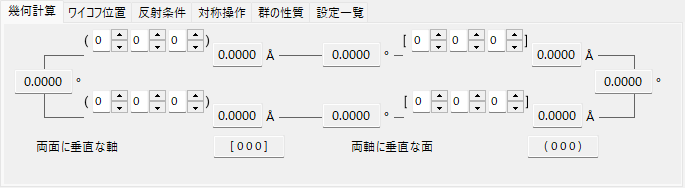
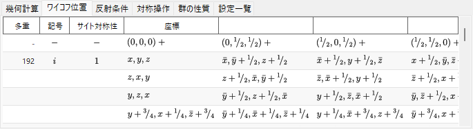
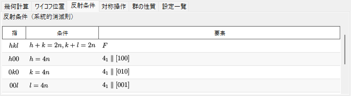
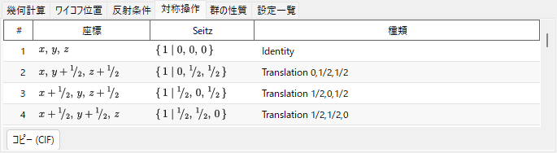
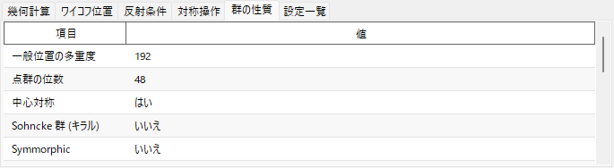
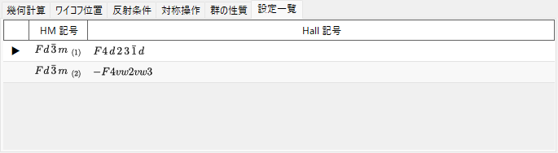
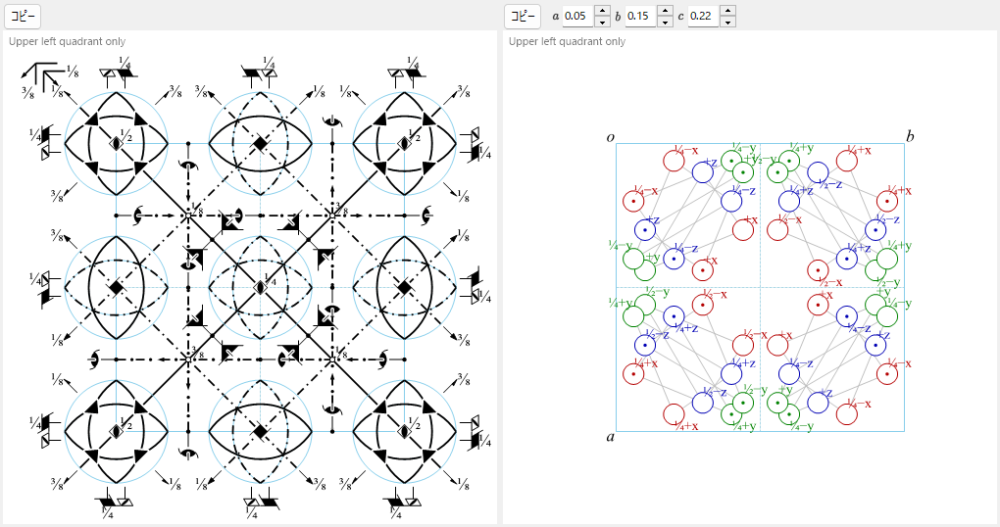

# 対称性情報 (Symmetry Information)

**Symmetry Information** は、選択した結晶の空間群対称性の詳細情報を表示し、さらに*International Tables for Crystallography* Vol. A の様式に沿った対称要素・一般位置の模式図を描画します。

ウィンドウは、空間群の情報（左上）、計算・表のタブ領域（右上）、2つの模式図（下部）から構成されます。

!!! tip "対称性の理論的背景 (Appendix A4)"
    ヘルマン・モーガン/Hall/シェーンフリース記号が実際に何を表しているか、**Properties**（群の性質）タブの群論的分類（中心対称・Sohncke・Symmorphic・極性、…）、下部の対称要素・一般位置模式図の意味、そして **Group Relations...**（群の関係）が示す群・部分群の関係は、すべて **[Appendix A4. 対称性と空間群](appendix/a4-symmetry-space-groups/index.md)** で説明しています。

---

## キーボード・マウスショートカット

このウィンドウに特別なキー／マウスの組み合わせはありません。<kbd>F1</kbd> でこのマニュアルページが開き、2つの **コピー** ボタンで対称要素図・一般位置図をクリップボードへコピーします（**コピー形式** の選択に応じてベクター emf またはラスター bmp）。

→ 全ウィンドウの一覧は **[21. キーボード・マウスショートカット](21-shortcuts.md)** を参照。

---

## 空間群の情報

左上のパネルには、現在の空間群について以下が表示されます。

- **Number**（1〜230）と設定インデックス
- **Crystal System**（結晶系）
- **Point Group**（結晶族点群） : ヘルマン・モーガン (HM) 記号とシェーンフリース (SF) 記号
- **Space Group**（空間群） : HM短縮記号・HM完全記号・SF記号・**Hall記号**

---

## Geometrics Calculation（幾何計算）

2つの結晶面 \((h_1, k_1, l_1)\),  \((h_2, k_2, l_2)\) または2つの方向指数 \([u_1, v_1, w_1]\),  \([u_2, v_2, w_2]\) を入力すると、次が得られます。

- 各面の面間隔／各軸の長さ
- 2面間（または2軸間）の角度
- **両面に垂直な方向指数** と **両軸に垂直な面指数**

これらは現在の単位胞の計量に基づいて計算されます。

---

## Wyckoff Positions（ワイコフ位置）

すべてのワイコフ位置について、多重度・ワイコフ記号・サイト対称性・一般/特殊位置を一覧表示します。複合格子では 格子並進ベクトルがヘッダ行に示されます。

---

## Conditions（反射条件）

複合格子、らせん・映進などの対称操作に由来する反射（出現則）条件を表示します。

---

## Operations（対称操作）

一般位置のすべての対称操作（格子心付けの並進は展開済み）を、座標トリプレット・Seitz記号・平易な幾何学的種類（例: 「3-fold rotation」「c-glide plane」「screw axis」）で一覧表示します。**コピー (CIF)** で全リストをCIFの `_space_group_symop_operation_xyz` ループとしてクリップボードにコピーできます。

→ この3通りの表記の読み方は **[Appendix A4.1](appendix/a4-symmetry-space-groups/symbols-and-diagrams.md#対称操作対称操作タブ)** を参照してください。

---

## Properties（群の性質）

現在の空間群の群論的分類（一般位置の多重度、点群の位数、中心対称、Sohncke、Symmorphic、極性、掌性対の相手、結晶族・格子系・ブラベー型、算術結晶類、Patterson対称）と、その対称性で許容される巨視的物性（焦電性/強誘電性、圧電性、第二高調波発生、旋光性）を表示します。

→ 各用語の意味は **[Appendix A4.1](appendix/a4-symmetry-space-groups/symbols-and-diagrams.md#群論的分類群の性質タブ)** を参照してください。

---

## Settings（設定一覧）

現在の空間群と同じIT番号を共有するすべての収録済み原点・軸設定の選択を、それぞれのHM記号・Hall記号とともに参考として一覧表示します。現在表示中の設定にはマークが付きます。行を選んでも結晶は変更されません。

---

## 対称要素・一般位置の模式図

下部の2つのパネルは、*International Tables for Crystallography* Vol. A の表記に則った空間群の対称性模式図を再現します。

- **対称要素 (左)**: 回転軸・らせん軸、鏡面・映進面、反転中心・回反点を、慣用の図記号で描画します。
  - 立方晶系の\(F\)格子に関しては、単位胞の1/8の領域（Upper left quadrant only）のみを表示します。
  - このような対称要素は [Structure Viewer](5-structure-viewer.md) の3Dモデル上にも直接描画することができます。

- **一般位置 (右)**: 一般等価位置を円（コンマ付きは鏡像）で表示し、分率座標を付記します。
  - 立方晶系についてのみ、3回回転軸で結ばれる三つの円をつなぐ補助線が表示されます。

模式図の下のコントロール:

- **投影方向**（`a` / `b` / `c`） : 投影する結晶軸を選択します。
- **コピー** : 各模式図を、**コピー形式** で選択した形式（ベクター emf ／ラスター bmp）でクリップボードにコピーします。emf は PowerPoint でグループ解除して編集できます。
- **群の関係...**（Group Relations...） : 現在の空間群の極大部分群／極小超群の関係を閲覧するブラウザを開きます。読み方は [Appendix A4.2](appendix/a4-symmetry-space-groups/group-subgroup-relations.md) を参照してください。

---

## 関連項目

- [結晶データベース](1-crystal-database.md)
- [結晶構造ビューア](5-structure-viewer.md)
- [ステレオネット](6-stereonet.md)
- [回転ジオメトリ](4-rotation-geometry.md)
- [メインウィンドウ](0-main-window.md)
- [Appendix A4. 対称性と空間群](appendix/a4-symmetry-space-groups/index.md) — このページの各タブ・模式図の背後にある結晶学・群論の理論的背景。
