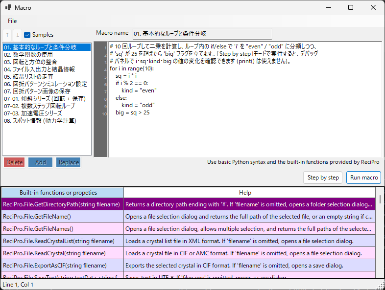

<!-- nav -->

[← 12. EBSDシミュレーション](14-ebsd-simulation.md)  |  [🏠 ホーム](index.md)  |  [20.1. 組み込み関数一覧 →](20-1-built-in-functions.md)

# マクロ

ReciPro は **IronPython** ベースのマクロ機能を搭載しており、結晶操作・回折シミュレーション・画像シミュレーションなどの操作をスクリプトで自動化できます。



上図は **Samples** をオンにして組み込みのサンプルマクロを表示した状態です。左にマクロ一覧、右にコードエディタ、下に組み込み関数のヘルプ表が並びます。

---

## 概要

マクロは Python 構文で記述します。ReciPro が提供する組み込みクラス・関数を使って、GUI 操作と同等の操作をプログラム的に実行できます。

- **言語**: Python 3 (IronPython 3.4)
- **保存先**: Windows レジストリに圧縮保存 (アプリケーション間で永続化)
- **呼び出し**: メインウィンドウの Macro ボタンからマクロエディタを開いて実行

---

## エディタ画面

マクロエディタは 4 つの領域に分かれています:

| 領域 | 用途 |
|------|------|
| **マクロリスト** (左) | 保存済みマクロの一覧。`Add` で新規追加、`Replace` で選択中を上書き、`Delete` で削除。Up/Down ボタンで順序を変更。 |
| **名前フィールド** (上) | 編集中マクロの識別名。 |
| **コード領域** (右) | Python コードエディタ。行番号ガター、オートインデント、入力候補ポップアップ付き。 |
| **組み込み関数表** (下) | ReciPro が提供する組み込み関数・プロパティと、その説明 (Help) の一覧。コードを書く際のリファレンスになります。 |
| **ステータスバー** (最下部) | 現在のキャレット位置を `Line N, Col M` で表示。 |
| **デバッグパネル** (Step 実行中のみ表示) | 現在の行におけるローカル変数一覧。 |

未保存の編集があるとタイトルバーに **`Macro*`** とアスタリスクが表示され、Add / Replace / Ctrl+S のいずれかで保存すると **`Macro`** に戻ります。

### サンプルマクロ

左上の **Samples** をオンにすると、ユーザーのマクロ一覧が一時的に組み込みのサンプルマクロ（基本的なループと条件分岐、数学関数、回転と方位の整合、結晶リストの走査、回折・画像シミュレーション、傾斜/エネルギーシリーズ、スポット情報など）に切り替わります。サンプルは読み取り専用で、現在の UI 言語に合わせて表示されます。学習やコピー元として使え、オフにすると元のユーザーマクロに戻ります。

---

## 編集機能

- **オートインデント**: Enter キーで改行すると、現在行の先頭空白・タブがそのまま引き継がれます。さらに行末が `:` の場合 (`def` / `if` / `for` など) は自動的に 1 段 (4 スペース) 分のインデントが追加されます。
- **スマート Backspace**: 行頭の空白領域内で Backspace を押すと、1 文字ではなくインデント 1 段 (4 スペース) をまとめて削除します。
- **Tab / Shift+Tab**:
  - 選択なし: キャレット位置で 1 段インデントを挿入・削除。
  - 複数行選択: 選択範囲全行に対してインデント・逆インデントを一括適用。
- **入力候補ポップアップ**: 文字を入力すると、マッチする関数名・Python 基本文法が候補としてポップアップ表示されます。矢印キーで選択、Enter/Tab で確定、Esc でキャンセル。
- **ツールチップ**: 候補をハイライトすると、その関数・構文の説明がツールチップで表示されます。

### キーボードショートカット

| ショートカット | 動作 |
|----------------|------|
| `Ctrl+S` | 現在のコードを選択中マクロに上書き保存 (インプレース) |
| `F10` | 次のステップへ進む (Step 実行中) |
| `Enter` | オートインデント付きで改行 |
| `Tab` / `Shift+Tab` | インデント / 逆インデント |
| `Backspace` | 行頭空白内ならインデント 1 段削除 |

---

## マクロの実行

実行モードは 2 種類あります:

- **Run macro**: 最後までまとめて実行。エラーが発生すると Python トレースバックを含むダイアログが出て、該当行が自動的に選択状態になります。
- **Step by step**: 各行の実行前で停止。デバッグパネルにその時点のローカル変数が表示されます。`F10` または **Next step (F10)** ボタンで次の行へ、**Stop** ボタンで実行中断。

**Stop** ボタンは Step モード専用です (IronPython は `CancellationToken` を尊重せず、また UI スレッド上で同期実行しているので、通常の Run macro 実行中の中断はできません)。

---

## Python 言語サポート

このマクロ環境は **IronPython 3.4** です。すべての Python 機能が有効というわけではありません。

### 事前 import 済み

- **`math`** モジュールは起動時に自動で import 済みです。`math.sqrt(x)`、`math.sin(x)`、`math.pi`、`math.radians(deg)` などをそのまま使えます。

### 使えるもの

- 制御構造: `if` / `elif` / `else`、`for`、`while`、`def`、`class`、`return`、`try` / `except` / `finally`、`pass`、`break`、`continue`、`lambda`
- リテラル: `True`、`False`、`None`
- 組み込み関数: `len`、`range`、`abs`、`min`、`max`、`sum`、`sorted`、`enumerate`、`zip`、`int`、`float`、`str`、`list`、`dict`、`tuple`、`type`、`isinstance`
- ピュア Python で書かれた標準ライブラリ: `random`、`datetime`、`time`、`re`、`json`、`itertools`、`functools`、`collections`

これらの基本文法は入力候補ポップアップにも登録されているので、最初の数文字を打てば候補が出てきます。

### 使えないもの

- **`print()`** — コンソールウィンドウが無いため出力先がありません。値を確認したいときは **Step by step** 実行でデバッグパネルを見てください。
- **`input()`** — 標準入力がありません。
- **ファイル I/O** (`open`、`with open`) — マクロからの直接ファイル操作は想定外です。代わりに `ReciPro.File.*` ヘルパーを使ってください。
- **C 拡張に依存するパッケージ**: `numpy`、`scipy`、`pandas`、`matplotlib` — IronPython では動きません。

---

## API へのアクセス

ReciPro のマクロ API はトップレベルの **`ReciPro`** という名前でまとめられています。組み込みクラスは `ReciPro` のフィールドとしてアクセスします:

```python
ReciPro.File.*         # ファイル I/O ヘルパー
ReciPro.Crystal.*      # 現在選択中の結晶
ReciPro.CrystalList.*  # 結晶リストの操作
ReciPro.Dir.*          # 結晶方位 (オイラー角、晶帯軸、回転)
ReciPro.DifSim.*       # 回折シミュレータ
ReciPro.HRTEM.*        # HRTEM シミュレーション
ReciPro.STEM.*         # STEM シミュレーション
ReciPro.Potential.*    # ポテンシャルシミュレーション
ReciPro.Sleep(ms)      # 実行を一時停止 (ミリ秒)
```

入力候補ポップアップは常に `ReciPro.Class.Member` の完全形で候補を出し、選択時も完全形を挿入するので、通常は `ReciPro.` を手で打つ必要はありません。

詳細は [組み込み関数一覧](20-1-built-in-functions.md) を参照してください。

---

## エラー表示

マクロ実行でエラーが発生すると、標準的な Python トレースバック形式のダイアログが表示されます:

```
Traceback (most recent call last):
  File "<string>", line 5, in <module>
NameError: name 'abc' is not defined
```

エディタはトレースバックの **最内側フレーム** (= 実際にエラーが起きた行) を自動的に選択状態にするので、すぐに修正できます。構文エラーも実行前に行番号付きで報告されます。

---

## 関連項目

- [組み込み関数一覧](20-1-built-in-functions.md)
- [マクロの使用例](20-2-examples.md)

---

[← 12. EBSDシミュレーション](14-ebsd-simulation.md)  |  [🏠 ホーム](index.md)  |  [20.1. 組み込み関数一覧 →](20-1-built-in-functions.md)
