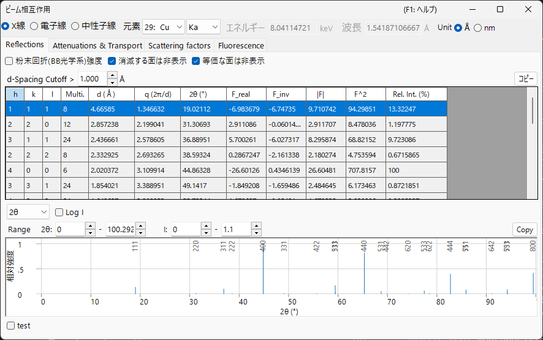
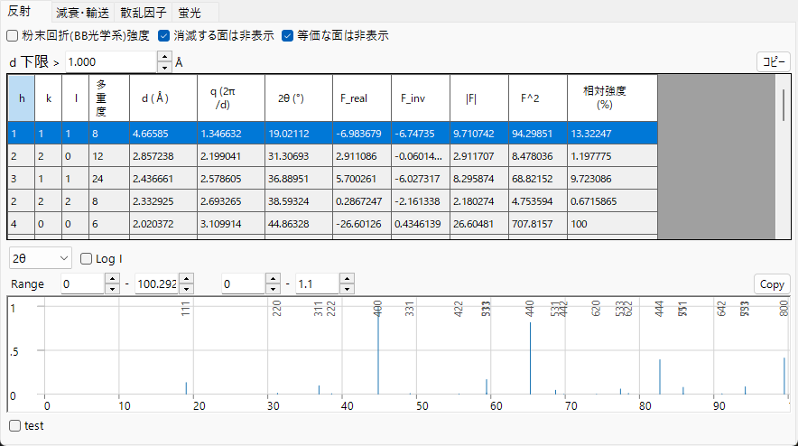
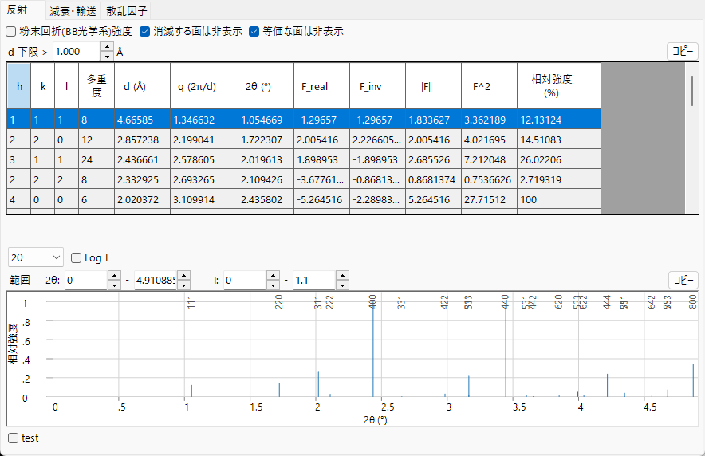
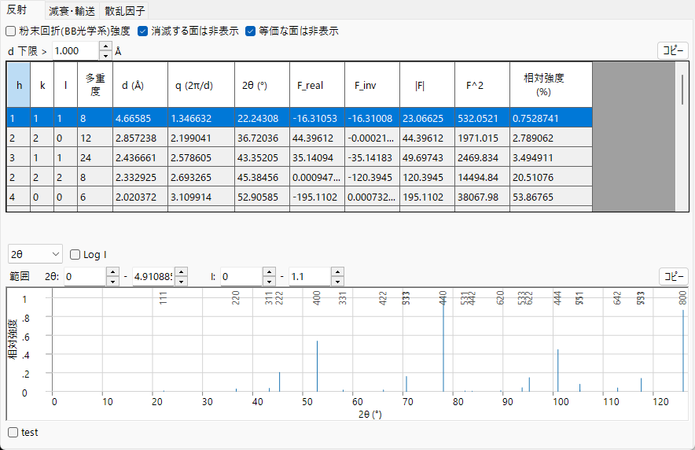
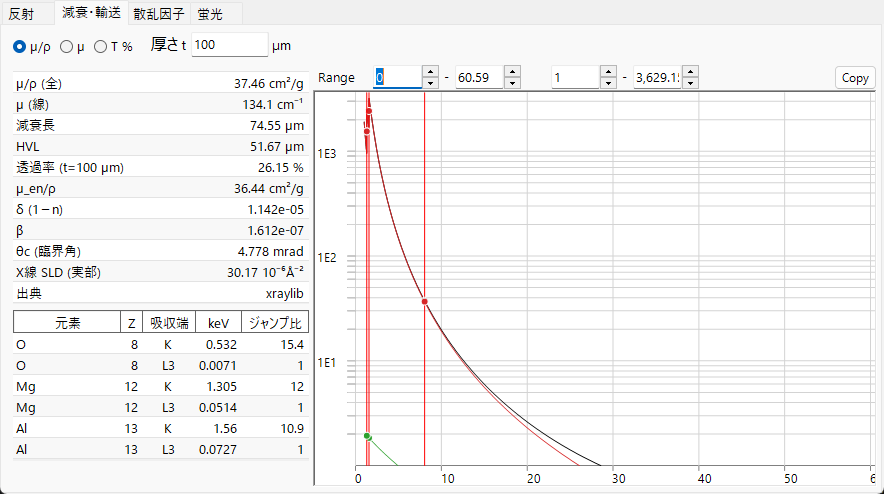
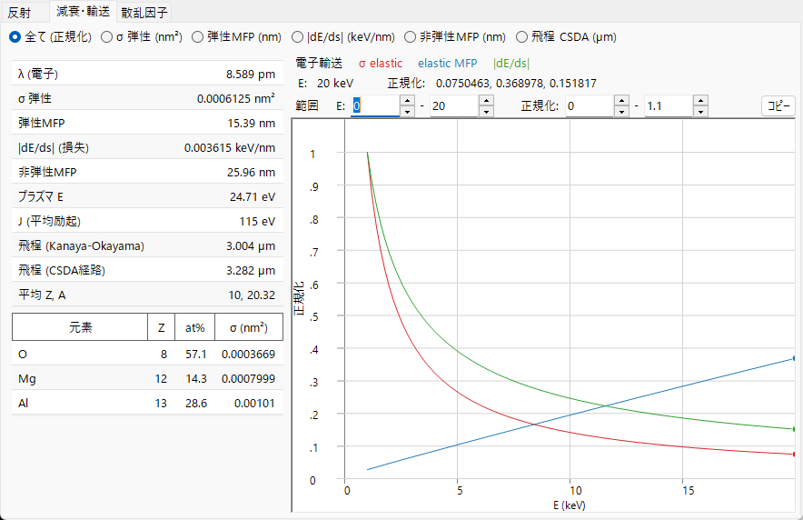
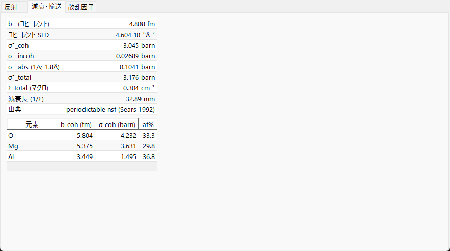
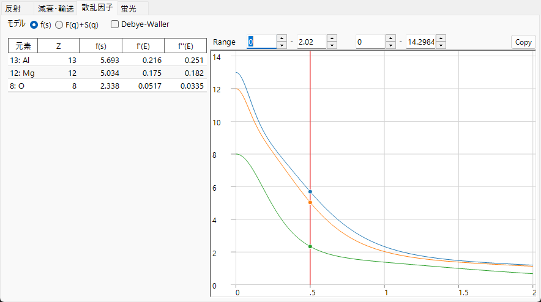
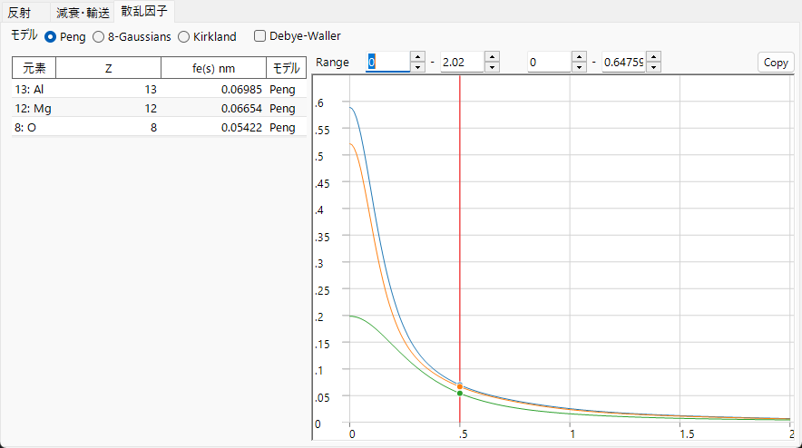
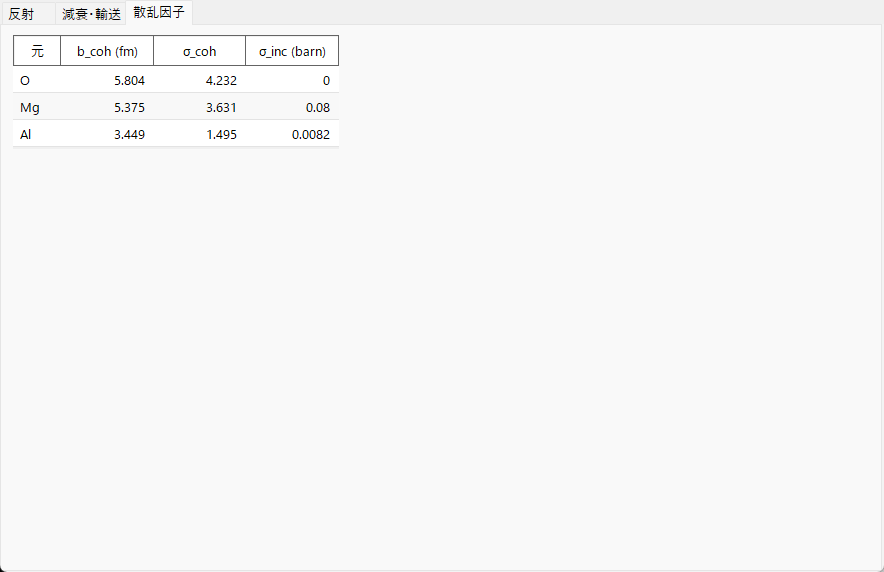

# ビーム相互作用 (Beam Interaction)

**ビーム相互作用** は、選択中の結晶が入射ビーム（**X線・電子線・中性子線**）とどのように相互作用するかを計算します。選んだ放射線について、許される反射とその構造因子、物質中でのビームの減衰と輸送、各元素の原子散乱因子、そして（X線では）特性蛍光線を求めます。上部で放射線の種類を切り替えるとすべてが再計算されるので、同じ結晶を回折・分光の手法ごとに比較できます。

入射ビームはウィンドウ上部の帯で選び、その下の4つのタブ — **反射**・**減衰・輸送**・**散乱因子**・**蛍光** — が相互作用の各側面を表示します。以下の各タブ節では、**X線 / 電子線 / 中性子線** の各ビームでのそのタブを示します（図の中のタブで切り替え）。内容はビームによって大きく変わります。

!!! tip "固体物理的背景（付録 A2）"
    これら4つのタブの背後にある散乱・固体物理 — 原子散乱因子、構造因子、ビームの減衰・輸送、蛍光 — は **[付録 A2. ビーム相互作用（固体物理的背景）](appendix/a2-beam-interaction/index.md)** で解説しています。

!!! note "X線データと同梱の xraylib ライブラリ"
    X線の多くの量（異常分散 $f'/f''$、$F(q)+S(q)$ の散乱分解、質量減衰係数の 光電 / Rayleigh / Compton 分解、吸収端のジャンプ比、蛍光収率）は、同梱の **[xraylib](https://github.com/tschoonj/xraylib)** ライブラリで評価しています。xraylib が利用できない場合は内蔵テーブル（光電吸収のみの減衰、特性線エネルギーのみ）にフォールバックし、該当セルは **N/A** と表示されます。各表の **出典** 行に、どのデータを使ったかが示されます。

---

## キーボード・マウスショートカット

このウィンドウに特別なキーの組み合わせはありません。<kbd>F1</kbd> でこのマニュアルページが開きます。**散乱因子** タブでは縦のカーソル線を**ドラッグ**して、その位置での各元素の散乱因子を表に読み出せます。また各タブの **コピー** ボタンで、その表を表計算ソフトに貼り付け可能なテキストとして書き出せます。

→ 全ウィンドウの一覧は **[21. キーボード・マウスショートカット](21-shortcuts.md)** を参照。

---

## ビームと波長

上部の帯は、他のシミュレータと共通の **波長コントロール** です。

- **X線 / 電子線 / 中性子線** : 原子散乱因子も相互作用の物理も入射線の種類によって異なるため、ここで切り替えます。
- **X線** の場合は **元素**（アノード材）と特性線（Kα など）を選ぶと、その特性X線の波長が自動的に設定されます。
- **エネルギー（keV）** と **波長（Å）** は相互に連動し、どちらを設定しても他方が更新されます。いずれも **反射** 表の 2θ の計算に使われます。
- **Unit（Å / nm）** は面間隔などに使う長さの単位を切り替えます。

選んだビームによって、意味を持つタブと曲線も変わります。

| ビーム | 反射 | 減衰・輸送 | 散乱因子 | 蛍光 |
|------|------|------|------|------|
| **X線** | 異常分散込みの構造因子 | µ/ρ・µ・透過率 ＋ 吸収端（エネルギー依存） | $f(s)$ または $F(q)+S(q)$ | 特性線 ＋ EDX スティック |
| **電子線** | 電子構造因子 | σ・MFP・dE/ds・IMFP・飛程（エネルギー依存） | Peng / Kirkland / 8-Gaussians | —（非表示） |
| **中性子線** | 核構造因子 | 散乱長・断面積（エネルギー曲線なし） | 散乱長（*s* 依存なし） | —（非表示） |

**蛍光** タブは X線専用で、電子線・中性子線では消えます。中性子線では、核の散乱長が散乱角やエネルギーに依存しないため、**減衰・輸送** と **散乱因子** のエネルギー依存グラフは元素別の表に置き換わります。

---

## 反射タブ

結晶の許される結晶面（反射）の一覧と、それぞれの **構造因子** ・回折強度を表示します。X線では構造因子に現在のエネルギーでの **異常分散** 項 $f'/f''$ が含まれるようになったため、吸収端の近くでは `F_inv`（虚部）が一般に 0 ではなくなります。レイアウトはどのビームでも同じで、構造因子の値と各反射の 2θ だけが変わります。

=== "X線"
    

=== "電子線"
    

=== "中性子線"
    

**オプション**

- **粉末回折(BB光学系)強度** : 多重度・ローレンツ偏光因子を含む粉末回折（Bragg–Brentano 光学系）の強度として相対強度を計算します。オフのときは構造因子由来の強度を表示します。オンにすると *等価な面は非表示*・*消滅する面は非表示* も自動的にオンになります。
- **等価な面は非表示** : 結晶学的に等価な面を 1 つにまとめて表示します。
- **消滅する面は非表示** : 消滅則で強度ゼロになる面を一覧から除外します。
- **d 下限 >** : これより小さい d（面間隔）の反射面を一覧から除外します（長さの単位は **Unit** の選択に従います）。

各行が 1 つの反射（または対称等価な面のグループ）に対応します。

| 列 | 意味 |
|------|------|
| **h, k, l** | ミラー指数 |
| **多重度** | 対称等価な面の数 |
| **d (Å)** | 面間隔 |
| **q (2π/d)** | 散乱ベクトルの大きさ |
| **2θ (°)** | 選択した波長に対する回折角 |
| **F_real** | 構造因子の実部 |
| **F_inv** | 構造因子の虚部（X線異常分散で 0 でなくなる） |
| **\|F\|** | 構造因子の振幅（$= \sqrt{F_\text{real}^2 + F_\text{inv}^2}$） |
| **F^2** | 構造因子の強度（$\lvert F\rvert^2$） |
| **相対強度 (%)** | 最大反射を 100 とした相対強度 |

**回折ピーク図.** 表の下に、同じ反射群がスティック状の回折図として描かれ、強いピークには *hkl* のラベルが付きます。

- 横軸セレクタで **2θ**（散乱角・度）、**d**（格子面間隔）、**Q**（$= 4\pi\sin\theta/\lambda$、散乱ベクトル＝運動量遷移）を選べます。3 つは同じ反射群を表し、横軸の取り方だけが変わります。
- **Log I** で強度軸を線形と対数で切り替えます。回折強度は桁が大きく異なるため、対数にすると下側が引き伸ばされ、線形では底に潰れて見えない弱いピークも確認できます。
- **Range** の各ボックスで描画する横軸・強度の範囲を設定します。

---

## 減衰・輸送タブ

ビームが物質をどれだけ透過し、どのようにエネルギーを失うか。内容はビームによって変わります。

=== "X線"
    

=== "電子線"
    

=== "中性子線"
    

### X線

ラジオボタンで、光子エネルギー（1〜60 keV、対数軸）に対して描く係数を選びます。

- **µ/ρ** — **質量**減衰係数（cm²/g）: 物質1グラムあたりに X線がどれだけ減衰されるかを表し、物質の詰まり具合（密度）によりません（データ集に載るのはこの値）。グラフは **total** とその **photo**・**Rayleigh**・**Compton** 成分を併せて表示します。
- **µ** — **線**減衰係数 $\mu = (\mu/\rho)\cdot\rho$（cm⁻¹）: 実際の密度の物質を1cm通るごとの減衰量です。透過強度は $I = I_0\,e^{-\mu t}$ に従い、$1/\mu$ は強度が約37%（1/e）になる距離に相当します。
- **T %** — **透過率** $T = e^{-\mu t}$ を%で表示します。試料厚 **t** は下の **厚さ t** ボックス（µm）で設定します。100%＝透明、0%＝完全遮断で、現在のエネルギーで適切な試料厚を決める目安になります。

縦線は現在のエネルギーと、各元素の **吸収端** を示します。左のスカラ表には、現在のエネルギーでの **減衰長**（$1/\mu$）・**HVL**（半価層、$\ln 2/\mu$）・厚さ *t* での **透過率**・**µ_en/ρ**（質量エネルギー吸収係数）、X線屈折率の減少量 **δ** と **β**（$n = 1-\delta+i\beta$）、全反射の **θc (臨界角)**、実部の **X線 SLD**（散乱長密度）が並びます。下の表は各元素の **K**・**L3** **吸収端** のエネルギーと **ジャンプ比** です。

### 電子線

量セレクタで、ビームエネルギー（1〜30 keV）に対して描く量を選びます。

- **全て (正規化)** — 下の3曲線を各最大で正規化して重ね、形を1枚で比較できます（絶対値は表で確認）。
- **σ 弾性 (nm²)** — 弾性散乱断面積: 原子1個が電子を曲げる起こりやすさ。
- **弾性MFP (nm)** — 平均自由行程: 弾性散乱が起きる平均間隔の距離。
- **dE/ds (keV/nm)** — 阻止能: 電子が1nm進むごとに失うエネルギー。
- **非弾性MFP (nm)** — 非弾性平均自由行程（IMFP）: エネルギーを失う衝突の平均間隔。
- **飛程 CSDA (µm)** — 電子が止まるまでに進む総経路長。

スカラ表には、電子の **波長**・**σ 弾性**・**弾性MFP**・**dE/ds**・**非弾性MFP**、**プラズマ E** と平均励起エネルギー **J**、2 種類の電子 **飛程**（Kanaya–Okayama の侵入深さ近似と CSDA 積分経路長）、**平均 Z, A** が並びます。元素別の表は各元素の原子分率と弾性断面積 σ です。弾性断面積は **NIST Mott** データ（50 eV〜36 keV）を用い、36 keV を超えると **遮蔽 Rutherford** 近似にフォールバックします。

### 中性子線

中性子の相互作用はエネルギー依存の曲線ではなく核断面積で決まるため、このタブは表のみを表示します。スカラ表には、平均コヒーレント散乱長 **b̄**・**コヒーレント SLD**・原子分率加重の コヒーレント / 非コヒーレント / 吸収 / 全 断面積（**σ̄_coh**・**σ̄_incoh**・**σ̄_abs**・**σ̄_total**）・マクロ全断面積 **Σ_total** と対応する **減衰長** が並びます。吸収断面積は現在の波長で 1/v 則により評価し、これが成り立たない核種（Cd・Sm・Eu・Gd の共鳴吸収体）には印を付けます。元素別の表は **b_coh**・**σ_coh**・原子分率です。

---

## 散乱因子タブ

各構成元素の原子散乱因子を $s = \sin\theta/\lambda$（Å⁻¹）に対して描きます。各元素を固有の色で描き、**縦のカーソル線**をドラッグすると、その位置での各元素の散乱因子を左の表に読み出せます。

=== "X線"
    

=== "電子線"
    

=== "中性子線"
    

- **X線** には2つの **モデル** モードがあります。**f(s)** は慣用の X線原子散乱因子（電子単位）を、**F(q)+S(q)** は Rayleigh **コヒーレント**形状因子 $F(q)$ と Compton **非コヒーレント**散乱関数 $S(q)$（xraylib）を描きます。表には現在のエネルギーでの異常分散項 **f'(E)**・**f''(E)** も載ります。
- **電子線** には電子散乱因子の3つのパラメータ化があります: **Peng**・**Kirkland**・**8-Gaussians**。表は $f_e(s)$（nm）と、それを与えた **モデル** を示します。
- **中性子線** の散乱長は $s$ に依存しないため曲線は描かれず、各元素のコヒーレント散乱長 **b_coh** とコヒーレント / 非コヒーレント断面積を表に示します。
- **Debye-Waller** は各原子の等方性変位パラメータを用いて、各因子に熱振動の減衰 $e^{-B s^2}$ を掛けます。

---

## 蛍光タブ

X線ビームの場合に、試料の特性 **蛍光** 発光を表示します。（このタブは電子線・中性子線では非表示です。）

**EDX 発光線** 図は、各元素の特性線（Kα1・Kα2・Kβ1・Lα1・Lα2・Lβ1）をその光子エネルギーの位置にスティックで描きます。高さは 原子分率 × 放射率 × 蛍光収率 に比例します（励起断面積や検出効率は含まない定性的な EDX 風プレビュー）。下の表は線ごとに、**元素**・**線**・エネルギー **E keV**・**相対強度**・蛍光収率 **ω** を示します。スカラ表は各元素の K 殻収率 **ω_K** と、スペクトル中の **最強線** を報告します。

---

## クリップボードにコピー

各タブの **コピー** ボタンで、その表を Excel などの表計算ソフトへ貼り付け可能なテキストとしてクリップボードにコピーします。

---

## 関連項目

- [結晶データベース](1-crystal-database.md) — 相互作用の計算対象となる結晶の定義。
- [回折シミュレータ](7-diffraction-simulator/index.md) — 構造因子を用いた回折図形のシミュレーション。
- [付録 A2. ビーム相互作用（固体物理的背景）](appendix/a2-beam-interaction/index.md) — 各タブの背後にある散乱・固体物理。
