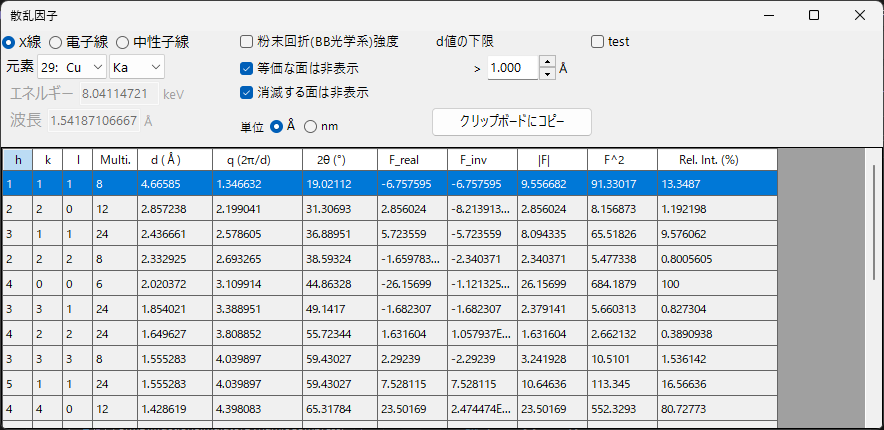
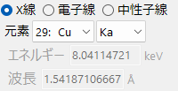

# 散乱因子 (Scattering Factor)

**Scattering Factor** は、選択中の結晶について許される結晶面（反射）の一覧を作成し、それぞれの **構造因子** と回折強度を計算します。放射線の種類（X線・電子線・中性子線）を切り替えられるので、同じ結晶の構造因子を回折手法ごとに比較できます。

ウィンドウ上部に計算条件、下部に反射の一覧表が並びます。条件を変更すると表は即座に再計算されます。

---

## 入射線の種類

- **X線 / 電子線 / 中性子線** : 原子散乱因子は入射線の種類によって異なるため、ここで切り替えます。
- **X線** の場合は **元素**（アノード材）と特性線（Kα など）を選ぶと、その特性X線の波長が自動的に設定されます。

---

## 波長コントロール

- **エネルギー（keV）** と **波長（Å）** は相互に連動します。
- 2θ（回折角）の計算にこのエネルギーや波長が使われます。X線では元素・線種の選択でも設定できます。

---

## 表示・計算オプション

- **粉末回折(BB光学系)強度** : 多重度・ローレンツ偏光因子を含む粉末回折（Bragg–Brentano 光学系）の強度として相対強度を計算します。オフのときは構造因子由来の強度を表示します。
- **等価な面は非表示** : 結晶学的に等価な面を 1 つにまとめて表示します。
- **消滅する面は非表示** : 消滅則で強度ゼロになる面を一覧から除外します。
- **単位（Å / nm）** : 面間隔などの長さの単位を切り替えます。
- **d値の下限** : これより小さい d（面間隔）の反射面を一覧から除外します。

---

## 反射一覧表

各行が 1 つの反射（または対称等価な面のグループ）に対応します。

| 列 | 意味 |
|------|------|
| **h, k, l** | ミラー指数 |
| **Multi.** | 多重度（対称等価な面の数） |
| **d (Å)** | 面間隔 |
| **q (2π/d)** | 散乱ベクトルの大きさ |
| **2θ (°)** | 選択した波長に対する回折角 |
| **F_real** | 構造因子の実部 |
| **F_inv** | 構造因子の虚部 |
| **\|F\|** | 構造因子の振幅（$= \sqrt{F_\text{real}^2 + F_\text{inv}^2}$） |
| **F^2** | 構造因子の強度（$\lvert F\rvert^2$） |
| **Rel. Int. (%)** | 最大反射を 100 とした相対強度 |

---

## クリップボードにコピー

**クリップボードにコピー** で、一覧表をExcelなどの表計算ソフトへ貼り付け可能なテキストとしてクリップボードにコピーします。

---

## 関連項目

- [結晶データベース](1-crystal-database.md) — 構造因子の計算対象となる結晶の定義。
- [回折シミュレータ](7-diffraction-simulator/index.md) — 構造因子を用いた回折図形のシミュレーション。
