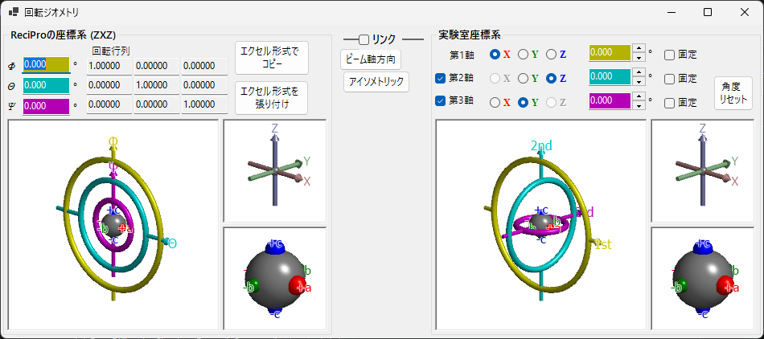

# 回転ジオメトリ (Rotation Geometry)

このウィンドウは、結晶の回転状態を3×3行列で表現し、異なるオイラー座標系間の変換を行います。

ReciProでは **Ψ**、**θ**、**Φ** の三つのオイラー角を **Z–X–Z** の順に適用して結晶の回転状態を表現します。ただし、この表現は実際のゴニオメーターの回転軸とは必ずしも一致しません。**回転ジオメトリ** ウィンドウでは、ReciProのオイラー角を任意の座標系に変換でき、実験室でのゴニオメーター調整をサポートします。

---

## キーボード・マウスショートカット

6つの3Dビュー（ReciPro／実験のゴニオ・軸・オブジェクトの各パネル）は**連動**しており、どれか1つを回転させると6つすべてが一緒に回転します。操作は ReciPro 標準の [OpenGL ビュー操作](21-shortcuts.md) です。

| ショートカット | 動作 |
|----------------|------|
| <kbd>F1</kbd> | このページのオンラインマニュアルを開く |
| ビューを左ドラッグ | モデルを回転（6ビューが連動） |
| ホイール、または右ドラッグ上下 | ズーム（大きいゴニオビュー） |
| 中ドラッグ | 平行移動（大きいゴニオビュー） |
| <kbd>CTRL</kbd> ＋ 右ドラッグ上下 | カメラ距離を変更（透視投影時のみ） |
| <kbd>CTRL</kbd> ＋ 右ダブルクリック | 正射投影／透視投影の切替 |

小さい *Axes*・*Objects* ビューはズーム・平行移動が無効です。<kbd>F1</kbd> 以外のキーボードショートカットはありません。

---

## ReciPro座標系 (ZXZ)

ウィンドウ上半分は「ReciProの座標系 (ZXZ)」で表現された回転状態を表示・設定する部分です。

- **Φ, θ, Ψ** の値はメインウィンドウのオイラー角と同期しています。
- **回転行列** には現在の回転状態に対応する3×3回転行列が表示されます。

### Φ, θ, Ψ (Z–X–Z オイラー角)

結晶方位は次の順序で適用される3つの回転として表現されます。

1. **Φ** — 最初に **Z** 軸まわりの回転
2. **θ** — 1回目の回転後の **X** 軸まわりの回転
3. **Ψ** — 2回目の回転後の **Z** 軸まわりの回転

数値ボックスはすべて編集可能です。ここでの変更はメインウィンドウおよびリンクされたシミュレータすべてに反映されます。

### 回転行列

現在の (Φ, θ, Ψ) から得られる 3 × 3 行列。**エクセル形式でコピー** / **エクセル形式を張り付け** で表計算ソフトとの間で行列をやり取りできます。

### OpenGLウィンドウ

3つのTorus（ドーナツ）で回転軸の状態を3次元的に描画します。

| 色 | オイラー角 | ゴニオメーターレベル |
|----|----------|-------------------|
| **黄** | Φ | 上位（1st）回転軸 |
| **水色** | θ | 中位（2nd）回転軸 |
| **ピンク** | Ψ | 下位（3rd）回転軸 |

**赤**・**緑**・**青**の矢印は実空間直交座標のX, Y, Z軸です。メインウィンドウに表示される結晶軸とは異なりますのでご注意ください。

中央の灰色の球はサンプルを表し、赤・緑・青の小球はΦ = θ = Ψ = 0のとき +X, +Y, +Z 方向に一致する目印です。

> **注意**: OpenGLウィンドウでのドラッグ操作はこのビューの投影方向のみを変更し、結晶自体は回転しません。結晶を回転するにはメインウィンドウを使用してください。

### ボタン

| ボタン | 動作 |
|--------|------|
| エクセル形式でコピー | 3×3回転行列をタブ区切りでクリップボードにコピー |
| エクセル形式を張り付け | クリップボードのタブ区切り3×3数値を回転行列として設定 |
| ビーム軸方向 | メインウィンドウと同じ投影方向（Z軸がスクリーン垂直） |
| アイソメトリック | アイソメトリック投影に切替 |

---

## 実験室座標系

ウィンドウ下半分は、任意の回転軸上でオイラー角を定義し、ゴニオメーターの回転状態を取得・設定する部分です。

### 第1軸・第2軸・第3軸

ゴニオメーターの回転軸を **±X**、**±Y**、**±Z** から選択します。選択に応じてグラフィックスも変化します。

各回転軸のオイラー角は対応する色のテキストボックス（黄、水色、ピンク）に表示され、直接値を入力することもできます。

---

## リンク (Link)

**リンク** をチェックすると、ReciPro座標系と実験座標系が連動します。オブジェクトの方位が両システムで一致するようにオイラー角が自動調整されます。

### 使用例

1. 実験室のゴニオメーターで、結晶の *a* 軸をX線入射方向に、*b* 軸を水平方向に合わせる。
2. 実験座標系にゴニオメーターのオイラー角を入力する。
3. メインウィンドウで結晶を回転し、*a* 軸をスクリーン法線方向、*b* 軸を水平方向に設定する。
4. **リンク** をチェック — 以降、メインウィンドウで結晶方位を変えると、必要なゴニオメーター角度が自動表示される。

---

## 関連項目

- [メインウィンドウ](0-main-window.md)
- [ステレオネット](6-stereonet.md)
- [基本座標系と結晶方位](appendix/a1-coordinate-system/1-orientation.md)
- [キーボード・マウスショートカット](21-shortcuts.md)
