# 結晶構造ビューア

**結晶構造ビューア (Structure Viewer)** は、選択した結晶の構造をOpenGLを使って3次元的に描画します。

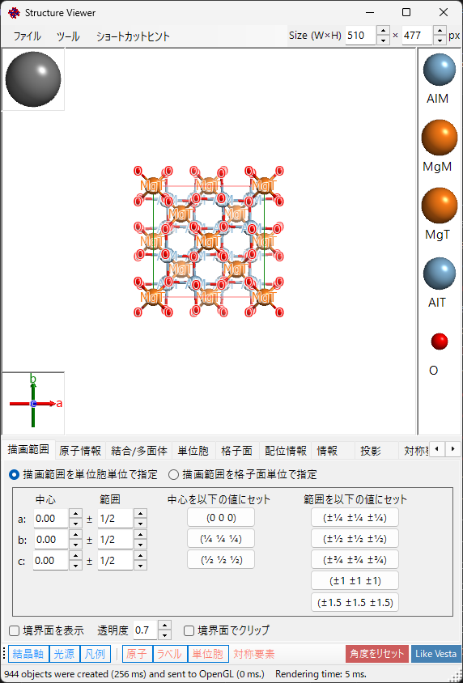

---

## キーボード・マウスショートカット

このウィンドウにはメインの3Dビューに加え、2つの小さなウィジェット（左下の **結晶軸** ボックスと左上の **光源** ボックス）があり、左ドラッグの動作がそれぞれ異なります。メインビューは ReciPro 標準の [OpenGL ビュー操作](21-shortcuts.md) です。

| ショートカット | 動作 |
|----------------|------|
| <kbd>F1</kbd> | このページのオンラインマニュアルを開く |
| <kbd>CTRL</kbd>+<kbd>SHIFT</kbd>+<kbd>C</kbd> | 描画画像をクリップボードにコピー |
| メインビューを左ドラッグ | モデルを回転 |
| 原子を左ダブルクリック | その原子の座標・最近接距離・結合角を表示 |
| 右ドラッグ上下、またはホイール | ズーム |
| 中ドラッグ | 平行移動 |
| <kbd>CTRL</kbd> ＋ 右ドラッグ上下 | カメラ距離を変更（透視投影時のみ） |
| <kbd>CTRL</kbd> ＋ 右ダブルクリック | 正射投影／透視投影の切替 |
| **結晶軸** ウィジェットを左ドラッグ | モデルを回転（面内回転なし） |
| **光源** ウィジェットを左ドラッグ | 照明方向を変更 |

メインウィンドウのアプリ全体ショートカット（<kbd>CTRL</kbd>+<kbd>SHIFT</kbd> 系）は、このウィンドウにフォーカスがある間も動作します（[メインウィンドウ](0-main-window.md) 参照）。

→ 全ウィンドウの一覧は **[21. キーボード・マウスショートカット](21-shortcuts.md)** を参照。

---

## メインエリア

画面上部に結晶構造が描画されます。左上に光源の方向、左下に結晶軸の方向、右側に原子の凡例が表示されます。
> ウィンドウ右上の **Size (W×H)** ボックスで、画像の保存・コピー時のピクセルサイズを指定します。
> その隣の **ProjWidth** ボックスは投影ビューの横幅 (nm) を表示します。値を編集して数値でズームすることもでき、ビュー上の右ドラッグ/ホイールによるズームと連動します。

---

## メニューバー

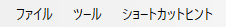

### ファイルメニュー

| メニュー項目 | 説明 |
|-------------|------|
| 画像を保存 | 描画画像をファイルに保存 |
| 画像をクリップボードにコピー | 画像をコピー（Ctrl+Shift+C でも可） |
| 動画を保存 | 回転・平行移動の動画を MP4 で保存（速度・時間・fps・品質などを設定） |
| ショートカットヒント | キーボードショートカットを表示 |

**動画を保存** を選ぶと、下記の「Movie setting」ダイアログが開きます。動画では視点の回転と投影中心の平行移動を、単独または同時に指定できます（**Rotation** / **Translation** チェックボックス）。

- **Rotation**: 下で選んだ回転軸 — **現在の投影**（矢印ボタンで傾斜方向を指定）/ **方向指数** [uvw] / **格子面** (hkl) の法線 — のまわりに、**Speed**（°/s、負の値で逆回転）で視点を回転します。
- **Translation**: 投影中心を方向指数 [uvw] に沿って **Speed**（格子周期/秒）で平行移動します。この項目は Structure Viewer から開いたときのみ表示され、ON の間は方向指定は **方向指数** のみになります。

動画の長さ（**Duration**）・フレームレート（**FPS**、1–120）・エンコード品質（**Quality**、1–100。大きいほど高ビットレートで大きなファイル）を設定し、コーデック（**H264** / **H265**）を選んで **OK** で MP4 ファイルを生成します。**Include final frame** をオンにすると、t = Duration の最終姿勢・位置のフレームを末尾に 1 枚追加します。（エンコード速度のリストは進捗表示のラベルにのみ使われ、現在はエンコードに影響しません。）

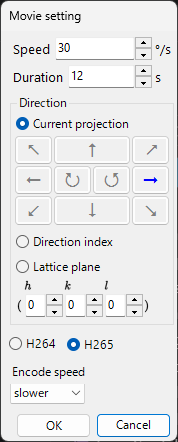

### ツールメニュー

---

## タブメニュー

### 描画範囲を単位胞単位で指定

結晶の描画範囲を指定します。2つのモードがあります。上部のラジオボタンで切替えます。

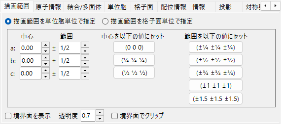

単位胞の *a*, *b*, *c* 軸を単位として描画範囲を指定します。

- **中心 (Center)**: 描画ボリュームの中心の分率座標
- **範囲 (Range)**: 各軸の上限/下限
- 右側の**プリセットボタン**で頻用値 (1×1×1, 2×2×2 など) を選択可能

### 描画範囲を結晶面で指定

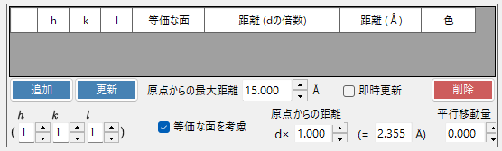

結晶面の集合で描画領域を定義します。指定した面が空間的に閉じた領域を作らない場合、ReciPro は自動的に 1 単位胞の境界にフォールバックします。

#### 境界面リスト

現在の結晶に登録された境界面のリストです。**追加 / 置換 / 削除** ボタンで操作。左端のチェックボックスで一時的に無効化できます。

> 変更を永続保存するには、メインウィンドウの**リストへ追加**または**選択結晶と入れ替え**も併せて押してください。さもなくば、メインウィンドウで結晶を選び直した時点で変更は失われます。

#### \((hkl)\)指数

境界面をミラー指数で指定します。チェックボックスで結晶学的等価面 (h k l) を一括で含めることができます。

#### 原点からの距離

結晶中心から境界面までの距離。単位は **d** または **Å** から選択。**d** の場合は入力値 × (h k l) の *d* 値、**Å** の場合は絶対値です。一方を変更すると他方が連動して更新されます。

#### 境界面を表示 / 不透明度

境界面そのものの表示/非表示。表示時は**不透明度 (Opacity)** で透過率を設定 (0=透過、1=不透過)。

#### 境界面で物体をクリップ

チェック時は境界面の内側のみを描画。境界と交差する原子・結合・多面体はクリップされます。

#### 原子を非表示

チェック時はすべての原子・結合・多面体を非表示にします。格子面や単位胞だけを表示したいときに使います。

### 原子情報

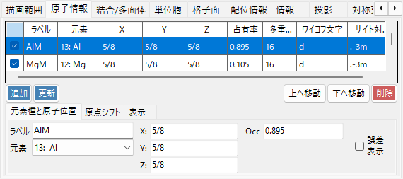

原子の座標と外観を設定します。

#### 原子リスト

結晶に含まれる原子の一覧。**追加 / 置換 / 削除** で操作し、左端チェックボックスで一時的に非表示にできます。

> **重要**: 変更を永続保存するには、メインウィンドウの**リストへ追加**または**選択結晶と入れ替え**を押してください。

#### 元素と位置

- **ラベル (Label)**: 自由記入のラベル (凡例・ツールチップに使用)
- **元素 (Element)**: 元素種・イオン状態
- **X, Y, Z**: 分率座標。0〜1 の実数または `1/2`・`2/3` のような分数表記
- **Occ**: 占有率 (0〜1 の実数)

#### 原点シフト

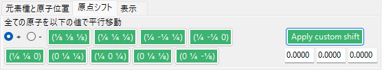

全原子を同じ分率オフセットだけシフトします。プリセットボタン (例: 同一空間群の原点 1/原点 2 切替) を押すか、(Δx, Δy, Δz) を入力して**カスタムシフトを適用**を押します。

#### 表示

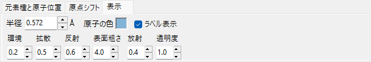

原子ごとの半径・色・マテリアル設定。

- **半径 (Radius)**: 描画時の原子半径
- **原子色 (Atom color)**: 表面色
- **マテリアル (Material)**: OpenGL シェーダで使われるテクスチャ・マテリアル特性
- **同じ元素に適用**: 現在の半径と色を、同じ元素種のすべての原子に一括反映

### 結合/多面体

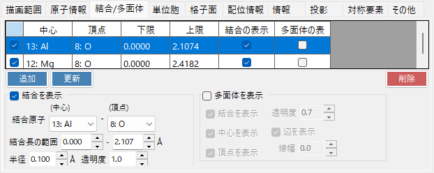

結合と配位多面体を定義します。

#### 結合リスト

結晶に登録された結合・多面体ルールの一覧。**追加 / 置換 / 削除** で操作、左端チェックボックスで一時的に無効化。原子情報や描画範囲と同様、メインウィンドウの**リストへ追加 / 選択結晶と入れ替え**で永続保存します。

#### 結合プロパティ

- **結合原子 (中心)**: 結合・多面体の中心となる元素種
- **結合原子 (頂点)**: 結合の頂点 (反対端) となる元素種
- **結合長範囲 (Length between ... and ...)**: 描画対象とする結合長の下限・上限。範囲外の原子対は描画されません
- **結合半径 (Bond Radius)**: 描画される結合の太さ (円筒半径)
- **Alpha**: 結合の透過率 (0=透過、1=不透過)

#### 多面体プロパティ

- **多面体を表示**: チェック時、結合で定義された配位多面体を描画 (中心/頂点の組合せが幾何学的に有効な場合のみ)
- **内側の結合 (Inner Bonds)**: 多面体内部の結合の表示/非表示
- **中心原子 (Center Atom)**: 多面体の中心原子の表示/非表示
- **頂点原子 (Vertex Atoms)**: 頂点原子の表示/非表示
- **色 (Color) / Alpha**: 面の色と透過率
- **辺を表示 (Show Edges)**: 多面体の頂点を結ぶ辺を描画
- **辺の色 / 線幅 (Width)**: 辺の色と線幅

### 単位胞

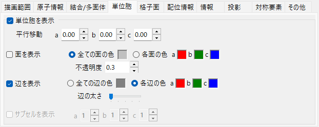

単位胞の描画設定です。

#### 平行移動

空間群にはそれぞれデフォルト原点があります。描画する単位胞の中心をデフォルト原点からずらしたいとき、*a*, *b*, *c* 各軸方向の移動量を入力します。

#### 面を表示

単位胞を構成する 6 つの面を描画するかどうか。表示する場合は面の色と透過率を設定できます。

#### 辺を表示

単位胞の辺を描画するかどうか。辺の色を設定できます。

### 格子面

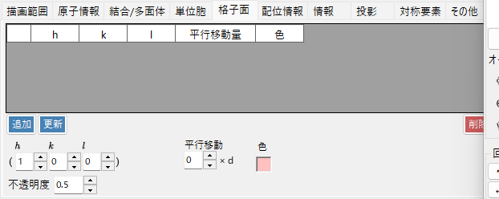

ミラー指数で指定した格子面を描画します。

#### \((hkl)\)指数

格子面をミラー指数で指定します。チェックボックスで結晶学的等価面を一括で含めることができます。

#### 平行移動

格子面を *d* 値の整数倍だけ平行移動して描画します。同じ族の連続した面を可視化するときに有用です。

### 配位情報

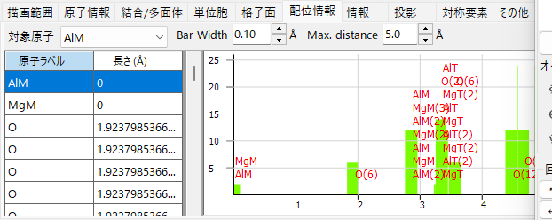

原子の配位情報を表示します。

#### テーブル (左側)

ターゲット原子の周囲にどのような原子がどの距離に存在するかを一覧表示します。ターゲット原子はテーブル上のドロップダウンで選択。

#### グラフ (右側)

左の表のデータをヒストグラム化したものです。**バー幅**を調整して配位殻が分離する厚みを見つけることで、配位数を視覚的に推定できます。

### 情報

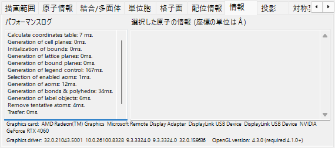

描画ログ (フレーム時間、GPU 情報) と選択原子の基本情報を表示します。実装拡張中。

### 投影

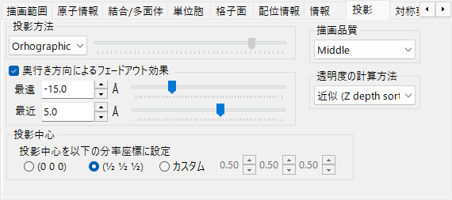

正射投影または透視投影、奥行きフェードアウト、描画品質、透明度モードの設定。

#### 投影方法

- **正射 (Orthographic)**: 完全な平行投影 (視点が無限遠)
- **透視 (Perspective)**: 視点距離をスライダで指定する透視投影

#### 奥行きフェードアウト

奥行き方向に遠い物体を徐々に透明化します。**Far** より遠い物体は完全透明、**Near** より近い物体は完全不透明、その間は線形補間。

#### 投影中心

投影中心を、指定した座標に設定します。カスタムをオンにすると、自由な座標を入力することができます。各座標は −0.5〜+0.5（1 格子周期）の範囲に折り畳まれます。動画の **Translation**（[ファイルメニュー](#ファイルメニュー)）を使うと、この値が自動的に駆動されます。

#### 描画品質

メッシュ分割数とアンチエイリアスの品質設定。品質を上げると描画が遅くなるため、GPU 性能に合わせて選びます。

#### 透明度モード

半透明の原子・多面体の重なりを計算するアルゴリズム。

- **Approximate**: 高速だが、半透明物体が多数重なる場合は不正確になりうる
- **Perfect**: 順序非依存透明度 (OIT) で正確だが非常に低速。実質的に外付け GPU が必要

### 対称要素

**対称要素**タブは、空間群の対称操作を3Dモデル上に直接描画します（ツールバーの **対称要素** ボタンで表示/非表示を切替）。要素の種類ごとに個別に表示できます。

- **回転軸** と **らせん軸**
- **鏡映面** と **映進面**
- **対称心** と **回反軸**

各種類について、記号サイズ・線幅・色を調整できます。

### その他

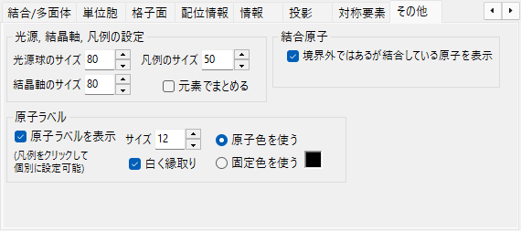

- **光源, 結晶軸, 凡例の設定**: 表示サイズを設定します。「元素でまとめる」で凡例表示を切り替えることができます。
- **結合原子**: 「境界外の結合原子も表示」で、描画範囲の外にあっても、範囲内の原子と結合している原子を表示します。
- **原子ラベル**: 原子ラベルのフォントサイズや色などを指定します。

---

## ツールバー

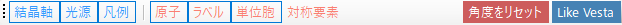

| ボタン | 説明 |
|--------|------|
| 結晶軸 | 結晶軸の方向を表示（サイズは格子定数を反映） |
| 光源 | ドラッグで光源方向を変更 |
| 凡例 | 原子の凡例を表示（ラベルまたは元素名） |
| 原子 | 原子オブジェクト表示切替 |
| ラベル | 原子ラベルの表示切替 |
| 単位胞 | 単位胞の辺の表示切替 |
| 対称要素 | 対称要素オーバーレイの表示切替（上記参照） |
| 角度をリセット | 初期方位に戻す |
| Like Vesta | Vestaソフトウェア風の原子色・サイズ・結合設定に変更 |

---

## 関連項目

- [メインウィンドウ](0-main-window.md)
- [結晶データベース](1-crystal-database.md)
- [対称性情報](2-symmetry-information.md)
- [回折シミュレータ](7-diffraction-simulator/index.md)
- [キーボード・マウスショートカット](21-shortcuts.md)
