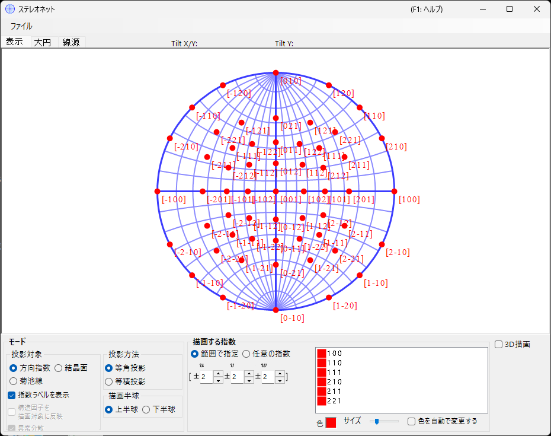
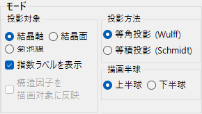
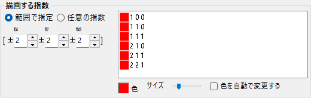
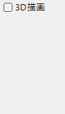
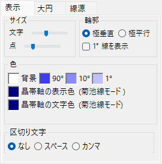
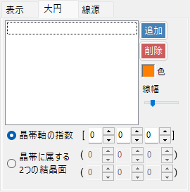
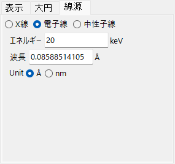

# ステレオネット (Stereonet)

**ステレオネット** は、結晶面や晶帯軸の方向をステレオネット投影で表示します。

---

## キーボード・マウスショートカット

ステレオネット本体は2D投影です。**3D表示** をオンにすると3D球も表示できます。

| ショートカット | 動作 |
|----------------|------|
| <kbd>F1</kbd> | このページのオンラインマニュアルを開く |
| 中心付近を左ドラッグ | 結晶を傾ける |
| 外周を左ドラッグ | 視線軸まわりに結晶を回す |
| 左ダブルクリック | **面** / **軸** 投影の切替 |
| 右クリック | ズームアウト |
| 右ドラッグで矩形選択 | 選択範囲にズームイン |
| 中ドラッグ | 平行移動 |
| マウス移動（ボタンなし） | カーソル位置の (hkl)/[uvw] を表示（測定スポットの指数付けに便利） |

ネット上のドラッグによって**結晶**を回転することができます。回転状態は全てのウィンドウで共有されます。

3D描画では ReciPro 標準の [OpenGL ビュー操作](21-shortcuts.md)（左ドラッグ回転・右ドラッグ/ホイールズーム・<kbd>CTRL</kbd> ＋右ダブルクリックで投影切替）で、3Dビューのみを回転します。結晶自体は回転しません。

メインウィンドウのアプリ全体ショートカット（<kbd>CTRL</kbd>+<kbd>SHIFT</kbd> 系）は、このウィンドウにフォーカスがある間も動作します（[メインウィンドウ](0-main-window.md) 参照）。

→ 全ウィンドウの一覧は **[21. キーボード・マウスショートカット](21-shortcuts.md)** を参照。

---

## メインエリア

選択した結晶の結晶面・方向指数・菊池線のステレオネット投影が表示されます。

---

## ファイルメニュー

表示中のステレオネットを保存またはコピーします。**ラスタ形式**または**ベクタ形式**で出力可能です。ベクタ形式でPowerPointに貼り付ければ、テキストのフォントや線の太さを自由に変更できます。

---

## モード {#mode}

### 投影対象

ステレオネットへ投影する対象を選択します。

- **方向指数** — 方向指数 \([uvw]\) を投影
- **結晶面** — 結晶面法線 \((hkl)\) を投影
- **菊池線** — 菊池線ペアを投影

### 投影法

| 投影法 | 説明 |
|--------|------|
| **等角投影 (Wulff / Stereographic)** | 角度関係を保存するが、立体角（面積）は保存しない。投影対象間の角度を読み取りたいときに使用。 |
| **等積投影 (Schmidt / Lambert)** | 立体角（面積）を保存するが、角度関係は保存しない。極点密度のような統計表示に適する。 |

### 描画半球

**上半球**または**下半球**を選択します。観測者から見える球面の側を切り替えます。

### 表示オプション

- 指数ラベルの表示
- **結晶面**あるいは**菊池線**選択時、各点あるいは各線を構造因子 \(|F_{hkl}|\) で重み付け表示します。線源・波長は線源タブで設定してください。

> 三方晶・六方晶系では、メインウィンドウの **オプション ▸ Use Miller-Bravais (hkil) index** でミラー・ブラベー（4指数）表記に切り替えられます。

---

## 描画する指数 (Indices)

描画する結晶面/晶帯軸を設定します。

### 範囲モード

\([uvw]\) または\((hkl)\) 指数の範囲を指定。範囲内の全指数を列挙して投影します。

### 指定モード

特定の軸や面を個別に指定します。指数を入力後 **追加** で描画リストに追加、**削除** で除去。**等価な指数を含める** をチェックすると、結晶学的に等価なすべての指数も含めて描画されます。

### 色/サイズ

投影点の**色** および**サイズ**を設定します。**色を自動で変更する** をチェックすると、等価な軸・面の組ごとに自動で色分けされます。複数の指数ファミリを同時表示する際の判別に有用です。

---

## 3Dオプション

3D ネット (球) オーバーレイの設定 — 球の透過率や結晶軸インジケータなど。

---

## タブメニュー

### 表示

#### 輪郭

ステレオネットの外枠 (境界円および大円グリッド) の描画方法。**極垂直** / **極平行** の選択、**1° 線を表示** と **背景** の切替、**90° / 10° / 1°** グリッド色、**線幅** をトラックバーで設定します。

#### 指数ラベル

- **サイズ** — 指数ラベルのサイズ
- **指定色** — 投影点の色とは独立に、すべての指数ラベルを指定色で表示。描画点を色分けしつつラベルは単色で統一したいときに使用してください。
- **区切り文字** — 各ラベルの指数の間に置く文字: **なし** (例 100) / **スペース** (1 0 0) / **カンマ** (1,0,0)

#### 晶帯軸 (菊池線モード)

- **点サイズ** — 投影点のサイズ
- **点** / **ラベル** — 点とラベルの色

### 大円・小円

大円や小円を描画します。**晶帯軸の指数** \([uvw]\) (その軸を含む晶帯の作る大円) または **晶帯に属する2つの結晶面の指数** で指定します。円の**線幅**もトラックバーで設定可能です。

### 線源 {#wave}

投影対象として**結晶面**あるいは**菊池線**を選択している場合のみ有効です。[モード](#mode)の**構造因子による重み付け**で用いる結晶構造因子の計算に必要な、線源 (X線 / 電子線 / 中性子線) と波長 (またはエネルギー) を設定します。
