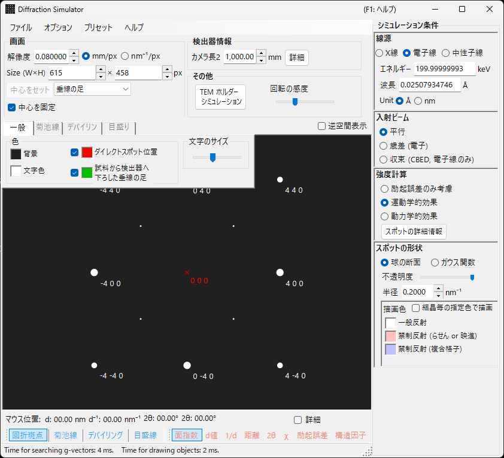

# 制限視野電子回折 (SAED) シミュレーション

**SAED (Selected Area Electron Diffraction)** シミュレーションは、平行な電子ビームによる単結晶電子回折パターンを計算します。[回折シミュレータ](index.md) の基本モードです。

> このページは、**波長 = 電子線 ・ 入射ビーム = 平行** を選んだときに右側の **スポット特性** に現れる設定項目をすべて掲載します。描画・保存などウィンドウ共通の操作は [まとめページ](index.md) を参照してください。

GUI条件: 波長 = 電子線 ・ 入射ビーム = 平行 ・ 強度計算 = 励起誤差のみ / 運動学的 / 動力学的。

---

## 概要

平行な電子ビームが薄い試料に入射したときの回折パターンをシミュレーションします。エワルド球と逆格子点の幾何学的関係に基づいて回折スポットの位置が決まり、強度計算モードに応じて各スポットの明るさが計算されます。

---

## 波長の設定

線源を **電子線** にします。エネルギー (keV) または波長 (nm) を入力すると、相対論的補正付きの波長が計算されます。X線・中性子線については [X線回折シミュレーション](4-x-ray-neutron-diffraction.md) を参照してください。

---

## 入射ビーム

入射ビームのジオメトリを **平行** にします。SAED や X線回折で用いる標準的な平面波ジオメトリです。

> **注記**: 電子線では **平行 / 歳差 (電子=PED) / 収束 (CBED)** が選べます。**歳差** を選ぶと [PEDシミュレーション](2-ped-simulation.md)、**収束** を選ぶと [CBEDシミュレーション](3-cbed-simulation.md) になり、いずれも強度計算が自動的に動力学的へ切り替わります。

---

## 強度計算

スポット強度の計算方法を選択します。

### 励起誤差のみ

エワルド球と逆格子点の幾何学的距離（励起誤差 $s_g$）だけから強度を決定します。$\lvert s_g \rvert$ が小さいほど強度が大きく、**Radius** で設定した値で最大となり、$\lvert s_g \rvert$ が Radius を超えると 0 になります。結晶構造因子は無視されるため、最も高速で、回折スポットの位置確認に適します。

### 運動学的

励起誤差に加えて運動学的構造因子 $\lvert F_{hkl} \rvert^2$ を強度に反映します。消滅則が正しく反映され、薄い試料や弱い回折に適します。

### 動力学的（ブロッホ波法・電子線のみ）

ブロッホ波法（ベーテ法）による厳密な動力学計算です。多重散乱と試料厚さ依存の強度変化を再現し、厚い試料や強い回折に必要です。電子線選択時のみ有効です。理論は [Appendix A3. ブロッホ波法](../appendix/a3-bloch-wave/calculation.md) を参照してください。

> **注記**: **動力学的** を選ぶと、下に **ブロッホ波設定** パネルが現れます。

---

## ブロッホ波設定（動力学理論）

**強度計算 = 動力学的** のときだけ有効です。

| パラメータ | 説明 |
|-----------|------|
| **回折波の数** | 固有値問題に含めるブロッホ波の本数。大きくするほど強度は正確になりますが、計算時間が $O(N^3)$ で増加します |
| **試料厚み** | 動力学計算で用いる試料の厚さ (nm) |

---

## スポットの外観

各回折スポットの描画方法を制御します。

- **Solid sphere / Gaussian** : 逆格子点の幾何モデル。**Solid sphere** は半径 $R$ の球とエワルド球の断面（円）を描画し円の面積が回折強度に対応、**Gaussian** は $\sigma = R$ の3Dガウス関数の断面（2Dガウス）を描画し積分が回折強度に対応します。
- **不透明度 (Opacity)** : スポットの透過率（0=透過、1=不透過）。
- **Radius (R)** : 逆格子点の仮想半径。**外観**モードと**強度計算**の組み合わせでスポットサイズが決まります（例: Solid sphere + 動力学的では半径が $I_\text{dyn}^{1/2}$ に比例）。
- **Brightness** : **Gaussian** モードでのみ有効。描画ガウスの積分強度。
- **カラースケール** : **Gray scale** または **Cold-warm**。
- **Log スケール** : 強度を対数表示。強度差の大きいパターンで有用です。
- **スポットの色** : カラースケールを使わないときのスポット色。
- **結晶の色を使う** : チェックすると結晶ごとに割り当てた色でスポットを描きます。

---

## スポットのラベル

スポットに重畳するラベルは [ツールバー](index.md#ツールバー) から選びます。

| ラベル | 表示内容 |
|--------|---------|
| **面指数** | ミラー指数 $(hkl)$ |
| **d値** | 面間隔 $d$ |
| **距離** | 検出器上のスポット間距離 |
| **励起誤差** | 励起誤差 $s_g$ |
| **構造因子** | 構造因子の絶対値 $\lvert F_{hkl} \rvert$ |

---

## 共通操作

検出器情報・反転・逆空間表示・菊池線・デバイリング・目盛り線・色設定・保存などは全モード共通です。[まとめページ](index.md) を参照してください。動力学計算で得た各反射の詳細は [回折スポット情報](index.md#回折スポット情報) で一覧できます。

---

## 関連項目

- [回折シミュレータ（まとめ）](index.md)
- [平行ビーム SAED の計算](../appendix/a3-bloch-wave/calculation.md#parallel-beam-saed)
- [X線回折シミュレーション](4-x-ray-neutron-diffraction.md)
- [歳差電子回折 (PED) シミュレーション](2-ped-simulation.md)
- [座標系の定義](../appendix/a1-coordinate-system/1-orientation.md)
