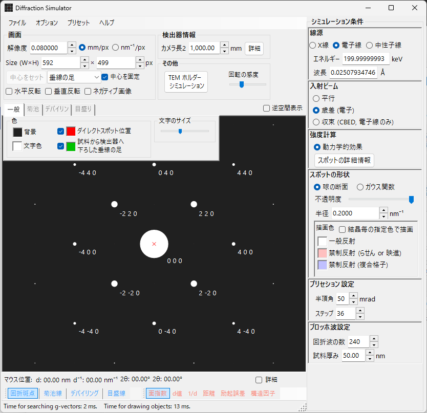
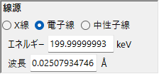
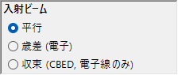
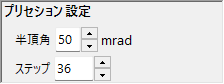
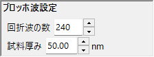
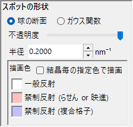

# 歳差電子回折 (PED) シミュレーション

**PED (Precession Electron Diffraction)** シミュレーションは、入射ビームを光軸まわりに円錐状に歳差運動させた電子回折パターンを計算します。

> このページは、**波長 = 電子線 ・ 入射ビーム = 歳差(電子) ・ 強度計算 = 動力学的（自動）** を選んだときに右側に現れる設定項目をすべて掲載します。**入射ビームを歳差(電子)にすると強度計算は自動的に動力学的へ切り替わる**点に注意してください。描画・保存などウィンドウ共通の操作は [まとめページ](index.md) を参照してください。

GUI条件: **波長 = 電子線 ・ 入射ビーム = 歳差(電子) ・ 強度計算 = 動力学的（自動）**

---

## 概要

PEDでは、電子ビームを光軸を中心に円錐状に歳差運動させ、歳差コーン上の各ビーム方向で得られた回折パターンを積算します。通常のSAEDに比べて次の利点があります。

- 動力学効果が平均化され、運動学的（Kinematical）強度比に近い強度データが得られる
- 高次のラウエ帯 (HOLZ) 反射がより明瞭に観測される
- 構造解析に適した強度データが得られる

---

## 波長の設定

PEDは電子回折なので、線源は **電子線** を選びます。電子線のエネルギー (keV) または波長 (nm) を入力すると、相対論的補正付きの波長が計算されます。

---

## 入射ビーム

入射ビームのジオメトリで **歳差 (電子)** を選びます（電子線選択時のみ有効）。

> **注記** : **歳差 (電子)** を選ぶと、**強度計算は自動的に動力学的（Dynamical）へ切り替わり**、ブロッホ波設定パネルとプリセッション設定パネルが現れます。**励起誤差のみ** / **運動学的** は選べなくなります。

---

## プリセッション設定

歳差コーンの形状とサンプリングを設定します。

| パラメータ | 説明 | 推奨値 |
|-----------|------|-------|
| **半頂角** | 歳差コーンの半角 (mrad) | 10–40 mrad |
| **ステップ** | 歳差コーン上でサンプリングする平行ビーム方向の数。多いほど積分が滑らかになりますが、計算時間は線形に増加します | 36–72 |

---

## 強度計算とブロッホ波設定

**歳差 (電子)** を選んだ時点で **強度計算 = 動力学的（自動）** に固定されます。各歳差方向の平行ビームに対してブロッホ波法（Dynamical 計算）で回折強度を求め、すべての方向にわたって積算したものがPEDパターンになります。

| パラメータ | 説明 | 推奨値 |
|-----------|------|-------|
| **回折波の数** | 固有値問題に含めるブロッホ波の本数。大きいほど強度は正確になりますが、計算時間は $O(N^3)$ で増加します | 50–200 |
| **試料厚み** | 動力学計算で用いる試料厚さ (nm) | — |

計算コストは概ね「ステップ数 × 1方向あたりのブロッホ波計算」で決まります。動力学計算の詳細は [動力学計算（Bloch波法）](../appendix/a2-bloch-wave/calculation.md) を参照してください。

---

## スポットの外観

各回折スポットの描画方法を制御します。

- **Solid sphere / Gaussian** : 逆格子点の幾何モデル。**Solid sphere** は半径 $R$ の球とエワルド球の断面を描き、**Gaussian** は $\sigma = R$ の3Dガウスとエワルド球の断面（2Dガウス）を描きます。
- **不透明度 (Opacity)** : スポットの透過率（0=透過、1=不透過）。
- **Radius (R)** : 逆格子点の半径。動力学的強度では、Gaussian は積分 $=$ Brightness $\times I_\text{dyn}$、Solid sphere は半径 $R \times I_\text{dyn}^{1/2}$（面積が動力学的強度に比例）。
- **Brightness** : **Gaussian** モードでのみ有効。描画ガウスの積分強度。
- **カラースケール** : **Gray scale** または **Cold-warm** カラーマップ。
- **Log スケール** : 強度を対数表示。
- **スポットの色** : カラースケールが適用されない場合のスポット色。
- **結晶の色を使う** : 結晶ごとに設定した色でスポットを描画します。

---

## SAEDとの比較

| 特徴 | SAED | PED |
|------|------|-----|
| ビーム | 平行・固定 | 歳差運動（円錐走査） |
| 動力学効果 | 大きい | 平均化されて小さい |
| HOLZ反射 | 弱い | 強く出現 |
| 強度の信頼性 | 構造解析には不十分なことがある | 構造解析に適する |
| 計算時間 | 短い | 長い |

---

## 関連項目

- [回折シミュレータ（まとめ）](index.md)
- [X線回折シミュレーション](4-x-ray-neutron-diffraction.md)
- [SAED シミュレーション](1-saed-simulation.md)
- [動力学計算（Bloch波法）](../appendix/a2-bloch-wave/calculation.md)
