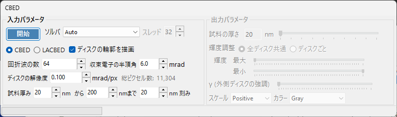
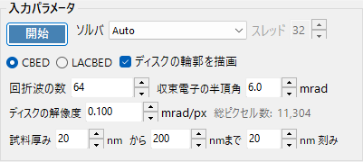
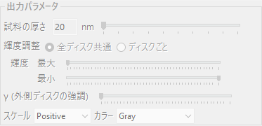

# CBED シミュレーション

**CBED（収束電子回折）シミュレーション**は、ブロッホ波（Bethe）法で収束ビーム回折パターンを計算・表示します。CBEDパターンはスポットの代わりに回折ディスクを示し、結晶の対称性・厚さ・構造に関する豊富な情報を含みます。

> このページは、[回折シミュレータ](index.md) で **波長 = 電子線**・**入射ビーム = 収束 (CBED, 電子線のみ)** を選んだときに開く専用ウィンドウの設定項目をすべて掲載します。入射ビームを収束にすると **強度計算** が自動的に **動力学的効果** へ切り替わり、この CBED 設定ウィンドウが開きます。回折パターンの描画・保存など回折シミュレータ共通の操作は [まとめページ](index.md) を参照してください。

---

## 入力パラメータ

| パラメータ | 説明 | 既定値 / 典型値 |
|-----------|------|-----------------|
| **モード** | **CBED**: 各ディスクが一つの反射に対応し、透過ディスク (000) が中心にある標準的な収束ビームパターン。 **LACBED**（大角度CBED）: 大角度収束ビームパターンで、異なる反射のディスクが重なり合う。高次ラウエゾーン (HOLZ) 線や対称性の観察に有用 | CBED |
| **収束電子の半頂角 (mrad)** | 収束ビーム円錐の半頂角。各回折ディスクのサイズを決めます（逆空間でのディスク直径は $2\alpha$ に対応） | 5–30 mrad |
| **ディスクの解像度 (mrad/px)** | 各ディスク内の角度分解能。小さいほど高解像度ですが、計算するビーム方向（ピクセル）数は二乗で増えるため計算時間も二乗で増加します。換算後の総ピクセル数（= 総ビーム方向数）が右に表示されます | — |
| **回折波の数** | 各入射ビーム方向でのブロッホ波計算に含めるビームの最大数。大きいほど精度が上がりますが固有値問題のコストは $O(N^3)$ で増加します | 100–500 |
| **厚さ範囲** | 試料厚さ (nm) の開始値・終了値・ステップ値。複数厚さをまとめて計算し、出力側の厚さスライダーで切り替えます | — |
| **ソルバー** | 固有値問題の計算エンジン。 **Auto**: 最適なソルバーを自動選択。 **Eigenproblem (MKL)**: Intel MKL ベース（最速）。 **Eigenproblem (Eigen)**: Eigen C++ ライブラリ。 **Managed**: 純粋な .NET マネージド（最も遅いが常に利用可能） | Auto |
| **スレッド数** | 計算の並列スレッド数 | — |
| **ディスクの輪郭を描画** | チェックすると各回折ディスクの境界を示す円を描画します | — |

---

## 実行 / 停止

- **開始** : 現在の入力パラメータで CBED シミュレーションを開始します。
- **中止** : 実行中の計算をキャンセルします。

---

## 出力パラメータ

計算が完了すると出力パラメータが操作可能になります。いずれも計算をやり直さずに表示だけを切り替えます。

| パラメータ | 説明 |
|-----------|------|
| **試料の厚さ** | 表示する試料厚さを、入力パラメータの厚さ範囲内でスライダーで選択します |
| **輝度調整** | **全ディスク共通**: すべてのディスクで共通の輝度スケールを使い、完全なCBEDパターンを表示。 **ディスクごと**: 選択した単一のディスクを、そのディスク内で正規化してフル解像度で表示 |
| **輝度 (最大 / 最小)** | 表示する強度の上限・下限。弱い特徴を強調したいときに調整します |
| **γ (外側ディスクの強調)** | ガンマ補正。中心の透過ディスクに比べて暗い外側の高角ディスクを見やすくするのに使います |
| **スケール** | 強度の階調を **Positive** / **Negative**（白黒反転）から選択します |
| **カラー** | 表示に使うカラーマップ。**Gray** などから選択します |

---

## 物理的背景

CBED では、入射ビームを異なる方向の平面波の円錐とみなし、各方向（収束絞り内の各点 = 部分入射平面波）についてブロッホ波法で結晶内の電子シュレーディンガー方程式を解き、結果を回折ディスクとして並べ直します。HOLZ（高次ラウエゾーン）線は、上位ラウエゾーンの反射から生じるディスク内の細い暗／明線として現れ、$c$ 軸方向の格子定数に敏感で 3 次元構造解析に有用です。

理論の詳細は [CBED の計算](../appendix/a2-bloch-wave/cbed.md) を参照してください。

---

## 関連項目

- [回折シミュレータ（まとめ）](index.md)
- [SAEDシミュレーション](1-saed-simulation.md)
- [PEDシミュレーション](2-ped-simulation.md)
- [CBED の計算](../appendix/a2-bloch-wave/cbed.md)
