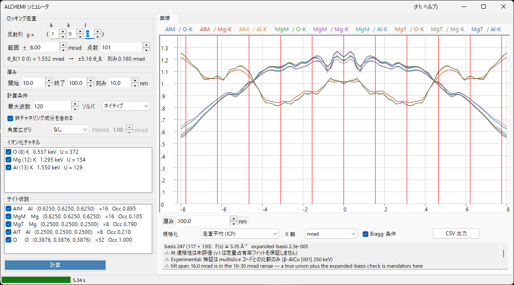

# ALCHEMI シミュレーション

**ALCHEMI (Atom Location by CHannelling-Enhanced MIcroanalysis)** は、系統反射列に沿って結晶を傾けながら特性X線の収量を測り、その方位依存性から**ドーパントがどのサイトを占めているか**を決める手法です。ReciPro の ALCHEMI シミュレータは、結晶構造とサイト仮説から**ロッキングカーブ (方位に対するイオン化収量) を前方計算**します。

> **Preview 機能です。** v1 は **1 次元の前方計算のみ**で、実験データへのフィットと 2D マップ (2D-HARECXS) は未実装です (右ペインの該当タブは非表示にしてあります)。**著者らの知る限り、一般に公開されている ALCHEMI フォワードシミュレータは他にありません。**照合できる実装が無いぶん、[適用範囲と既知の限界](#適用範囲と既知の限界)を読んでから定量に使ってください。

起動: [回折シミュレータ](index.md) の **オプション** メニュー → **ALCHEMI シミュレータ...**

GUI 条件: 波長 = 電子線 (結晶・加速電圧・方位は親の回折シミュレータから受け取ります)



ウィンドウは**左が設定** (走査・厚み・計算条件・イオン化チャネル・サイト仮説)、**右が結果** (曲線タブ) です。

---

## 何を計算しているか

各入射方位についてブロッホ波法で結晶内の波動場を解き、サイト $s$ とイオン化チャネル $c$ の組ごとに、厚み $t$ までのイオン化収量を解析的に積分します。

$$
Y_\text{dyn} = \mathrm{Re} \sum_{jj'} \alpha_j^{*}\,\bigl(C^{\dagger} \mu_{s,c} C\bigr)_{jj'}\, \alpha_{j'}\, F_{jj'}(t),
\qquad F_{jj'}(t) = \frac{e^{\lambda t} - 1}{\lambda}
$$

イオン化行列 $\mu$ は 2 つの反射の差 $G = \mathbf{g}_h - \mathbf{g}_g$ だけで決まります。

$$
\mu_{hg} = \sum_a \mathrm{Occ}_a\, e^{-M_a(G)}\, \sigma_c\, F_c(|G|/2)\, e^{-2\pi i\,G \cdot \mathbf{r}_a}
$$

- $\sigma_c$ : イオン化全断面積。**Bote–Salvat** モデル
- $F_c(s)$ : 規格化イオン化形状因子。自前の **DHFS** 生成テーブル ([ビーム相互作用](../3-beam-interaction.md) や [STEM-EDX](../9-hrtem-stem-simulator/2-stem-simulation.md) と共通の基盤)
- $e^{-M_a(G)}$ : デバイ・ワラー因子 (非等方 ADP に対応)

これは ICSC (Oxley & Allen 2003) の**局所形状因子近似**に相当します。二変数 MDFF は使っていません。

### 非チャネリング成分

熱散漫散乱による吸収でコヒーレントなブロッホ場から失われた電子は、方向がランダム化された電子として残りの厚みを走り、そこでもイオン化を起こします。

$$
Y_\text{dech} = \frac{\mu_{00}}{V_c}\,\bigl(t - L_\text{coh}(t)\bigr),
\qquad L_\text{coh}(t) = \int_0^t \sum_g |\psi_g(z)|^2\,dz
$$

**計算条件**の**非チャネリング成分を含める**を外すとこの項が落ちます。典型的な厚みで全収量の数十パーセントを占めるので、外すとサイトコントラストが実際より強く見えます。

### 出力量

一次量は**入射電子 1 個あたりに生成される内殻空孔数** (vacancies generated per incident electron) です。**蛍光収率と線分岐を掛けた X 線光子への変換、試料内での X 線自己吸収、検出器の効率と立体角は適用していません。**

⚠ **空孔数は計数値ではありません。** 実測の EDX 強度との間には、ReciPro が行っていない次の 3 段 — 原子過程・試料・装置 — が挟まります。

1. **空孔 → 光子** : 殻の蛍光収率と線分岐
2. **光子 → 試料から出る光子** : X 線の自己吸収。**光子が生成した深さ**と取り出し角に依存します
3. **光子 → 計数値** : 検出器の効率・立体角とスペクトル処理

特に 2 は、出来上がった曲線に吸収係数を 1 つ掛けて後から取り戻せる量ではありません (先に収量を深さ分解する必要があります)。したがって、これらの曲線を実測強度・k ファクタ・組成と比べるには、上の各段を ReciPro の外で行う必要があります。

このうちどれが規格化で消えるかに注意してください。1 と 3、および定数として扱える吸収は**方位に依らない乗算因子**なので、2 本の線のエネルギーが大きく違っても ICP (走査平均) の規格化で落ちます。**自己吸収は一般には落ちません。**チャネリングは空孔が生成する深さの分布を変えるので、吸収される割合そのものが走査に沿って変化し、規格化を生き延びます。エネルギーの近い線を選ぶことが効くのは、この残る分に対してです。

---

## 左ペイン: 設定

### ロッキング走査

| 項目 | 説明 | 既定値 |
|------|------|--------|
| **反射列 ( h k l )** | 掃引する系統反射列を反射指数で指定します。傾斜軸はビームとこの $\mathbf{g}$ の両方に垂直に取られるので、走査はこの列をブラッグ条件を通して掃きます | (1 0 0) |
| **範囲 ±** | 傾斜走査の半幅 (mrad)。10 mrad を超えると固定 union 基底の保証が外れ、30 mrad を超えると v1 の保証範囲外です | 8 mrad |
| **点数** | 走査点数 (3〜1001) | 101 |

その下の行に、選んだ反射列のブラッグ角 $\theta_B$、走査幅が何 $\theta_B$ に相当するか、傾斜の刻みが表示されます。実行前に「何 $\theta_B$ ぶん振るのか」を確認できます。

⚠ **既定の ±8 mrad は使い始めに便利な値であって、文献的な最適値ではありません。** Jones (2002) の総説はロッキング走査幅を mrad の数値では与えていません。上の表に挙げた上限も v1 の数値計算上の限界であって推奨値ではありません。走査幅は $\theta_B$ 単位で判断し (表の下の行がそれを表示します)、比較したい動力学的な特徴が走査の内側に入るように選んでください。

⚠ 「照射は**ブラッグ角程度まで**広げてよい」という Jones の記述 (最適化した系統反射列の条件について) は**入射コーンの収束半角**、つまり下の**計算条件**の**角度広がり**に関するものです。ロッキング走査の半幅の推奨値では**ありません**。両者は別の量なので混同しないでください。

### 厚み

開始・終了・刻み (nm) を与えます。**全厚みが 1 回の計算でまとめて求まり**、結果は曲線の下のスライダーで切り替えます。

サイトコントラストは薄い試料と厚い試料で大きく変わり、**符号すら反転しうる**ので、結論を出す前に複数の厚みを確認してください。厚みセレクタを曲線の直下に置いてあるのはそのためです。

### 計算条件

| 項目 | 説明 | 既定値 |
|------|------|--------|
| **最大波数** | 1 方位あたりのブロッホ波数の上限 (1〜1600)。走査全体の union はこれより大きくなります | 120 |
| **ソルバ** | 固有値問題の計算エンジン。**ネイティブ** (Eigen C++) と**マネージド** (.NET) から選びます。ネイティブが使えない環境では自動的にマネージドに固定されます | ネイティブ |
| **非チャネリング成分を含める** | 上記 $Y_\text{dech}$ を加えるか | オン |
| **角度広がり** | 入射ビームの角度広がりを曲線に畳み込みます。**なし** または **Gaussian** (半値全幅 mrad)。方位軸上の後処理で、表示の規格化より**前**に適用されます | なし |

**最大波数の上限 1600 はイオン化形状因子テーブルの収録範囲 $s \le 16\ \text{Å}^{-1}$ と対**になっています。実測では 1600 波でも基底が要求する $s$ は約 10.5 Å⁻¹ に留まるので、この上限を守る限り収録範囲を使い切ることはありません。実際の到達値はグラフ下の[基底診断](#基底診断)行に出ます。

### イオン化チャネル

イオン化する元素と殻の一覧です。1 行は `元素 (Z) 殻   吸収端エネルギー   U = 過電圧` の形で、注意が要る状態は末尾に括弧書きが付きます。

- **励起できないチャネル** (入射エネルギーが吸収端より低い) や**収録範囲外のチャネル**は理由付きで表示され、チェックできません
- 過電圧 $U = E_0/E_\text{edge}$ が 1.2 を下回るチャネルは断面積の信頼度が落ちるため注意表示が付きます

### サイト仮説

収量を別々に計算する原子サイトの一覧です。`ラベル 元素名 (x, y, z) ×多重度 Occ 占有率` を表示します。

⚠ **トレーサ近似ではチャネルとサイトの組み合わせは自由です。** ドーパントのイオン化チャネルをホストサイトの幾何 (位置・ADP・占有率) と組み合わせた仮説が正当な使い方で、元素が一致する組み合わせだけに絞ると誤りになります。選んだチャネルとサイトの**全組み合わせ**が計算されます。

### 計算 / 中止

**計算**で走査を開始します。進捗はステータスバーに 5 段 (イオン化データの解決 → union 基底の構築 → イオン化行列の構築 → 方位の計算 → 拡張基底の検証) で表示され、**中止**でいつでも打ち切れます。

---

## 右ペイン: 曲線タブ

計算が終わると、サイト × チャネルの組ごとに 1 本の曲線が描かれます。凡例は `サイトラベル / チャネル` です。

| 項目 | 説明 |
|------|------|
| **厚み** | 表示する厚みをスライダーで選びます (再計算は起きません) |
| **規格化** | **走査平均 (ICP)** = 走査全体の平均で割る (ALCHEMI で通常使う量) / **最大値 = 1** / **生値 (電子 1 個あたり)** |
| **X 軸** | **mrad** と **θ_B** (掃いた反射列のブラッグ角単位) を切り替えます |
| **Bragg 条件** | $\theta = n\,\theta_B$ の位置に縦線を引きます |
| **CSV 出力** | 全方位・全厚み・全サイト・全チャネルの生の曲線を CSV に書き出します ([下記](#csv-出力)) |

⚠ **規格化は表示上の変換だけ**です。保存される量は常に入射電子 1 個あたりの発生空孔数で、**最大値 = 1 は表示専用**なので ICP の基準には使えません。

### コントラストと相関

曲線の下の 1 行目に、系列ごとの**コントラスト** $(\max-\min)/\text{mean}$ と、先頭系列に対する**相関係数** $r$ が出ます。どのサイトが効いているかを一目で判断するための要約です。$r$ が $+1$ に近い 2 系列は方位依存が同じ = そのデータではサイトを分離できません。

### 基底診断

2 行目に基底の状態が出ます。

```text
basis 347 (184 + 163)   F(s) ≤ 6.20 Å⁻¹   expanded-basis 6.7e-3   ⚠ fit 適格性は未評価   ⚠ Experimental: 定量検証済みは β-AlCo [001] 250 keV のみ
```

- **basis N (中心のみ + union で追加)** : 走査の全方位で採った反射の真の union の本数
- **F(s) ≤ … Å⁻¹** : 基底が実際に要求した形状因子の引数の最大値
- **expanded-basis** : 走査の中心と両端を 1.25 倍の基底で解き直したときの最大相対差。**収束誤差の代理量**です
- **fit 適格性** : v1 は常に**未評価**と表示します。この診断には既知の欠陥が 3 つあり — 分母がテンソル全体の最大値であること、
  分子が絶対収率であること、1.25 倍にしても基底が実際には増えないときに素通りしてしまうこと — 「適格」と保証表示すると
  誤りの方向が悪くなるためです
- **Experimental** : 定量検証が済んでいるのは β-AlCo だけなので、どの run にも検証済みの範囲と一緒にこの印が付きます

⚠ **v1 は定量的な占有率フィットを保証しません。** 生の診断値は表示され続け、小さいほど良いのは確かですが、合否印ではなく目安として扱ってください。なお診断は**絶対収率**に対する量なので、走査平均で割る ICP を見る用途では保守側 (厳しめ) に出ます。

このほか、以下の状況では警告が続けて表示されます。

- **加速電圧が 80 kV 未満** : この電圧では形状因子テーブルが $s = 16\ \text{Å}^{-1}$ までを保証できません。ただし基底の要求する $s$ が収まっていれば計算そのものは正しいので、**拒否ではなく告知**です
- **形状因子の打ち切り** : 保証範囲の外の $F(s)$ を 0 で打ち切った場合、**その誤差の上界 $|F| \le \varepsilon$ が数値で表示されます**。黙って外挿はしません

---

## CSV 出力

`CSV 出力`は `# key: value` 形式のヘッダ (下は抜粋) に続けて long-format の表を書き出します。ヘッダは**そのファイルだけで再現条件が分かる**ように付けてあります。

```text
# generator: ReciPro ALCHEMI, ver 4.947 (2026-08-09)
# model: LocalFormFactor (local form-factor approximation; NOT the two-momentum MDFF)
# quantity: IonizationVacanciesGenerated (PerIncidentElectron)
# crystal: MgAl2O4 (spinel) / F d -3 m
# cell_nm: a 0.808000 b 0.808000 c 0.808000 alpha 90.0000 beta 90.0000 gamma 90.0000 deg
# accelerating_voltage_kV: 200.000
# scan_row_hkl: 1 0 0
# theta_B_mrad: 1.552030
# thicknesses_nm: 10.0000 20.0000 ... 100.0000
# angular_spread: Gaussian1D FWHM 1.0000 mrad (kernel renormalized at the scan ends)
# processing_order: forward yield -> angular spread convolution -> (display normalization, NOT applied to these columns)
# basis: 202 beams (120 centre-only + 82 added by the union), hash 1F3A...
# expanded_basis_max_rel_diff: 9.500e-004
# fit_eligibility: NotEvaluated (v1 does not certify quantitative occupancy fits; raw diagnostic AcceptedForFit=True at tolerance 3e-3)
# occupancy_coupling: Tracer (dilute limit; site responses may be combined linearly). VCA is not implemented
# verification: Experimental. Quantitatively verified only for beta-AlCo [001] at 250 keV (Al-K / Co-K / Co-L). ...
# not_modelled: X-ray self-absorption, detector efficiency and solid angle, fluorescence yield and line branching, background, specimen thickness distribution, specimen bending
# channel[Al-K]: edge 1.5596 keV, sigma 1.95e-007 nm2, sigma_source ... , F(s)_source ... (tabulated to s = 16.0 A^-1), not truncated
# site[AlM]: atom indices 0, occupancy from the crystal
# conventions: tilt is the signed rotation about the axis perpendicular to both the beam and g(scan_row_hkl), positive toward +g; angles in mrad; lengths in nm; ...
tilt_mrad,thickness_nm,site,channel,dynamic,dechannelled,total,dynamic_conv,dechannelled_conv,total_conv
```

`dynamic` / `dechannelled` / `total` は分離して保存されるので、**非チャネリング成分の寄与を後から評価できます**。`*_conv` 列は角度広がりを有効にしたときだけ現れ、畳み込み後の曲線が入ります。つまり再現用の生値と実験比較用の値が 1 つのファイルに揃います。値は表示上の規格化を通していない生値 (入射電子 1 個あたり) で、小数点は常にピリオドです。

---

## 適用範囲と既知の限界

「計算できること」と「定量的に検証済みであること」は別です。この節は後者の範囲を明示します。

### 一般的な ±% の精度は掲げません — 区別すべき 3 つ

ReciPro は「サイト占有率を ±N % で決められる」といった一般的な精度を**意図的に掲げません**。Jones (2002) の総説も普遍的な占有率誤差を報告していません。この形で公表されている数値は、ある系をある手順で測った結果であって、手法の性質でも、まして本シミュレータの性能でもありません。

結果を判断するときは、次の 3 つを分けて考えてください。

**精度 (precision)** : 数値がどれだけ再現するか — 計数統計、回帰が返す誤差、繰り返し間のばらつき。フィット残差が小さいことや相関係数が 1 に近いことは、それだけではモデルが正しい証拠になりません。Jones が論じた例では、フィットに自由な定数を足すと precision は改善しましたが、accuracy が改善したことは示されませんでした。

**モデルの偏り (model bias)** : 前方計算そのものが持つ系統誤差 — 非チャネリング項にサイト相関が無いこと、局所形状因子近似、厚み分布と曲げが入っていないこと (いずれも以下)。この種の「入っていない物理」は、計数を増やしても走査点数を増やしても減りません (基底を増やすのは別の話で、そちらが減らすのは**数値的な**打ち切り誤差です。[基底診断](#基底診断)が別に表示します)。

**独立な照合 (independent checks)** : 同じ前提を共有しないものとの一致で、水準が 2 つあります。定式化が独立な**実装**との比較 (コード間比較) が検証するのは定式化と実装であり、ここで行っているのはこちら (1 つの系について) です。**実験**との比較 — 物理そのものを現実に照らすもの — はまだ行っていません。

### 定量的に検証済みの範囲

**β-AlCo [001] 250 keV の Al-K / Co-K / Co-L** のみです。動力学の定式化が完全に独立なマルチスライス + フロンズフォノン計算 (py_multislice) との比較で、

- **Al サイト (軽い柱)** : 全厚みで ICP 変調に対する RMS 残差 ≤3.2 %、$t \ge 10$ nm では ≤0.6 %
- **Co サイト (重い柱)** : $t \le 4$ nm では ≤3 %。**$t \gtrsim 10$ nm で 6〜17 %**

これ以外の系・元素・殻・電圧は「計算可能」であって「定量検証済み」ではありません。

**実験データとの照合は行っていません。** 上の比較はコード間の比較で、厚みは $t$ = 2〜30 nm の範囲です。次節に挙げる 10〜19 ポイントという値は差の原因を切り分けるための**診断値**であって、シミュレータが適用する補正ではなく、それを当てはめた後の一致を検証結果として主張するものでもありません。

### 既知の系統誤差 — 非チャネリング項にサイト相関がない

v1 の非チャネリング項は方位に依らない定数なので、ICP には「1 へ寄せる」効果しか持ちません。実際には熱散乱された電子の一部が柱へ再チャネリングし、**強い散乱体である重い柱に優先的に戻る**と考えられます。上の比較では、この実効量を**重い柱で 10〜19 ポイント過小評価**していました。

→ **軽い/弱い散乱サイト、または $t \lesssim 5$ nm では独立実装と 1〜3 % で一致します。重い柱かつ $t \gtrsim 10$ nm では ICP 変調の 6〜17 % の系統誤差を持ちます。**サイト相関を持つ再注入モデルは v1.1 以降の課題です。

### フォワードモデルに入っていないもの

**角度広がりの畳み込みだけで実験を再現できるわけではありません。**次のものは一切入っていません。

- 試料の**厚み分布**と**曲げ**
- X 線の**自己吸収**
- **検出器の効率と立体角**
- **背景** (制動放射・重なり線)

**入射ビームの角度広がり** (収束半角・ドリフト) は**モデル化されています** (計算条件の**角度広がり**)。ただしそれを畳み込んでも、上に挙げたものの代わりにはなりません。

### 低エネルギー線 — 局所近似が最も弱くなるところ {#local-approximation}

v1 のイオン化行列は 1 本のベクトル $G = \mathbf{g}_h - \mathbf{g}_g$ だけの関数です (局所形状因子近似)。ICSC は、この近似が妥当なのは特性 X 線のエネルギーが**おおよそ 3〜4 keV より上**にある、強く束縛された内殻の場合だと述べています (Oxley & Allen 2003, p. 941)。

⚠ **この数値は経験的でモデル依存の目安であって、厳密な cutoff ではありません。ReciPro はこれを理由に計算を拒否しません。**これより低い線も通常どおり計算しますし、実際に興味の対象になるのはむしろそちらです。Al-K は 1.49 keV、Co-L は 0.79 keV で、どちらも上記のコード間比較に使った β-AlCo の組に入っています。

この数値が示しているのは、**1 本**のベクトル $G$ への縮約が足りなくなり始める目安です。イオン化は原子核の上で起きるわけではなく、その確率は核から有限の距離で最大になり、その距離は必要なエネルギーが下がるほど大きくなります。ここで、この近似が何を保ち何を落とすかに注意してください。$F_c(|G|/2)$ は運動量に依存するので、**有限の相互作用範囲は保たれています**。落ちているのは 2 つの運動量移行への別々の依存性、つまり完全な MDFF が持つ非局所構造です。非局在性が大きくなると、この落とした構造が効き始めます。

線のエネルギーだけで結果を保証することはできません。殻の空間的な広がり、方位、厚み、基底が実際に要求する逆格子ベクトルがいずれも効きます。3〜4 keV は合否の印ではなく「より注意して見るべき」という目印として扱ってください。選べるなら**エネルギーの近い**線どうしを比べると 2 本の非局在性の偏りが揃いやすくなります。Jones (2002) はこれを実務上の第一手として挙げ、第二手として帯軸より系統反射列を勧めています。v1 が計算するのは後者です (帯軸はチャネリングが強い代わりに非局在性の補正が大きくなります)。

⚠ 低いエネルギーの線は **X 線の自己吸収**の影響も強く受けます。ただしその強さは試料の組成と吸収端・経路長・取り出し角に依存し、放出エネルギーだけで決まるわけではありません。これは局所近似とは**別**の誤差源で、そもそもモデルに入っておらず ([出力量](#出力量))、局所近似の当否とは独立に実験との比較を狂わせます。

### モデル上の前提

- **トレーサ近似限定** : サイト応答の線形合成が成り立つのは、ドーパントが弾性波動場を変えない希薄極限だけです。有限濃度の VCA は v1 では扱いません
- **局所形状因子近似** : $\mu$ は $G = \mathbf{g}_h - \mathbf{g}_g$ だけの関数で、二変数 MDFF (OAR 1999 の Model A 級) ではありません。軽元素 K 殻や低エネルギー端で最も弱くなります ([上記](#local-approximation))
- **X 線光子ではなく空孔** : 蛍光収率・線分岐は掛けていません
- **加速電圧の下限は 80 kV** : $s = 16\ \text{Å}^{-1}$ を保証できる下限であって、拒否の閾値ではありません

---

## 関連項目

- [回折シミュレータ (概要)](index.md)
- [CBED シミュレーション](3-cbed-simulation.md)
- [動力学計算 (共通コア)](../appendix/a3-bloch-wave/calculation.md)
- [STEM シミュレーション](../9-hrtem-stem-simulator/2-stem-simulation.md) — 同じイオン化データ基盤を使う STEM-EDX
- [ビーム相互作用](../3-beam-interaction.md) — 断面積・吸収端のデータ
