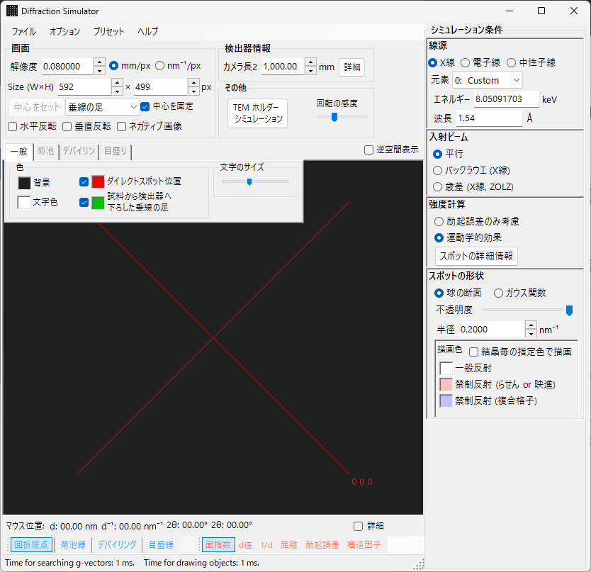

# X線・中性子線回折シミュレーション

**X線・中性子線回折シミュレーション**は、単結晶のX線・中性子線回折パターンを計算します。[回折シミュレータ](index.md) のメインモードのひとつです。

> このページは、**波長 = X線**（または中性子線）を選んだときに右側に現れる設定項目をすべて掲載します。描画・保存などウィンドウ共通の操作は [まとめページ](index.md) を参照してください。

GUI条件: 波長 = X線 / 中性子 ・ 入射ビーム = 平行 / 歳差(X線) / Back Laue ・ 強度計算 = 励起誤差のみ / 運動学的

---

## 概要

X線は電子線より波長が長く（Cu Kα: 0.15406 nm = 1.5406 Å）、エワルド球の曲率が大きくなります。そのため同時に回折条件を満たす逆格子点の数が電子線に比べて少なくなります。また原子散乱能が小さく多重散乱が弱いので、回折強度は運動学的 (Kinematical) 理論で十分な精度が得られます（動力学的 (Dynamical) 計算は電子線のみ対応）。

---

## 波長の設定

線源で **X線** を選択します。X線には特性X線とシンクロトロン放射光の2通りの指定方法があります。

### 特性X線

**元素** と **遷移** を選ぶと特性X線の波長が決まります。遷移は Siegbahn 記法（Kα₁ / Kα₂ / Kβ など）で指定します。代表的な元素の Kα₁ 波長:

| 元素 | 線種 | 波長 (Å) | エネルギー (keV) |
|------|------|----------|-----------------|
| Cu | Kα₁ | 1.5406 | 8.048 |
| Mo | Kα₁ | 0.7107 | 17.479 |
| Co | Kα₁ | 1.7890 | 6.930 |
| Cr | Kα₁ | 2.2910 | 5.415 |

### シンクロトロン放射光

**元素** を **0: Custom** に設定し、エネルギー (keV) または波長 (Å) を直接入力します。任意の波長を使用できます。

---

## 入射ビーム

入射ビームのジオメトリを選択します。X線では次の3種が選べます。

### 平行

標準の平面波。SAED やX線単結晶回折で用いる平行入射ビームです。

### 歳差X線（プリセッションカメラ）

X線の歳差（プリセッション）カメラをシミュレートします。逆格子の1層だけを取り出して撮影する歳差写真です。

### Back Laue（後方反射ラウエ）

白色X線による後方反射ラウエパターンをシミュレートします。検出器を線源側に置く後方反射のジオメトリで、Monochrome はオフになります。反射の幾何は **検出器ジオメトリ** の Tau / Phi で与えます（[検出器ジオメトリ](index.md#検出器ジオメトリ) 参照）。

> **注記**: 入射ビームの選択肢は波長に連動します。**歳差 (電子)**・**収束 (CBED)** は電子線選択時のみ、上記の **歳差X線**・**Back Laue** はX線選択時のみ表示されます。中性子線では **平行** のみです。スクリーンショットは撮影時の状態によりX線用の選択肢が写っていない場合があります。

---

## 強度計算

スポット強度の計算方法を選択します。X線では次の2通りです。

### 励起誤差のみ考慮

エワルド球と逆格子点の幾何学的距離（励起誤差 $s_g$）だけで強度を決めます。$\lvert s_g \rvert$ が小さいほど強く、**Radius** で設定した値で最大、$\lvert s_g \rvert$ が Radius を超えると 0 になります。結晶構造因子は無視されます。

### 運動学的効果

励起誤差に加えて運動学的構造因子 $\lvert F_{hkl} \rvert^2$ を強度に反映します。消滅則が厳密に成立します。Lorentz因子・偏光因子は含みません（幾何学的パターンのシミュレーション）。

> **注記**: **動力学的効果** はX線では無効です（電子線選択時のみ有効）。

---

## スポットの外観

各回折スポットの描画方法を制御します。

- **Solid sphere / Gaussian** : 逆格子点の幾何モデル。**Solid sphere** は半径 *R* の球とエワルド球の断面（円の面積が回折強度に対応）、**Gaussian** は σ = *R* の3Dガウス関数とエワルド球の断面（2Dガウスの積分が回折強度に対応）。
- **不透明度 (Opacity)** : スポットの透過率（0 = 透過、1 = 不透過）。
- **Radius (R)** : 逆格子点の半径。**外観**と**強度計算**の組み合わせで描画スポットサイズが決まります。
- **Brightness** : **Gaussian** モードでのみ有効。描画ガウスの積分強度を設定します。
- **カラースケール** : **Gray scale** または **Cold-warm** カラーマップを選択。
- **Log スケール** : 強度を対数表示します。
- **スポットの色** : カラースケールが適用されない場合のデフォルトスポット色。
- **結晶の色を使う** : チェックすると、各結晶に設定した色でスポットを描画します。

---

## デバイリング（多結晶）

多結晶試料のデバイリングを表示できます。ツールバーの **デバイリング** を有効にしてください（[ツールバー](index.md#ツールバー) 参照）。

- **回折強度を無視** : すべてのリングを同色・同強度で描画します（構造因子を無視した純粋に幾何的な比較に使用）。
- **指数ラベルを表示** : 各リングの近傍に (*hkl*) を表示します。

詳細な設定は [描画オーバーレイのタブ](index.md#描画オーバーレイのタブ) のデバイリングタブにあります。

---

## 中性子回折

波長コントロールで **中性子線** を選ぶと中性子回折パターンを計算します。エネルギー (meV) または波長 (nm) を入力します。入射ビームは **平行** のみです。強度計算は **励起誤差のみ** / **運動学的** が使えます（動力学的は不可）。運動学的強度には原子散乱因子の代わりに中性子散乱長を用います。

---

## X線回折と電子線回折の違い

| 特徴 | X線回折 | 電子線回折 |
|------|---------|----------|
| 波長 | 長い (0.5–2.5 Å) | 短い (0.02–0.04 Å) |
| エワルド球の曲率 | 大 | 小（ほぼ平面） |
| 同時回折数 | 少 | 多 |
| 散乱因子 | 原子散乱因子 $f(s)$ | 電子散乱因子 $f_e(s)$ |
| 動力学効果 | 通常小さい | 大きい |
| 消滅則 | 厳密に成立 | 多重散乱により破れることあり |

---

## 共通操作

カメラ長・検出器ジオメトリ・パターンの保存・色設定などウィンドウ共通の操作は [まとめページ](index.md) を参照してください。検出器幾何の詳細設定は次のジオメトリウィンドウで行います。

---

## 関連項目

- [回折シミュレータ（まとめ）](index.md)
- [SAED シミュレーション](1-saed-simulation.md)
- [歳差電子回折 (PED) シミュレーション](2-ped-simulation.md)
- [収束電子線回折 (CBED) シミュレーション](3-cbed-simulation.md)
- [座標系 — 結晶方位](../appendix/a1-coordinate-system/1-orientation.md)
