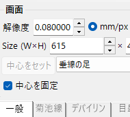
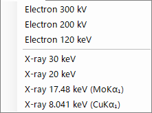
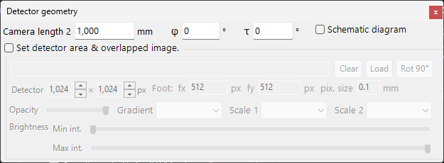
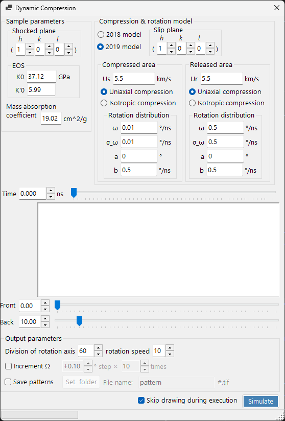

# 回折シミュレータ (Crystal Diffraction)

**回折シミュレータ (Crystal Diffraction)** は、単結晶のX線回折・中性子線回折・電子線回折パターンをシミュレーションします。

ウィンドウは、**左側**に回折パターンの描画エリア、**右側**にスポット特性（波長・入射ビーム・強度計算・外観など）の設定パネルが並びます。波長と入射ビームの組合せで撮影モード（X線回折・SAED・PED・CBED）が決まり、それに応じて右側パネルの構成が切り替わります。

---

## このページと各モードページの分担

- **このページ（まとめ）**: 全モードで共通の操作（ショートカット・メニュー・ツールバー・画面/検出器情報・オーバーレイのタブ・スポット情報・検出器ジオメトリ・動的圧縮）をまとめます。
- **各モードページ**: そのモードを選んだときに **右側に現れる全設定項目**（波長・入射ビーム・強度計算・外観・ブロッホ波設定・プリセッション設定など）を、1ページで完結するように網羅します（モード間で一部重複します）。

| モード | 内容 | ページ |
|--------|------|--------|
| **X線（・中性子）回折** | 単結晶X線／中性子回折パターン（平行・歳差X線・Back Laue） | [X線回折シミュレーション](4-x-ray-neutron-diffraction.md) |
| **SAED** | 平行ビーム電子回折（制限視野電子回折） | [SAEDシミュレーション](1-saed-simulation.md) |
| **PED** | 歳差電子回折（プリセッション） | [PEDシミュレーション](2-ped-simulation.md) |
| **CBED** | 収束電子線回折 | [CBEDシミュレーション](3-cbed-simulation.md) |

---

## モード早見表

**波長（線源）**と**入射ビーム**の組合せから、設定すべきページを引きます。

| 波長 | 入射ビーム | モード | ページ |
|------|-----------|--------|--------|
| 電子線 | 平行 | SAED | [SAEDシミュレーション](1-saed-simulation.md) |
| 電子線 | 歳差（電子＝PED） | PED | [PEDシミュレーション](2-ped-simulation.md) |
| 電子線 | 収束（CBED） | CBED | [CBEDシミュレーション](3-cbed-simulation.md) |
| X線 | 平行 | X線回折 | [X線回折シミュレーション](4-x-ray-neutron-diffraction.md) |
| X線 | 歳差（X線） | 歳差X線（プリセッションカメラ） | [X線回折シミュレーション](4-x-ray-neutron-diffraction.md) |
| X線 | Back Laue | 後方反射ラウエ | [X線回折シミュレーション](4-x-ray-neutron-diffraction.md) |
| 中性子 | 平行 | 中性子回折 | [X線回折シミュレーションの中性子節](4-x-ray-neutron-diffraction.md) |

> **注記**: 入射ビームの選択肢は波長で変わります。電子線では **平行・歳差(電子=PED)・収束(CBED)**、X線では **平行・歳差(X線)・Back Laue**、中性子では **平行** のみです。**歳差(電子=PED)** または **収束(CBED)** を選ぶと、強度計算は自動的に **動力学的(Dynamical)** へ切り替わります。

---

## キーボード・マウスショートカット

X線・SAED・PED のシミュレーションで共通の回折パターンウィンドウに適用されます。パターン上のドラッグは**結晶**を回転させます。ここには**ホイールズームはありません** — ズームは右クリック／右ドラッグで行います。

| ショートカット | 動作 |
|----------------|------|
| <kbd>F1</kbd> | このページのオンラインマニュアルを開く |
| 中心付近を左ドラッグ | 結晶を傾ける |
| 外周を左ドラッグ | ビーム軸まわりに結晶を回す |
| スポットを左ダブルクリック | 反射の詳細を表示（指数・*d*・構造因子・励起誤差） |
| 中ドラッグ | パターンを平行移動 |
| <kbd>CTRL</kbd> ＋ 中ドラッグ | 検出器中心を移動（検出器領域の表示時） |
| 右クリック | ズームアウト |
| 右ドラッグで矩形選択 | 選択範囲にズームイン |
| ステータスバーを右ダブルクリック | 現在の設定のテキスト要約をコピー |
| 点灯中のレイヤーボタン（Spots / Kikuchi / Debye / Scale）を右ダブルクリック | そのレイヤーを点滅 |

ここから開く補助ウィンドウには、さらに以下があります。

| ショートカット | 動作 |
|----------------|------|
| ステレオネットを左ダブルクリック — **TEMホルダー** | ホルダー傾斜をその点に設定 |
| 矢印キー — **TEMホルダー** | ホルダー傾斜をステップ送り（先に **Arrow keys** をチェック） |
| `.prm` ファイルや画像をドロップ — **検出器ジオメトリ** | 検出器幾何／重畳画像を読込 |
| `.txt` プロファイルをドロップ — **動的圧縮** | 圧力／時間プロファイルを読込（グラフの赤線をドラッグして走査） |

メインウィンドウのアプリ全体ショートカット（<kbd>CTRL</kbd>+<kbd>SHIFT</kbd> 系）は、このウィンドウにフォーカスがある間も動作します（[メインウィンドウ](../0-main-window.md) 参照）。

→ 全ウィンドウの一覧は **[21. キーボード・マウスショートカット](../21-shortcuts.md)** を参照。

---

## 目的別最速手順

| 目的 | 操作の入口 | 参照ページ |
|------|------------|------------|
| 平行ビームの電子回折（SAED）を出す | **入射ビーム**を **平行**、**波長**を **電子線**にする | [SAEDシミュレーション](1-saed-simulation.md)、[平行ビーム SAED の計算](../appendix/a3-bloch-wave/calculation.md) |
| X線単結晶回折を出す | **波長**を X-ray / Synchrotron へ切り替える | [X線回折シミュレーション](4-x-ray-neutron-diffraction.md) |
| 歳差電子回折（PED）を出す | **入射ビーム**を **歳差 (電子)** にし、半頂角とステップを設定する | [PEDシミュレーション](2-ped-simulation.md) |
| 収束電子線回折（CBED）を出す | **入射ビーム**を **収束 (CBED, 電子線のみ)** にし、CBED設定ウィンドウで条件を決める | [CBEDシミュレーション](3-cbed-simulation.md)、[CBED の計算](../appendix/a3-bloch-wave/cbed.md) |
| 動力学計算の反射一覧を確認する | **動力学的効果**を選び、**スポットの詳細情報**または **詳細**を開く | [動力学計算（共通コア）](../appendix/a3-bloch-wave/calculation.md) |
| 実験像と重ねて検出器幾何を合わせる | **詳細**から検出器ジオメトリ設定を開き、重畳画像を使う | [検出器座標系](../appendix/a1-coordinate-system/2-diffraction.md) |

---

## メインエリア

画面中央に回折パターンがシミュレーションされます。

### マウス操作

ページ冒頭の「キーボード・マウスショートカット」を参照してください。

### マウス位置

カーソル位置に対応する情報 (カーソル位置の *q*, *d*, 2θ, 方位角など) がパターン上部のステータス行に表示されます。**詳細** をチェックすると、最近接反射の (*hkl*)・励起誤差・構造因子などのより詳細な情報が追加表示されます。

---

## ファイルメニュー

| メニュー項目 | 説明 |
|-------------|------|
| **保存** | 表示中の回折パターンをファイルに保存 |
| **検出器領域を保存** | 検出器領域のクロップのみを保存 |
| **コピー** | 表示中の画像をクリップボードへコピー |
| **検出器領域をコピー** | 検出器領域のクロップのみをコピー |

### プリセット

波長・検出器ジオメトリ・タブ設定・スポット特性などのシミュレータ設定一式をプリセットとして保存・呼び出しします。装置・取得モード間で素早く切り替えるのに便利です。

---

## ツールバー

| ボタン | 説明 |
|--------|------|
| 回折斑点 (Spots) | 回折スポットレイヤーの表示／非表示 |
| 菊池線 (Kikuchi) | 菊池線レイヤーの表示／非表示 |
| デバイリング (Debye) | デバイリングレイヤーの表示／非表示 |
| 目盛線 (Scale) | スケール線レイヤーの表示／非表示 |
| 面指数 / d値 / 距離 / 励起誤差 / 構造因子 | スポットに添えるラベルの選択 |

---

## 画面と検出器情報

### 画面

| 項目 | 説明 |
|------|------|
| **解像度** | 1 ピクセルあたりのサイズ (mm)。実際の検出器ピクセルサイズである必要はなく、表示スケールとして扱われ、マウスズームで自動更新されます |
| **Size (W×H)** | 描画領域のピクセル幅・高さ。ディスプレイ解像度によっては非常に大きな値は設定できません |
| **中心をセット / 中心を固定** | パターン中心を描画領域内の任意ピクセルに設定し、必要に応じて固定します。固定するとマウスパンで中心が動かなくなります |
| **水平反転 / 垂直反転 / ネガティブ画像** | 表示パターンの幾何反転（水平／垂直）とコントラスト反転。実験像の向きやコントラストに合わせるときに使用します |
| **逆空間表示** | パターン上にエワルド球と逆格子ベクトルを重ねて描画し、どの反射が励起されているかを可視化します |

### 検出器（カメラ長）

- **カメラ長2** : 試料から検出器までの距離 (mm)。
- **詳細** : 検出器ジオメトリ設定ウィンドウ（後述の[検出器ジオメトリ](#検出器ジオメトリ)節）を開きます。

### その他

- **回転の感度** : マウスドラッグ 1 ピクセルあたりの結晶回転量。
- **TEMホルダーシミュレーション** : ホルダー連動シミュレーションウィンドウを開きます（下記参照）。

---

## TEMホルダーシミュレーション

回折図形をダブルティルト（または回転）の **TEMホルダー** と連動させるウィンドウを開きます。ホルダーの傾斜角を設定するとパターンと結晶方位が更新され、到達可能な方位をステレオネット上に表示できます（ver4.914 で追加）。ステレオネットを左ダブルクリックするとホルダー傾斜をその点に設定でき、**Arrow keys** をチェックしておくと矢印キーで傾斜をステップ送りできます。

---

## 描画オーバーレイのタブ

### 一般 (General)

スポット、ラベル、菊池線、デバイリング、その他オーバーレイの色を設定します。ここでの設定はすべての描画モードに反映されます。

### 菊池線 (Kikuchi lines)

ツールバーで菊池線が有効のときにアクティブになります。

- **反射の選択** : 描画する菊池線の元となる反射を選びます。**結晶構造因子**（$\lvert F_{hkl}\rvert$ の上位 *N* 本）または **1/d 閾値**（1/d がしきい値 (nm⁻¹) 以下のすべての反射）。
- **線の表現** : 線の太さ、菊池線の色、**運動学的回折強度に従って描画**（反射の Kinematical 強度で線の濃さを変える）を設定します。
- **しきい値** : 旧来パラメータ。指定した *d* より大きい反射に対してのみ菊池線計算を実行します（互換のため残置）。

### デバイリング (Debye rings)

ツールバーでデバイリングが有効のときにアクティブになります。

- **回折強度を無視** : チェック時はすべてのデバイリングを同じ色・強度で描画します（結晶構造因子を無視）。純粋に幾何的な比較をしたいときに使います。
- **指数ラベルを表示** : チェック時、各リングの近傍に (*hkl*) を表示します。

### 目盛り線 (Scale)

ツールバーで目盛り線が有効のときにアクティブになります。

- **2θ / 方位角 目盛り線** : **2θ** は等散乱角（同心円）、**方位角** は等方位角（中心からの放射状直線）を表します。色はそれぞれ独立に設定できます。
- **線の太さ** : 目盛り線の太さ。
- **分割** : 隣接する目盛り線の角度間隔。
- **目盛りラベルを表示** : 目盛り線に数値ラベルを表示するか。

### その他 (Misc)

マウス回転感度などの細々した設定です。

- **マウス感度** : マウスドラッグ 1 ピクセルあたりの結晶回転量。

---

## 回折スポット情報

ブロッホ波法（Dynamical 計算）で計算された各反射の詳細を一覧表示します。**スポットの詳細情報**ボタン（強度計算パネル）または**詳細**チェックボックスで開きます。

### 模式図と定義

左上の模式図は、エワルド球上のベクトルと、表で使う量の定義を示します（$\hat{\mathbf{n}}$ は試料表面の法線方向の単位ベクトル、$\mathbf{k}$ は入射波数ベクトル、$\mathbf{g}$ は逆格子ベクトル）。

- $P_g = 2\,\hat{\mathbf{n}} \cdot (\mathbf{k} + \mathbf{g})$
- $Q_g = |\mathbf{k}|^2 - |\mathbf{k} + \mathbf{g}|^2 = -\mathbf{g} \cdot (2\mathbf{k} + \mathbf{g})$
- **励起誤差:** $S_g = \dfrac{\sqrt{P_g^2 + 4 Q_g} - P_g}{2}$
- **評価関数:** $R = |\mathbf{g}|\, Q_g^2$ — 反射を励起の強さで順位付けする量（小さいほどエワルド球に近く＝強く励起される。透過波 $g=0$ は $R=0$ で先頭）。表は $R$ の昇順に並びます。

### 表の各列

| 列 | 意味 |
|------|------|
| **R** | 評価関数 $R = \lvert\mathbf{g}\rvert\, Q_g^2$（上記。反射の選択・並べ替えに使用） |
| **h, k, (i,) l** | ミラー指数（*i* は六方晶の冗長指数で、六方晶のときのみ） |
| **d** | 面間隔（nm） |
| **gX, gY, gZ** | 逆格子ベクトル *g* の成分（1/nm） |
| **\|g\|** | *g* の大きさ（1/nm） |
| **Vg re / Vg im** | 弾性散乱に対する結晶ポテンシャルのフーリエ係数 $V_g$（実部・虚部） |
| **V'g re / V'g im** | 熱散漫散乱（TDS）に対応する虚（吸収）ポテンシャル $V'_g$（実部・虚部） |
| **Sg** | 励起誤差 $S_g$（上記。1/nm） |
| **Pg** | 補助量 $P_g = 2\,\hat{\mathbf{n}}\cdot(\mathbf{k}+\mathbf{g})$（上記） |
| **Qg** | 補助量 $Q_g = -\mathbf{g}\cdot(2\mathbf{k}+\mathbf{g})$（上記） |
| **Φ re / Φ im** | 出射面における動力学的回折波の複素振幅 $\Phi$（実部・虚部） |
| **\|Φ\|^2** | その反射の回折強度 $\lvert\Phi\rvert^2$ |
| **Σ\|Φ\|^2** | $\lvert\Phi\rvert^2$ の累積和（全反射の和。強度保存の確認に使える） |

### ポテンシャルの単位とその他のコントロール

- **Unit of potential** : ポテンシャルの表示単位を **Vg [eV]**（電位、eV）と **Ug [nm⁻²]**（ブロッホ波方程式に入る換算量 $U_g = (2 m_0/h^2)\, V_g$）で切り替えます。単位に応じて表の列見出しも *Vg / V'g* ↔ *Ug / U'g* に変わります。
- 表上部に、加速電圧・波長（$\lambda = 1/k_\text{vac}$）・相対論的質量比 $m/m_0$・速度比 $v/c$・格子体積・試料厚さ・（CBEDモードの）電子線の最大半角が表示されます。
- **Note 1:** 長さの単位は Å ではなく **nm**。**Note 2:** 波数の単位は 2π/nm ではなく **1/nm**。
- **Effective digit** : 表に表示する有効桁数。**Auto resize row width** : 列幅の自動調整。**Copy to clipboard** : 表を表計算ソフトへ貼り付け可能なテキストとして出力します（このフォームは日本語UIでも英語表示です）。

---

## 検出器ジオメトリ

検出器の幾何（カメラ長・傾き・回転）と、実験像の重畳を詳細に設定するウィンドウです。**検出器ジオメトリ**パネルの **詳細** から開きます。

### 検出器ジオメトリ設定

カメラ長・検出器の傾き（**Tau / Phi**）などの反射幾何を与えます。Back Laue（後方反射ラウエ）では、ここで検出器を線源側に置く幾何を設定します。

### 検出器領域と重畳画像

検出器の有効領域を指定し、実験像をドロップして重畳します。シミュレーションパターンと実験像を重ねて検出器幾何を合わせ込むのに使います。

座標系の定義は [検出器座標系](../appendix/a1-coordinate-system/2-diffraction.md) も参照してください。

---

## 動的圧縮

高圧（動的圧縮）実験の圧力・時間プロファイルを走査するためのウィンドウです。`.txt` の圧力／時間プロファイルをこのウィンドウにドロップして読み込み、グラフ上の赤線をドラッグすると、その時刻（圧力）に対応する状態を回折パターン側に反映しながら連続的に走査できます。

---

## 関連項目

- [X線回折シミュレーション](4-x-ray-neutron-diffraction.md)
- [SAEDシミュレーション](1-saed-simulation.md)
- [PEDシミュレーション](2-ped-simulation.md)
- [CBEDシミュレーション](3-cbed-simulation.md)
- [動力学計算（共通コア）](../appendix/a3-bloch-wave/calculation.md)
- [検出器座標系](../appendix/a1-coordinate-system/2-diffraction.md)
