<!-- nav -->

[← 6. ステレオネット](../6-stereonet.md)  |  [🏠 ホーム](../index.md)  |  [7.1. SAEDシミュレーション →](../7-1-saed-simulation.md)

# 回折シミュレータ (Crystal Diffraction)

**Crystal Diffraction** は、単結晶X線回折および電子線回折パターンをシミュレーションします。

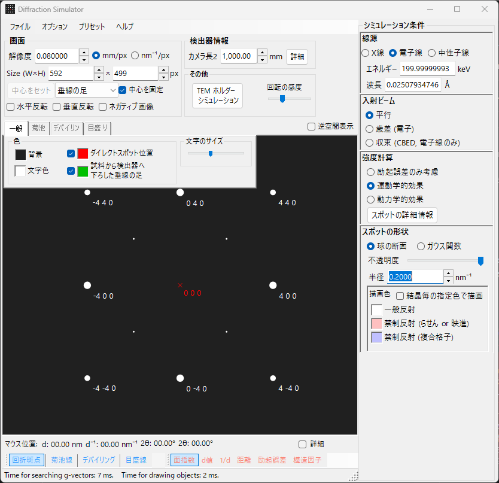

---

## メインエリア

画面中央に回折パターンがシミュレーションされます。

### マウス操作

| 操作 | 動作 |
|------|------|
| 左ドラッグ | 回転 |
| 中ドラッグ | 平行移動 |
| 右ドラッグ | ズームイン |
| 右クリック | ズームアウト |
| 左ダブルクリック | 選択スポットの詳細情報表示 |

**マウス位置**: カーソル位置に対応する情報が表示されます。**詳細** をチェックするとより詳細な情報を表示。

---

## ファイルメニュー

| メニュー項目 | 説明 |
|-------------|------|
| Save / Save detector area | 表示画像/検出器領域画像を保存 |
| Copy / Copy detector area | 表示画像/検出器領域画像をコピー |

### プリセット

---

## ツールバー

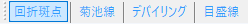

| ボタン | 説明 |
|--------|------|
| 回折斑点 | 回折スポットの表示/非表示 |
| 菊池線 | 菊池線の表示/非表示 |
| デバイリング | デバイリングの表示/非表示 |
| 目盛線 | スケール線の表示/非表示 |
| 面指数 / d値 / 距離 / 励起誤差 / 構造因子 | スポットラベルの選択 |

---

## モニター / 検出器ジオメトリ

### モニター

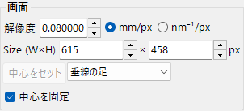

- **解像度**: 1ピクセルのサイズ (mm)。表示スケールのパラメータであり、マウスズームで変化。
- **Size (W×H)**: 描画領域のピクセル数 (幅×高さ)。
- **中心をセット / 中心を固定**: パターン中心の設定・固定。
- **水平反転 / 垂直反転 / ネガティブ画像**: パターンの反転・白黒反転。
- **逆空間表示**: エワルド球と逆格子ベクトルを描画。

### その他

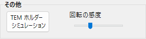

- **回転の感度**: マウスドラッグ時の回転量。
- **TEM ホルダーシミュレーション**: ホルダー連動シミュレーションウィンドウを開く（下記参照）。

### TEM ホルダーシミュレーション

回折図形をダブルティルト（または回転）の **TEMホルダー** と連動させるウィンドウを開きます。ホルダーの傾斜角を設定するとパターンと結晶方位が更新され、到達可能な方位をステレオネット上に表示できます（ver4.914 で追加）。

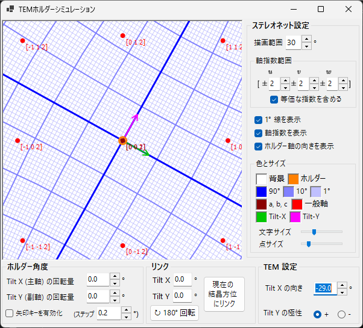

### 検出器ジオメトリ

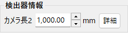

- **カメラ長2**: 試料から検出器までの距離 (mm)。
- **詳細**: 光学系設定ウィンドウを開く。

---

## タブメニュー

### 一般設定 (General)

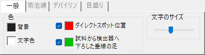

スポット、ラベル、菊池線等の色を設定。

### 菊池線 (Kikuchi lines)

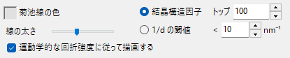

ツールバーで菊池線が有効の場合にアクティブ。描画する菊池線の選定基準を **結晶構造因子**（**トップ** N 本）または **1/d の閾値**（< X nm⁻¹）で指定します。**線の太さ**・**菊池線の色**、**運動学的な回折強度に従って描画する** も設定できます。

### デバイリング (Debye rings)

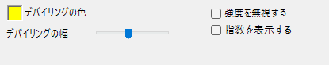

デバイリングが有効の場合にアクティブ。

### スケール (Scale)

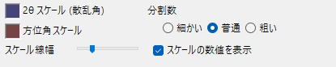

---

## スポット特性 (Spot property)

ツールバーで **回折斑点** が有効の場合にアクティブ。

### 波長

### 入射ビーム

| モード | 説明 |
|--------|------|
| **平行** | 平行入射ビーム |
| **歳差 (電子)** | 歳差電子回折 (PED)。自動的に動力学理論に設定 |
| **収束 (CBED, 電子線のみ)** | 収束ビーム (CBED)。自動的に動力学理論に設定、CBED設定ウィンドウが開く |

### 強度計算

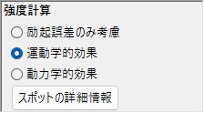

| 方法 | 説明 |
|------|------|
| **励起誤差のみ考慮** | エワルド球と逆格子点の幾何学的距離に基づく強度 |
| **運動学的効果** | 励起誤差に加え結晶構造因子を反映 |
| **動力学的効果** | ブロッホ波法（電子線のみ） |

### 外観

### ブロッホ波パラメータ（動力学理論）

- **回折波の数**: 動力学計算に含めるブロッホ波の数
- **試料厚み**: 試料の厚さ

### 歳差パラメータ

- **半頂角**: 歳差の半角
- **ステップ**: サンプリングするビーム方向数

---

## 検出器ジオメトリ（詳細）

### 検出器ジオメトリ設定

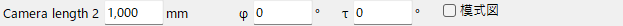

### 検出器領域と重畳画像

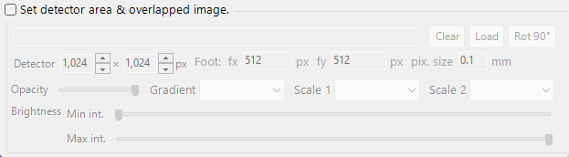

[検出器座標系](../appendix-a2-detector-coordinate-system.md) も参照。

---

## 回折スポット情報

ベーテの動力学理論（ブロッホ波法）で計算された各反射の詳細を一覧表示します。**スポットの詳細情報**ボタン（強度計算パネル）または**詳細**チェックボックスで開きます。

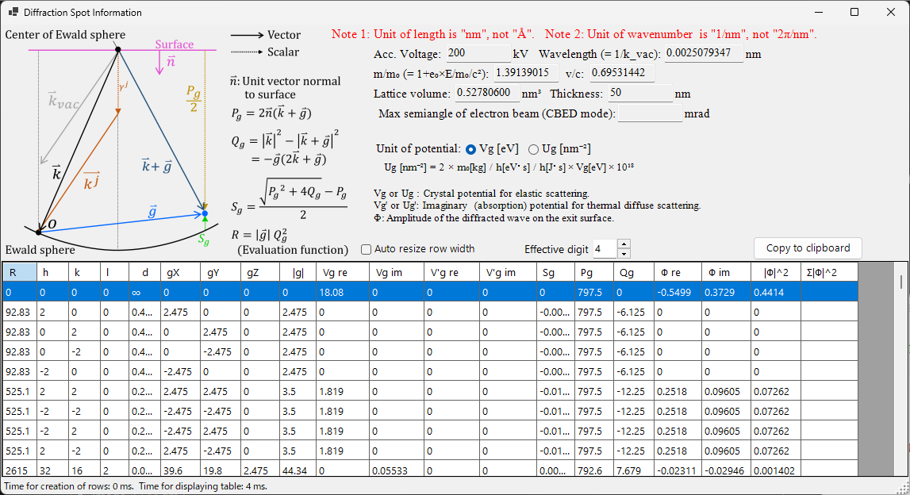

### 模式図と定義

左上の模式図は、エワルド球上のベクトルと、表で使う量の定義を示します（**n̂** は試料表面の法線方向の単位ベクトル、**k** は入射波数ベクトル、**g** は逆格子ベクトル）。

- **P_g = 2 n̂·(k + g)**
- **Q_g = |k|² − |k + g|² = −g·(2k + g)**
- **励起誤差 S_g = ( √(P_g² + 4Q_g) − P_g ) / 2**
- **評価関数 R = |g|·Q_g²** — 反射を励起の強さで順位付けする量（小さいほどエワルド球に近く＝強く励起される。透過波 g=0 は R=0 で先頭）。表は R の昇順に並びます。

### 表の各列

| 列 | 意味 |
|------|------|
| **R** | 評価関数 R = \|g\|·Q_g²（上記。反射の選択・並べ替えに使用） |
| **h, k, (i,) l** | ミラー指数（*i* は六方晶の冗長指数で、六方晶のときのみ） |
| **d** | 面間隔（nm） |
| **gX, gY, gZ** | 逆格子ベクトル *g* の成分（1/nm） |
| **\|g\|** | *g* の大きさ（1/nm） |
| **Vg re / Vg im** | 弾性散乱に対する結晶ポテンシャルのフーリエ係数 *V_g*（実部・虚部） |
| **V'g re / V'g im** | 熱散漫散乱（TDS）に対応する虚（吸収）ポテンシャル *V'_g*（実部・虚部） |
| **Sg** | 励起誤差 S_g（上記。1/nm） |
| **Pg** | 補助量 P_g = 2 n̂·(k+g)（上記） |
| **Qg** | 補助量 Q_g = −g·(2k+g)（上記） |
| **Φ re / Φ im** | 出射面における動力学的回折波の複素振幅 Φ（実部・虚部） |
| **\|Φ\|^2** | その反射の回折強度 \|Φ\|² |
| **Σ\|Φ\|^2** | \|Φ\|² の累積和（全反射の和。強度保存の確認に使える） |

### ポテンシャルの単位とその他のコントロール

- **Unit of potential** — ポテンシャルの表示単位を **Vg [eV]**（電位、eV）と **Ug [nm⁻²]**（ブロッホ波方程式に入る換算量 *U_g* = 2m₀/h² · *V_g*）で切り替えます。単位に応じて表の列見出しも *Vg / V'g* ↔ *Ug / U'g* に変わります。
- 表上部に、加速電圧・波長（= 1/k_vac）・相対論的質量比 *m/m₀*・速度比 *v/c*・格子体積・試料厚さ・（CBEDモードの）電子線の最大半角が表示されます。
- **Note 1:** 長さの単位は Å ではなく **nm**。**Note 2:** 波数の単位は 2π/nm ではなく **1/nm**。
- **Effective digit** — 表に表示する有効桁数。**Auto resize row width** — 列幅の自動調整。**Copy to clipboard** — 表を表計算ソフトへ貼り付け可能なテキストとして出力します（このフォームは日本語UIでも英語表示です）。

---

[← 6. ステレオネット](../6-stereonet.md)  |  [🏠 ホーム](../index.md)  |  [7.1. SAEDシミュレーション →](../7-1-saed-simulation.md)
