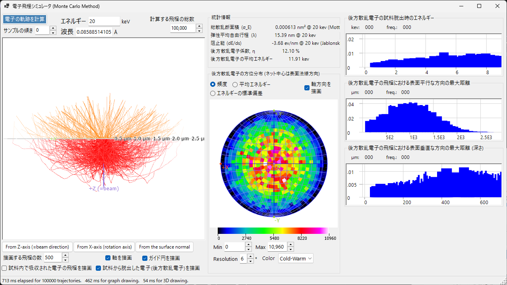
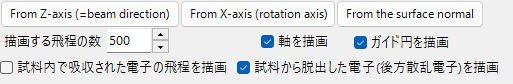
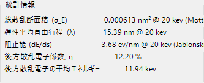
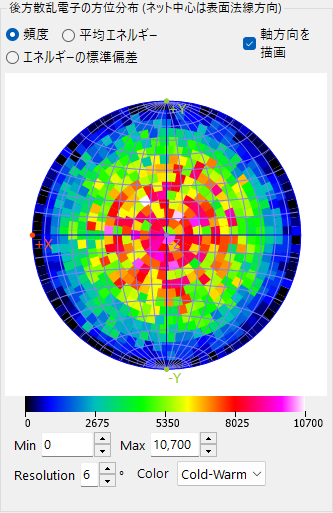
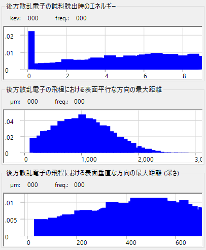

# 電子軌道 (Electron Trajectory)

**電子飛程シミュレータ** は、試料内部の電子の軌跡を **モンテカルロ法** で計算します。入射電子は弾性・非弾性散乱を受け、後方散乱電子の分布（方向・エネルギー・侵入深さ）が集計されます。これらの分布は [EBSDシミュレーション](12-ebsd-simulation.md) の方位・エネルギー・深さの重み付けにも利用されます。

---

## キーボード・マウスショートカット

電子軌道は3D OpenGLビューに表示されます。ReciPro 標準の [ビュー操作](21-shortcuts.md) ですが、**平行移動は無効**です — 標準的な視点へはビューのプリセットボタンで切り替えます。

| ショートカット | 動作 |
|----------------|------|
| <kbd>F1</kbd> | このページのオンラインマニュアルを開く |
| 左ドラッグ | モデルを回転 |
| 右ドラッグ上下、またはホイール | ズーム |
| <kbd>CTRL</kbd> ＋ 右ダブルクリック | 正射投影／透視投影の切替 |

→ 全ウィンドウの一覧は **[21. キーボード・マウスショートカット](21-shortcuts.md)** を参照。

---

## 計算条件

ビームエネルギー、入射電子数、試料・物質、その他のモンテカルロパラメータ。

### ビームエネルギー

入射電子線の加速電圧 (keV)。弾性散乱 (Mott) と非弾性散乱 (誘電応答モデル) の両方で運動エネルギーとして使用されます。

### 入射電子数

シミュレートする電子の数。多いほど統計ノイズは減りますが、計算時間が線形に増加します。

### 試料 / 物質

試料の組成と密度。デフォルトはメインウィンドウで選択中の結晶ですが、軌跡計算のみ目的の場合は上書き可能。

### 試料傾斜

試料の傾斜角。軌跡データを [EBSDシミュレータ](12-ebsd-simulation.md) で使うときの傾斜 (EBSD では通常 70°) に対応。

### 断面積モデル

弾性散乱断面積モデル (Mott / Bethe / NIST)。モデルにより、高傾斜や吸収端近傍での速度・精度のトレードオフが異なります。

---

## ステレオネットオプション

ステレオネット投影に描画する角度分布の表示オプション。

### 投影法

**Wulff** (等角) または **Schmidt** (等積) 投影。統計密度を読み取る用途では Schmidt が標準的です。

### 半球

上半球 (後方散乱側) または下半球 (透過側) を描画。

### 解像度 / カラースケール

角度ヒストグラムのビンサイズと密度表示に用いるカラーマップ。

---

## 統計情報

計算結果の要約。

- **後方散乱率** — 入射面から脱出した電子の割合
- **平均自由行程** — 散乱イベント間の平均距離
- **平均侵入深さ** — 電子が脱出または吸収されるまでに到達した平均最大深さ
- **経過時間 / スループット** — 計算の wall-clock コスト

---

## 後方散乱電子の方位分布

後方散乱電子の角度分布（ステレオネット中心は表面法線方向）。黄/橙の縁取りがある場合は、EBSD検出器の見込み領域を示します。

---

## プロファイル

電子の深さ・エネルギープロファイル。

### 深さプロファイル

後方散乱電子の最終脱出深さ (nm) のヒストグラム。EBSD シミュレータのマスターパターン深さ積分の重み付けに利用されます。

### エネルギープロファイル

後方散乱電子のエネルギー損失 ΔE (keV) のヒストグラム。EBSD シミュレータのエネルギー積分の重み付けに利用されます。
