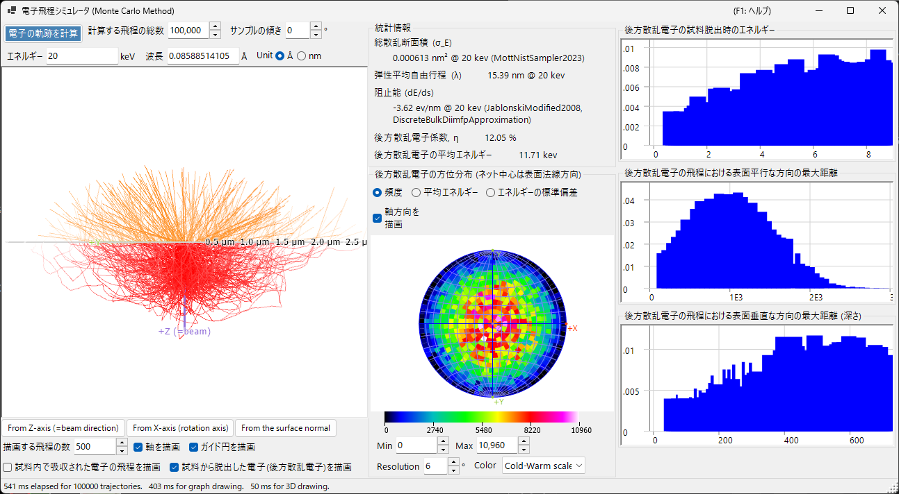
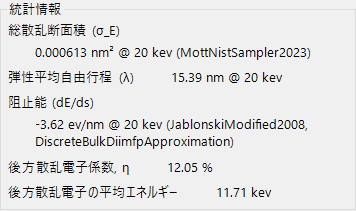
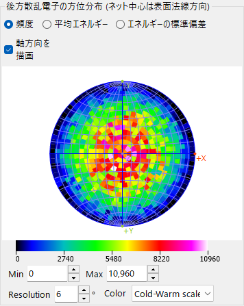
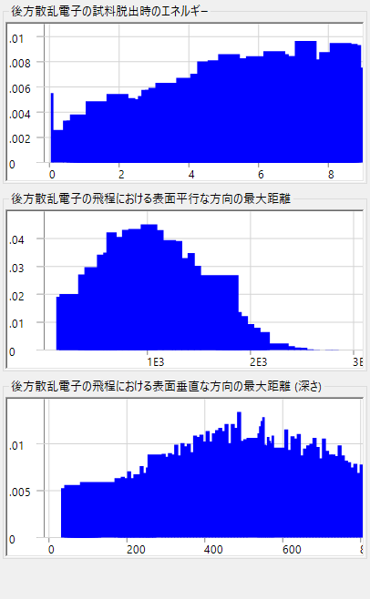

# 電子飛程 (Electron Trajectory)

**電子飛程シミュレータ (Monte Carlo Method)** は、試料内部の電子の軌跡を **モンテカルロ法** で計算します。入射電子は弾性・非弾性散乱を受け、後方散乱電子 (BSE) の分布 — 方位・脱出時のエネルギー・侵入深さ・表面平行方向の広がり — が集計されます。これらの分布は [EBSDシミュレーション](12-ebsd-simulation.md) の方位・エネルギー・深さの重み付けにも利用されます。

ウィンドウは3列構成です。左が **3D の飛程表示**、中央が **統計情報** と **後方散乱電子の方位分布** のステレオネット、右が3つの **ヒストグラム** です。試料の組成と密度はメインウィンドウで選択中の結晶から取られ、このウィンドウで設定するのはビームエネルギー・試料の傾き・飛程の本数だけです。

---

## キーボード・マウスショートカット

電子の飛程は3D OpenGLビューに表示されます。ReciPro 標準の [ビュー操作](21-shortcuts.md) ですが、**平行移動は無効**です — 標準的な視点へはビューのプリセットボタンで切り替えます。

| ショートカット | 動作 |
|----------------|------|
| <kbd>F1</kbd> | このページのオンラインマニュアルを開く |
| 左ドラッグ | モデルを回転 |
| 右ドラッグ上下、またはホイール | ズーム |
| <kbd>CTRL</kbd> ＋ 右ダブルクリック | 正射投影／透視投影の切替 |

→ 全ウィンドウの一覧は **[21. キーボード・マウスショートカット](21-shortcuts.md)** を参照。

---

## 計算条件

ウィンドウ上部のコントロールで計算の条件を決めます。

- **電子の軌跡を計算** : モンテカルロ計算を開始します。下部のステータスバーには、飛程計算・グラフ描画・3D描画それぞれの経過時間が別々に表示されます。
- **計算する飛程の総数** : 追跡する入射電子の本数。多いほど以下の各分布の統計ノイズは減りますが、計算時間は本数に比例して増えます。
- **サンプルの傾き** (°) : *X* 軸まわりの試料表面の傾き。垂直入射なら 0 のままにします。[EBSDシミュレータ](12-ebsd-simulation.md) と同じ配置を再現するときは **−70°** にします (大きく傾けると後方散乱電子の収率が上がるため)。
- **Energy** (keV) / **Wavelength** / **Unit** : 入射電子線の加速電圧と、それに連動した相対論補正済みの電子波長。このエネルギーが、弾性散乱 (NIST Mott) と非弾性散乱 (阻止能・IMFP) の両方の運動エネルギーになります。

散乱モデル自体はユーザーが選ぶものではありません。弾性散乱断面積は同梱の NIST Mott 表 (適用範囲外では遮蔽 Rutherford にフォールバック)、阻止能は Jablonski (2008) の修正形を使います。実際に使われたモデル名は **統計情報** の各値の隣に表示されます。各モデルの中身は [減衰・輸送](appendix/a2-beam-interaction/attenuation-transport.md) を参照してください。

### 3D の飛程表示

赤い軌跡は試料内で吸収された電子、橙色の軌跡は後方散乱電子として脱出した電子です。同心のガイド円には nm (または µm) の目盛りが付き、**+X**・**+Y**・**+Z (=beam)** が座標軸を示します。

- **From Z-axis (=beam direction)** / **From X-axis (rotation axis)** / **From the surface normal** : 視点を標準的な方向 (ビーム方向・回転軸方向・表面法線方向) へ切り替えます。この3つのボタンだけは日本語UIでも英語表示です。
- **描画する飛程の数** : 計算した軌跡のうち何本を描くか (10万本すべてを描くと読めず、描画も遅くなります)。
- **軸を描画** / **ガイド円を描画** : 座標軸の矢印と距離の目盛り。
- **試料内で吸収された電子の飛程を描画** : 脱出せずに終わった電子も描きます。
- **試料から脱出した電子(後方散乱電子)を描画** : 後方散乱電子が表面から出たあとの経路も続けて描きます。

---

## 統計情報

現在のビームエネルギーにおける値です。各値の隣には、それを与えたモデル名が括弧書きで表示されます。

- **総散乱断面積 (σ_E)** (nm²) — 原子1個あたりの全弾性散乱断面積。
- **弾性平均自由行程 (λ)** (nm) — 弾性散乱から次の弾性散乱までの平均距離。
- **阻止能 (dE/ds)** (eV/nm、負値) — 単位経路長あたりに失うエネルギー。
- **後方散乱電子係数, η** (%) — 入射電子のうち入射面から再び出ていく割合。BSE 像のコントラストの源になる量です。
- **後方散乱電子の平均エネルギー** (keV) — 後方散乱電子が脱出する瞬間の平均エネルギー。

---

## 後方散乱電子の方位分布

後方散乱電子の角度分布を、中心が表面法線方向のステレオネット上に描きます。

- **頻度** / **平均エネルギー** / **エネルギーの標準偏差** : 色に対応させる量。各方向へ出ていく電子の数、その平均エネルギー、あるいはエネルギーのばらつきです。
- **軸方向を描画** : +X / ±Y / ±Z の方向を重ねて表示します。
- **Min** / **Max**・**Resolution**・**Color** : カラースケールの上下限、角度ヒストグラムのビンサイズ、カラーマップ。

---

## ヒストグラム

後方散乱電子についての3つの分布で、いずれも面積が1になるよう正規化されています。

### 後方散乱電子の試料脱出時のエネルギー

後方散乱電子が試料から出る時点で **まだ持っているエネルギー** (keV) のヒストグラムです。エネルギー損失ではないことに注意してください。EBSD シミュレータはこれをマスターパターンのエネルギー積分の重みに使います。

### 後方散乱電子の飛程における表面平行な方向の最大距離

各後方散乱電子が脱出するまでに **表面に平行な方向へ** どれだけ広がったか (nm) のヒストグラムです。相互作用体積の横方向の大きさにあたり、BSE 像や EBSD 測定の空間分解能の原理的な限界を与えます。

### 後方散乱電子の飛程における表面垂直な方向の最大距離 (深さ)

各後方散乱電子が脱出するまでに **表面に垂直な方向へ** 到達した最大深さ (nm) のヒストグラムです。EBSD シミュレータはこれをマスターパターンの深さ積分の重みに使います。

---

## 関連項目

- [EBSDシミュレーション](12-ebsd-simulation.md)
- [EBSDの計算](appendix/a3-bloch-wave/ebsd.md)
- [減衰・輸送](appendix/a2-beam-interaction/attenuation-transport.md) — ここで使う弾性散乱断面積・阻止能・飛程の中身。
- [動力学回折(Bloch波法)](appendix/a3-bloch-wave/index.md)
- [HRTEM/STEMシミュレータ](9-hrtem-stem-simulator/index.md)
- [回折シミュレータ](7-diffraction-simulator/index.md)
