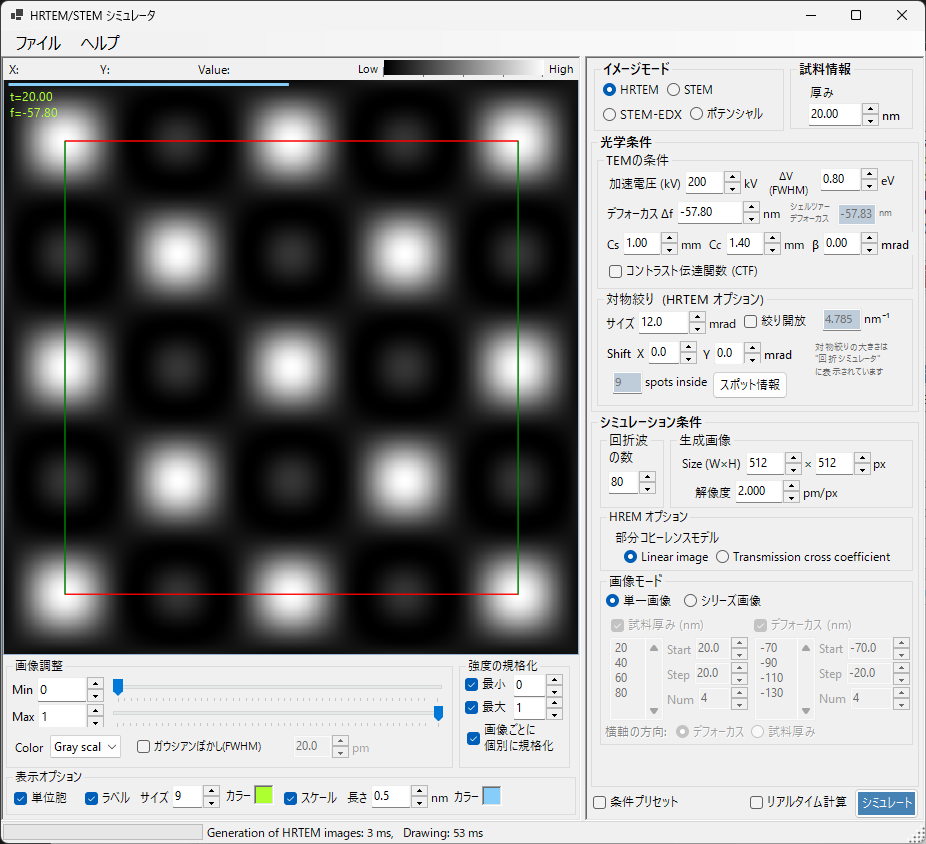

# HRTEM シミュレーション

**HRTEM (High-Resolution Transmission Electron Microscopy)** シミュレーションは、高分解能TEM格子縞像を計算します。[HRTEM/STEMシミュレータ](index.md) のメインモードです。

> このページは、**イメージモード = HRTEM** を選んだときに右側に現れる設定項目をすべて掲載します。結果の表示・明るさ調整など左側の操作は [まとめページ](index.md#結果の表示調整左側パネル) を参照してください。

---

## 概要

HRTEM像は、試料を透過した電子波が対物レンズの収差の影響を受けて結像することで形成されます。ReciProでは、ブロッホ波法（Dynamical 計算）で試料中の電子波伝搬を計算し、位相コントラスト伝達関数 (PCTF) を通してHRTEM像を生成します。

### 計算の流れ

1. **ブロッホ波法**: 結晶ポテンシャル中の電子波伝搬を計算し、出射波の振幅と位相を取得
2. **レンズ関数**: 対物レンズの収差（球面収差 $C_s$、デフォーカス $\Delta f$）を適用
3. **部分コヒーレンス**: 光源の有限サイズ（空間コヒーレンス）とエネルギー揺らぎ（時間コヒーレンス）を考慮
4. **像の形成**: 強度分布 $|\psi(\mathbf{r})|^2$ を計算

理論の詳細は [Appendix A3.2 — HRTEM 像形成](../appendix/a3-bloch-wave/hrtem.md) を参照してください。

---

## 試料情報

- **厚み** : 試料の厚さ (nm)。HRTEM像は厚さに強く依存します。**シリーズ画像** モードのときはこの値は無視され、後述の厚さリストが使われます。

---

## TEMの条件

対物レンズの結像条件を設定します。

| パラメータ | 説明 | 既定値 / 典型値 |
|-----------|------|-----------------|
| **加速電圧 (kV)** | 加速電圧。相対論補正された電子波長が右に表示されます | 200 kV |
| **デフォーカス Δf** | 対物レンズのデフォーカス (nm)。下に **シェルツァーデフォーカス** の参考値が表示されます | −57.8 nm |
| **Cs** | 球面収差係数 (mm)。CTFとシェルツァーデフォーカスに影響します | 0.5–1.0（通常）、< 0.01（Cs補正） |
| **Cc** | 色収差係数 (mm)。エネルギー幅による像のぼけを決めます | 1.0–2.0 mm |
| **β** | 照射半角 (mrad)。有限光源サイズ効果（空間コヒーレンス）を表します | 0.1–1.0 mrad |
| **ΔV (FWHM)** | 電子線のエネルギー幅の半値全幅 (eV)。Cc とともに色収差による焦点広がりを決めます | 0.5–2.0 eV |

> **右クリックメニュー**: TEMの条件パネルでは、**収差をすべて0に設定** / **デフォーカスをシェルツァー値に設定** / **デフォーカスを0 nmに設定** をワンクリックで行えます。条件プリセット（300kV ARM300F、200kV 2100F など）は左下の **条件プリセット** から呼び出せます。

### シェルツァーデフォーカス

現在の波長と球面収差 $C_s$ から計算される、位相コントラストが最適となる付近のデフォーカス値（参考表示）です。

$$\Delta f_{\text{Scherzer}} = -\sqrt{\tfrac{4}{3}\,C_s \lambda}\quad\left(\approx -1.155\,\sqrt{C_s \lambda}\right)$$

この条件では、PCTFが広い空間周波数範囲で負になり、原子位置が暗いコントラストとして得られます。ReciPro はこの原典の Scherzer 値（収差位相 $\chi$ の極小値を $-2\pi/3$ とする条件から導かれる）を採用しており、GUI に表示される値もこの式によります。なお、帯域をさらに広げた *extended Scherzer* 値 $-1.2\sqrt{C_s\lambda}$ を用いる流儀もあります。

---

## レンズ関数 / コントラスト伝達関数 (CTF)

**コントラスト伝達関数 (CTF)** をチェックすると、レンズ収差とデフォーカスが空間周波数ごとに像コントラストをどう伝達するかをプロットするウィンドウが開きます。

- $\sin\chi(u)$ : 位相コントラスト伝達関数（$\chi(u)$ はレンズの収差関数）
- $E_\text{s}(u)$ : 空間コヒーレンスのエンベロープ関数。光源の有限サイズ（$\beta$）による減衰
- $E_\text{c}(u)$ : 時間コヒーレンスのエンベロープ関数。エネルギー揺らぎ（$C_c$, $\Delta V$）による減衰

横軸 $u$（空間周波数）の上限を変えると描画範囲が変わります。

---

## 対物絞り (HRTEM オプション)

対物絞りを通過させる回折波を制限します。絞りで切る回折波の数によって、ブロッホ波計算に含めるスポット数も変わります（上限は **回折波の数** の最大ブロッホ波数）。

- **絞り半径** : 対物絞りの半角 (mrad)。小さいほど高角度の回折波を切り、高分解能の細部がなだらかになります。逆空間半径 $\sin\theta/\lambda$ への換算値 (nm⁻¹) が表示されます。
- **シフト X / Y** : 対物絞り中心のシフト量 (mrad)。暗視野・傾斜結像に使います。
- **絞り開放** : 対物絞りを開放（無限大）にし、すべての回折波を結像に使います。
- **スポット数** : 絞り内に入る回折ビーム（スポット）の本数（読み取り専用）。
- **Spot info** : 絞り内に入る回折ビームの一覧テーブル（強度・複素振幅など）を開きます。

> 対物絞りの大きさは **回折シミュレータ** 上にも表示されます。

---

## HREM オプション（部分コヒーレンスモデル）

入射ビームの全方向からの寄与を統合する際の干渉モデルを選びます。

- **線形イメージモデル（準コヒーレント）** : 計算コストが低い。弱位相物体近似が成り立つ薄い試料に適し、PCTFに空間・時間コヒーレンスエンベロープを乗じます。
- **透過交差係数 (TCC)** : 計算コストが高いがより正確。完全な透過交差係数を積分します。多くの強い回折波を励起する強散乱体に使うべきモデルです。

詳細は [Appendix A3.2 — HRTEM 像形成](../appendix/a3-bloch-wave/hrtem.md) を参照。

---

## 画像モード（単一 / シリーズ画像）

- **単一画像** : 現在の厚さとデフォーカスで1枚のHRTEM像を計算します。
- **シリーズ画像** : 厚さ・デフォーカスを段階的に変えた一連の画像（through-thickness / through-focus シリーズ）を生成します。実験像とのベストマッチ条件探索に有用です。

シリーズ画像では次を設定します。

| 項目 | 説明 |
|------|------|
| **試料厚み (nm)** / **デフォーカス (nm)** | どちらをスイープするか（両方可） |
| **Start / Step / Num** | 開始値・刻み幅・枚数。下のリスト欄に展開され、直接編集も可能 |
| **横軸の方向** | 厚さとデフォーカスの両方をスイープしたとき、グリッドの横方向に並べる量（厚さ / デフォーカス） |

厚さとデフォーカスの両方をスイープすると、行 × 列のマトリクス画像が生成されます。

---

## 生成画像

- **Size (W×H)** : シミュレートする画像のピクセル数（既定 512×512）。
- **解像度** : サンプリング分解能 (pm/px)。値を小さくすると格子縞は細かく描けますが、FFT 時間が比例して長くなります。

---

## 回折波の数

- **最大ブロッホ波数** : ベーテ法（Dynamical 計算）で使用するブロッホ波の最大数（既定 80）。多くするほど精度が上がりますが、固有値問題の解法時間が $O(N^3)$ で増加します。

---

## 関連項目

- [HRTEM/STEMシミュレータ（まとめ）](index.md)
- [STEMシミュレーション](2-stem-simulation.md)
- [ポテンシャルシミュレーション](3-potential-simulation.md)
- [Appendix A3.2 — HRTEM 像形成](../appendix/a3-bloch-wave/hrtem.md)
