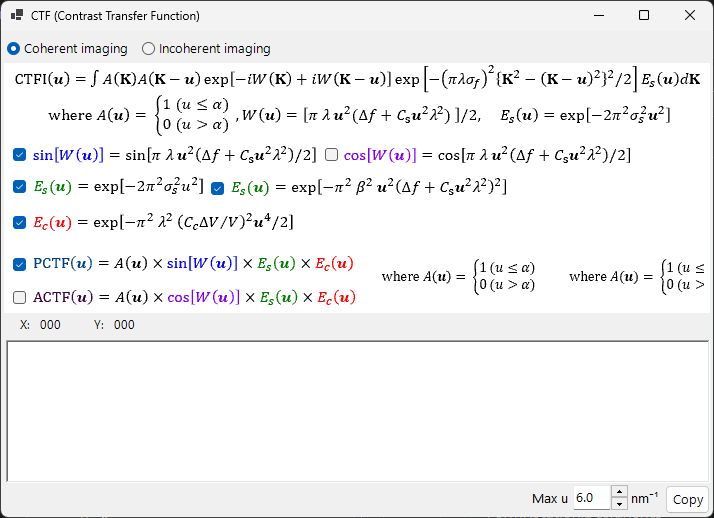
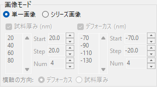

# HRTEM シミュレーション

**HRTEM (High-Resolution Transmission Electron Microscopy)** シミュレーションは、高分解能TEM格子縞像を計算します。[HRTEM/STEMシミュレータ](index.md) のメインモードです。

---

## 概要

HRTEM像は、試料を透過した電子波が対物レンズの収差の影響を受けて結像することで形成されます。ReciProでは、ブロッホ波法で試料中の電子波伝搬を計算し、位相コントラスト伝達関数 (PCTF) を通してHRTEM像を生成します。

---

## 計算の流れ

1. **ブロッホ波法**: 結晶ポテンシャル中の電子波伝搬を計算。出射波の振幅と位相を取得
2. **レンズ関数**: 対物レンズの収差（球面収差 $C_s$、デフォーカス $\Delta f$）を適用
3. **部分コヒーレンス**: 光源の有限サイズ（空間コヒーレンス）とエネルギー揺らぎ（時間コヒーレンス）を考慮
4. **像の形成**: 強度分布 $|\psi(\mathbf{r})|^2$ を計算

---

## 試料パラメータ

| パラメータ | 説明 |
|-----------|------|
| **厚み** | 試料厚さ (nm)。HRTEM像は厚さに強く依存 |

---

## 光学パラメータ

### TEM条件

| パラメータ | 説明 |
|-----------|------|
| **加速電圧 (kV)** | 加速電圧。相対論補正された波長が右に表示される |
| **デフォーカス Δf** | デフォーカス値 (nm)。シェルツァーデフォーカス値が下に参考値として表示 |

| パラメータ | 説明 | 典型値 |
|-----------|------|--------|
| **Cs** | 球面収差係数 (mm) | 0.5–1.0 mm（通常TEM）、< 0.01 mm（Cs補正TEM） |
| **Cc** | 色収差係数 (mm) | 1.0–2.0 mm |
| **β** | 照射半角 (mrad) | 0.1–1.0 mrad |
| **ΔE** | エネルギー揺らぎの1/*e*幅 (eV) | 0.5–2.0 eV |

---

## 位相コントラスト伝達関数 (PCTF)

レンズ関数タブに以下が表示されます：

- $\sin\chi(u)$: 位相コントラスト伝達関数（$\chi(u)$ はレンズの収差関数）
- $E_\text{s}(u)$: 空間コヒーレンスのエンベロープ関数。光源の有限サイズによる減衰
- $E_\text{c}(u)$: 時間コヒーレンスのエンベロープ関数。エネルギー揺らぎによる減衰

シェルツァーデフォーカス（Scherzer defocus）: $\Delta f = -1.2\,\sqrt{C_s \lambda}$ で、PCTFが広い空間周波数範囲で負になる条件（暗いコントラスト = 原子位置）。

---

## 対物絞り

対物絞りのサイズ (mrad) と位置を設定できます。

- 絞りを小さくすると高次回折波がカットされ、像のコントラストが向上するが分解能は低下
- **絞り開放** で無限大（絞りなし）に設定
- ブロッホ波法で考慮する回折波の数は絞り条件に依存

---

## 部分コヒーレンスモデル

### 準コヒーレントモデル（線形像モデル）

高速計算。弱位相近似が妥当な条件で有効。

### 透過相互係数 (TCC) モデル

より正確な計算。部分コヒーレンスの効果を厳密に取り込みます。計算時間は準コヒーレントモデルより長くなります。

---

## シミュレーションモード

### 単一画像

現在の厚さとデフォーカスで1枚のHRTEM像を計算。

### シリーズ画像

複数の厚さ・デフォーカスで連続的にHRTEM像を計算。

| パラメータ | 説明 |
|-----------|------|
| **Start** | 開始値 |
| **Step** | ステップ幅 |
| **Num** | 枚数 |

厚さとデフォーカスの両方をスイープすると、行×列のマトリクス画像が生成されます。

---

## 像の調整

| 設定 | 説明 |
|------|------|
| **Min / Max** | 輝度の表示範囲（画像調整のトラックバー） |
| **カラー** | グレースケール or Cold-Warm |
| **ガウシアンぼかし(FWHM)** | ガウシアンフィルタの適用 |
| **単位格子** | 単位格子グリッドの重畳表示 |
| **スケール** | スケールバーの表示 |

---

## 関連項目

- [HRTEM/STEMシミュレータ](index.md)
- [STEMシミュレーション](2-stem-simulation.md)
- [ポテンシャルシミュレーション](3-potential-simulation.md)
