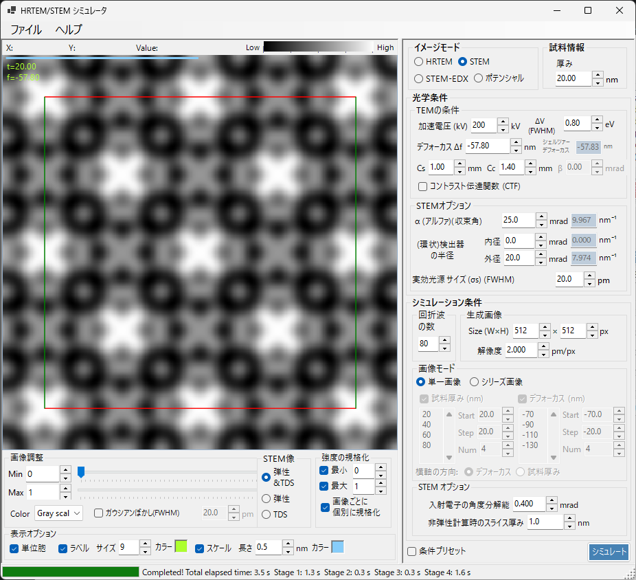

# STEM シミュレーション

**STEM (Scanning Transmission Electron Microscopy)** シミュレーションは、走査透過電子顕微鏡像を計算します。

> このページは、**イメージモード = STEM** を選んだときに右側に現れる設定項目をすべて掲載します。結果の表示・明るさ調整など左側の操作は [まとめページ](index.md#結果の表示調整左側パネル) を参照してください（STEM固有の **表示対象** だけは下にも再掲します）。

---

## 概要

STEM像は、収束した電子ビームを試料上で走査し、各位置での透過・散乱電子を環状検出器で検出することで形成されます。ReciProではブロッホ波法（Dynamical 計算）でSTEM像をシミュレーションします。

### 計算手法

1. 各走査位置で、収束ビームの各入射方向に対してブロッホ波法で回折強度を計算
2. 検出器の角度範囲内の散乱強度を積算
3. 弾性散乱と熱散漫散乱 (TDS) の両方を計算可能

理論の詳細は [Appendix A2.4 — STEM の計算](../appendix/a2-bloch-wave/stem.md) を参照してください。

---

## 検出器の種類

| 検出器 | 角度範囲 | 主な寄与 | 像のコントラスト |
|--------|---------|---------|----------------|
| **BF** (明視野) | 0 〜 収束角 | 弾性散乱 | 位相コントラスト |
| **ABF** (環状明視野) | 収束角の内側 | 弾性散乱 | 軽元素に感度が高い |
| **LAADF** (低角環状暗視野) | 収束角のやや外側 | 弾性 + TDS | ひずみに敏感 |
| **HAADF** (高角環状暗視野) | 収束角の十分外側 | TDS (非弾性) | Z-コントラスト（$\propto Z^2$、原子番号の約2乗に比例） |

> **典型的な検出器設定**（STEMオプションの右クリックメニューからワンクリックで設定可能、いずれも収束角 α=25 mrad）:
> BF (0–5 mrad) / ABF (12–24 mrad) / LAADF (26–60 mrad) / HAADF (80–250 mrad)

---

## 試料情報

- **厚み** : 試料の厚さ (nm)。**シリーズ画像** モードのときはこの値は無視されます。

---

## TEMの条件

| パラメータ | 説明 | 既定値 / 典型値 |
|-----------|------|-----------------|
| **加速電圧 (kV)** | 加速電圧。相対論補正された電子波長が右に表示されます | 200 kV |
| **デフォーカス Δf** | 対物（プローブ形成）レンズのデフォーカス (nm) | −57.8 nm |
| **Cs** | 球面収差係数 (mm)。プローブ径に影響します | 0.5–1.0 mm |
| **Cc** | 色収差係数 (mm) | 1.0–2.0 mm |
| **ΔV (FWHM)** | 電子線のエネルギー幅の半値全幅 (eV) | 0.5–2.0 eV |

> **β（照射半角）はSTEMモードでは無効**です（収束角 α が役割を担うため）。

---

## STEMオプション（光学系）

収束プローブと環状検出器のジオメトリを設定します。各角度は逆空間半径 $\sin\theta/\lambda$ への換算値 (nm⁻¹) も右に表示されます。

| パラメータ | 説明 | 既定値 / 典型値 |
|-----------|------|-----------------|
| **α（収束角）** | 収束プローブの半角 (mrad)。大きいほどプローブが細くなり、回折コントラストも変わります | 15–25 mrad |
| **(環状)検出器の内角** | 環状検出器の内側取り込み半角 (mrad)。これより内側の信号は除外 | BF: 0、HAADF: 80 |
| **(環状)検出器の外角** | 環状検出器の外側取り込み半角 (mrad)。これより外側の信号は除外 | BF: 5、HAADF: 250 |
| **実効光源サイズ σs (FWHM)** | 有効電子源サイズ。大きいほどプローブがぼけ、細部のコントラストが低下します | — |

---

## STEMオプション（計算）

- **非弾性用スライス厚** : TDS（熱散漫散乱による非弾性）電子強度を計算する際の試料スライス厚さ (nm)。小さいほど精度は上がりますが計算は遅くなります。
- **角度分解能** : 入射プローブ方向の角度サンプリング分解能 (mrad)。小さいほどプローブを細かくサンプリングしますが計算は遅くなります。

---

## 画像モード（単一 / シリーズ画像）

- **単一画像** : 現在の厚さで1枚のSTEM像を計算します。
- **シリーズ画像** : 厚さ・デフォーカスを段階的に変えた一連の像を生成します（**Start / Step / Num** で指定、下のリスト欄で直接編集も可能）。

---

## 生成画像

- **Size (W×H)** : 走査像のピクセル数（既定 512×512）。STEMでは走査点数に直結し、計算時間に線形に効きます。
- **解像度** : サンプリング分解能 (pm/px)。

---

## 回折波の数

- **最大ブロッホ波数** : ベーテ法で使用するブロッホ波の最大数（既定 80）。固有値問題のコストは波数の3乗に比例します。

---

## STEM像の表示対象（結果表示側）

ウィンドウ左下にある表示切替で、計算済みのSTEM像のうちどの散乱成分を表示するかを選びます（計算をやり直さずに切り替え可能）。

| 表示対象 | 説明 |
|----------|------|
| **弾性** | 弾性散乱のみの像 |
| **TDS** | 熱散漫散乱のみの像 |
| **弾性 & TDS** | 弾性 + TDS の合計像 |

---

## 計算時間に影響する要因

STEMシミュレーションは計算コストが高いため、以下のパラメータを適切に設定してください。

| 要因 | 影響 |
|------|------|
| **収束角** | 大きいほどCBEDディスクの重なりが増え、計算コストが増大 |
| **ブロッホ波の数** | 固有値問題のコストは波数の3乗に比例 |
| **角度分解能** | 細かいほど正確だが計算時間は二乗で増大 |
| **画素数（Size）** | 走査点数に線形に比例 |

---

## 温度因子の重要性

HAADF-STEM像のシミュレーションには、原子の等方性温度因子 (Debye-Waller factor) をゼロ以外に設定する必要があります。温度因子が不明な場合は $B = 0.5\ \text{Å}^2$ 程度に設定してください。温度因子がゼロの場合、TDS強度がゼロとなり、HAADF像が正しく計算されません。

| 検出器 | 範囲 | 主な寄与 |
|--------|------|---------|
| BF, ABF | 収束角内 | 弾性散乱 |
| LAADF, HAADF | 収束角外 | 非弾性散乱 (TDS) |

---

## Dr. Probe との比較

ReciProのSTEMシミュレーション結果は、広く使われている Dr. Probe GUI (v.1.10) と良好に一致することが確認されています。下図は、BF・ABF・LAADF・HAADF 検出器について厚さシリーズ（2.96〜60.05 nm）で両者を比較したものです（左: 収差なし、右: Cs = 0.2 mm, デフォーカス = −25.9 nm）。すべての検出器・厚さで両者はよく一致します。

より詳細な比較は PDF で参照できます: [Comparison of STEM simulations by Dr. Probe GUI (v.1.10) and ReciPro (v.4.854)](https://github.com/seto77/ReciPro/files/10976084/ComparisonSTEMsimulations.pdf)

---

## 関連項目

- [HRTEM/STEMシミュレータ（まとめ）](index.md)
- [HRTEMシミュレーション](1-hrtem-simulation.md)
- [ポテンシャルシミュレーション](3-potential-simulation.md)
- [Appendix A2.4 — STEM の計算](../appendix/a2-bloch-wave/stem.md)
