# STEM シミュレーション

**STEM (Scanning Transmission Electron Microscopy)** シミュレーションは、走査透過電子顕微鏡像を計算します。

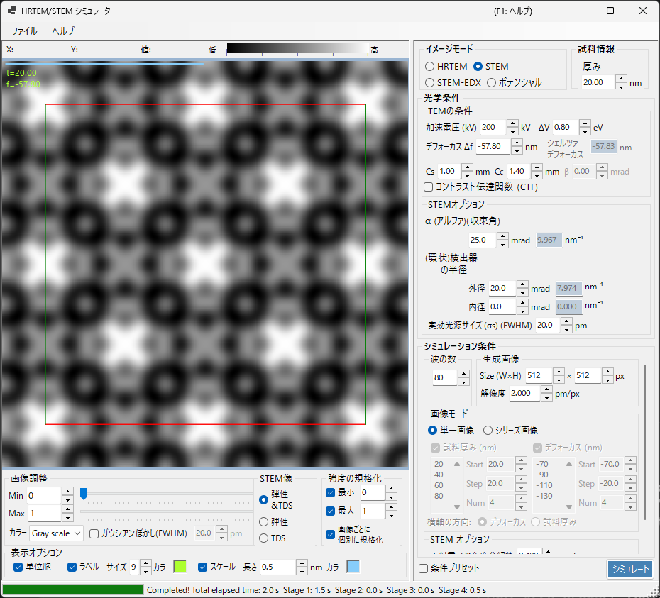

> このページは、**イメージモード = STEM** を選んだときに右側に現れる設定項目をすべて掲載します。結果の表示・明るさ調整など左側の操作は [まとめページ](index.md#結果の表示調整左側パネル) を参照してください（STEM固有の **表示対象** だけは下にも再掲します）。

---

## 概要

STEM像は、収束した電子ビームを試料上で走査し、各位置での透過・散乱電子を環状検出器で検出することで形成されます。ReciProではブロッホ波法（Dynamical 計算）でSTEM像をシミュレーションします。

### 計算手法

1. 各走査位置で、収束ビームの各入射方向に対してブロッホ波法で回折強度を計算
2. 検出器の角度範囲内の散乱強度を積算
3. 弾性散乱と熱散漫散乱 (TDS) の両方を計算可能

理論の詳細は [Appendix A3.4 — STEM の計算](../appendix/a3-bloch-wave/stem.md) を参照してください。

---

## 検出器の種類

| 検出器 | 角度範囲 | 主な寄与 | 像のコントラスト |
|--------|---------|---------|----------------|
| **BF** (明視野) | 0 〜 収束角 | 弾性散乱 | 位相コントラスト |
| **ABF** (環状明視野) | 収束角の内側 | 弾性散乱 | 軽元素に感度が高い |
| **LAADF** (低角環状暗視野) | 収束角のやや外側 | 弾性 + TDS | ひずみに敏感 |
| **HAADF** (高角環状暗視野) | 収束角の十分外側 | TDS (非弾性) | Z-コントラスト（$\propto Z^2$、原子番号の約2乗に比例） |

> **典型的な検出器設定**（STEMオプションの右クリックメニューからワンクリックで設定可能、いずれも収束角 α=25 mrad）:
> BF (0–5 mrad) / ABF (12–24 mrad) / LAADF (26–60 mrad) / HAADF (80–250 mrad)

---

## 試料情報

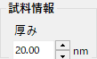

- **厚み** : 試料の厚さ (nm)。**シリーズ画像** モードのときはこの値は無視されます。

---

## TEMの条件

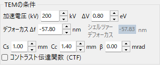

| パラメータ | 説明 | 既定値 / 典型値 |
|-----------|------|-----------------|
| **加速電圧 (kV)** | 加速電圧。相対論補正された電子波長が右に表示されます | 200 kV |
| **デフォーカス Δf** | 対物（プローブ形成）レンズのデフォーカス (nm) | −57.8 nm |
| **Cs** | 球面収差係数 (mm)。プローブ径に影響します | 0.5–1.0 mm |
| **Cc** | 色収差係数 (mm) | 1.0–2.0 mm |
| **ΔV (FWHM)** | 電子線のエネルギー幅の半値全幅 (eV) | 0.5–2.0 eV |

> **β（照射半角）はSTEMモードでは無効**です（収束角 α が役割を担うため）。

---

## STEMオプション（光学系）

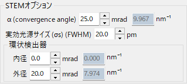

収束プローブと環状検出器のジオメトリを設定します。各角度は逆空間半径 $\sin\theta/\lambda$ への換算値 (nm⁻¹) も右に表示されます。

| パラメータ | 説明 | 既定値 / 典型値 |
|-----------|------|-----------------|
| **α（収束角）** | 収束プローブの半角 (mrad)。大きいほどプローブが細くなり、回折コントラストも変わります | 15–25 mrad |
| **(環状)検出器の内角** | 環状検出器の内側取り込み半角 (mrad)。これより内側の信号は除外 | BF: 0、HAADF: 80 |
| **(環状)検出器の外角** | 環状検出器の外側取り込み半角 (mrad)。これより外側の信号は除外 | BF: 5、HAADF: 250 |
| **実効光源サイズ σs (FWHM)** | 有効電子源サイズ。大きいほどプローブがぼけ、細部のコントラストが低下します | — |

---

## STEMオプション（計算）

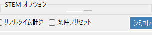

- **非弾性用スライス厚** : TDS（熱散漫散乱による非弾性）電子強度を計算する際の試料スライス厚さ (nm)。小さいほど精度は上がりますが計算は遅くなります。
- **角度分解能** : 入射プローブ方向の角度サンプリング分解能 (mrad)。小さいほどプローブを細かくサンプリングしますが計算は遅くなります。方向数はこの比の 2 乗で増えるため、計算時間を左右する最大の要素です。収束の実測値は [プローブの角度サンプリング](../appendix/a3-bloch-wave/stem.md#angular-sampling) を参照してください。

---

## 画像モード（単一 / シリーズ画像）

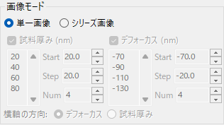

- **単一画像** : 現在の厚さで1枚のSTEM像を計算します。
- **シリーズ画像** : 厚さ・デフォーカスを段階的に変えた一連の像を生成します（**Start / Step / Num** で指定、下のリスト欄で直接編集も可能）。

---

## 生成画像

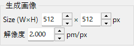

- **Size (W×H)** : 走査像のピクセル数（既定 512×512）。STEMでは走査点数に直結し、計算時間に線形に効きます。
- **解像度** : サンプリング分解能 (pm/px)。

---

## 波の数

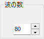

- **最大ブロッホ波数** : ベーテ法で使用するブロッホ波の最大数（既定 80）。固有値問題のコストは波数の3乗に比例します。

---

## STEM像の表示対象（結果表示側） {#stem-display-target}

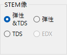

ウィンドウ左下にある表示切替で、計算済みのSTEM像のうちどの散乱成分を表示するかを選びます（計算をやり直さずに切り替え可能）。

| 表示対象 | 説明 |
|----------|------|
| **弾性** | 弾性散乱のみの像 |
| **TDS** | 熱散漫散乱のみの像 |
| **弾性 & TDS** | 弾性 + TDS の合計像 |
| **EDX** | 特性 X 線マップ。表示する線（例 `O-K`）は下のコンボボックスで選びます。*正規化* の **EDX: 共通** を入れると全チャネルが 1 つの表示レンジを共有し、チャネルを切り替えても倍率が変わりません |

!!! note
    3 つの像はいずれも Fourier 和の実部から再構成されるため、**弾性 & TDS** は他の 2 つの厳密な和になります。ver 4.944 までは絶対値をとっていたためこの一致が崩れ、暗い画素がわずかに明るくなっていました。詳細は [実数像への再構成](../appendix/a3-bloch-wave/stem.md#real-image-reconstruction) を参照してください。

---

## STEM-EDX 元素マップ {#stem-edx}

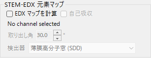

**EDX マップを計算** にチェックを入れると、ADF 系の像と同時に特性 X 線マップを計算します。別モードではありません。弾性・TDS・EDX はいずれも同じ STEM 計算から出てくるので、計算後に [STEM像の表示対象](#stem-display-target) で計算し直さずに切り替えられます。

元素を選ぶ UI はありません。チェックが入っていれば、**この結晶・この加速電圧で計算できる元素・殻チャネルをすべて**計算し、チェックの下の行にそれらを並べます（例: `3 個のマップ: O-K, Mg-K, Al-K`）。チャネルが利用できるのは、イオン化端が加速電圧より低く、かつ同梱データが収録している殻 — K: C–Sn (Z = 6–50)、L 全体: Ca–Rn (Z = 20–86) — の場合です。同梱テーブルは全チャネルの完全相対論的なイオン化形状因子を散乱ベクトル 8 Å⁻¹ まで収録しており、ラドンまでの重元素 L 線も外挿なしで計算されます。ひとつも無いときは空のマップを作らず、理由を示して実行を止めます。

次の行はプローブの方向格子で、たとえば `グリッド: 132² (推奨: 48² 以上)` と出ます。この格子は **角度分解能** と収束角で決まります（[プローブの角度サンプリング](../appendix/a3-bloch-wave/stem.md#angular-sampling)）。推奨分割数を下回ると ±q のエルミート残差が許容値を超えて計算が中断され得るため、数値が橙色になり、計算開始前に確認ダイアログが出ます。

!!! warning "この数値が表すもの"
    マップは **入射電子 1 個あたりに生成した内殻空孔の数** です。モデル上の量であって、予測される X 線カウントではありません。蛍光収率・試料内の自己吸収・検出器の立体角・検出効率はいずれも**適用されていません**。空間分布の把握や、厚さ・方位を変えたときの比較に使ってください。絶対定量には使えません。

### 検出器パラメータ（予約）

**自己吸収**・**取り出し角**・**検出器** は配置してありますが無効です。まだ実装していない検出器モデルに属するもので、実装時にパネルの配置が動かないよう先に置いてあります。効き方は種類が異なります。

| 因子 | 1 枚のマップ内の画素比 | 元素マップ間の比 |
|---|---|---|
| 自己吸収（取り出し角） | **変える** | **変える** |
| 検出器の窓・デッドレイヤ・効率 | 効かない | **大きく変える** |
| 検出器の立体角・プローブ電流・滞在時間 | 効かない | 効かない |

最後の行が、ReciPro がプローブ電流や滞在時間をそもそも設けない理由です。これらは全マップの全画素に同じ係数を掛けるだけで、比をとると消え、表示の正規化後には見えません。

### 精度と計算量

STEM-EDX に固有の上限はありません。ADF 系の像とまったく同じ計算経路を通るので、STEM で動く設定はそのまま EDX でも動きます。

精度そのものは、波数や角度分解能と同じく利用者の判断に委ねています。目安として、深さ積分の誤差は **スライス厚 (TDS)** にほぼ比例し、1 nm で約 2〜3 %、2 nm で 4〜8 %、4 nm で 12〜23 %です（ピーク基準、SrTiO₃ 39 nm での実測）。スライス厚を半分にすると誤差はおよそ半分、深さ積分の計算量はおよそ倍になります。

収差を設定した条件 (例: Cs = 1 mm + シェルツァーデフォーカス、α = 25 mrad) では、収差位相がプローブ方向グリッド上で速く振動するため、細かいグリッドでも *non-Hermitian residual* エラーで実行が拒否されることがあります。これは数 % 級の格子アーティファクトからマップを守るための拒否です。Cs・デフォーカスを小さくするか (EDX マップの走査平均は収差に全く依存しません)、**角度分解能**を大幅に細かくして計算時間の増加を受け入れてください。

---

## 計算時間に影響する要因

STEMシミュレーションは計算コストが高いため、以下のパラメータを適切に設定してください。

| 要因 | 影響 |
|------|------|
| **収束角** | 大きいほどCBEDディスクの重なりが増え、計算コストが増大 |
| **ブロッホ波の数** | 固有値問題のコストは波数の3乗に比例 |
| **角度分解能** | 細かいほど正確だが計算時間は二乗で増大 |
| **画素数（Size）** | 走査点数に線形に比例 |

---

## 温度因子の重要性

HAADF-STEM像のシミュレーションには、原子の等方性温度因子 (Debye-Waller factor) をゼロ以外に設定する必要があります。温度因子が不明な場合は $B = 0.5\ \text{Å}^2$ 程度に設定してください。温度因子がゼロの場合、TDS強度がゼロとなり、HAADF像が正しく計算されません。

| 検出器 | 範囲 | 主な寄与 |
|--------|------|---------|
| BF, ABF | 収束角内 | 弾性散乱 |
| LAADF, HAADF | 収束角外 | 非弾性散乱 (TDS) |

---

## Dr. Probe との比較

ReciProのSTEMシミュレーション結果は、広く使われている Dr. Probe GUI (v.1.10) と良好に一致することが確認されています。下図は、BF・ABF・LAADF・HAADF 検出器について厚さシリーズ（2.96〜60.05 nm）で両者を比較したものです（左: 収差なし、右: Cs = 0.2 mm, デフォーカス = −25.9 nm）。すべての検出器・厚さで両者はよく一致します。

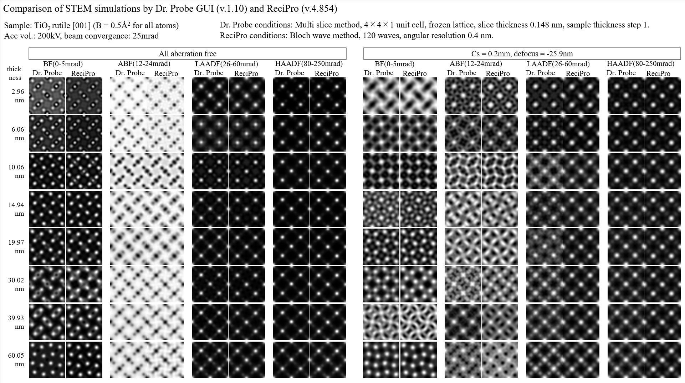

より詳細な比較は PDF で参照できます: [Comparison of STEM simulations by Dr. Probe GUI (v.1.10) and ReciPro (v.4.854)](https://github.com/seto77/ReciPro/files/10976084/ComparisonSTEMsimulations.pdf)

---

## py_multislice との比較

STEM-EDX マップは、独立したマルチスライス/フローズンフォノンのコードである [py_multislice](https://github.com/HamishGBrown/py_multislice) とも比較検証しています。下図は SrTiO₃ [001]・200 kV における O-K, Ti-K, Sr-L の各マップを、厚み系列 (3.91–62.48 nm) で比較したものです (左: 収差なし、右: Cs = 0.2 mm・デフォーカス −25.9 nm)。

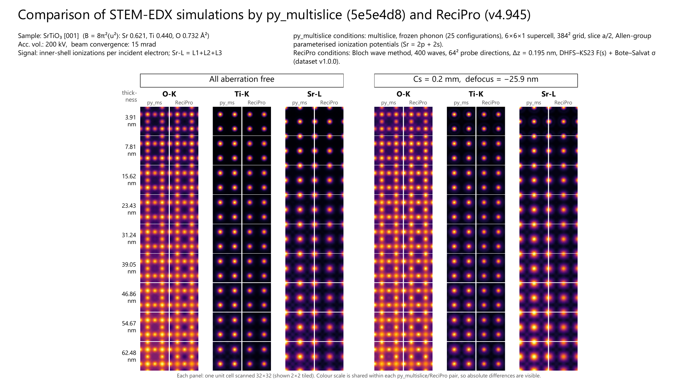

規格化したマップの形状は、薄い極限で Ti-K・Sr-L とも 1–2 % で一致します。一方**総量**は ±10–17 % 異なりますが、これは両者がイオン化断面積を別の出典から取っているためです (ReciPro は Bote–Salvat、py_multislice は Allen グループの表)。また ReciPro / py_multislice 比が厚みとともに低下するのは、ReciPro の吸収ポテンシャル模型が熱散漫散乱された電子を取り除くのに対し、フローズンフォノンではそれらが引き続きイオン化に寄与するためで、EDX における吸収近似の実用上の誤差を定量化した結果といえます。

定量比較の曲線と空間周波数解析を含む詳細版は PDF で参照できます: [py_multislice と ReciPro (v4.945、イオン化データセット v3.0.0) による STEM-EDX シミュレーションの比較](../../assets/references/STEM_EDX_pyms_comparison.pdf)。

---

## 関連項目

- [HRTEM/STEMシミュレータ（まとめ）](index.md)
- [HRTEMシミュレーション](1-hrtem-simulation.md)
- [ポテンシャルシミュレーション](3-potential-simulation.md)
- [Appendix A3.4 — STEM の計算](../appendix/a3-bloch-wave/stem.md)
