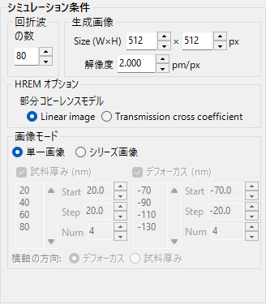

# ポテンシャルシミュレーション

**ポテンシャルシミュレーション**は、結晶ポテンシャルの2次元分布を計算・表示します。

---

## 概要

結晶内の電子は結晶ポテンシャルの影響を受けて散乱されます。ポテンシャルの分布は回折・結像現象の基礎であり、結晶構造を理解するための重要な情報です。

---

## 表示設定

### ポテンシャルの種類

| 種類 | 説明 |
|------|------|
| **Ug** | フーリエポテンシャル（構造因子に対応）。散乱の強さを表す |
| **U'g** | 吸収ポテンシャル。電子の弾性散乱チャネルからの損失を表す |

---

### 表示モード

| モード | 説明 |
|--------|------|
| **振幅と位相** | ポテンシャルの振幅と位相を表示 |
| **実数部と虚数部** | ポテンシャルの実部と虚部を表示 |

---

## 画像の調整

| 設定 | 説明 |
|------|------|
| **Min / Max** | 値の表示範囲（画像調整のトラックバー） |
| **カラー** | グレースケール or Cold-Warm |
| **単位格子** | 単位格子グリッドの重畳表示 |

---

## 関連項目

- [HRTEM/STEMシミュレータ](index.md)
- [HRTEMシミュレーション](1-hrtem-simulation.md)
- [STEMシミュレーション](2-stem-simulation.md)
