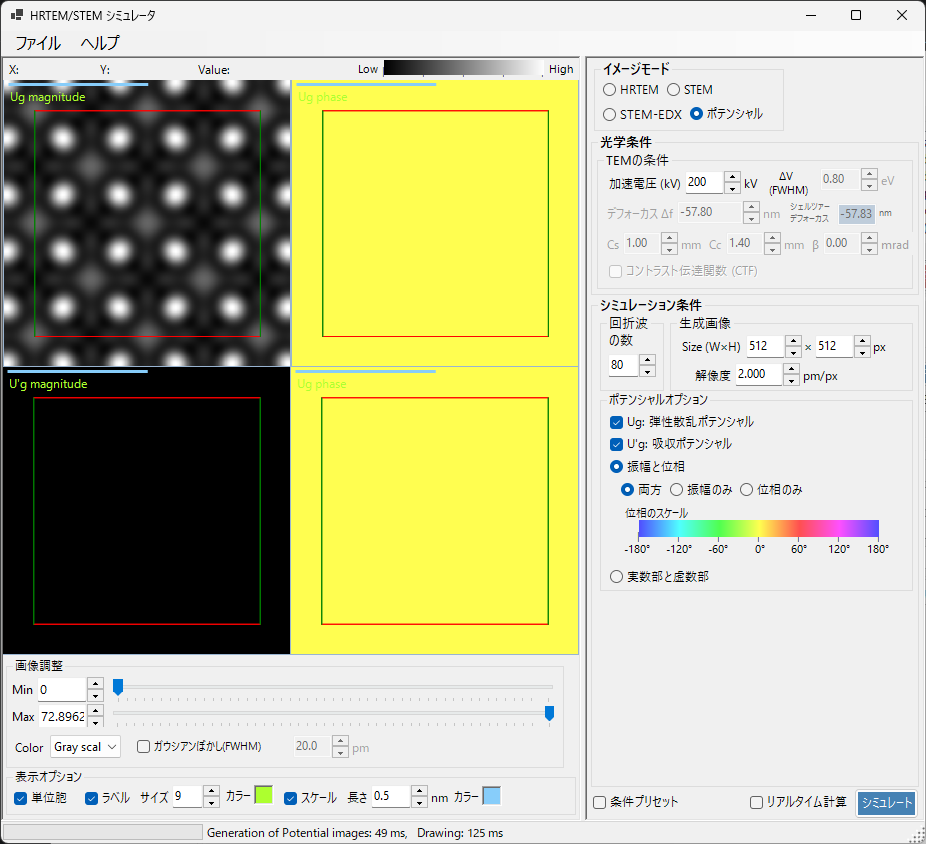

# ポテンシャルシミュレーション

**ポテンシャルシミュレーション**は、結晶ポテンシャルの2次元分布を計算・表示します。TEM/STEMの像伝達効果（レンズ収差・検出器）をかけず、投影された結晶ポテンシャルそのものを可視化します。

> このページは、**イメージモード = ポテンシャル** を選んだときに右側に現れる設定項目をすべて掲載します。結果の表示・明るさ調整など左側の操作は [まとめページ](index.md#結果の表示調整左側パネル) を参照してください。

---

## 概要

結晶内の電子は結晶ポテンシャルの影響を受けて散乱されます。ポテンシャルの分布は回折・結像現象の基礎であり、結晶構造を理解するための重要な情報です。本モードはレンズ収差や厚さ依存の動力学効果を含まないため、構造そのものの確認に適します。

> **ポテンシャルモードでは、試料厚み・強度の規格化・画像モード（単一/シリーズ）のパネルは表示されません。** TEMの条件のうち有効なのは加速電圧のみです。

---

## TEMの条件

- **加速電圧 (kV)** : 加速電圧。電子波長を決め、ポテンシャルのフーリエ係数 $U_g$ の計算に用いられます。

> **デフォーカス・Cs・Cc・β・ΔV・CTF はポテンシャルモードでは無効**です（結像光学を適用しないため）。グレーアウト表示になります。

---

## ポテンシャルオプション

表示するポテンシャルの種類と表示形式を選びます。

### ポテンシャルの種類

| 種類 | 説明 |
|------|------|
| **$U_g$: 弾性散乱ポテンシャル** | 弾性散乱を担う結晶（静電）ポテンシャル。散乱の強さを表します |
| **$U'_g$: 吸収ポテンシャル** | TDS（熱散漫散乱）に由来する虚（吸収）ポテンシャル。弾性チャネルからの損失を表します |

$U_g$ と $U'_g$ は同時に表示できます（チェックした分だけペインが並びます）。

### 表示方法

| モード | 内訳 |
|--------|------|
| **振幅と位相** | **両方** / **振幅のみ** / **位相のみ**（位相はカラーホイールで表示し、下に位相スケールが出ます） |
| **実数部と虚数部** | **両方** / **実数部のみ** / **虚数部のみ** |

---

## 生成画像

- **Size (W×H)** : 生成する画像のピクセル数（既定 512×512）。
- **解像度** : サンプリング分解能 (pm/px)。

---

## 回折波の数

- **最大ブロッホ波数** : ポテンシャルのフーリエ合成に含めるブロッホ波（フーリエ係数）の最大数（既定 80）。多くするほど高い空間周波数まで含まれ、ポテンシャルの細部が再現されます。

---

## 画像の調整（左側）

明るさ（Min / Max）、カラースケール、単位胞グリッドの重畳などは、左側の **画像調整**・**表示オプション** で行います（[まとめページ](index.md#結果の表示調整左側パネル) 参照）。

---

## 関連項目

- [HRTEM/STEMシミュレータ（まとめ）](index.md)
- [HRTEMシミュレーション](1-hrtem-simulation.md)
- [STEMシミュレーション](2-stem-simulation.md)
