# HRTEM / STEMシミュレータ

**HRTEM/STEM シミュレータ** は、選択した結晶と方位に対するTEM格子縞像（HRTEM）・STEM像・投影ポテンシャルをシミュレーションします。**シミュレート** ボタンで実行します。

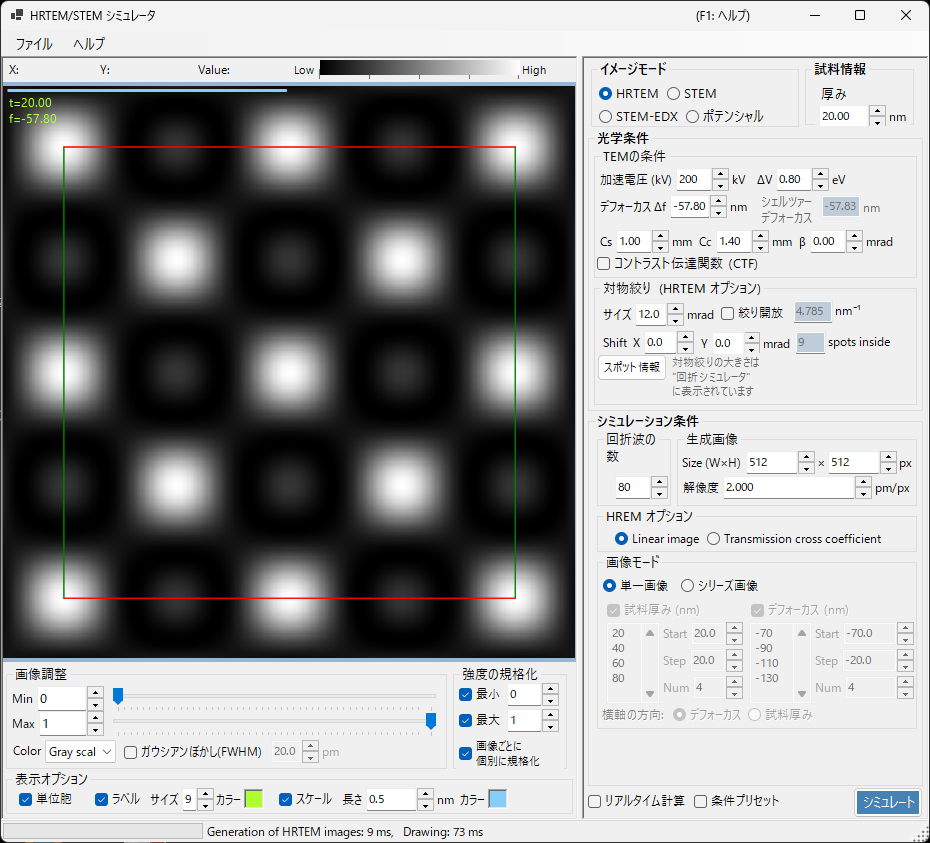

---

## キーボード・マウスショートカット

結果は1つ以上の画像ペインに表示されます。ReciPro 標準の [画像ビュー操作](../21-shortcuts.md) で、全ペインが連動して拡大・平行移動します。

| ショートカット | 動作 |
|----------------|------|
| <kbd>F1</kbd> | このページのオンラインマニュアルを開く |
| <kbd>CTRL</kbd>+<kbd>C</kbd>（画像グリッドにフォーカス時） | 画像をメタファイルとしてクリップボードへコピー |
| 左ドラッグ／中ドラッグ | 画像を平行移動（全ペイン連動） |
| ホイール上／下 | カーソル位置を中心にズームイン（×2）／ズームアウト（×0.5） |
| 右ドラッグで矩形選択 | 選択範囲にズームイン |
| 右クリック／右ダブルクリック | ズームアウト（×0.5） |
| <kbd>CTRL</kbd> ＋ 右ドラッグで矩形 | 矩形領域を選択 |
| ペインを左ダブルクリック | そのペインを最大化／グリッドに戻す（複数ペイン時） |
| マウス移動（ボタンなし） | カーソル位置の座標（pm）とピクセル値を表示 |

→ 全ウィンドウの一覧は **[21. キーボード・マウスショートカット](../21-shortcuts.md)** を参照。

---

## 目的別クイックルート

| 目的 | 最初に設定する場所 | 参照ページ |
|------|------------------|------------|
| HRTEM像を1枚計算する | **イメージモード**を **HRTEM**、**TEMの条件**で加速電圧とデフォーカスを設定 | [HRTEMシミュレーション](1-hrtem-simulation.md)、[HRTEM 像形成](../appendix/a2-bloch-wave/hrtem.md) |
| STEM像を計算する | **イメージモード**を **STEM**、**STEMオプション**で収束角と検出器を設定 | [STEMシミュレーション](2-stem-simulation.md)、[STEM の計算](../appendix/a2-bloch-wave/stem.md) |
| 投影ポテンシャルを見る | **イメージモード**を **ポテンシャル** にする | [ポテンシャルシミュレーション](3-potential-simulation.md) |
| 厚さ・デフォーカスシリーズを作る | **HREM オプション**の **Single / Serial** と画像条件を設定 | [HRTEMシミュレーション](1-hrtem-simulation.md) |
| TDSを含むHAADF-STEMを扱う | 原子の温度因子を非ゼロにし、STEM検出器を LAADF / HAADF 側へ設定 | [STEM の計算](../appendix/a2-bloch-wave/stem.md) |

---

## 基本ワークフロー

1. メインウィンドウで結晶と方位を決め、このウィンドウを開く。
2. **イメージモード**で HRTEM / STEM / ポテンシャルを選ぶ。
3. **光学特性**で加速電圧、デフォーカス、収差、絞り、STEM収束角などを設定する。
4. **シミュレーション特性**で厚さ、画像サイズ、分解能、Bloch 波数、部分コヒーレンスモデルを設定する。
5. **シミュレート**を押し、必要に応じて **表示設定**で明るさ、規格化、スケールバー、ラベルを調整する。

---

## 画像エリア

ウィンドウ左半分にシミュレーション像が表示されます。上部のステータスバーには、カーソル位置 (**X:**、**Y:**) とカーソル直下の画像の **Value:** (強度) が表示され、その右に現在のカラーマップと明るさ範囲を表す **Low → High** の強度スケールが並びます。

---

## ファイルメニュー

### ヘルプメニュー

---

## イメージモード / 試料情報

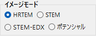{align=left}

**HRTEM**、**ポテンシャル**、**STEM** モードから選択。

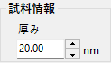{ align=left style="clear: both" }
試料の厚みを設定します。

## 光学特性 (Optical property) { style="clear: both" }

### TEMの条件

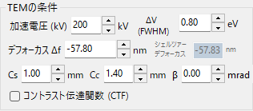

- **加速電圧 (kV)**: 加速電圧。相対論補正波長が右に表示。
- **デフォーカス Δf**: デフォーカス値。シェルツァーデフォーカスが下に表示。

#### 加速電圧

電子顕微鏡の加速電圧。値を変えると相対論補正された電子線波長 (右側に表示) と、**Cs** と合わせた **シェルツァーデフォーカス** の参考値が更新されます。

#### デフォーカス

対物レンズのデフォーカス値。弱位相物体近似で位相コントラストの伝達が最大になる値 (シェルツァーデフォーカス) が下に参考表示されます。

### 固有特性 (HRTEM 光学収差)

電子顕微鏡固有のレンズ収差パラメータ。

- **Cs** — 球面収差係数
- **Cc** — 色収差係数
- **β** — 照射半角 (有限光源効果)
- **ΔE** — 電子エネルギーゆらぎの 1/e 幅

### レンズ関数

レンズ関数のプロット。横軸 *u* の上限を変えると描画範囲が変わります。

- **sin[χ(u)]** — 位相コントラスト伝達関数 (PCTF)
- **E_s(u)** — 空間コヒーレンスエンベロープ関数
- **E_c(u)** — 時間コヒーレンスエンベロープ関数

### 対物絞り (HRTEM オプション)

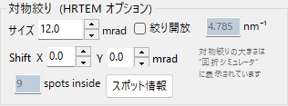

Cs, Cc, beta, delta-E。レンズ関数（PCTF、空間・時間コヒーレンスエンベロープ）。対物絞り。

#### 絞り径 (Size)

対物絞りのサイズ (mrad)。**絞りを開放** をチェックすると絞りを無効化します。絞り条件によって Bloch 波計算に含める回折スポットの数が変わります。最大数は **シミュレーション特性** の **Max Bloch waves** で制限されます。

#### シフト (Shift)

対物絞りの水平位置オフセット (mrad)。シフトした対物絞りを模擬する用途に使います。

#### Spot info

絞りを通過する反射の詳細スポット情報 (強度・複素振幅など) を一覧表示。回折シミュレータと併用してアパチャ径の妥当性を確認するときに有用。

### STEMオプション（光学系）

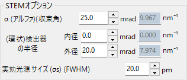

#### 収束半角

収束プローブの半角 (mrad)。STEM プローブ径と空間分解能を決めます。

#### 検出器ジオメトリ

環状検出器の内側・外側収集角 (mrad)。BF (内角小) / ABF / LAADF / HAADF (内角大) を選択。

#### スキャン領域 / ステップ

STEM 像のスキャン視野とピクセルサイズ。

---

## シミュレーション特性

### HREM オプション

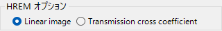

- **Max Bloch waves**: 計算に使用するブロッホ波の最大数
- 部分コヒーレンスモデル: 準コヒーレント（高速）またはTCC（正確）
- Single / Serial モード

#### Max Bloch waves

動力学計算に含めるブロッホ波の最大数。多くするほど精度が上がりますが、固有値問題の解法時間が *O*(*N*³) で増加します。

#### 生成画像 (ピクセル数 & 分解能)

シミュレートする画像のピクセル数とサンプリング分解能。分解能を上げると格子縞は細かく描けますが、スライスごとの FFT 時間が比例して長くなります。

#### 部分コヒーレンスモデル

入射ビームの全方向からの寄与を統合する際の波の干渉モデル。

- **準コヒーレント** — 高速で近似的。位相コントラスト伝達関数に空間・時間コヒーレンスエンベロープを乗じる
- **TCC (透過交差係数)** — より正確。完全な透過交差係数を積分する。線形像形成領域で厳密だが低速

[Appendix A2.2 — HRTEM 像形成](../appendix/a2-bloch-wave/hrtem.md) を参照。

#### Single / Serial モード

- **Single image** — **試料情報**の厚さと**光学特性**のデフォーカスで単一画像を計算
- **Serial image** — **Start / Step / Num** に従って厚さ × デフォーカスの行列を計算。実験像とのベストマッチ条件探索に有用

### STEM オプション（シミュレーション）

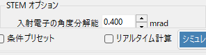

- **Bloch 波数** — HRTEM と同様。各プローブ位置ごとに適用
- **角度分解能** — プローブ方向積分のサンプル数
- **TDS の扱い** — 温度因子 *B* による熱散漫散乱を含めるかどうか。LAADF/HAADF では必須

### ポテンシャルオプション

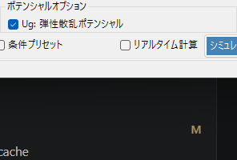

**イメージモード = ポテンシャル** 選択時に表示されます。

- **対象ポテンシャル** — **U_g** (弾性) または **U′_g** (吸収・TDS) を選択
- **表示方法** — **絶対値と位相**、または **実部と虚部**

### 生成画像

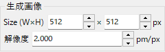

### 回折波の数

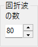

---

## シミュレーション実行

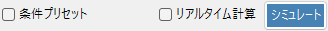

---

## 表示設定

### 画像調整

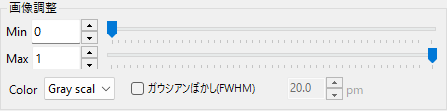

### 強度の規格化

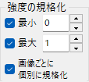

### 表示オプション

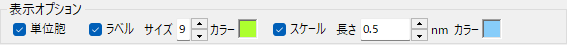

ラベル（厚さ・デフォーカス）、スケールバー、単位格子グリッドの設定。

### STEM像

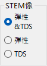

---

## STEMシミュレーション

| 検出器 | 範囲 | 主な寄与 |
|--------|------|---------|
| BF, ABF | 収束角内 | 弾性散乱 |
| LAADF, HAADF | 収束角外 | 非弾性散乱 (TDS) |

> **重要**: 非弾性散乱強度の計算には、原子の温度因子をゼロ以外に設定する必要があります。不明な場合は B = 0.5 Ų に設定してください。

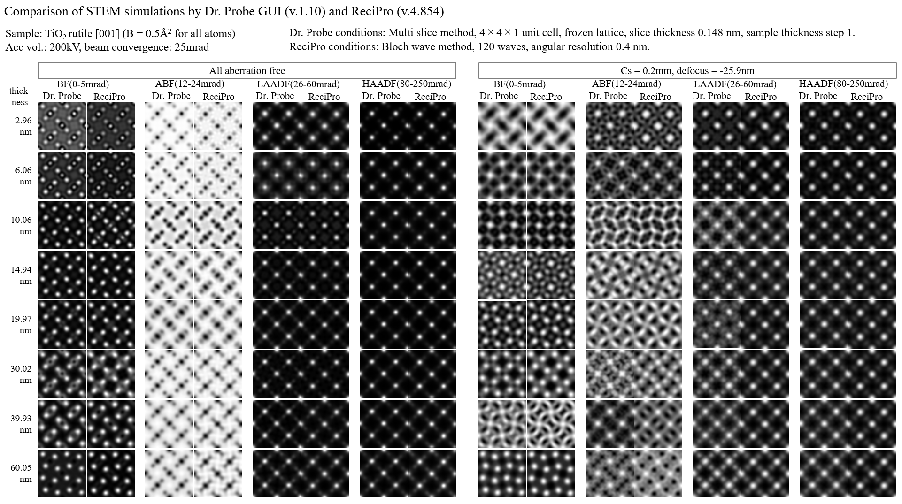

より詳細な比較は PDF で参照できます: [Dr. Probe GUI (v.1.10) と ReciPro (v.4.854) のSTEMシミュレーション比較](https://github.com/seto77/ReciPro/files/10976084/ComparisonSTEMsimulations.pdf)

詳細は [STEMシミュレーション](2-stem-simulation.md) を参照してください。
