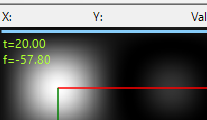
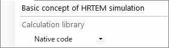

# HRTEM / STEMシミュレータ

**HRTEM/STEM シミュレータ** は、選択した結晶と方位に対するTEM格子縞像（HRTEM）・STEM像・投影ポテンシャルをシミュレーションします。**シミュレート** ボタンで実行します。

ウィンドウは大きく2つに分かれます。**左側**はシミュレーション結果の表示と見た目の調整（描画ボックス・明るさ・カラー・スケールバーなど）、**右側**は計算条件の設定（光学条件・シミュレーション条件）です。

---

## このページと各モードページの分担

- **このページ（まとめ）**: 全モードで共通の操作と、**左側の結果表示・調整** をまとめます。
- **各モードページ**: そのモードを選んだときに **右側に現れる全設定項目** を、1ページで完結するように網羅します（モード間で一部重複します）。

| モード | 内容 | ページ |
|--------|------|--------|
| **HRTEM** | 高分解能TEM格子縞像 | [HRTEMシミュレーション](1-hrtem-simulation.md) |
| **STEM** | 走査透過電子顕微鏡像（BF/ABF/LAADF/HAADF） | [STEMシミュレーション](2-stem-simulation.md) |
| **ポテンシャル** | 投影結晶ポテンシャル（$U_g$ / $U'_g$） | [ポテンシャルシミュレーション](3-potential-simulation.md) |

---

## キーボード・マウスショートカット

結果は1つ以上の画像ペインに表示されます。ReciPro 標準の [画像ビュー操作](../21-shortcuts.md) で、全ペインが連動して拡大・平行移動します。

| ショートカット | 動作 |
|----------------|------|
| <kbd>F1</kbd> | このページのオンラインマニュアルを開く |
| <kbd>CTRL</kbd>+<kbd>C</kbd>（画像グリッドにフォーカス時） | 画像をメタファイルとしてクリップボードへコピー |
| 左ドラッグ／中ドラッグ | 画像を平行移動（全ペイン連動） |
| ホイール上／下 | カーソル位置を中心にズームイン（×2）／ズームアウト（×0.5） |
| 右ドラッグで矩形選択 | 選択範囲にズームイン |
| 右クリック／右ダブルクリック | ズームアウト（×0.5） |
| <kbd>CTRL</kbd> ＋ 右ドラッグで矩形 | 矩形領域を選択 |
| ペインを左ダブルクリック | そのペインを最大化／グリッドに戻す（複数ペイン時） |
| マウス移動（ボタンなし） | カーソル位置の座標（pm）とピクセル値を表示 |

→ 全ウィンドウの一覧は **[21. キーボード・マウスショートカット](../21-shortcuts.md)** を参照。

---

## 目的別クイックルート

| 目的 | 最初に設定する場所 | 参照ページ |
|------|------------------|------------|
| HRTEM像を1枚計算する | **イメージモード**を **HRTEM**、**TEMの条件**で加速電圧とデフォーカスを設定 | [HRTEMシミュレーション](1-hrtem-simulation.md)、[HRTEM 像形成](../appendix/a3-bloch-wave/hrtem.md) |
| STEM像を計算する | **イメージモード**を **STEM**、**STEMオプション**で収束角と検出器を設定 | [STEMシミュレーション](2-stem-simulation.md)、[STEM の計算](../appendix/a3-bloch-wave/stem.md) |
| 投影ポテンシャルを見る | **イメージモード**を **ポテンシャル** にする | [ポテンシャルシミュレーション](3-potential-simulation.md) |
| 厚さ・デフォーカスシリーズを作る | HRTEMで **画像モード**の **単一 / シリーズ画像** と画像条件を設定 | [HRTEMシミュレーション](1-hrtem-simulation.md) |
| TDSを含むHAADF-STEMを扱う | 原子の温度因子を非ゼロにし、STEM検出器を LAADF / HAADF 側へ設定 | [STEM の計算](../appendix/a3-bloch-wave/stem.md) |

---

## 基本ワークフロー

1. メインウィンドウで結晶と方位を決め、このウィンドウを開く。
2. **イメージモード**で HRTEM / STEM / ポテンシャルを選ぶ。
3. **光学条件**で加速電圧、デフォーカス、収差、絞り、STEM収束角などを設定する（各モードページ参照）。
4. **シミュレーション条件**で厚さ、画像サイズ、分解能、ブロッホ波数、部分コヒーレンスモデルなどを設定する（各モードページ参照）。
5. **シミュレート**を押し、必要に応じて左側の **画像調整**・**強度の規格化**・**表示オプション**で見た目を整える。

---

## イメージモードの選択

{ align=left }

右上の **イメージモード** で計算の種類を選びます。選んだモードに応じて右側のパネル構成（光学条件・シミュレーション条件）が切り替わります。

- **HRTEM** — 高分解能TEM格子縞像 → [HRTEMシミュレーション](1-hrtem-simulation.md)
- **STEM** — 走査透過電子顕微鏡像 → [STEMシミュレーション](2-stem-simulation.md)
- **STEM-EDX** — STEMの計算条件で STEM-EDX 出力を扱う（STEMの一種）
- **ポテンシャル** — 投影結晶ポテンシャル → [ポテンシャルシミュレーション](3-potential-simulation.md)

---

## 画像エリア（左側）

ウィンドウ左半分にシミュレーション像が表示されます。上部のステータスバーには、カーソル位置 (**X:**、**Y:**) とカーソル直下の画像の **Value:** (強度) が表示され、その右に現在のカラーマップと明るさ範囲を表す **Low → High** の強度スケールが並びます。

複数枚（シリーズ画像、ポテンシャルの振幅/位相など）はグリッド状に並び、いずれのペインも連動してズーム・平行移動します。

---

## 結果の表示・調整（左側パネル）

左下のパネルでは、計算結果の見た目（明るさ・カラー・規格化・重畳要素）を調整します。これらは全モード共通で、計算をやり直さずに反映されます。

### 画像調整

- **Min / Max** : 表示する輝度レンジの下限（黒）と上限（白）。トラックバーでコントラストを調整します。
- **Color** : 画像のカラースケール。**Gray scale**（グレースケール）または **Cold-Warm**（青〜赤）。
- **ガウシアンぼかし(FWHM)** : チェックすると、右の半値全幅 (pm) でガウシアンぼかしを適用し、有限分解能（点像分布）を近似します。

### 強度の規格化

- **画像ごとに個別に規格化** : チェックすると、各画像を個別に正規化します（オフのときはシリーズ全体を共通スケールで規格化）。
- **最小 / 最大** : 正規化の下限・上限を、画像の最小/最大値ではなく右の指定値に固定します。

### STEM像の表示対象

STEMモードのときだけ表示されます。計算済みのSTEM像のうち、どの散乱成分を表示するかを切り替えます（**弾性** / **TDS** / **弾性 & TDS**）。STEM固有の項目のため [STEMシミュレーション](2-stem-simulation.md) にも掲載しています。

### 表示オプション

像に重畳する要素を設定します。

- **単位胞** : 投影単位胞の輪郭を重畳し、像コントラストと結晶格子の対応を確認します。
- **ラベル** : 厚さ・デフォーカス・指数などのラベルを重畳します。**サイズ**（フォントサイズ）と **カラー** を指定できます。
- **スケール** : スケールバーを重畳します。**長さ** (nm) と **カラー** を指定できます。

---

## シミュレーションの実行

- **シミュレート** : 現在の結晶・顕微鏡条件・厚さ・デフォーカス・表示設定で計算を実行します。
- **停止** : 実行中の計算を中断します（計算中のみ表示）。
- **リアルタイム計算** : チェックすると、結晶の回転に合わせて即座に再計算します（STEMモードでは非表示）。
- **条件プリセット** : TEM撮影条件を保存・呼び出すプリセットウィンドウの表示を切り替えます。

---

## ファイルメニュー

- **画像を保存** : PNG / TIFF / メタファイル (EMF) で保存。**個別保存** はシリーズ画像を1枚ずつ保存します。
- **画像をコピー** : 画像 または メタファイル (EMF) としてクリップボードへコピー。
- **記号オーバープリント** : 保存画像に単位胞・ラベル・スケールバーを焼き込みます。
- **TEMパラメータの読込 / 保存** : 加速電圧・収差などの光学条件をファイルに保存・復元します。

## ヘルプメニュー

- **HRTEMシミュレーションの基本原理** : HRTEM像形成の解説（[Appendix A3.2](../appendix/a3-bloch-wave/hrtem.md)）を開きます。
- **計算ライブラリ** : 計算ライブラリを選択します。**Native code**（高速な C++/Eigen）または **Managed code**（.NET）。通常は Native が高速です。

---

## 関連項目

- [HRTEMシミュレーション](1-hrtem-simulation.md)
- [STEMシミュレーション](2-stem-simulation.md)
- [ポテンシャルシミュレーション](3-potential-simulation.md)
- [動力学回折(Bloch波法)](../appendix/a3-bloch-wave/index.md)
- [回折シミュレータ](../7-diffraction-simulator/index.md)
- [電子飛程](../8-electron-trajectory.md)
