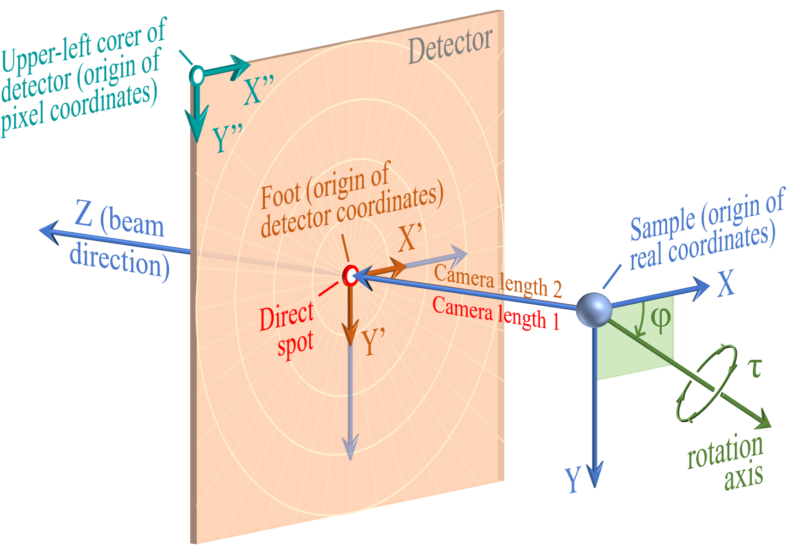
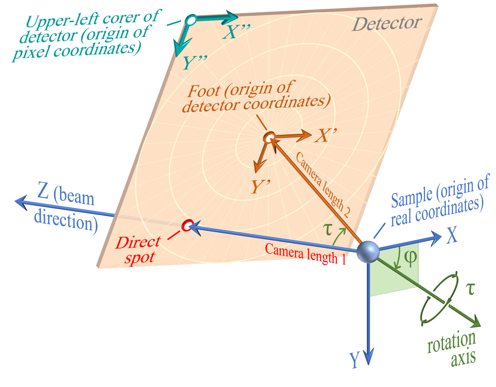

<!-- 260526Cl: 図(Coordinates4-5)に合わせ座標記号を数式(MathJax)化・用語色を図に一致 (.rp-*: docs/src/assets/stylesheets/extra.css)。 -->
# 付録 A1.2. 回折シミュレーションにおける座標系の定義

**Crystal Diffraction** 機能は、検出器上に写る回折パターンをシミュレーションします。検出器はピクセルの集合からなる有限サイズの平面で、試料から一定の距離に置かれ、入射ビームに対して傾いている場合もあります。これを正確に再現するには、検出器と試料の幾何学的関係に加え、検出器のピクセルサイズ・ピクセル数の情報が必要です。基本（方位）座標系については [A1.1. 基本座標系と結晶方位の定義](1-orientation.md) を参照してください。

!!! note "ZとYは方位の座標系とは異なる"
    検出器の座標系では、$Z$軸はビーム方向に平行で、$Y$軸は下方向です。これは方位の座標系（ビーム= $-Z$、$Y$= 上方向）とは異なることに注意してください。検出器の座標系は、画像・検出器で一般的な慣習（原点が左上、$Y$は下向きに増加）に従います。

## 回転前（検出器がビームに垂直）

3つの座標系を定義します。

- **実座標** ($X$, $Y$, $Z$) — mm単位の3次元直交座標。**試料**を原点とする。$Z$軸はビーム方向に平行で、$Z$軸方向を正面に見て $X$ は右、$Y$ は下を向く。検出器がビームに垂直のとき、$X$ / $Y$ は $X'$ / $Y'$ に平行。
- **検出器座標** ($X'$, $Y'$) — 検出器平面上のmm単位の2次元座標。**foot** を原点とする。$X'$ / $Y'$ は検出器平面上で右 / 下を向き、$X''$ / $Y''$ に平行。
- **ピクセル座標** ($X''$, $Y''$) — ピクセル単位の2次元座標。検出器の**左上隅**を原点とし、検出器のピクセル配列に沿う。

検出器がビームに垂直なとき、**foot** と**透過スポット**は一致し、**Camera length 1** と **Camera length 2** は等しくなります。

## 回転後（検出器が傾いた場合）

検出器の傾きは2つのパラメータで表現します。

| パラメータ | 説明 |
|-----------|------|
| $\varphi$ | 回転軸の方向。$XY$平面（$Z$ = 0 平面）上で、$X$軸から測った角度 |
| $\tau$ | その軸まわりの回転角（右ネジの方向） |

検出器が傾くと：

- **透過スポット**と **foot** は一致しなくなる。
- **Camera length 1** ($C_1$) = 試料から透過スポットまでの距離。
- **Camera length 2** ($C_2$) = 試料から foot までの距離。
- **検出器座標**の原点は常に **foot**、**ピクセル座標**の原点は常に**左上隅**。
- $X$ / $Y$ 方向は $X'$ / $Y'$ 方向と一致しなくなる。

## パラメータ一覧

| 用語 | 定義 |
|------|------|
| **Sample（試料）** | 入射ビームを散乱する物質。実座標の原点 |
| **実座標** ($X$, $Y$, $Z$) | 実験系のmm単位の3次元座標。原点は試料、$Z$軸は常にビーム方向に平行 |
| **透過スポット (Direct spot)** | 入射ビームと検出器の交点 |
| **Foot** | 試料から検出器平面に下ろした垂線の足。検出器座標の原点。検出器がビームに垂直なときのみ透過スポットと一致する。重ね合わせ画像モードでは foot の位置をピクセル座標で設定する |
| **検出器座標** ($X'$, $Y'$) | 検出器平面上のmm単位の2次元座標。原点は foot |
| **ピクセル座標** ($X''$, $Y''$) | 検出器平面上のピクセル単位の2次元座標。原点は左上隅 |
| **Camera length 1** ($C_1$) | 試料から透過スポットまでの距離 (mm) |
| **Camera length 2** ($C_2$) | 試料から foot までの距離 (mm) |
| **Pixel size** | 1ピクセルの一辺の長さ (mm)。正方ピクセルのみ対応 |
| **Detector width / height** | 水平 / 垂直方向のピクセル数 |
