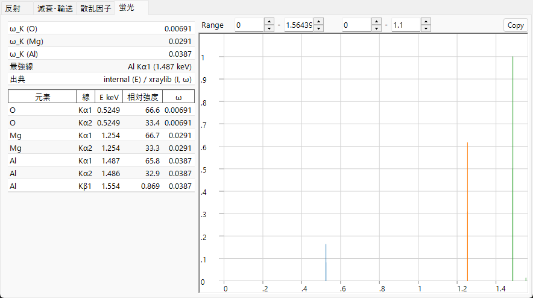

# 蛍光

X線の **光電吸収** が内殻電子を叩き出す([減衰](attenuation-transport.md)参照)と、深い準位に空孔が残ります。原子は外殻の電子を空孔に落として緩和し、放出されるエネルギーは **特性X線光子**(蛍光)として出るか、もう1つの電子を叩き出す(**Auger** 過程)かのいずれかになります。**蛍光** タブは特性光子チャネルをプレビューします。これは X線専用で、電子線・中性子線では非表示です。

---

## 特性線

殻のエネルギーが鋭く定まっているため、放出される光子エネルギーは **2つの結合エネルギーの差**

$$E_\gamma = E_B(\text{内殻}) - E_B(\text{外殻})$$

であり、その元素に固有です。

- **K 線** — $K$ 殻の空孔が $L$($K\alpha$)または $M$($K\beta$)から埋められる。
- **L 線** — $L$ 殻の空孔が $M$/$N$($L\alpha$, $L\beta$, …)から埋められる。

双極子選択則で許される遷移だけが現れるので、スペクトルは連続ではなく数本の離散線(K$\alpha_1$, K$\alpha_2$, K$\beta_1$, L$\alpha_1$, …)になります。そのエネルギーは **Moseley 則** に従います。遮蔽水素様近似では、

$$E_{n_2\to n_1} \approx R_\infty hc\,(Z-\sigma)^2\left(\frac{1}{n_1^2} - \frac{1}{n_2^2}\right), \qquad \text{したがって}\qquad \sqrt{E} \propto (Z-\sigma),$$

ここで $\sigma$ は遮蔽定数です。$K\alpha$($n_2{=}2\to n_1{=}1$, $\sigma\approx1$)ではこれが $E_{K\alpha}\approx R_\infty hc\,(Z-1)^2\left(1-\tfrac14\right)$ になります。この、電子数で決まる単調な $Z$ 依存性が元素同定(EDX/WDX)の基礎です。

---

## 蛍光収率

放射緩和と Auger 緩和の競合は **蛍光収率**

$$\omega = \frac{\Gamma_r}{\Gamma_r + \Gamma_a}$$

で表されます。これはある空孔が Auger 電子ではなく光子を放出して崩壊する確率です($\Gamma_r$, $\Gamma_a$ は放射・Auger 遷移率)。

- **軽元素** では Auger チャネルが支配的なので $\omega_K$ は小さく(C・N・O で 1% を大きく下回る)、軽元素は弱くしか蛍光しません。EDX で検出しにくい理由です。
- **重元素** では放射チャネルが勝ち、$\omega_K$ は 1 に近づきます。

残りは補完的な **Auger 収率** $a$ が担い、

$$\omega + a = 1$$

となるので、$\omega$ が小さいことは空孔の大半が Auger 放出で崩壊することを意味します。放射チャネルの中で、ある特定の線 $\ell$(例: $K\alpha_1$ と $K\beta_1$)の取り分は **分岐比**

$$p_{\ell\mid X} = \frac{\Gamma_\ell}{\sum_{\ell'\in X}\Gamma_{\ell'}}$$

で、殻 $X$ 内の相対放射率です。ReciPro は各元素の $\omega_K$ と、スペクトル中の最強線を示します。

---

## このプレビューがモデル化すること・しないこと

**EDX 発光線** 図は、各特性線をその光子エネルギーの位置にスティックで描き、高さを

$$\text{(原子分率)} \times \text{(放射率)} \times \omega$$

に比例させます。これは線がどこに来るか、おおまかな相対高さがどうかの **定性的** プレビューです。実際の定量 EDX/XRF スペクトルに必要な以下の要素は意図的に省いています。

- 入射エネルギーが空孔生成に必要な **吸収端を超えているか**(現在のエネルギーで励起できない線も描かれます)。
- **励起断面積**(選んだエネルギーで入射ビームがどれだけ効率よく空孔を作るか)。
- 試料内での放出光子の **自己吸収**(マトリックス効果)。
- **検出器効率** と分解能。

したがってこのプレビューは線の同定と相対位置の推定用であり、定量組成のためのものではありません。

---

## プレビューから定量へ

実際の EDX/XRF 分析は、線強度を **マトリックス(ZAF)補正** — 原子番号($Z$)、放出光子が試料外へ出る際の **吸収**($A$)、他の線に励起される二次 **蛍光**($F$) — と、上で触れた励起断面積・検出器応答を組み合わせて濃度に換算します。完全な形では、元素 $i$ の線 $\ell$ の測定強度は

$$I_\ell \;\propto\; C_i\,\Phi_0\,\sigma_{\text{ion},X,i}(E_0)\,\omega_{X,i}\,p_{\ell\mid X}\,\epsilon(E_\ell)\,A_\text{matrix}(E_0,E_\ell)$$

です($C_i$ は濃度、$\Phi_0$ は入射フラックス、$\sigma_\text{ion}$ は電離断面積、$\omega$ は蛍光収率、$p_{\ell\mid X}$ は分岐比、$\epsilon$ は検出器効率、$A_\text{matrix}$ は吸収・二次蛍光補正)。ReciPro のプレビューは $C_i\,p_{\ell\mid X}\,\omega$ の部分(原子分率 × 放射率 × 収率)だけを残し、他は省きます。線の位置と固有の相対強度を示し、測定スペクトル中で同定できるようにするだけです。

---

## 関連項目

- [減衰・輸送](attenuation-transport.md) — 空孔を作る吸収端、光電吸収。
- [原子散乱因子](scattering-factor.md) — 同じ束縛電子を散乱の側から見る。
- [3. ビーム相互作用 → 蛍光タブ](../../3-beam-interaction.md#蛍光タブ)
