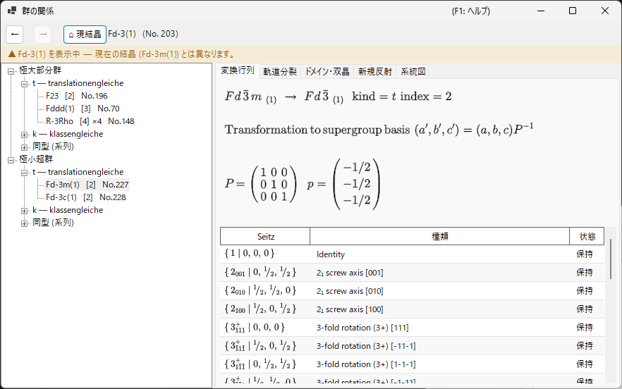
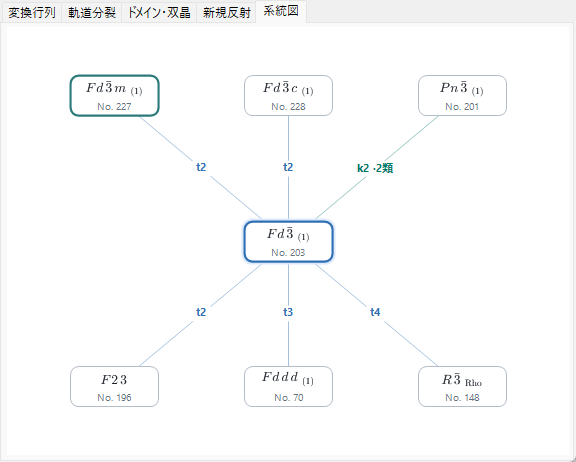
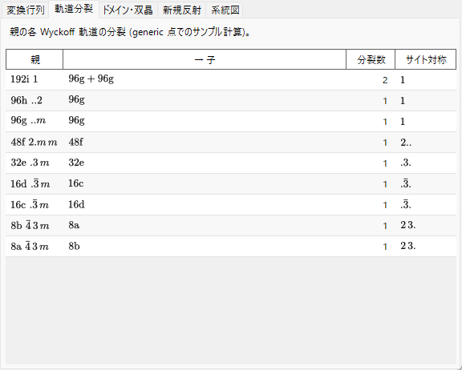
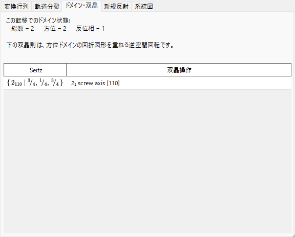

# A4.2. 群・部分群の関係

**群の関係**（Group Relations...）は、[対称性情報](../../2-symmetry-information.md) の **オプション** パネルから開く、230空間群タイプの極大部分群／極小超群の関係を閲覧するブラウザです。静的な表とは異なり、表示される各関係は、現在の空間群自身の対称操作（[A4.1](symbols-and-diagrams.md#対称操作対称操作タブ) 参照）から実行時に直接計算されます。そのため、*International Tables* Vol. A1 の転記として鵜呑みにするのではなく、操作1つ1つまで照合できます。

このページでは、まずブラウザが使う群論用語を説明し、続いて各タブの読み方を順に見ていきます。

---

## Hermann の定理: *t*-, *k*-, そして同型部分群

部分群 $H<G$ が **極大 (maximal)** であるとは、$G$ のどの部分群も $H$ と $G$ の間に厳密には存在しないことを言います。Carl Hermann による定理（1929年）は、ここで扱う3次元空間群について、$G$ のあらゆる極大部分群が次の2種類のいずれかであることを述べています。

- **translationengleiche（*t*-）部分群** — 「並進が等しい」: $H$ は $G$ の並進（同じ格子・同じ単位胞）を*すべて*保持しますが、より小さな点群を持ちます。指数 $[G:H]$（$G$ における $H$ のコセットの個数）は点群の指数 $[P_G:P_H]$ に等しくなります。
- **klassengleiche（*k*-）部分群** — 「類が等しい」: $H$ は $G$ と *同じ幾何学的結晶類（点群タイプ）* を保持しますが、$G$ の並進の部分格子のみを持ちます——より大きな慣用胞、および/または心付けベクトルの減少です。指数は並進格子の指数 $[T_G:T_H]$ に等しくなります。

**同型部分群 (Isomorphic subgroup)** は、$H$ が $G$ 自身と *同じ空間群タイプ* でもある（単に胞が大きくなっただけの）*k*-部分群の特別な、重要なケースです（この関係は際限なく繰り返せるため、同型部分群は胞の大きさで添字付けられる無限系列をなします。これは有限個しかない $G$ の *t*- および非同型 *k*-部分群とは異なります）。*極大な* 同型部分群では、指数は常に素数のべき（$p$、3次元では稀に $p^2$ や $p^3$）です。どのべきが現れるかは、有限な商格子が点群の作用のもとでどのように加群として分解するかによります。なお、部分格子への基底変換は、単に1軸方向の胞の一様な拡大だけでなく、真の基底ベクトルの変更や原点シフトを伴いうることにも注意してください。

任意の（極大とは限らない）有限指数の部分群関係は、極大なステップの連鎖として到達できるため、極大部分群（および逆方向の極小超群）だけを列挙すれば、有限指数の部分群関係の全体像を記述するのに十分です——これこそが、ITA Vol. A1 も、このブラウザも、極大／極小の関係だけを表にする理由です。

!!! note "2種類のみ — 同型はその部分集合であり、第3のものではない"
    「*t*-, *k*-, 同型部分群」の3つが並列であるかのように語られることがよくあり、実際このブラウザのツリーも便宜上3本の枝に分けて構成されています。しかし形式的には、Hermann の定理は **2** 分岐（*t* か *k* か）です。同型部分群は、単に $G$ 自身の空間群タイプを再現する *k*-部分群にすぎません。

### 指数はコセットの個数

空間群は（並進を含むため）無限群なので、ここでの「指数」は常に **$G$ における $H$ のコセットの個数** を意味し、位数の比 $|G|/|H|$（どちらも無限）ではありません——有限群では両者は一致しますが、空間群ではコセットを数える定義だけが意味を持ちます。ツリーとMatrixタブは、この指数を `t, index 2` や `k, index 3` のように表示します。

### 共役部分群と共役類

ある抽象的な部分群関係は、$G$ の中で、向きや位置が異なる幾何学的に別々の形で実現されることがよくあります——タイプは同じでも方向・位置が異なる、例えば鏡映面の鏡像や、対称的に等価だが異なる方向を向くらせん軸などです。2つのそのような実現 $H$ と $H'$ が、ある $g\in G$ について $H' = gHg^{-1}$ を満たすとき、両者は **$G$ 内で共役** であると言います。ブラウザは、ある関係のこうした $G$-共役な複製をすべて1つのエントリにまとめ、その個数を *共役類* のサイズとして報告します。これは、ITA自身が代わりに用いることもある（より粗い）$G$ のユークリッド正規化群または アフィン正規化群による同値分類よりも厳密に細かい分類です。したがって、同じタイプ・同じ指数を持つ部分群が自動的に1つの共役類に属するとは限らず、複数の類に分かれることがあります。

---

## ブラウザの操作

- **ツリー**（左ペイン）には **極大部分群** と **極小超群** の2つの根があり、それぞれが **`t — translationengleiche`** の枝、**`k — klassengleiche`** の枝、そして **`同型 (系列)`** の枝に分かれます。同じ子タイプ・同じ指数を持つ非共役な類はそのままではラベルが同一になるため、`· 類 n` の接尾辞で区別されます。
- **系統図 (Diagram)** タブは、簡略化したBärnighausen図式風の骨格を描画します。中央に現在の群（強調表示）、その上に極小超群、下に極大部分群を配置します——***t*-・*k*-・同型のいずれの関係も**、それぞれが「極大な一段」なので同じ段に並びます。各辺には種別と指数のラベル（`t2`, `k3`, `i3`）が付き、*t*=青、*k*=青緑、同型=橙で色分けされます。ノードの記号は、らせん軸の下付き数字や回反のオーバーラインを含む正式な結晶学記号として組版されます。同じ対象タイプ・種別・指数を持つ非共役な類は1つのノードに集約され、辺ラベルに類数が添えられます（例: `k2 ·2類`）——類ごとの詳細はツリー側で確認できます。1行に収まらない数の関係がある場合はノードが一段縮小され、なお収まらない分は破線の `+N` ノードにまとめられます（クリック不可——全リストはツリーで参照）。同型の辺が表示されているときは隅に `i: index ≤ 4 のみ` の注意書きが、*k*-超群の逆引きを構築中は `k: 計算中…` が表示されます。これが表すのはあくまで群論的な骨格のみです——構造的関係としての本来のBärnighausen図では、胞の変換・Wyckoff分裂・原子座標の対応関係も各辺に付記されますが、それらは図そのものではなく後述の各タブに収められています。
- **シングルクリック**（ツリーノードまたはDiagramのノード）はその関係を選択し、下部の詳細タブに内容を反映します。**ダブルクリック** は *移動* を行います——ブラウザ全体をその空間群を起点として再構成するため、群→部分群→部分群と段階的にたどっていくことができます。
- **戻る／進む／現結晶** ボタンで移動履歴をたどれます。**現結晶** は常に、このブラウザを実際に開いたときの結晶の空間群へ戻ります。
- 上部の **パンくず** には現在表示中の空間群（`HM記号 (No. n)`）が表示されます。その下の **文脈バナー** は、それが現在の結晶と一致するときは緑（「現在の結晶の空間群を表示しています。」）、別の場所へ移動しているときは黄色（「{0} を表示中 — 現在の結晶 ({1}) とは異なります。」）になります——部分群を閲覧しても結晶自体は変更されない、という注意喚起です。

---

## 変換行列タブ (Matrix)

親設定と子設定の間の基底変換・原点シフトを、ITAの規約——新しい基底ベクトルは $(\mathbf a',\mathbf b',\mathbf c')=(\mathbf a,\mathbf b,\mathbf c)\cdot P$、ある点の親設定での座標は $\mathbf x_{\text{parent}} = P\,\mathbf x_{\text{child}} + \mathbf p$——で表示します。$3\times3$ 行列 $P$ と原点シフト $\mathbf p$ は分数で表示されます。

- **極大部分群** からこの関係にたどり着いた場合、$P$ と $\mathbf p$ はそのまま表示されます（親→子の向き）。
- 代わりに **極小超群** からたどり着いた場合は、$P^{-1}$（およびそれに対応して反転したシフト）が「超群自身の部分群表から算出」という注記とともに表示されます——ブラウザは常により大きな群の視点から関係を保持しており、必要に応じてそれを逆算します（2つの独立したコピーを保持するのではありません）。
- **この類の共役部分群数: $n$** は、前節で説明した共役類のサイズを報告します。
- 生成元の表には、すべてのコセット代表元が **保持**（$H$ に残っている）または **消失**（$G$ には存在するが $H$ には無い——対称性が破れる原因そのものとなる操作）のいずれかとしてタグ付けされ、それぞれ [A4.1](symbols-and-diagrams.md#対称操作対称操作タブ) で導入したSeitz記号・幾何学的種類の記述が添えられます。
- ある候補の関係について、その目的の空間群タイプがReciProのカタログと照合して同定できなかった場合、タブは推測で埋めることなくその旨を明示し、点群記号のみを表示します。

---

## 軌道分裂タブ (Orbit splitting)

*親* 群の各Wyckoff位置が、対称性が $H$ へ低下したときにどう分裂するかを示します。1行が親の1つのワイコフ位置に対応し、親の多重度／記号／サイト対称性、結果として生じる子の多重度／記号（軌道が複数に分裂する場合は `+` で連結）、いくつに分裂したか、そして分裂後の子のサイト対称性の種類が列挙されます。

これは、**1個の固定された generic なサンプル点** を両群の操作に実際に代入し、得られる軌道を比較することで計算されます——完全に記号的なWyckoff分裂の定式化（WYCKSPLITのようなツール）ではなく、数値的に *サンプリングされた* 分裂です。そのため意図的に「Orbit splitting」（軌道分裂）と呼ばれ、「Wyckoff splitting」（Wyckoff分裂）とは呼ばれません——完全に記号的な扱いであれば原理的にすべての特殊パラメータでの一致を追跡できますが、このサンプリング方式は1個のgeneric点で見られる分裂だけを報告するものであり、$x,y,z$ の特殊な値でのみ生じる一致をそれ自体では検出できません。

***k*- および同型の関係** でも同じサンプリング方式が、粗くなった並進格子を考慮したうえで適用されます。タブには、格子並進の喪失に伴い親の各軌道がどう分裂するかが表示され、子の多重度は **拡大した部分群胞基準** で数えられます（したがって指数 $n$ の胞拡大では、分裂した各片の多重度の合計は親の多重度の $n$ 倍になります）。

---

## ドメイン・双晶タブ (Domains & Twins)

結晶が $G$ から部分群 $H$ へ転移するとき、$G$ における $H$ の $[G:H]$ 個のコセットのそれぞれが、1つの可能な **ドメイン状態** に対応します。基準状態は恒等コセットであり、それ以外の各コセット——Matrixタブの「消失」した操作1つで代表されます——は、その操作によって基準状態と関係づけられるもう1つのドメイン状態を生成します。

***t*-部分群** の場合に限っては、並進格子が変化しない（$T_G=T_H$）ため、群論的にはここで **反位相（並進）ドメイン** というものは存在しません——すべてのドメイン状態は、単なるシフトではなく、必ず真の点群操作によって基準状態と異なります。そのためこのタブは常に「反位相 = 1」「方位 = 総数」と報告します。すなわち $[G:H]$ 個のドメイン状態すべてが **方位ドメイン** です。

***k*- および同型** の転移では状況がちょうど逆になります。点群は変わらないため **方位状態はただ1つ** であり、失われた格子並進が **反位相（並進）ドメイン** を生みます——タブは「方位 = 1」「反位相 = 総数」と報告します。失われた各並進は純並進のSeitz記号として列挙され、それに対応する部分群胞座標での反位相ベクトルが添えられます。すべての反位相ドメインは同じ方位を共有するため、基本反射は厳密に重なり合い、反位相境界をまたいで位相差を持つのは超格子反射（**新規反射** タブ参照）だけです。

一組の方位ドメインに対する **双晶則** とは、消失した操作の線形部——直接格子または逆格子に作用する回転または鏡映として表されるもの——であり、一方のドメインの格子の向きをもう一方の向きへ写します。*t*-部分群への転移では、この操作は構成上 *親* 群 $G$ の格子の対称操作そのものです。そのため、低対称構造の実際の計量がその格子対称性をなお保っていれば、この双晶則を施した後で2つのドメインの逆格子は厳密に一致し、それらの回折図形は完全に重なります——このタブが記述しているのは、この理想化された場合（いわゆる完全双晶 (merohedral twinning)）です。実際の転移では、低対称相はしばしば小さな自発ひずみを生じて親の計量を近似的にしか保たないため、実際には重なりが近似的にしかならないことが多く（pseudo-merohedral な双晶）、このタブが報告するのはあくまで群論的・厳密計量での双晶則であって、実際の結晶がそれにどれだけ近いかの測定値ではありません。

コセット代表元のリストが空になる退化したケースは「(単一ドメイン)」と報告されます（指数1は関係として表示されません）。

---

## 新規反射タブ (New reflections)

*t*-部分群への転移について、$G$ では系統的に消滅していたが $H$ では対称性上許容されるようになる反射（$|h|,|k|,|l|\le4$ の範囲で探索）を一覧表示します——すなわち、親の反射条件（[反射条件](../../2-symmetry-information.md) 参照）では禁止されているが、$H$ の反射条件では禁止されない反射です。

*t*-部分群は単位胞を拡大しないため、これらは **超構造反射・分数指数反射ではありません**——親の胞のままの整数 $(h,k,l)$ であり、それをこれまで消滅させていた映進面やらせん軸が失われたために「許容」になるだけです。（親胞に対して分数指数を持つ真の超構造反射は、胞そのものが拡大して初めて生じ得るものであり、それは *t*-部分群ではなく *k*-部分群で起こります。）ここに表示される反射は対称性上 *許容* されるにすぎず、実際に観測されるかどうかは、実際の低対称構造の構造因子に依存します。

***k*- および同型の関係** では、このタブは新規反射を **拡大した部分群胞の指数で**（同じく $|h'|,|k'|,|l'|\le4$ の範囲で）一覧表示し、右端の列で次の2種類に分類します。

- **超格子反射**: 親指数に写すと *分数* になる反射。親の分数指数が括弧付きで表示されます（例: `(1/2 0 1)`）——胞が拡大したこと自体によって現れる反射です。
- **消滅則解除による反射**: 親胞でも整数指数ですが、親の反射条件によって禁止されていたものが部分群で解除された反射。解除された親の消滅則が表示されます（心付け並進の喪失——例えば $I$ 心の親が $h+k+l$ 偶数の条件を失う場合——もここに含まれます）。

親と子の両方で許容される反射（基本反射）は表示されません。子の空間群タイプが同定できなかった場合は、子の反射条件が判定できないため予測不能である旨が表示されます。

---

## 現在の制限

ブラウザの *t*- および *k*-部分群エンジン、*t*- および *k*-超群の逆引き、そして同型 (IIc) の分類は完全に実装済みであり、空間群の操作表と照合して独立に検証されています。**軌道分裂**・**ドメイン・双晶**・**新規反射** の各タブも、すべての種類の関係で実データを表示します。残る制限は、黙って省略するのではなくその旨が明示されます。

- **同型部分群の列挙は index ≤ 4 まで** です。同型系列はより高い指数へ際限なく続くため（立方晶群では $a'=3a$ だけで既に指数27）、ツリーの枝には「index ≤ 4 のみ表示 — 同型系列はより高い指数へ続きます」というグレーの注記が添えられ、一覧が完全であるかのようには表示されません。
- ***k*-超群** は初回利用時にバックグラウンドで計算されます（逆引きには同じ結晶類に属する全タイプの *k*-部分群表が必要なため）。準備が整うまで、ツリーには一時的にグレーの「計算中…」ノードが（系統図には隅の「k: 計算中…」注記が）表示されます。
- 反射の探索範囲は $|h|,|k|,|l|\le4$ に固定されており、現バージョンではユーザーが調整することはできません。

---

## 用語集

| 用語 | 意味 |
|---|---|
| 極大部分群 / 極小超群 | $G$ との間に他の部分群関係が厳密には存在しない部分群（超群） |
| 指数 $[G:H]$ | $G$ における $H$ のコセットの個数 |
| translationengleiche (*t*-) | 並進格子は同じで点群がより小さい。指数 = 点群の指数 |
| klassengleiche (*k*-) | 点群タイプは同じで並進の部分格子（より大きな胞）を持つ。指数 = 格子の指数 |
| 同型部分群 | $G$ 自身と同じ空間群タイプでもある *k*-部分群 |
| 共役類（$G$ 内） | ある部分群関係の、$G$-共役（$gHg^{-1}$）な実現の集合 |
| 方位ドメイン | 真の点群操作によって基準状態と関係づけられるドメイン状態 |
| 反位相（並進）ドメイン | 失われた並進のみによって基準状態と関係づけられるドメイン状態（*k*-への転移でのみ可能。*t*-では不可） |
| 双晶則 | 消失した操作の線形部。一方の方位ドメインの格子をもう一方へ写す |

---

## 関連項目

- [2. 対称性情報](../../2-symmetry-information.md) — 本付録が解説するGUIガイド。
- [A4.1. 空間群記号と対称性模式図](symbols-and-diagrams.md) — Matrix・ドメイン/双晶タブ全体で使うSeitz記号・幾何学的種類の語彙。
- [Appendix A4. 対称性と空間群](index.md)
