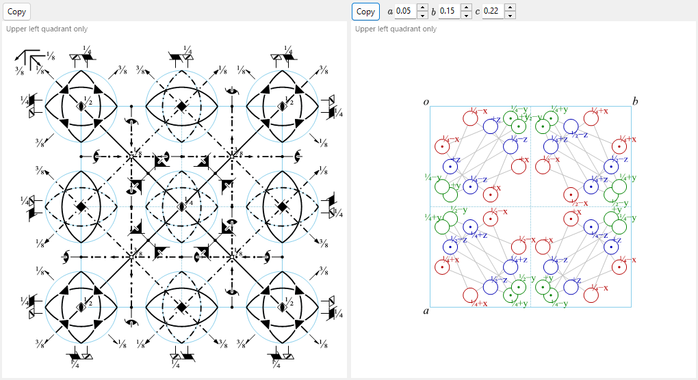

# A4.1. 空間群記号と対称性模式図

このページでは、[対称性情報](../../2-symmetry-information.md) 上部（空間群の情報パネルと **対称操作**／**群の性質**／**設定一覧** タブ）とウィンドウ下部の2つの模式図に表示されるすべてを説明します。表記はすべて *International Tables for Crystallography*（ITA）Vol. A に従います。

---

## ヘルマン・モーガン (HM) 記号

ヘルマン・モーガン記号には2つの階層があります。**点群記号**（上段のボックス、*Point Group*）は結晶の巨視的対称性のみを表し、**空間群記号**（下段のボックス、*Space Group*）はこれに格子の複合化と、らせん・映進成分を加えたものです。

### 格子文字

空間群記号は、次の7種類の標準的な格子文字のいずれかから始まります。

| 文字 | 意味 |
|---|---|
| `P` | 単純格子 |
| `A`, `B`, `C` | 一面心（それぞれ *bc*, *ac*, *ab* 面での心付け） |
| `I` | 体心 |
| `F` | 全面心 |
| `R` | 菱面体（三方晶系独自の格子。六方軸で表す場合、単位胞内に格子点が3個含まれます） |

### 対称方向

格子文字に続く記号中の各位置は、それぞれ1つの **対称方向**（結晶中で回転・らせん軸が沿う方向、および/または鏡映・映進面がそれに垂直に位置する方向）を表します。これらの位置がどの物理的方向に対応し、どの順で並ぶかは結晶系ごとに決まっています。

| 結晶系 | 第1位置 | 第2位置 | 第3位置 |
|---|---|---|---|
| 三斜晶系 | （なし — `1` または `-1` のみ） | | |
| 単斜晶系 | $[010]$（ReciProの規約でユニーク軸 $b$） | | |
| 直方晶系 | $[100]$ | $[010]$ | $[001]$ |
| 正方晶系 | $[001]$ | $[100],[010]$ | $[110],[1\bar 10]$ |
| 三方晶系・六方晶系 | $[001]$ | $[100],[010],[\bar 1\bar 1 0]$ | $[1\bar 10],[120],[\bar 2\bar 1 0]$ |
| 立方晶系 | $[100],[010],[001]$ | $[111]$（他3本の体対角線を含む） | $[1\bar 10],[110]$（他4本の面対角線を含む） |

各位置は次の規則で埋まります。

- 単独の数字 $n$（$n=1,2,3,4,6$）: その方向に沿う $n$ 回 **回転軸**。
- らせん軸 $n_p$（例: $2_1$, $4_2$, $6_3$）: $360°/n$ の回転 **と** 軸方向への格子繰り返しの $p/n$ の並進を組み合わせたもの。例えば $2_1$（「2回らせん」）は180°回転**と**軸方向へ単位胞の半分の並進を、$6_3$ は60°回転と $c$ 方向へ単位胞半分の並進を意味します。
- 回転数を伴わない単独の文字（$m,a,b,c,n,d$）: その方向に **垂直な鏡映面または映進面**（各文字の意味は後述の模式図の節と同じ）。
- $n/m$ または $n_p/m$: 回転・らせん軸 **と** それに垂直な鏡映面（両要素は同じ方向を共有し、一方は軸に沿い、一方はそれを横切ります）。
- $-n$（例: $-1,-3,-4,-6$）: **回反軸**（$360°/n$ 回転してから、軸上の1点で反転）。$-1$ 単独は純粋な反転中心を表します。「$-2$」という軸は存在しません（2回回反は鏡映と全く同じになるため、常に $m$ と書かれます）。

### 短縮記号と完全記号

**短縮**HM記号（通常引用されるもの）は、他の記載要素からすでに含意される対称要素を省略します。**完全**記号はすべての方向を書き出します。例えば空間群 No. 62 は短縮形で $Pnma$、完全形で $P\,2_1/n\,2_1/m\,2_1/a$ です——3本の $2_1$ らせん軸は、3枚の映進・鏡映面と空間群の点群 $mmm$ からすでに含意されるため、短縮記号では省略されます。ReciProの *HM 記号 (短縮)* と *HM 記号 (完全)* の両欄で確認できます。多くの空間群ではこの2つは一致します。

### シェーンフリース (SF) 記号と Hall 記号

**シェーンフリース記号**（例: $D_{2h}^{16}$）は点群タイプ（$D_{2h}$）を表し、上付き数字はその点群族の中で「これが何番目の空間群か」を単に列挙するものです——HM記号と異なり、この上付き数字自体には直接的な幾何学的意味はなく、対応表を引く必要があります。ReciProは点群・空間群の両方についてシェーンフリース記号を表示します。

**Hall 記号** は、コンピュータ処理での曖昧さのなさを目的とした別系統の記法です。生成元となる操作の最小集合と明示的な原点を列挙するため、プログラムは「このHM記号がどの設定・原点選択を意味するか」という対応表を引かずに、正確な座標集合を再構成できます。Hall記号はある操作集合を表す**唯一**の記法ではありません（生成元の選び方が異なれば、同じ群に対して異なるが同様に妥当なHall記号が得られます）が、いずれも単独で完全に明示的・可逆です。ReciProは現在の設定に対して体系的に生成した1つのHall記号を表示します。**設定一覧** タブ（後述）には、現在の空間群番号を共有するすべての収録済み原点・設定選択が、それぞれのHM記号・Hall記号とともに一覧表示されます。

---

## 対称操作（対称操作タブ）

**対称操作** タブには、現在の設定における一般位置のすべての対称操作（格子心付けの並進はすでに展開済み）が、3通りの表記で並記されます。

| 列 | 例 | 意味 |
|---|---|---|
| 座標 | `-y, x-y, z+1/3` | 座標トリプレット $(x,y,z)\mapsto(x',y',z')$、すなわちアフィン写像 $x'=Rx+t$ を代数的に書き下したもの（ITA/CIF の慣例）。 |
| Seitz | `3+ [111]` | 簡潔な記号: 回転・らせんの位数と向き（`3+`）、軸方向（`[111]`）、並進があればそれ（例: `2₁ [001] 0,0,1/2`）。純粋な鏡映は `m`、恒等操作は `1`、反転は `-1`。 |
| 種類 | `3-fold rotation (3+) [111]` | 操作の平易な分類: `Identity`（恒等）、`Inversion centre at …`（反転中心）、`n`回回転、$n_p$らせん軸、鏡映面 $m$、$a/b/c/n/d$映進面、あるいは $n$ 回回反のいずれかを、方向（反転中心は位置も）付きで表します。 |

**コピー (CIF)** ボタンで、全操作リストをCIFの `_space_group_symop_operation_xyz` ループとしてクリップボードにコピーできます。ここで導入したSeitz記号・幾何学的種類の語彙は、[A4.2](group-subgroup-relations.md) 全体で——部分群関係の保持/消失した各生成元の記述として——繰り返し使われます。

---

## 群論的分類（群の性質タブ）

**群の性質** タブは、現在の空間群についての標準的な分類を報告します。このうち中心対称・Sohncke・極性（およびそれらから導かれる下記の物性許容）は、各操作の **線形部（行列部）** $R$（回転または鏡映を表す線形部分）から——中心対称についてはさらに並進部分も込みで——直接決まります。それ以外の項目——Symmorphic・掌性対の相手・結晶族/格子系/ブラベー型・算術結晶類・Patterson対称——は、個々の操作というより空間群 *タイプ* 全体の性質（IT番号・格子型・Laue類）です。いずれも計量（単位胞の形状）には依存せず、空間群タイプの対称的な内容と分類だけで決まります。

**中心対称 (Centrosymmetric)** — 操作集合が $\{-I \mid t\}$ の形の操作（点 $t/2$ を中心とする反転。原点である必要はありません）を含むこと。以下の Sohncke・極性の性質はこれと両立しません。反転中心はあらゆる方向を反転させるため、中心対称群は極性を持ちえず、また $-I$ の行列式は $-1$ なので、中心対称群は Sohncke 群にもなりえません。

**Sohncke 群 (キラル)** — *すべて*の操作の線形部が $\det R=+1$ を満たすこと。すなわち群は真の回転・らせん回転のみを含み、鏡映・映進・反転・回反を一切含みません。230タイプ中65タイプがSohncke群です。Sohncke群であることは、構造がその鏡像を含むことなく特定の掌性を持つ物体（キラル分子・タンパク質・水晶、…）と両立するための対称性条件です。これは、230タイプの中で自身の鏡像となる別タイプを持つ本当の意味での「対」（下記「掌性対の相手」参照）のメンバーであることよりも広い概念です。

**掌性対の相手 (Enantiomorphic partner)** — 65のSohncke型のうち、11対（22タイプ）は、向きを反転する変換によってのみ互いに関係づけられ、いかなる真の（向きを保つ）変換によっても関係づけられません。すなわち、これらの空間群のどれか一方に鏡映を施すと必ずもう一方になり、軸の付け替えでは決して元に戻りません。この11対は、逆向きの掌性を持つらせん軸で構成されています。

$$P4_1 / P4_3,\ \ P4_122 / P4_322,\ \ P4_12_12 / P4_32_12,\ \ P3_1/P3_2,\ \ P3_112/P3_212,\ \ P3_121/P3_221,$$
$$P6_1/P6_5,\ \ P6_2/P6_4,\ \ P6_122/P6_522,\ \ P6_222/P6_422,\ \ P4_332/P4_132.$$

残る $65-22=43$ のSohncke型は、（そのタイプに属する個々の構造自体は依然として掌性を持つとしても）タイプとしては自分自身の鏡像と一致します。

**Symmorphic** — 73の空間群タイプの1つであり、原点を適切に選ぶことで、格子並進を法として*すべて*のコセット代表元が固有（らせん・映進）並進成分を持たないようにできるもの——同じことですが、単位胞内のある点のサイト対称群が点群全体と同型になっている場合です（もちろん心付けの並進はそのまま残ります。「Symmorphic」は格子についてではなく、点群操作の非単純並進部分についての言明です）。Symmorphic空間群は常に点群と格子だけから生成でき、その原点で記述する限りらせん軸・映進面を必要としません——そしてこれは、ITA自身がSymmorphicなタイプに対して実際に収録している原点そのものなので、その標準的な短縮記号・完全記号にはすでにらせん・映進の文字は現れません。（同じ群の操作を、シフトした原点や心付け並進だけずらした原点で記述し直すと、個々の操作の表記上はらせん・映進の並進を持つように見えることがありますが、それによってそのタイプのSymmorphicという分類が変わるわけではありません——分類が問うのはそのような並進を持たない原点が「存在するかどうか」だけであり、この73タイプについては実際に存在します。）

**極性 (Polar)** — すべての操作の線形部について $Rv=v$ を満たす方向 $v$ が存在するかどうか（$\pm v$ ではありません。真の極性方向は、反転されたり2回軸として残るだけでなく、厳密に保存されなければなりません）。該当する場合は、**なし**（該当方向なし）／単一の軸 $[uvw]$／面全体（その面内のあらゆる方向）／**あらゆる**方向（点群 $1$ のみ）のいずれかです。極性軸とは、自発電気分極が対称性上許容される方向です（下記の物性の表を参照）。

**結晶族・格子系・ブラベー型** — 結晶系より上位のIUCr標準分類階層です。全部で6つの **結晶族**、7つの **結晶系**、7つの **格子系**、14種類の **ブラベー格子型** があります。注意が必要なのは **六方晶族** です。**結晶系** としては*三方*晶系と*六方*晶系に分かれますが、**格子系** としてはそれとは異なり*六方*格子系と*菱面体*格子系に分かれます——三方晶系の空間群は、格子が $P$型なら六方格子系に、$R$心付けなら菱面体格子系に属し、これは三方晶系・六方晶系のどちらの結晶系に属するかとは独立です。

**算術結晶類 (Arithmetic crystal class)** — （方向まで特定した）点群記号とブラベー格子文字の組み合わせ、例えば `4mmP` です。全部で73の算術結晶類があります。一部の点群記号（六方格子に対する $3m$ 点群の2通りの非同値な配置を表す `3m1` と `31m`）はすでにそれ自体が格子に対する向きを表しているため、方向まで特定した点群記号と格子文字さえ組み合わせれば、その類を曖昧さなく指定できます。

**Patterson 対称** — 格子型と *Laue 類*（空間群自身の点群に $-1$ を加えて得られる中心対称点群）の組み合わせで、らせん・映進の情報はすべて捨象されます。例えば直方晶系 $P$格子の30空間群はすべて、映進面の有無にかかわらず `Pmmm` になります。これは（運動学的近似での）回折 **強度** $|F|^2$ から計算されるPatterson関数の対称性です。$|F|^2$ は映進・らせん並進が引き起こす位相のずれに鈍感だからです（ただし、それが引き起こす系統的消滅や、Patterson図上のHarkerピークからは、間接的にその存在が示唆されることがあります）。動力学的電子回折ではこの運動学的描像は厳密には成り立ちません。[Appendix A3](../a3-bloch-wave/index.md) を参照してください。

### 物性の対称性許容

群の性質タブの末尾の行は、与えられた巨視的物性が現在の点群の対称性で **許容されるか** を報告します——これは必要条件であり、実際の結晶でその効果が大きい、あるいはそもそも存在することを保証するものではありません（Nye "Physical Properties of Crystals" の慣例）。

| 物性 | 対称性条件 | 該当点群 |
|---|---|---|
| 焦電性 / 強誘電性 | 極性（1階の極性ベクトル——自発分極——が許容される） | 10個の極性点群 |
| 圧電性 | 非中心対称 **かつ** 点群 $\ne 432$ | 21個の非中心対称点群のうち20個 |
| 第二高調波発生（バルク電気双極子 $\chi^{(2)}$） | 圧電性と同じ条件（3階の極性テンソル） | 圧電性と同じ20点群 |
| 旋光性（自然光学活性） | 真の回転のみを含む11点群、および純粋なSohncke群ではないが旋光性を示す残り4点群 | $1,2,3,4,6,222,32,422,622,23,432$ および $m,mm2,\bar4,\bar42m$ — 合計15点群 |

$432$ は、非中心対称でありながら圧電性・SHG応答を持たない唯一の点群です。（立方晶系の真の回転のみからなる）回転対称性が高すぎるため、いかなる3階の極性テンソル成分も生き残れません。

!!! note "対称性上許容 = 実際に観測されるとは限らない"
    この表の各行は、点群が「許容する」ことを述べているにすぎません。実際の結晶が分極を切り替えられるか（真の強誘電性）、実用上意味のある圧電・SHG応答を示すかは、対称性だけでなく化学組成や構造の詳細に依存します。

### 設定一覧タブ

現在の空間群と同じIT番号を共有するすべての収録済み原点・軸設定の選択（例えば $Fd\bar 3m$ の2つの原点選択、あるいは単斜晶系のさまざまな胞の選び方）を、それぞれのHM記号・Hall記号とともに一覧表示します。現在表示中の設定に対応する行にはマークが付きます。このタブは選択肢の閲覧専用であり、行を選んでも結晶は変更されません。

---

## 対称要素の模式図

左側の模式図は、**Direction**（`a`/`b`/`c`）で選んだ投影軸に沿って見た、現在の設定に対するITA Vol. A様式の対称性模式図を再現します。

**紙面に垂直な軸** は、回転の位数を表す図形で塗り潰した点記号として描かれ、らせん軸には小さな「尾（フィン）」が付きます（その本数と配置は、らせんのピッチ $p$ だけでなくその掌性（回転方向）も表すため、例えば同じ位数で逆向きのらせんである $3_1$ と $3_2$ は、単に尾の本数が違うのではなく互いに鏡像となる尾のパターンで描き分けられます）。

| 記号 | 対称要素 |
|---|---|
| 塗り潰したレンズ形（先の尖った楕円） | 2回回転軸 |
| フィン付きのレンズ形 | $2_1$ らせん軸 |
| 塗り潰した三角形 | 3回回転軸 |
| 尾付きの三角形 | $3_1$ / $3_2$ らせん軸 |
| 塗り潰した四角形 | 4回回転軸 |
| 尾付きの四角形 | $4_1$ / $4_2$ / $4_3$ らせん軸 |
| 塗り潰した六角形 | 6回回転軸 |
| 尾付きの六角形 | $6_1 \ldots 6_5$ らせん軸 |
| 小さな白丸 | 反転中心（$-1$） |
| 白・塗り潰し複合記号 | 回反軸（$-3,-4,-6$） |

紙面に対して斜め、または紙面内にある軸（立方晶系の $\langle 111\rangle$ 体対角線や $\langle 110\rangle$ 面対角線のような特別な方向でのみ生じます）は、同じITAの慣例に従い、軸足に点記号を添えた矢印として描かれます。

**面** は、映進の種類を表す線種で描かれます——文字は映進ベクトルがどの格子方向に沿うか（あるいは対角/四分の一胞であるか）を表し、その並進が紙面「内」にあるか紙面から「垂直に出る」かは選んだ投影軸に依存します。

| 線種 | 面 |
|---|---|
| 実線 | 鏡映面 $m$ |
| 長い破線 | 軸性映進 $a$ または $b$ |
| 点線 | 軸性映進 $c$（多くの場合、並進が紙面から垂直に出る場合） |
| 一点鎖線 | 対角映進 $n$ |
| 矢印付き一点鎖線 | ダイヤモンド映進 $d$（四分の一胞の並進。複合格子でのみ生じます） |
| 二重線 | 「二重映進」$e$ — 独立な2つの映進ベクトルが同一平面上に共存（複合格子でのみ、映進とその心付け並進で移された相方が同じ面を通る場合に生じます） |

記号の脇にある分数の高さラベル（例: `1/4`）は、その要素が高さ0の面内にない場合の投影軸方向の座標を表します。

!!! note "F格子の立方晶群: 1/8領域のみを描画"
    立方晶系の $F$心付け空間群では、ReciProは単位胞の1/8の左上四分円のみを描画します（そうしないと図が密集しすぎて読めなくなるためです）。単位胞全体は、この心付け並進と描画済みの対称要素自体によって繰り返されます。同じ対称要素は [Structure Viewer](../../5-structure-viewer.md) の3Dモデル上に直接重ねて表示することもできます。

---

## 一般位置の模式図

右側の模式図は、一般等価位置——ある一般点 $(x,y,z)$ の空間群のすべての操作による軌道——を、同じくITA様式でプロットします。

- 各 **円** は、点の対称等価な複製の投影を表します。
- 円の中の **コンマ** は、第2種の操作（鏡映・映進・反転・回反）によって生成された複製を表します——元の点に置いたキラルな試験対象の掌性が反転している状態で、ITA自身で使われる鏡像・非鏡像のペアと全く同じです。
- **分割円**（半分が無地、半分がコンマ）は、真の操作による複製と第2種の操作による複製が同じ位置に投影される場合を表します。
- 円の脇の高さラベル（`+`、`−`、`½+`、…）は、そのコピーの投影軸方向の座標を基準点との **相対値** として表します——`+` は「$z$ の高さ」、`−` は「$-z$ の高さ」、`½+` は「$z+\tfrac12$ の高さ」を意味し、絶対的な高さではありません。
- （立方晶系のみ）体対角線 $\langle111\rangle$ の3回軸で結ばれる3つの円を、細い補助線がつなぎます。
- 一般には、1個の円（または分割円の半分）が1個の等価位置に対応するため、円の数は [Wyckoff Positions（ワイコフ位置）](../../2-symmetry-information.md) タブに表示される一般位置の **多重度** と一致します——どちらの図を読むときにも簡便な確認手段になります。ただし、選んだ投影軸によって同じ掌性の複数の複製がちょうど重なってしまう場合は、別々の円として並べて描かれるのではなく（高さラベルだけで区別される形で）同じ位置に重ねて描かれるため、見た目の円の数が多重度より少なくなることがあります。

**Direction** の下にある `numericBox` 欄では、試験点 $(x,y,z)$ をその点群の既定位置から動かすことができます。複数の円が重なって図が見づらい場合に有用です。

---

## 関連項目

- [2. 対称性情報](../../2-symmetry-information.md) — 本付録が解説するGUIガイド。
- [A4.2. 群・部分群の関係](group-subgroup-relations.md) — ここで導入したSeitz記号・幾何学的種類の語彙を引き続き使います。
- [Appendix A4. 対称性と空間群](index.md)
