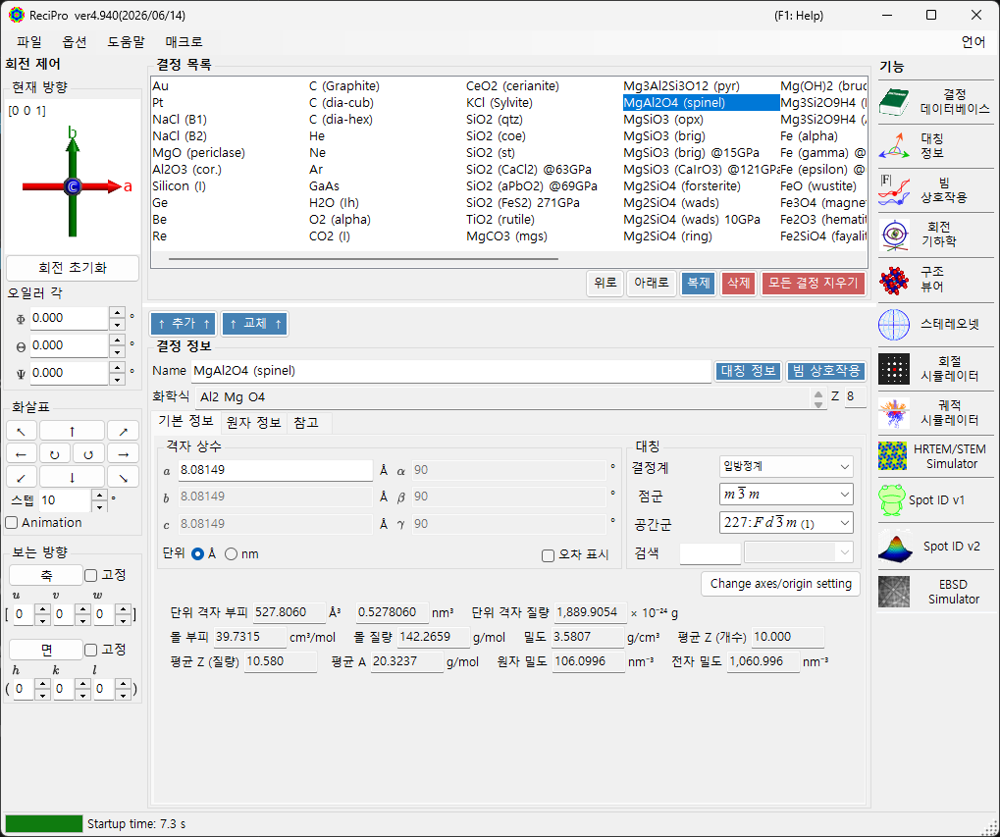
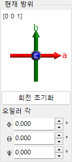
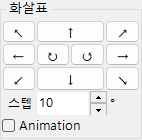
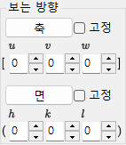
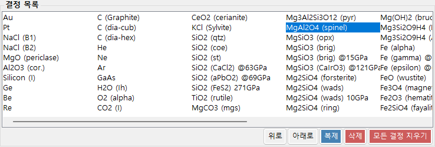
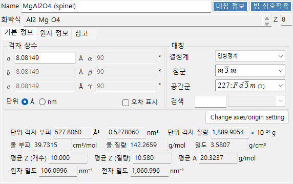
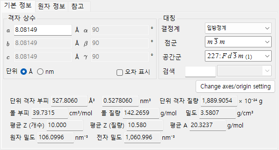
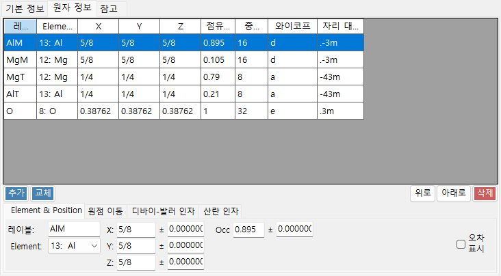
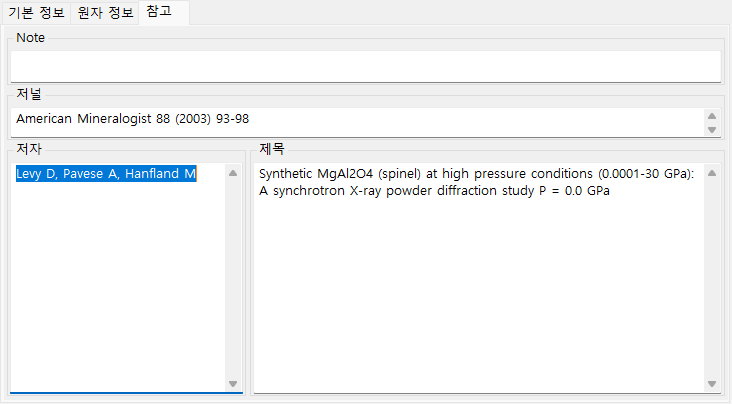
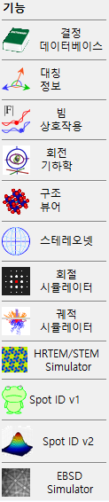

# 메인 창

ReciPro를 실행하면 메인 창이 나타납니다. 이 창에서 결정을 선택하고, 그 회전을 제어하며, 다양한 기능을 호출합니다.

| 영역 | 위치 | 설명 |
|------|----------|-------------|
| **파일 메뉴** | 상단 | 파일 작업, 옵션, 도움말 |
| **회전 제어** | 왼쪽 | 결정 방향 보기/설정 |
| **결정 목록** | 중앙 상단 | 결정 선택 및 관리 |
| **결정 정보** | 중앙 하단 | 격자 상수, 대칭, 원자 편집 |
| **기능** | 오른쪽 | 시뮬레이션/분석 창 실행 |

---

## 키보드 & 마우스 단축키 {#keyboard-mouse-shortcuts}

메인 창은 여러 개의 **응용 프로그램 전역** 단축키를 설치합니다. 구조 뷰어, 스테레오넷, 회절 시뮬레이터, Spot ID, 계산기 창이 포커스를 가지고 있는 동안에도 계속 동작합니다.

| 단축키 | 동작 |
|----------|--------|
| <kbd>F1</kbd> | 온라인 매뉴얼의 이 페이지 열기 |
| <kbd>CTRL</kbd>+<kbd>SHIFT</kbd>+<kbd>D</kbd> | **회절 시뮬레이터** 열기 / 닫기 |
| <kbd>CTRL</kbd>+<kbd>SHIFT</kbd>+<kbd>V</kbd> | **구조 뷰어** 열기 / 닫기 |
| <kbd>CTRL</kbd>+<kbd>SHIFT</kbd>+<kbd>S</kbd> | **스테레오넷** 열기 / 닫기 |
| <kbd>CTRL</kbd>+<kbd>SHIFT</kbd>+<kbd>T</kbd> | **Spot ID** 열기 / 닫기 |
| <kbd>CTRL</kbd>+<kbd>SHIFT</kbd> + 화살표 키 | 해당 방향으로 결정을 한 단계 회전 (두 개의 화살표를 함께 눌러 대각선) |
| <kbd>CTRL</kbd> 두 번 두드리기 | **계산기** 열기 / 닫기 |
| <kbd>CTRL</kbd>+<kbd>SHIFT</kbd>+<kbd>R</kbd> | 선택한 결정의 **Reserved** 플래그 전환 |
| ReciPro 시작 시 <kbd>CTRL</kbd> 누르고 있기 | OpenGL을 비활성화한 상태로 시작 (그래픽 문제 복구용) |
| 방향 위젯을 왼쪽 드래그 (왼쪽 하단, *Current Direction* 아래) | 결정 회전 |
| 방향 위젯을 오른쪽 더블 클릭 | 위젯 이미지를 클립보드에 복사 |
| 기능 버튼 한 번 클릭 | 해당 창 열기 / 닫기 |
| 기능 버튼 더블 클릭 | 창을 강제로 표시하고 맨 앞으로 가져오기 |
| 목록에서 결정을 오른쪽 클릭 | 컨텍스트 메뉴 (이름 바꾸기 / 복제 / 삭제 / CIF 내보내기…) |
| **Current Index** 레이블 더블 클릭 | max-UVW 상자 표시 / 숨기기 |
| 창에 파일 끌어다 놓기 | 결정 목록 (`.xml`, `.cdb2`) 또는 결정 (`.cif`, `.amc`) 불러오기 |

→ 모든 창을 한눈에 보려면 **[21. 키보드 & 마우스 단축키](21-shortcuts.md)**를 참조하십시오.

---

## 기본 작업 흐름

ReciPro를 처음 사용하는 경우 다음 단계를 참조하십시오:

1. **결정 목록**에서 대상 결정을 선택합니다. CIF/AMC 파일을 사용하려면 **결정 정보**로 끌어다 놓으십시오.
2. 격자 상수나 원자 위치를 편집한 경우, 변경 사항이 결정 목록에 다시 기록되도록 **Add** 또는 **Replace**를 누르십시오.
3. **회전 제어**에서 정대축, 결정면, 오일러 각도 또는 마우스 드래그를 사용하여 결정 방향을 설정합니다.
4. **기능**에서 원하는 도구를 엽니다. 회절, HRTEM/STEM, EBSD 및 기타 계산 창은 현재 선택된 결정과 방향을 사용합니다.

---

## 파일 메뉴

### File

| 메뉴 항목 | 설명 |
|-----------|-------------|
| Read crystal list (as new list) | 결정 목록 파일(*.xml)을 불러오고 현재 목록을 대체 |
| Read crystal list (and add) | 현재 목록에 추가 |
| Read initial crystal list | 기본 결정 목록 다시 불러오기 |
| Save crystal list | 현재 결정 목록 저장 |
| Export selected crystal to CIF | CIF 형식으로 저장 |
| Clear crystal list | 모든 결정 제거 |
| Exit | 응용 프로그램 닫기 |

### Option

| 메뉴 항목 | 설명 |
|-----------|-------------|
| Show Tooltips | 툴팁 표시 전환 |
| Use Miller-Bravais (hkil) index | 응용 프로그램 전체에서 삼방/육방 결정계에 4-지수 표기법 사용 |
| Reset registry settings on exit (effective after restart) | 다음 재시작 시 설정 초기화 |
| Disable Crystallography.Native library (requires restart) | 네이티브(C++) 라이브러리를 불러오지 못할 경우 관리 코드로 대체 |
| Disable all OpenGL rendering (requires restart) | 구형 GPU / 원격 데스크톱용 |
| Disable OpenGL text rendering (requires restart) | 일부 GPU의 텍스트 렌더링 문제에 대한 임시 해결책 |
| Use MKL Library | 수치 루틴에 Intel MKL 사용 |
| Dark mode | 밝은 색상 테마와 어두운 색상 테마 간 전환 |
| Powder diffraction function (under development) | 다결정(분말) 회절 창 활성화 |
| Capture GUI Components… | GUI 스크린샷 저장용 개발자 도구 |

### Help

| 메뉴 항목 | 설명 |
|-----------|-------------|
| Program updates | ReciPro의 새 버전이 있는지 확인하고 설치 |
| Hint | 사용 힌트 표시 (사용 중단됨) |
| Version history | 버전 기록 대화 상자 열기 |
| License | MIT 라이선스 표시 |
| GitHub page | 브라우저에서 ReciPro 저장소 열기 |
| Report bugs, requests, or comments | GitHub Issues 페이지 열기 |
| Help (Web) | UI 언어와 일치하는 페이지로 GitHub Pages의 온라인 매뉴얼 열기. |

언어는 별도의 **Language** 메뉴에서 전환합니다 (영어/일본어, 재시작 필요).

### Language

UI 언어를 영어와 일본어 사이에서 전환합니다. 변경 사항은 ReciPro를 재시작한 후 적용됩니다.

### Macro

[매크로](20-macro/index.md) 창을 열어 Python 스타일 스크립트로 ReciPro 작업을 자동화합니다. 반복되는 작업 흐름은 [내장 함수](20-macro/1-built-in-functions.md) 및 [매크로 예제](20-macro/2-examples.md)를 참조하십시오.

---

## 결정 방향 제어

결정의 회전 상태는 회절 시뮬레이터, 구조 뷰어, 스테레오넷, HRTEM/STEM 시뮬레이터, EBSD 시뮬레이터 및 기타 창에서 공유됩니다. 이는 단순한 보기 설정이 아니라 — 입사빔 방향과 시뮬레이션에 사용되는 결정 좌표 관계를 정의합니다. 짧은 비디오 튜토리얼은 [사용법](appendix/a0-how-to-use.md) 페이지에서 볼 수 있습니다.

### 현재 방향

결정 방향을 표시합니다. 드래그하여 회전합니다. 축: 빨강 = *a*, 초록 = *b*, 파랑 = *c*.

### 회전 초기화
초기 상태로 재설정: *c*-축이 화면에 수직, *b*-축이 위쪽.

### 정대축
화면 법선에 가장 가까운 정대축을 표시합니다 (예: *u*+*v*+*w* < 30).

### 오일러 각도 (Z-X-Z)
**Z–X–Z** 오일러 각도로 결정 방향을 설정합니다:

- \(\Phi\): Z-축 회전
- \(\Theta\): X-축 회전
- \(\Psi\): Z-축 회전

회전은 \(\Psi \to \Theta \to \Phi\) 순서로 적용됩니다. 자세한 내용은 [회전 기하학](4-rotation-geometry.md) 및 [부록 A1. 좌표계](appendix/a1-coordinate-system/1-orientation.md)를 참조하십시오.

### 화살표

각도 스텝만큼 회전합니다. 연속 회전은 Animation을 체크하십시오.

### 보는 방향

정대축 [*uvw*] 또는 결정면 (*hkl*)을 화면에 수직으로 정렬합니다.

- **고정**: 체크하면, 지정된 정대축 또는 면이 이후의 회전 작업 동안 공간적으로 고정됩니다.
- **축**: 입력한 정대축 \([uvw]\)을 화면에 수직으로 배치합니다. **면**도 설정된 경우, 그 방향이 화면에서 위쪽을 향합니다.
- **면**: 입력한 결정면 \((hkl)\)의 법선을 화면에 수직으로 배치합니다. **축**도 설정된 경우, 그 방향이 화면에서 위쪽을 향합니다.

### 방향을 설정하는 기본 방법

| 방법 | 사용 시기 | 위치 |
|--------|----------|-------|
| 마우스 드래그 | 결정 축을 보면서 자유롭게 회전하고 싶을 때. | **현재 방향** 패널 |
| 화살표 버튼 | 작고 반복 가능한 회전을 원할 때. | **화살표** 패널 |
| 정대축 | \([001]\) 또는 \([110]\)과 같은 관찰 방향을 알고 있을 때. | **보는 방향** / 정대축 입력 |
| 면 법선 | 결정면 \((hkl)\)을 화면에 수직으로 두고 싶을 때. | **보는 방향** / 면 입력 |
| 오일러 각도 | 재현 가능한 수치적 방향이 필요할 때. | **오일러 각도 (Z-X-Z)** |

회전 행렬과 좌표 규약은 [회전 기하학](4-rotation-geometry.md) 및 [부록 A1. 좌표계](appendix/a1-coordinate-system/1-orientation.md)를 참조하십시오.

---

## 결정 목록

기본 설치에는 약 80개의 결정이 있습니다. 선택하여 세부 정보를 보고 계산용으로 설정합니다. 결정 목록에서 **결정을 오른쪽 클릭**하면 컨텍스트 메뉴가 나타납니다: *Rename*, *Export as CIF*, *Duplicate*, *Delete*.

| 버튼 | 동작 |
|--------|--------|
| Up / Down | 순서 변경 |
| Duplicate | 선택한 결정 복사 |
| Delete / All clear | 결정 제거 |
| Add / Replace | 목록에 추가하거나 선택한 항목 대체 |

---

## 결정 정보

격자 상수, 대칭, 원자를 편집하고; 구조를 불러오려면 CIF/AMC 파일을 끌어다 놓으십시오. 이 컨트롤은 ReciPro, PDIndexer, CSmanager에서 공유되지만, 표시되는 탭과 기능은 응용 프로그램마다 다릅니다. ReciPro는 Basic Info, Atom, Reference 탭을 표시합니다 (EOS, Elasticity 및 기타 탭은 다른 응용 프로그램용이며 ReciPro에서는 표시되지 않습니다).

> **중요**: 변경 사항을 저장하려면 **Add** 또는 **Replace**를 누르십시오.

패널 상단에는 항상 **Name** (결정 이름), **Formula** (원자 목록에서 계산된 화학식), **Reset** (모든 필드 지우기)이 표시됩니다.

### Basic Info 탭

격자 상수, 대칭 및 그로부터 유도된 양.

| 항목 | 설명 |
|------|------|
| Cell constants | 격자 상수 a, b, c (단위 Å = 10⁻¹⁰ m) 및 α, β, γ. 대칭을 선택하면 자동으로 제한됩니다 (예: 입방의 경우 a=b=c, α=β=γ=90°). |
| Symmetry | 결정계, 점군, 공간군을 선택합니다. **Search** 상자에 입력하여 일치하는 후보를 나열합니다 (대소문자 구분). |
| Cell Volume / Cell Mass | 단위 격자의 부피와 질량. |
| Molar Volume / Molar Mass / Z / Density | 몰 부피, 몰 질량, 단위 격자당 화학식 단위 수 (Z), 밀도. **원자가 입력된 경우에만** 표시됩니다. |
| Color of Profile | 이 결정의 회절 프로파일을 그릴 때 사용되는 색. |

### Atom 탭

각 원자의 종, 위치, 온도 인자, 산란 인자를 설정합니다. **Add**, **Replace** (선택한 행 대체), **Up/Down** (순서 변경), **Delete**로 원자 목록을 편집합니다. 각 원자는 다음을 가집니다:

| 항목 | 설명 |
|------|------|
| Label | 원자 레이블 (임의의 식별자). |
| Element | 원소 (이온 원자가 포함). |
| X, Y, Z | 분율 좌표 (0–1). 1/2 또는 2/3과 같은 분수를 입력할 수 있습니다. |
| Occ | 점유율 (0–1). |

**Origin shift**: 모든 원자 좌표의 원점을 이동합니다. 표준 이동에는 프리셋 버튼 (**+** / **−**)을, 임의의 양에는 **Apply custom shift**를 사용하십시오.

**디바이-월러 인자 (온도 인자)**:

| 항목 | 설명 |
|------|------|
| Notation | U 또는 B 표기법 사용. |
| Model | 등방성 또는 비등방성. |
| B##, U## | 비등방성의 경우 각 성분을 입력 (B11, …). |

**Scattering factor**: 각 원자에 사용되는 산란 인자를 선택합니다.

| 방사선 | 출처 / 설정 |
|-----------|------|
| X-ray | 이온 원자가를 포함한 산란 인자 (International Tables for Crystallography, Vol. C). |
| Electron | 전자 산란 인자 (Peng 1998, Acta Cryst. A54, 481–485). |
| Neutron | 중성자 산란 길이. **Natural isotope abundance** 또는 **Custom isotope abundance** (임의의 동위원소 조성)을 선택합니다. |

### Reference 탭

구조의 출처를 기록합니다: **Note**, **Authors**, **Journal**, **Title**.

### 컨텍스트 메뉴 (오른쪽 클릭)

컨트롤의 빈 영역을 오른쪽 클릭하면 다음 주요 작업이 나타납니다:

| 메뉴 항목 | 동작 |
|-----------|------|
| Beam Interaction | [빔 상호작용](3-beam-interaction.md) 창을 엽니다. |
| Symmetry information | [대칭 정보](2-symmetry-information.md) 창을 엽니다. |
| Import from CIF, AMC | CIF / AMC 파일에서 결정을 불러옵니다. |
| Export to CIF | 현재 결정을 CIF로 내보냅니다. |
| Revert cell constants | 셀 상수를 처음 불러온 값으로 복원합니다. |
| Convert to P1 spacegroup | 구조를 공간군 P1로 확장합니다. |
| Convert to a superstructure | a, b, c의 정수 배수를 갖는 초격자로 변환합니다 (크기 대화 상자). |
| Convert to an equivalent space group | 등가 공간군 (다른 축 설정)으로 변환합니다. |

---

## 기능 패널 {#functions}

오른쪽의 세로 버튼 막대는 분석 및 시뮬레이션 창을 실행합니다 (아래의 [기능](#functions) 표 참조).

| 버튼 | 설명 | 세부 정보 |
|--------|-------------|---------|
| Crystal Database | 번들 / 온라인 데이터베이스에서 결정 검색 및 가져오기 | [1. 결정 데이터베이스](1-crystal-database.md) |
| Symmetry Information | 공간군 정보 및 ITC Vol. A 대칭 도표 | [2. 대칭 정보](2-symmetry-information.md) |
| Beam Interaction | 빔-결정 상호작용: 반사, 감쇠, 산란 인자, 형광 | [3. 빔 상호작용](3-beam-interaction.md) |
| Rotation Geometry | 3D 회전 행렬 / 고니오미터 각도 | [4. 회전 기하학](4-rotation-geometry.md) |
| Structure Viewer | 3D 결정 구조 | [5. 구조 뷰어](5-structure-viewer.md) |
| Stereonet | 입체 투영 | [6. 스테레오넷](6-stereonet.md) |
| Diffraction Simulator | 단결정 X선 / 전자 회절 | [7. 회절 시뮬레이터](7-diffraction-simulator/index.md) |
| Trajectory Simulator | 몬테카를로 전자 궤적 시뮬레이션 | [8. 전자 궤적](8-electron-trajectory.md) |
| HRTEM/STEM Simulator | HRTEM / STEM 이미지 시뮬레이션 | [9. HRTEM/STEM 시뮬레이터](9-hrtem-stem-simulator/index.md) |
| Spot ID v1 | SAED 패턴 지수화 (이전 명칭 "TEM ID") | [10. Spot ID v1](10-spot-id.md) |
| Spot ID v2 | 스폿 검출 & 지수화 | [11. Spot ID v2](11-spot-id-v2.md) |
| EBSD Simulator | EBSD 패턴 시뮬레이션 | [12. EBSD 시뮬레이션](12-ebsd-simulation.md) |
| Powder Diffraction | 다결정(분말) 회절 — **Option ▸ Powder diffraction function**으로 활성화 | - |

---

## 참고

- [결정 데이터베이스](1-crystal-database.md)
- [회전 기하학](4-rotation-geometry.md)
- [구조 뷰어](5-structure-viewer.md)
- [회절 시뮬레이터](7-diffraction-simulator/index.md)
- [키보드 & 마우스 단축키](21-shortcuts.md)
- [기본 좌표계 & 결정 방향](appendix/a1-coordinate-system/1-orientation.md)
