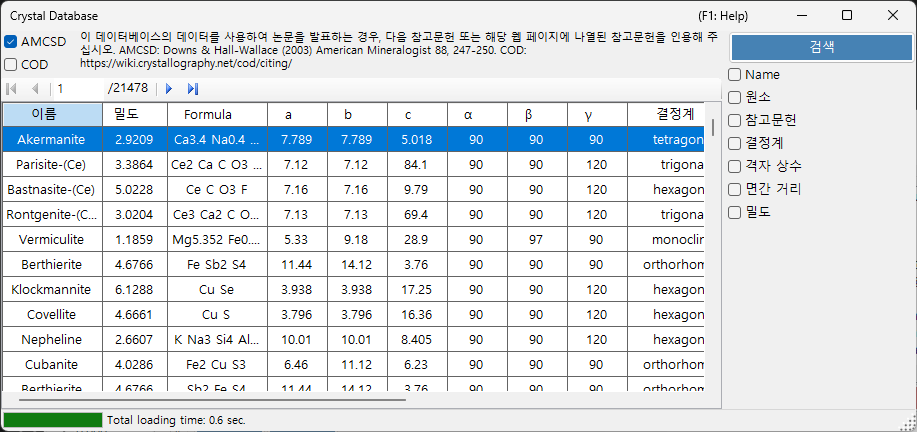
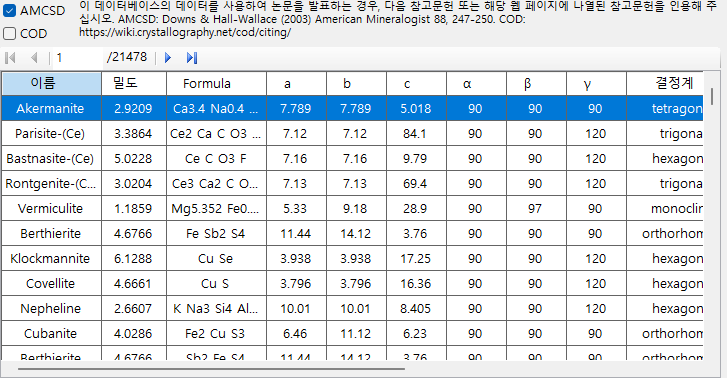
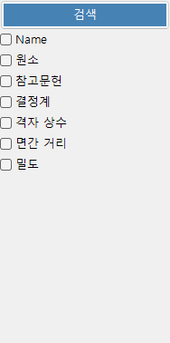
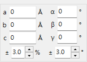

# 결정 데이터베이스

**결정 데이터베이스**는 **AMCSD** 및 **COD** 확인란으로 선택할 수 있는 두 가지 출처에서 결정 구조를 검색하고 가져오는 기능을 제공합니다.

- **AMCSD** : 기본 포함된 [American Mineralogist Crystal Structure Database](https://www.rruff.net/) (20,000개 이상의 구조).
- **COD** : [Crystallography Open Database](https://www.crystallography.net/cod/). 파일이 크기 때문에 설치 프로그램에는 포함되어 있지 않습니다. 데이터베이스 파일은 처음 사용할 때 자동으로 다운로드됩니다. 서버에서 파일이 갱신되면 다시 다운로드하라는 메시지가 표시됩니다.

이 데이터베이스를 사용할 때는 다음 참고 문헌을 인용해 주십시오.

**AMCSD** 사용 시:

> Downs, R.T. and Hall-Wallace, M. (2003) The American Mineralogist Crystal Structure Database. *American Mineralogist* **88**, 247-250.

**COD** 사용 시:

> Gražulis, S. et al. (2009) Crystallography Open Database – an open-access collection of crystal structures. *Journal of Applied Crystallography* **42**, 726-729.
>
> Gražulis, S. et al. (2012) Crystallography Open Database (COD): an open-access collection of crystal structures and platform for world-wide collaboration. *Nucleic Acids Research* **40**, D420-D427.

---

## 키보드 & 마우스 단축키

이 창에는 보조 키 조합이 없으며, 일반 클릭으로 조작합니다. 명확하지 않은 유일한 입력은 다음과 같습니다.

| 단축키 | 동작 |
|----------|--------|
| <kbd>F1</kbd> | 온라인 매뉴얼의 이 페이지를 엽니다 |
| 임의의 검색 필드에서 <kbd>ENTER</kbd> | 데이터베이스 검색을 실행합니다 (**Search** 버튼과 동일) |
| 결과 표에서 행을 클릭 | 해당 결정을 메인 창에 불러옵니다 |
| **Periodic table** 팝업에서 원소를 클릭 | 해당 필터를 순환합니다: *ignore* → *must include* → *must exclude* |

→ 모든 창을 한눈에 보려면 **[21. 키보드 & 마우스 단축키](21-shortcuts.md)**를 참조하십시오.

---

## 표

검색 조건과 일치하는 결정을 표시합니다. 결정을 선택하면 메인 창의 결정 정보로 전송됩니다. **Add** 또는 **Replace**를 눌러 결정 목록에 추가합니다.

---

## 검색 옵션

아래에 검색 조건을 입력하고 **Search** 버튼 또는 **Enter** 키를 누릅니다.

| 조건 | 설명 |
|-----------|-------------|
| **Name** | 결정 이름 |
| **Element** | 주기율표 선택기 (포함 가능/필수 포함/포함 불가) |
| **Reference** | 제목, 저널, 저자 |
| **Crystal system** | 결정계 선택 |
| **Cell Param** | 격자 상수와 오차 |
| **d-spacing** | 가장 강한 반사의 d 값과 오차 |
| **Density** | 밀도와 오차 |

### Name

결정 이름에 대한 자유 텍스트 일치. 부분 일치가 허용됩니다.

### Element

**Periodic Table** 버튼을 눌러 원소 선택기를 엽니다. 각 원소 버튼은 세 가지 상태를 순환합니다.

- **May or may not include** (기본값 — 회색)
- **Must include** (녹색)
- **Must exclude** (빨강)

창 상단의 세 버튼은 한 번의 클릭으로 모든 원소를 세 가지 상태 중 하나로 초기화합니다.

### Reference

출판 메타데이터에 대한 자유 텍스트 일치: 논문 제목, 저널 이름, 저자 목록.

### Crystal system

검색을 특정 결정계로 제한합니다 (Cubic, Tetragonal, Orthorhombic, Hexagonal, Trigonal, Monoclinic, Triclinic).

### 격자 상수 검색

목표 격자 상수 *a*, *b*, *c*, *α*, *β*, *γ*와 허용 오차를 입력합니다. 빈 필드는 와일드카드로 처리됩니다.

### d-spacing

가장 강한 반사(또는 여러 개의 강한 반사)의 *d* 값(d-spacing)과 허용 오차를 입력합니다. 실험에서 회절 피크 위치만 알고 있을 때 유용합니다.

### Density

허용 오차 범위 내에서 질량 밀도(g/cm³)로 필터링합니다.

---

## 관련 항목

- [메인 창](0-main-window.md)
- [대칭 정보](2-symmetry-information.md)
- [빔 상호작용](3-beam-interaction.md)
- [구조 뷰어](5-structure-viewer.md)
