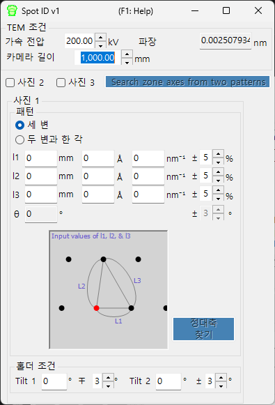

# Spot ID v1

**Spot ID v1** 은 실험적으로 얻은 전자 회절 이미지에서 회절 스폿을 검출하고 피팅하여 지수화합니다. 또한 수치로 입력한 스폿 기하학을 사용하여 수동으로 정대축을 검색하는 기능(이전의 **TEM ID**)도 지원합니다.

---

## 키보드 및 마우스 단축키

Spot ID v1 은 스폿 기하학을 **수치 입력**으로 받으며(이전의 *TEM ID* 작업 흐름), 스폿 검출/피팅은 버튼으로 수행합니다. 회절 이미지는 참조용으로만 표시되며 클릭으로 조작할 수 없습니다(마우스 확대/축소 및 수동 스폿 선택은 [Spot ID v2](11-spot-id-v2.md) 에 속합니다). 유일한 단축키는 결과 창에 있습니다.

| 단축키 | 동작 |
|----------|--------|
| <kbd>F1</kbd> | 온라인 매뉴얼의 이 페이지를 엽니다 |
| 결과 목록의 행을 더블 클릭 | 해당 결정을 선택하고 일치하는 정대축으로 회전합니다 |

→ 모든 창을 한눈에 보려면 **[21. 키보드 및 마우스 단축키](21-shortcuts.md)** 를 참조하십시오.

---

## 주 영역

회절 이미지를 참조용으로 표시합니다. 이미지는 끌어서 놓기 또는 **File** 메뉴를 통해 불러옵니다.

### 이미지 조정

| 설정 | 설명 |
|---------|-------------|
| Min / Max | 밝기 범위(트랙 바로도 조정 가능) |
| Gradient | Positive 또는 Negative |
| Scale | Linear 또는 Log |
| Colour | Grey scale 또는 Cold-Warm |
| Dust & Scratch | 비정상적으로 밝거나 어두운 픽셀을 제거(범위와 임계값 설정) |
| Gaussian blur | 블러 적용(범위는 픽셀 단위) |

---

## Optics

입사 선원, 에너지/파장, 카메라 길이, 검출기 픽셀 크기를 입력합니다.

> dm3/dm4 파일(Gatan Digital Micrograph)을 불러오면 이 값들은 자동으로 설정됩니다.

---

## 스폿 검출 및 피팅

**Detect & fit spots** 를 누르면 회절 스폿을 자동으로 검출하고 2D Pseudo-Voigt 함수로 피팅합니다. 결과는 표에 나타납니다.

### 검출 옵션

| 매개변수 | 설명 |
|-----------|-------------|
| Number | 검출할 스폿의 최대 개수 |
| Nearest neighbour | 검출된 스폿 사이의 최소 거리 |
| Fitting range | 피팅을 위한 각 스폿 주변의 반경(픽셀) |

### 표 컨트롤

| 버튼 | 동작 |
|--------|--------|
| Reset range | 모든 스폿의 피팅 범위를 다시 설정 |
| Show label/symbol | 이미지 위에 레이블/기호를 겹쳐 표시 |
| Clear all spots | 모든 스폿을 제거 |
| Save / Copy | 표를 탭으로 구분된(Excel) 형식으로 내보내기 |
| Re-fit all | 모든 스폿을 다시 피팅 |

### 스폿 상세 창

확인란을 선택하면 선택한 스폿(왼쪽)과 네 방향의 프로파일(오른쪽)을 보여 주는 상세 창이 열립니다. 파란색 = 관측 데이터, 빨간색 = 피팅.

---

## Index

**Identify spots** 를 누르면 검출된 스폿을 메인 창에서 선택한 결정에 대해 지수화합니다.

| 설정 | 설명 |
|---------|-------------|
| Acceptable error | 지수화 허용 오차 |
| Single grain / Multi grains | 단결정으로 지수화하거나 여러 결정립으로 지수화(최대 결정립 수 설정) |
| Show label/symbol | 지수화된 레이블을 이미지 위에 겹쳐 표시 |
| Refine thickness and direction | 동역학 이론(블로흐파 방법)을 적용하여 검출된 강도에 가장 잘 맞는 시료 두께와 결정 방위를 정밀화 |

---

## 스폿 기하학으로부터의 정대축 검색 (이전의 TEM ID)

불러올 이미지가 없는 경우에도, 제한시야 전자 회절(SAED) 패턴의 기하학을 직접 입력하여 후보 정대축을 검색할 수 있습니다. TEM 관찰 조건과 스폿 기하학을 입력한 다음 **Search zone axes** 를 눌러 후보 결정 방위를 찾습니다.

### TEM condition

TEM 관찰 조건(가속 전압, 카메라 길이 등)을 입력합니다.

### Photo 1, 2, 3

회절 스폿의 기하학을 입력합니다.

- 검출기 상의 스폿 간 거리를 입력하려면 **mm** 상자를 사용합니다.
- *d* 값을 알고 있다면 **Å** 또는 **nm⁻¹** 단위로 입력합니다.

**Three sides mode** : direct spot 을 한 꼭짓점으로 하는 삼각형의 세 변 길이를 입력합니다.

**Two sides and an angle mode** : 두 변(direct spot 포함)의 길이와 그 사이의 각도를 입력합니다.

---

## 함께 보기

- [Spot ID v2](11-spot-id-v2.md)
- [회절 시뮬레이터](7-diffraction-simulator/index.md)
- [메인 창](0-main-window.md)
- [결정 데이터베이스](1-crystal-database.md)
- [EBSD 시뮬레이션](12-ebsd-simulation.md)
